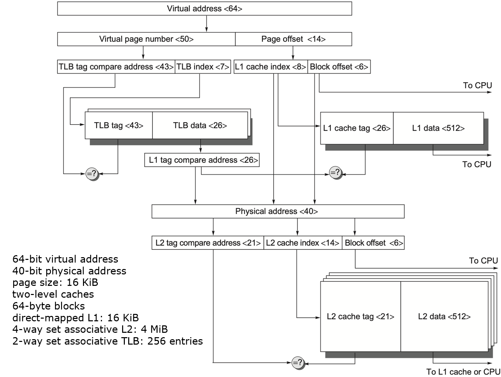
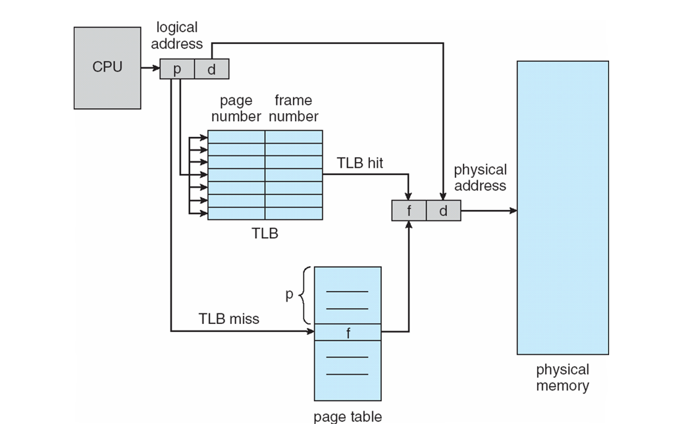
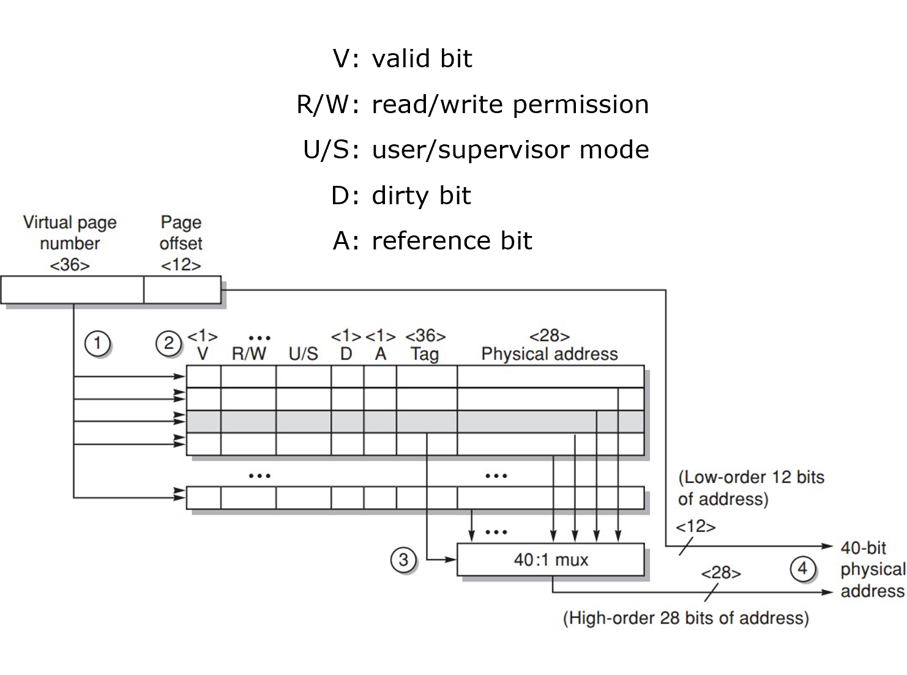

### 1. 存储层次与局部性

#### 1.1 局部性原理

存储系统设计的根本依据是程序的访存局部性（Principle of Locality）：
- **时间局部性 (Temporal Locality)**：被访问过的数据在不久的将来极可能再次被访问。如循环结构中的控制变量、频繁调用的函数等。
- **空间局部性 (Spatial Locality)**：被访问过的数据其地址相邻的数据在近期极可能被访问。如数组的顺序遍历、顺序执行的指令流等。
#### 1.2 存储器金字塔

采用极简层级分类，从上至下满足“速度递减、容量递增、单位成本递减”的物理规律。

| **层次**          | **硬件技术**    | **管理者** | **典型容量** | **访问延迟**   |
| --------------- | ----------- | ------- | -------- | ---------- |
| **L0 寄存器**      | Custom CMOS | 编译器     | 字节级      | < 1 ns     |
| **L1/L2 Cache** | SRAM        | 硬件      | KB\~MB 级 | 1\~10 ns   |
| **L3 主存**       | DRAM        | 操作系统    | GB 级     | 50\~100 ns |
| **L4 辅存**       | 磁盘 / SSD    | 操作系统/用户 | TB 级     | 毫秒 / 微秒级   |
> [!Note] **Performance of Main Memory**
> * **access time** 读取请求发出到请求的 word 抵达所用的时间；
> * **cycle time** 相邻两次读取请求的最小时间间隔。

#### 1.3 DRAM

**DRAM** 实现中分为 **bank, row, column 三级结构**。预充电命令用于打开或关闭存储库， row 地址通过激活命令发送，随后该 row 的数据被传输至 **缓冲区**，对于缓冲区中的 row，可以通过连续的通过连续的 column 地址进行传输。

为了提升传输速率等性能， DRAM 引入了：
* **DDR (double data rate) 技术**，在时钟的上升和下降沿均传输数据；
* 将单个 SDRAM 拆分成多个 banks，可以 **独立进行数据传输**；
* 分为动态和静态耗能，当 DRAM 被设置为 power down mode 时 **停止非必要刷新**。

为适应 GPU 等并行处理器对数据传输的要求，有 bandwidth 更高的 GDRAM (Graphic)。
#### 1.4 Flash Memory

**Flash Memory** 是一种 EEPROM（电可擦可编程只读存储器）类型。只读，但可擦除，具有 **非易失性**（无需电源即可保持数据），用作便携式设备的主存。

Flash Memory 与 DRAM 的不同之处：
* 写入前必须先 **以块为单位** 擦除；
* 具有非易失性，功耗更低；
* 每个块都有有限的写入次数；
* 比 SDRAM 便宜但慢，比硬盘贵但块；
* 采用写入均衡技术，确保写入操作在整个存储中 **均匀分布**。
#### 1.5 错误与检测纠正

**软错误/瞬态故障（soft error/transient fault）** 指由外部干扰引起的存储单元内容翻转，但硬件电路本身没有物理损坏，是瞬时、可恢复的。

**硬错误/永久性故障（hard error/permanent fault）** 指由硬件电路物理缺陷导致某个存储单元或电路功能永久失效的错误，是不可恢复的，必须通过冗余或替换来规避。

**检测纠正技术**：奇偶校验 parity，纠错码 ECC（典型配置为每64位数据额外增加8位检验位，可纠正1位错误，检测2位错误），Chipkill（将 ECC 类似于 RAID 分散到芯片上）。

### 2. Cache 结构与机制

#### 2.1 映射机制

主存块（Block）如何放置到 Cache 中，决定了硬件查找的复杂度和冲突的概率。

1. **直接映射 (Direct Mapped)**
	- **规则**：一个主存块只能放在 Cache 中的唯一固定位置。
	- **公式**：$\text{Cache Index} = \text{Block Address} \bmod \text{Number of Blocks in Cache}$
	- **特点**：查找极快，硬件简单，但容易发生冲突。
2. **全相联映射 (Fully Associative)**
	- **规则**：一个主存块可以放在 Cache 中的任何位置。
	- **特点**：空间利用率最高，无冲突缺失，但需要并行比较所有 Tag，硬件成本极高。
3. **组相联映射 (Set Associative)**
	- **规则**：将 Cache 分为若干组（Set），主存块映射到固定的组，但可以放在该组内的任何位置（通常是 $n$-way，即 $n$-way 中任何位置）。
	- **公式**：$\text{Cache Set Index} = \text{Block Address} \bmod \text{Number of Sets in Cache}$
#### 2.2 地址划分

当 CPU 发出物理地址（Physical Address）时，硬件将其截断为三部分以并行查询：

```plantxt
+---------------------------+---------------+------------------+
|           Tag             |     Index     |    Byte Offset   |
+---------------------------+---------------+------------------+
 \_________________________/ \_____________/ \________________/
        匹配块标识              定位 Cache 行       定位块内字节
```

- **块内偏移 (Byte Offset)**：$\text{Byte Offset Bits} = \log_2(\text{Bytes per Block})$
- **索引 (Index)**：$\text{Index Bits} = \log_2(\text{Number of Sets})$
- **标记 (Tag)**：$\text{Tag Bits} = \text{Total Address Bits} - \text{Index Bits} - \text{Offset Bits}$

> [!Note] **有效位 (Valid Bit)**
> 除了 Tag，每个 Cache 行还自带一个 Valid Bit。冷启动时全为 0，只有 Valid = 1 且 Tag 匹配时，才算真正的 **Cache Hit**。
#### 2.3 缺失与替换

| **缺失类型**              | **释义**                      | **优化方向**                          |
| --------------------- | --------------------------- | --------------------------------- |
| **强制性缺失 Compulsory**  | 第一次访问该数据，必然缺失。              | 增加块大小 (Block Size)、预取 (Prefetch)。 |
| **容量性缺失 Capacity**    | Cache 总容量装不下工作集，被挤出后再次访问。   | 增加 Cache 总容量。                     |
| **冲突性缺失<br>Conflict** | 多个主存块映射到同一个 Cache 行/组，互相驱逐。 | 提高相联度 (Associativity)。            |

* **LRU (Least Recently Used)**：最近最少使用。硬件记录访问顺序，优先替换最久未被访问的块（性能好，硬件开销随相联度呈指数增加）。
- **Random**：随机替换。相联度较高时，性能与 LRU 极其接近，且硬件实现极简。
#### 2.4 写入策略

* **写命中（Write Hit）**
	1. **写直达 (Write-Through)**：数据同时写入 Cache 和下层存储。保证一致性，但极慢，通常需加装 Write Buffer；
	2. **写回 (Write-Back)**：只写 Cache，并把该行标记为 **脏块 (Dirty Bit = 1)**。直到该块被替换时才写回下层。
* **写缺失（Write Miss）**
	1. **按写分配 (Write Allocate)**：把主存块读入 Cache，然后在 Cache 内修改；
	2. **不按写分配 (No-Write Allocate)**：绕过 Cache，直接修改下层存储。。

按写分配通常搭配写回策略，不按写分配通常搭配写直达策略。
### 3. Cache 的六种优化
#### 3.1 增大块大小

*  **优点** ：利用空间局部性降低缺失率，标签位数量减少降低静态功耗；
*  **缺点** ：会增加缺失代价（Miss Penalty），增加容量缺失与冲突缺失的情况。

衡量整个存储层级平均每次访问所需的时间 **AMAT** (Average Memory Access Time)。
$$
\begin{align}
\text{AMAT} 
&= (1-\text{Miss Rate})\times\text{Hit Time} + \text{Miss Rate} \times \text{Miss Time}\\
&=(1-\text{Miss Rate})\times\text{Hit Time}+\text{Miss Rate}\times(\text{Hit Time}+\text{Miss Penalty})\\
&=\text{Hit Time}+\text{Miss Rate}\times\text{Miss Penalty}
\end{align}
$$
#### 3.2 增大容量

* **优点** ：减少容量缺失的情况，降低缺失率；
* **缺点** ：会增加命中时间、成本和功耗。
#### 3.3 增大关联度

* **优点** ：减少冲突缺失的情况，降低缺失率；
* **缺点** ：会增加命中时间和功耗。

>[!Note] **cache rule of thumb**
> A direct-mapped cache of size $N$ has about the same miss rate as a two-way set associative cache of size $N/2$.
#### 3.4 多级缓存

* **优点** ：兼具大 Cache 减少冲突缺失和小 Cache 速度快的优点，降低缺失代价和功耗；
* **缺点** ：增加硬件设计复杂度，带来额外的功耗。

两级 Cache 架构的 **平均访存时间 AMAT** 计算：
$$\begin{align}\text{AMAT} = \text{Hit Time}_{\text{L1}} +& \text{Miss Rate}_{\text{L1}} \\&\times (\text{Hit Time}_{\text{L2}} + \text{Miss Rate}_{\text{L2}} \times \text{Miss Penalty}_{\text{L2}} )\end{align}$$ 两级缓存系统中，处理器因等待数据而 **平均每条指令停顿的时钟周期数**：
$$
\begin{align}
\text{Average mem}&\text{ stalls per instruction}\\
=&\text{Misss per instr}_\text{L1}\times\text{Hit time}_\text{L2}
+\text{Miss per instr}_\text{L2}\times\text{Miss Penalty}_\text{L2}
\end{align}
$$
Cache 性能指标公式：
$$
\text{CPU Exe Time}=(\text{CPU clock cycles}+\text{Memory stall cycles})\times\text{Clock Cycle Time}
$$
$$
\begin{align}
\text{Memory Stall Cycles}
&=\text{Number of Misses}\times\text{Miss Penalty}\\
&=\text{IC}\times\frac{\text{Misses}}{\text{Instruction}}\times\text{Miss Penalty}\\
&= \text{IC} \times \frac{\text{Memory Accesses}}{\text{Instruction}} \times \text{Miss Rate} \times \text{Miss Penalty}
\end{align}
$$
$$
\begin{align}
\text{Memory Stall}& \text{ Clock Cycles}\\ =& \text{IC}\times \text{Reads per inst} \times \text{Read Miss Rate} \times \text{Read Miss Penalty}\\ +& \text{IC}\times \text{Writes per inst} \times \text{Write Miss Rate} \times \text{Write Miss Penalty}
\end{align}
$$

* **Local miss rate** : 缓存中的缺失次数除以该缓存收到的访问总次数 The number of misses in a cache divided by the total number of mem accesses to this cache；
* **Global miss rate** : 缓存中的缺失次数除以处理器产生的总访问次数 The number of misses in the cache divided by the number of mem accesses gen by the processor。

L1 缓存中的数据和 L2 缓存中的数据有包含或互斥两种处理策略：
* **Multilevel inclusion** : L1 缓存中的数据始终存在于 L2 缓存中，仅需针对 L2 缓存进行一致性检查，从而简化一致性维护；
* **Multilevel exclusion** : L2 缓存容量略大于 L1 时，L1 缓存中的数据不会出现在 L2 中，当 L1 缺失时，会在 L1 和 L2 之间进行块互换。
#### 3.5 读缺失优先于写操作

* 降低缺失代价，引入写缓冲滞后执行写操作。

**具体实现逻辑**：当发生读缺失时，不再简单地让读请求一直阻塞，直到写缓冲区完全清空；先检查写缓冲区的内容，如果读请求要访问的地址与写缓冲区中待写的地址没有冲突，并且内存系统当前可用，就允许读请求先执行，而写操作可以继续在后台排队；只有当读请求与写缓冲区存在地址冲突时，才需要等待相关写操作完成，以保证数据一致性。
#### 3.6 虚拟索引物理标签

* **优点**：降低命中时间，使用页内偏移量作为缓存索引，采用虚拟索引、物理标签。
* **缺点**：进程切换时，相同虚拟地址可能对应不同物理地址，需要处理缓存别名问题。



> [!Note] **Note**
> * 传统方式使用 **串行** 方法，即先将虚拟地址通过 TLB 转换为物理地址，再将物理地址高位作为 tag，中间部分作为 index，低位作为 byte offset 读取。
> * 用页内偏移量作为缓存索引时，利用虚拟地址和物理地址的 page offset 相同的特性，**并行** 处理 TLB 转换物理地址和索引 cache 两个操作，从而做到更快读取。需要注意的是，在物理地址转换完成后仍然需要比对 tag 来判断是否 Hit。
> * page offset = index + byte offset ，两种方法的 **地址划分相同但时序不同**。
### 4. 虚拟内存

#### 4.1 虚拟内存四问

1. **虚拟内存的块放置在哪里**：全相连策略，虚拟内存的块允许放置在主存的任何位置，因为发生页面/地址错误时，访问硬盘等存储设备会导致很高的缺失代价。
2. **如何找到块放置在哪里**：使用页表来记录虚拟地址与物理地址之间的映射关系，页表中的每个条目记录了某个虚拟页映射到哪个物理页，然后利用虚拟地址中包含的偏移量，即可在物理页中定位到确切的数据。
3. **块缺失的替换策略**：替换最近最少使用的块 LRU (Least Recently Used)，使用一个“使用位”，在访问某个块时对该位进行标记，未标记使用位的块就可被选为替换目标。
4. **虚拟内存的写回策略**：访问硬盘等存储设备耗时大，使用脏位 （Dirty Bit），仅当块从磁盘读入后被修改过，才将其写回磁盘。
#### 4.2 页表与 TLB

**页表** 存储在主存中，一次数据访问需要 **两次内存访问**：从页表中获取物理地址和从物理地址获取数据。为了加速数据访存的速度，引入 TLB 缓存用于缓存先前完成的地址转换。

**TLB** 是一种特殊的缓存 Cache，每个条目记录一个从虚拟页号到物理页号的先前映射关系，每个表目分成两部分：**标签** 部分记录虚拟页号，**数据** 部分记录物理页号。**使用位** 用于跟踪已访问的页面；**脏位** 用于跟踪已修改的页面；**有效位** 标记有效才能匹配成功。



>[!Note] **TLB 访存流程** 
>1. 虚拟内存地址 page number 与 TLB 中的所有 tag 进行比对；
>2. TLB 中匹配的物理地址会被发送给多选器；
>3. 将物理地址与 page offset 拼接得到最终的物理地址；


#### 4.3 页面尺寸

* **大页面尺寸的优势**：
	1. **页表更小**：占用更少内存，减少页表存储开销；
	2. **缓存命中更快**：可以利用更大的缓存块或更高的 TLB 覆盖范围，提升缓存命中率；
	3. **I/O 效率更高**：与二级存储之间传输大页面更高效，减少传输次数和开销；
	4. **减少 TLB 缺失**：单个TLB条目可映射更大的内存区域，从而降低TLB缺失率。
* **小页面尺寸的优势**：
	1. **节省存储空间**：小页面可减少内部碎片，避免浪费内存；
	2. **更细粒度的内存管理**：适合对内存使用要求紧凑的场景，减少因对齐造成的空间浪费。

大页面可显著减少TLB缺失（某些程序中对 CPI 的影响甚至与缓存缺失相当），小页面能减少内部碎片，近年来的微处理器普遍支持 **多种页面大小**（如4KB、2MB、1GB）。操作系统可根据应用的内存访问模式动态选择合适的页面大小，在TLB覆盖率和内存利用率之间取得平衡。
$$
\text{Virtual Memory}=\text{main Memory}+\text{Secondary Storage}
$$
### 5. 十种 Cache 进阶优化

