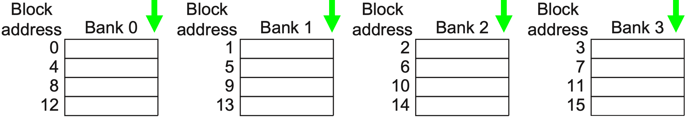
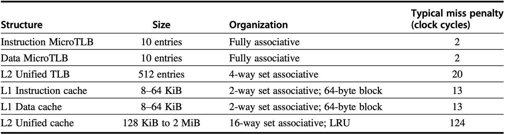
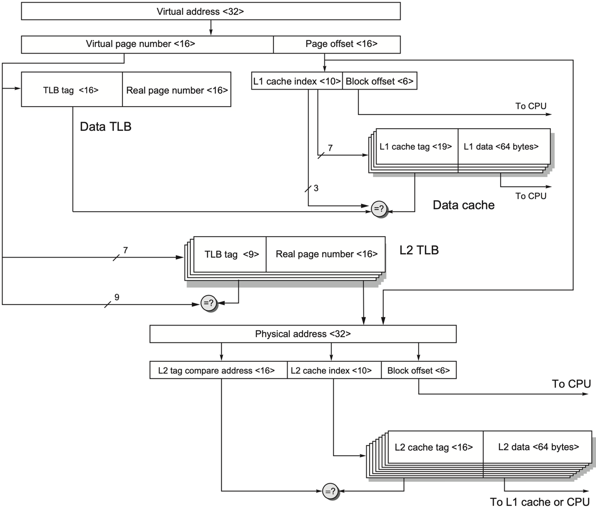
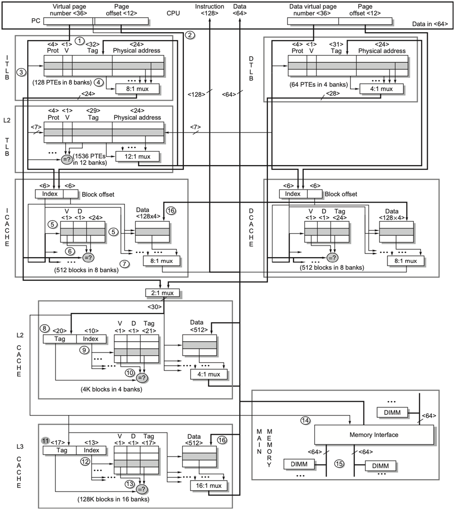

### 5. Cache 十种进阶优化

#### 5.1 小而简单的一级缓存

**原理**：较小容量可以支持更快的时钟频率（电信号传输、多选器延迟等因素），降低功耗。

* 采用较低的关联度（如直接映射），使标签检查和数据传输 **并行**，缩短命中时间。
#### 5.2 缓存路预测

**原理**：在保持高关联度的同时，减少冲突缺失并缩短命中时间。

* 为每个缓存块添加 **块预测位 (block predictor bits)**，预测下一次访问的“路”。预测命中则仅执行一次标签比较；失败则在下一周期检查其他块。
#### 5.3 流水线与缓存划分

**原理**：提高缓存带宽，减少访问缓存过程中器件的空闲时长。

* 类比于 CPU 流水线，将缓存访问过程划分为多个 **流水级**，虽然增加了单次访问的延迟 (latency)，但极大地提升了指令吞吐量；
* 将缓存分为多个 **独立的存储体 (bank)** ，支持同时被访问，通过顺序交错 (Sequential Interleaving) 的地址映射方式，将连续的块地址轮流分到各个存储体中。

<div align="center">  </div>

#### 5.4 非阻塞缓存

**原理**：在发生缓存缺失时，允许处理器继续为后续的命中请求提供服务，而不必停顿。

对非阻塞缓存的支持程度包含以下几类：
1. Hit under miss: 一个未命中发生时，后续的 **命中** 请求可以正常完成；
2. Miss under miss: 多个未命中可以 **并发处理**（第二个未命中可在第一个完成前发出）；
3. Hit under multiple misses: 多个未命中并发进行时，仍能处理新的命中请求。

* 内存访问延迟可能达到数百个周期，如果只处理一个未命中，当程序存在多个缓存缺失时，后续的未命中必须等待前一个完成才能发出请求，无法利用内存的并行性，支持miss under miss 可以让处理器同时发出多个内存请求，**并行处理隐藏延迟**；
* 支持并发未命中的数量 **并不是越多越好**，每个未命中的状态都需要独立的存储、缺失状态保持寄存器等硬件，条目越多，硬件成本与复杂度越高，资源冲突可能性也越大。
#### 5.5 关键字优先与早重启

**原理**：针对大缓存块，不需要等待这个块加载完毕，优先满足处理器的字需求。

* **关键字优先 (Critical Word First)**：优先请求缺失的字，一旦到达立即送往处理器，处理器在执行的同时填充大缓存块的剩余部分；
* **尽早重启动 (Early Restart)**：按照正常顺序传输大缓冲块，但目标字一旦到达就送往处理器执行，同时按顺序继续传输剩余部分。
#### 5.6 合并写缓冲区

**原理：** 将同一缓存行内的连续写操作合并，减少对下级存储器的写操作次数。

* 检查写缓冲区 (write buffer) 中已有的地址，如果新写入的数据地址与已有条目 **连续**，则将其合并为单个物理条目（中间不能有空洞），以减少写操作次数。

>[!Note] **Example**
>
>假设写缓冲每个条目可以存放一个 64 字节的缓存行，且支持部分写入，CPU 依次执行以下写操作（地址按照字节寻址）：
>1. 写入地址 0x1000，4 字节数据 A；
>2. 写入地址 0x1004，4 字节数据 B；
>3. 写入地址 0x1008，4 字节数据 C；
>
>* 如果写缓冲区 **不支持合并**，那么三个写操作会占用三个独立的条目，最终需要向下级存储发出三次写入请求（即使它们可能属于同一个缓存行）。
>* 如果 **支持合并**，则有效范围最终扩展为 0x1000~0x100B。只有一个条目被发送到下级存储，合并为一次写操作。

实际硬件设计会根据以下规则判断是否可以合并：
* **地址对齐**：通常以缓存行为边界。合并只允许在同一个缓存行内进行。
* **连续性**：新写入的地址与已有条目的地址范围必须恰好连续（即首尾相接），不能有空洞。有些设计也允许重叠，这时需要更新已有数据；
* **掩码支持**：每个条目通常带有一个 **字节掩码（byte mask）**，用于标记哪些字节是有效数据。合并时只需更新掩码和数据部分，无需移动其他数据。
#### 5.7 编译器优化

* **循环交换 (Loop Interchange)：** 改变嵌套循环顺序，使访问模式符合数据在内存中的存储顺序，提升空间局部性；

```C++
// Program 1 
// 相邻的 a[i][j] 和 a[i+1][j] 相距 1024 个整数，空间局部性极差
for(int j=0;j<1024;j++)
for(int i=0;i<1024;i++)
	sum+=a[i][j];

// Program 2 
// 每次缺失载入的后 15 个整数均 hit，缺失率降到原来的约 1/16
for(int i=0;i<1024;i++)
for(int j=0;j<1024;j++)
	sum+=a[i][j];
```

* **分块 (Blocking)：** 将大型矩阵运算划分为较小的子块 (sub-blocks)，确保子块能完全装入缓存，提升时间局部性。
```C++
// Program 1 
// 由于矩阵规模远超缓存容量，导致数据在重用前被频繁替换，时间局部性极差
// 当计算 c[i][j+1] 时，之前为 c[i][j] 加载的 b 列数据可能已经被替换
for(int i=0;i<N;i++)
for(int j=0;j<N;j++)
for(int k=0;k<N;k++)
	c[i][j]+=a[i][k]*b[k][j];

// Program 2 
// 限制访问范围确保子块驻留在缓存中，提升时间局部性，数据重用率提升约 B 倍
// 处理方块时 B*B 块大小小于缓存容量，a 和 b 的数据会驻留在缓存中
// 若 B 太小则无法充分利用缓存空间，理想的 B 应使 a,b,c 块综合略小于缓存有效容量
for(int j_st=0;j_st<N;j_st+=B)
for(int k_st=0;k_st<N;k_st+=B)
{
	int j_ed=std::min(j_st+B,N);
	int k_ed=std::min(k_st+B,N);
	for(int i=0;i<N;i++)
	{
		for(int j=j_st;j<j_ed;j++)
		{
			int tmp=0;
			for(int k=k_st;k<k_ed;k++)
				tmp+=a[i][k]*b[k][j];
			c[i][j]+=tmp;
		}
	}
}

```

>[!Note] **Note**
>**软件优化的优势：** 编译器优化不需要任何硬件改动，通过纯软件手段就能显著降低缺失率 (miss rate)，是现代高性能计算的核心。
#### 5.8 硬件预取

**原理**：硬件根据访问模式预测未来需要的数据，提前将其加载到缓存或**指令流缓冲区 (instruction stream buffer)**。

* 发生未命中时取回两个块，将请求的块放入缓存，下一个连续的块放入指令流缓冲区。
* 如果请求的块已经在流缓冲区中，则取消原本的缓存请求，然后从流缓冲区读取该块并发出下一个预取请求。
#### 5.9 编译器预取

**原理**：编译器在代码中显式插入 **预取指令 (prefetch instructions)**。

* 分为 **寄存器预取** 和 **缓存预取**。将预取操作的时间与流水线执行重叠，有效隐藏缺失惩罚。

```C++
// 16-byte blocks, 8-byte elements for a and b, write back

// Program 1 251 misses
// a 每相邻两次发生一次 miss,一共发生了 3*(100/2) = 150 misses
// b 从 0 至 100 各发生一次 miss,一共发生了 101 misses
for(int i=0;i<3;i++)
	for(int j=0;j<100;j++)
		a[i][j]=b[j][0]+b[j+1][0];

// Program 2 19 misses
// a 是 4 misses 因为在预取的时，相邻的两次有一次 hit
// b 是 7 misses 因为在预取的时，列相距远全部 miss
// 预取指令 prefetch(+7) 意味着处理器尝试提前加载 7 轮之后才用得到的数据
for(int j=0;j<100;j++)
{
	prefetch(b[j+7][0]); // b[0][0]~b[6][0] 7 misses
	prefetch(a[0][j+7]); // a[0][0]~a[0][6] 4 misses
	a[0][j]=b[j][0]*b[j+1][0];
}
for(int i=1;i<3;i++)
	for(int j=0;j<100;j++)
	{
		prefetch(a[i][j+7]); // a[1][0]~a[1][6] 4 misses
		a[i][j]=b[j][0]*b[j+1][0]; // a[2][0]~a[2][6] 4 misses
	}
```
#### 5.10 HBM 优化

**原理**：利用高带宽内存 (High Bandwidth Memory, HBM) 作为巨大的 L4 缓存。

传统 HBM 的访存过程一个简单表述为：
1. **行激活 (ACT)**：根据地址打开 HBM 内部的一个数据行，搬运几 KB 数据到行缓冲区；
2. **列寻址 (CAS)**：在缓冲区中定位到 Tag 所在的列并读出；
3. **比对与传输**：CPU 比对 Tag，若 Hit，则发起第二次列寻址读出 Data，若 Data 不在已经激活的数据行中，则需要再激活其所在的数据行；
4. **突发传输 (Burst)**：数据通过 1024-bit 位宽的总线高速传回 CPU；
5. **预充电 (PRE)**：关闭当前行，准备下次访问。

由于 L4 容量巨大，会导致标签 (tags) 数据量极其庞大，通常需要两次 DRAM 访问（一次查标签进行地址翻译，一次 Hit 后查数据） ，针对此问题有以下优化策略：
1. 将标签和数据放在 DRAM 的同一行 (same row) 中，不需要再激活 row buffer；
2. 采用 **合金缓存 (Alloy cache)** ：将标签和数据结构性地融合在一起（直接映射结构），Hit 直接读数据以加快访问速度，使得只需单次 HBM 周期就能进行突发传输 (burst transfer) 同时获取标签和数据；
3. 使用映射表 (map) 或访存预测器 (memory access predictor) 加快未命中检测速度。
### 6. 虚拟内存技术
#### 6.1 引入动机

* **连续分配导致效率低下**：早期系统采用连续分配和直接内存访问，一个程序必须作为一个整体、连续地塞进物理内存中。这不仅导致大程序很难找到足够大的连续空间，还会随着程序的频繁加载和卸载，在内存中留下大量无法利用的内存碎片，严重浪费资源。
* **缺乏隔离带来安全隐患**：不同进程直接操作物理内存地址。如果 Process A 出现代码错误或恶意行为，它可能会越界读取甚至篡改 Process B 的内存数据。这种缺乏保护的机制导致系统极不稳定。
#### 6.2 四个任务

* **多处理器模式**：至少提供两种处理器模式（用户模式和操作系统/内核模式）。这种区分在硬件层面建立了防护围墙，防止应用程序非法篡改系统配置或干预其他进程的运行。
	1. **用户模式** 用于运行普通程序，其访问硬件和执行敏感指令的权限受限；
	2. **内核模式** 则供操作系统管理系统资源，如读写页表和控制中断。
* **不可写状态机制**：提供一部分用户进程可用但不可写的处理器状态机制。处理器中包含一些定义系统行为的关键状态寄存器，例如页表基址寄存器（PTBR），如果用户能随意修改映射规则，就能将虚拟地址指向任意物理内存位置，从而使所有安全限制失效。因此，这些核心配置只能由处于特权模式的操作系统进行修改；
* **模式切换机制**：提供从用户模式切换到特权模式（如通过系统调用）及反向切换的机制。这种机制类似于一个受监控的闸口，确保用户进程只能在特定的、可预测的入口点请求操作系统服务，严禁恶意代码绕过验证直接跳转到内核的敏感执行区域；
* **内存保护限制**：提供限制内存访问的机制，以便在不把进程交换到磁盘的情况下保护进程的内存状态。这通常通过在页表项中设置 **访问控制位**（如读/写/执行权限）来实现。当进程尝试访问未授权的物理页或违反权限操作时，硬件会自动触发异常拦截。
### 7. 虚拟机技术
#### 7.1 引入动机

* **安全性与可靠性**：现代操作系统的代码量及其庞大且逻辑复杂， 导致其固有的安全漏洞（如内核漏洞）难以完全根除。一旦操作系统被攻破，运行其上的所有程序都将暴露。虚拟机监视器在底层构建更小更易于防御的软件层，可以为系统提供更高级别的隔离保护；
* **云计算与资源共享**：在数据中心或云服务中，多个互不信任的用户需要共享同一台高性能服务器。虚拟机技术允许每位用户运行独立的操作系统镜像，确保即便某位用户的系统崩溃或受损，也不会影响同一物理机上的其他租户；
* **性能开销的可接受性**：过去虚拟化因软件模拟硬件而导致严重的性能损失。随着现代处理器主频的飙升、多核架构的普及以及硬件辅助虚拟化技术的出现，这种性能损耗已大幅降至可忽略不计的程度，使得虚拟化在大规模部署中变得经济高效。
#### 7.2 核心特性

单台物理计算机可以运行多个 **虚拟机 (VM)**，支持多个不同的操作系统同时共享底层硬件资源。**虚拟机监视器 (VMM/Hypervisor)** 负责支持虚拟机的运行。

VMM必须具备三个基本特征：1、为程序提供与原硬件基本一致的环境；2、保证程序运行速度仅有轻微下降；3、完全控制所有系统资源。
#### 7.3 软硬件要求

* 从 **定性要求 (Qualitative Req)** 来看，客户软件在虚拟机上的行为应与其在原生硬件上 **完全一致**，且不能直接更改系统资源的分配。
* 从 **特权要求 (Privilege Req)** 来看，处理器必须至少支持系统和用户两种模式。存在一个特权指令子集，只能在系统模式下执行，且所有系统资源必须仅能通过这些特权指令来控制。
#### 7.4 ARM Cortex-A53

* **硬核**：已经完成物理布局布线、针对特定芯片代工厂深度优化的设计。它就像一个无法修改内部电路的“黑盒”，使用者只能连接其外部接口并调整少量外部参数（如外接缓存大小）。虽然毫无修改余地，但它能提供极致的高性能和最小的芯片面积。
* **软核**：软核通常以代码或标准逻辑元件库的形式交付，尚未绑定具体的物理制造工艺。具有极高的灵活性和可移植性，不仅能自由更换不同的芯片代工厂进行生产，还允许使用者修改其内部逻辑。不过，这种灵活性通常以牺牲部分极致性能和增加芯片面积为代价。

<div align="center">  </div>
<div align="center">  </div>

**处理器的经典设计：L1 指令 / 数据 Cache 分离 (Harvard架构)**：现代 CPU 的 L1 Cache 普遍使用分离式设计：
* **L1 指令 Cache (L1 I-Cache)**：专门存指令，大小为 32KB；
* **L2 指令 Cache (L2 D-Cache)**：专门存数据，大小为 32 KB；
* 两者是完全独立的硬件，各自有自己的`tag`,`index`和`offset`划分，不能混用。

在数据访问路径里计算的是 **数据 Cache 自己的 32 KB** ，而不是 L1 Cache 总体的 64 KB。
#### 7.5 Intel Core i7-6700

指令 Cache 和数据 Cache 的差异：
- **指令 Cache**：所有程序的指令缺失率都远低于数据 Cache，且随着 Cache 扩容下降更快，最终趋近于零，因为指令的局部性天然优于数据；
- **数据 Cache**：不同程序的缺失率差距极大，是 Cache 性能的核心瓶颈。


<div align="center">  </div>