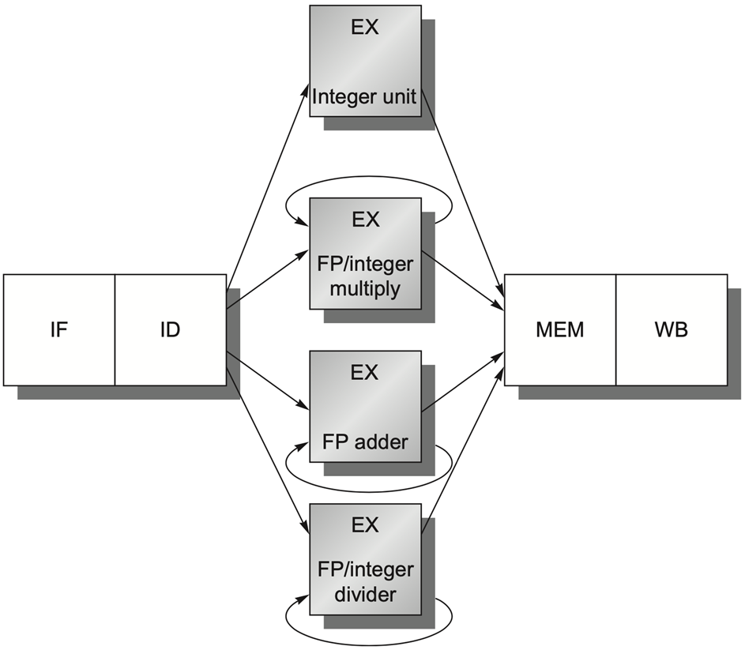
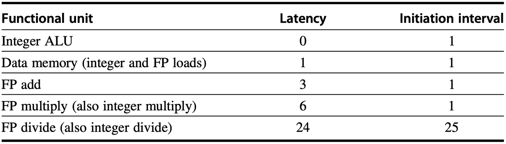
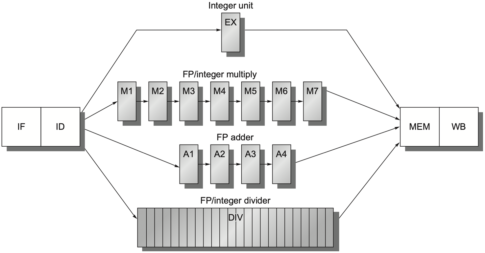
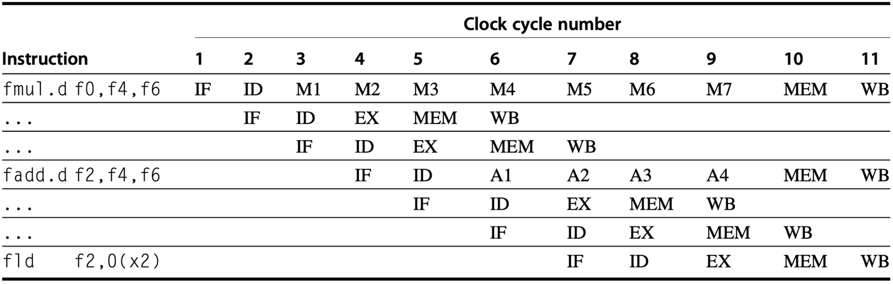
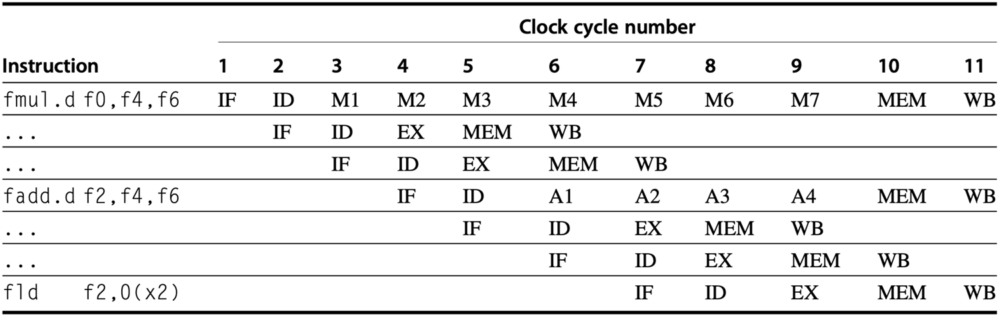
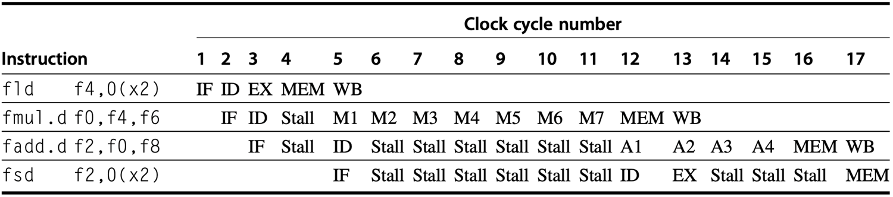

### 1. 浮点流水线

#### 1.1 浮点流水线架构

浮点运算比整型运算要消耗更多的时间，在流水线中有以下两种直观选择：

- **延长时钟周期时长**，使得在一个时钟周期内足以完成浮点运算，但是整型运算速度更快，会浪费计算完成后等待时钟周期结束的时间；
- 在时钟周期时长不变的情况下，通过在浮点运算单元中 **集成更多的计算逻辑** 来增强其计算能力，使其能在一个时钟周期内完成，但是制造困难且成本高昂。

显然，两种选择都具有明显的缺点。为了便于制造，我们需要在速度要求上作出妥协，也就是说浮点运算不一定必须在一个时钟周期内完成，**执行阶段可能超过一个时钟周期**。遵循这一设计原则，浮点流水线与证书流水线相比有两处改动：

- **重复执行 EX 阶段**：负责 EX 的组件可在每个时钟周期内被重复使用，例如加法运算会被拆成“指数对齐”、“尾数相加”、“规格化”、“舍入”等几个阶段，EX 阶段就变成了多级流水线，这样既提高了主频，又能让多条浮点指令重叠执行；
- **使用多个浮点功能单元**：每个单元专门负责某种特定类型的运算，例如加法和除法。它不会简单地将所有类型的计算逻辑混入一个组件中，从而简化了制造过程。同时，由于不同的浮点运算的电路复杂度和延迟差很多，独立单元可以让不同的浮点指令并行执行。

  

由于现在一个功能单元 (FP) 的操作可能需要重复执行 EX 指令多次才能完成（尤其是浮点除法器等 **内部没有做流水化的功能单元**），因此无法允许后续指令在 EX 指令执行后的下一个时钟周期内进入 EX。这要求 EX 指令不能采用流水线处理，在上一条指令离开 EX 之前，任何其他使用该功能单元的指令 **都不能发出**。
#### 1.2 延迟与发射间隔

- **延迟 (Latency)**：指产生结果的指令和使用该结果的指令之间必须间隔的时钟周期数；
- **发射间隔/重复间隔 (Initiation/Repeat Interval)**：连续发射两条同类型指令之间，必须间隔的时钟周期数，即同一个功能单元，多久能发下一条指令。

如果两条指令隔的周期数小于延迟，就会触发 **RAW (Read-After-Write) 数据冒险**，必须停顿流水线。本质上反应的是数据依赖的等待时间。

例如，某浮点乘法器的发射间隔为 $1$ 说明乘法器是完全流水化的，每一排都能进一条新指令，而某浮点除法器的发射间隔为 $35$ ，说明除法器几乎没有流水，一条除法指令要占 $35$ 哥周期，期间下一条除法指令必须等它完全结束才能发射。因此发射间隔本质上反应的是功能单元的 **吞吐能力**，决定了同类型指令的峰值执行速度，解决的是 **资源冲突** 问题。

  

流水线延迟比执行流水线深度少 $1$ ，流水线深度是指从 EX 阶段到产生结果之间的阶段数。即延迟表示要在流水线中 **插入的 stall 数量**，发射间隔则表示下一条指令和当前指令发射的 **周期间隔数量**。下表式浮点加法在发生 RAW 数据冒险时流水线内各阶段的变化。

|  周期   |  1  |  2  |  3  |   4   |   5   |   6   |  7  |
| :---: | :-: | :-: | :-: | :---: | :---: | :---: | :-: |
| fadd1 | IF  | ID  | EX1 |  EX2  |  EX3  |  EX4  | MEM |
| fadd2 |     | IF  | ID  | stall | stall | stall | EX1 |

  

【注】浮点指令中的指令助记符 `.d` 后缀表示双精度浮点运算，如 `add.d`、`mul.d`。
### 2. 流水线冒险
#### 2.1 结构冒险

* 浮点除法器 **不是完全流水化的**，这与 EX 阶段其他完全流水化的单元不同；
* 指令执行时间各不相同，可能导致同一周期内需要完成 **多次寄存器写操作**。

下表展示了浮点流水线中 **乱序完成指令** 在 WB 阶段抢寄存器写端口的结构冒险，同时也说明，虽然多条指令同时处于 MEM 阶段，但只要不是都真的访问内存，就不会发生冲突。

  

**发射前互锁检测 (Interlock Detection)**：在译码阶段跟踪写端口的使用情况，并在指令发出前对其进行暂停，以提前预防，其核心机制是维护一个 **移位寄存器 (shift register)**：

- **硬件组件**：一个固定长度的移位寄存器，长度由流水线中最长指令延迟决定；
- **时序逻辑**：每一个时钟周期寄存器内容整体向右移动一位，相当于倒计时；
- **记录操作**：当一条指令在 ID 阶段准备发射时，根据其预估的写回延迟，在寄存器对应的位置标记为 $1$ ，例如浮点乘法指令在 EX 阶段需要 $7$ 个周期，就将第 $7$ 位置 $1$；
- **冲突检测**：当新指令进入 ID 阶段，硬件检查移位寄存器对应的位置是否已经被置 $1$ ，如果有，说明此时发射指令会与之前的指令写回冲突，当前指令就会 stall 直至冲突消除。

**发射前互锁检测 (Interlock Detection)** 具有以下优缺点：

- **优点**：逻辑清晰，所有的冲突检测和停顿控制都集中在 ID 阶段完成，指令一旦通过 ID 阶段发射，后续就不会因为写回冲突而被卡住，降低了流水线后续阶段的控制复杂度；
- **缺点**：需要额外的移位寄存器和复杂的比较逻辑电路，是一种保守发射策略，即使后续有可能通过其他方式避开冲突也会停顿，导致一些不必要的空转，降低吞吐率。

**导致空转的例子**：假设有一条指令 A 发生了写回冲突而停顿，但后续的指令都没有写回冲突，如果先计算指令 A 并将写回延迟一个周期，后续的指令就可能可以提前运行加速。

>[!Note] **Note**
>移位寄存器本身不负责检测数据冲突，但是它必须与数据冲突检测逻辑配合工作，如果发生任何冲突，指令都会继续停顿，并且每个周期都会重新检测，直到所有冲突消除。

**事后补救互锁检测 (Reactive Stall Detection)**：不提前预判冲突，允许指令正常向前运行，直到冲突发生时才在后端进行干预：

- **核心逻辑**：仅在指令尝试进入 MEM 或 WB 阶段抢占资源时进行实时检测；
- **冲突处理**：若多条指令在同一周期冲突，硬件决定 stall 其中一条，常用准则为 **长延迟指令优先 (Longest Latency First)** 即优先放行执行时间长的指令，尽早解除后续指令可能存在的 RAW 数据依赖。

>[!Note] **长延迟指令优先**
>- 延迟长的指令（如浮点除法）前面的执行单元已经被占用了，如果在 WB 阶段把它挺住，除法器会一直被占用，后面的除法指令无法进入，很容易引发连锁停顿；
>- 延迟短的指令前面的流水线阶段很快就能释放，停顿代价小，也不会影响前面的单元。

**事后补救互锁检测 (Reactive Stall Detection)** 具有以下优缺点：

- **优点**：硬件开销小，仅需检测当前周期的实时冲突，消除了预判导致的不必要空转；
- **缺点**：控制逻辑复杂，stall 信号可能在多个阶段（MEM 和 WB）触发，增加了控制单元的处理复杂度，并可能触发 **反向连锁停顿 (back-pressure)**，执行单元被占用的指令阻塞，拖累整条流水线的进度。

>[!Note] **Note**  
>该方法将停顿推迟到了最后一刻。虽然提高了执行单元的利用率，但一旦发生冲突，由于指令已处于流水线深处，其产生的停顿逐级反向波及到前端。

#### 2.2 WAW 冒险

不同功能单元指令执行时间差异太大，如果两条指令都要写一个寄存器，但它们的 **写回顺序** 乱了，就会导致寄存器里的值被错误覆盖。在下表中，如果 `fld` 指令提前一个时钟周期发出，它会比 `fadd.d` 指令提前一个时钟周期写入 `f2` ，产生 **WAW 冒险**。

需要注意的是，这种冒险仅在 `add.d` 的结果被覆盖且没有任何指令曾使用该结果时才会发生，如果在 `fadd.d` 和 `fld` 之间有对 F2 的访问，则流水线需要因为 RAW 冒险而停顿。

  

**指令发射 (issue)**：是指指令通过 ID 阶段的依赖性检查，从 ID 阶段流水线寄存器进入执行单元的过程，在支持变长延迟的流水线中，发射阶段必须完成 WAW 冒险的检测与拦截。

**延迟指令发射法 (delay issuing)** 解决 WAW 冒险：

- **检测时机**：在指令离开 ID 阶段进入功能单元之前，必须确认目标寄存器状态；
- **判定条件**：检查当前目标寄存器是否存在于任何已发射但尚未完成的功能单元中；
- **停顿策略**：若检测到目标寄存器冲突，硬件必须在 ID 阶段停顿，直到先前指令完成写回或清空相关状态（此处与前文的互锁优化不同）。

**写控制置零法 (nullifying write control)** 解决 WAW 冒险：

- **核心机制**：当检测到 WAW 冒险时，硬件不再通过 Stall 停顿后续指令，而是允许其继续执行，同时废弃先前已发射指令的写回结果；
- **实现逻辑**：在指令 $I_2$ 的 ID 阶段，检测其目标寄存器是否与已在执行路径中的指令 $I_1$ 冲突，如果存在冲突，硬件逻辑向 $I_1$ 所在的功能单元发送干预信号，将 $I_1$ 的寄存器写使能信号强制置为 $0$ 进入无效状态；
- **执行结果**：$I_1$ 虽然继续完成计算但计算结果在 WB 阶段被禁止写入寄存器堆，$I_2$ 正常执行并在 WB 阶段将最新值存入寄存器堆，最终寄存器堆保存的是程序最后一条的结果。
#### 2.3 RAW 冒险

在浮点流水线中，因 RAW 数据依赖引发的停顿频率远高于整数流水线。根本原因在于：指令本身的计算时间过长，超出了前递 (Forwarding) 的覆盖极限：

- **整数流水线**：整数计算通常在 EX 阶段 $1$ 个时钟周期即可出结果。前递机制直接将刚算完的数据前递给下一条指令，填补了写回前的时间差，基本无需 stall；
- **浮点流水线**：浮点运算本身的流水级极深，前递只能搬运已经算出来的结果无法预支还在计算中的数据，流水线只能强制进行长时间的 stall 等待计算结果。

  

【注】上表中 `fsd` 在 `MEM` 前要 stall 三次而非两次，是因为这套基准架构为了节省硬件成本和降低电路复杂度，并没有设计从浮点运算单元直接连向数据内存入口的旁路连线，所有浮点指令算完后只有传递到 MEM 之后才能通过前递网络送到后面的指令。由于 `fadd.d` 指令实际上并不需要使用 MEM 资源，所以此处并 **不属于结构冒险**。