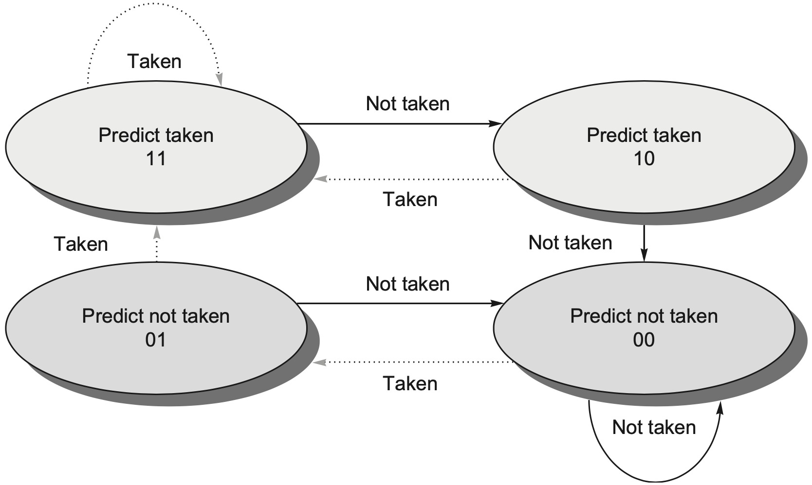
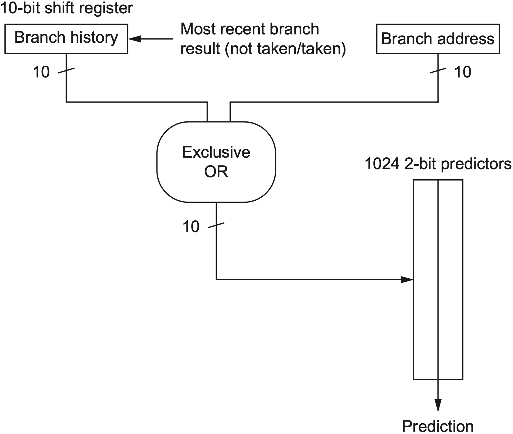
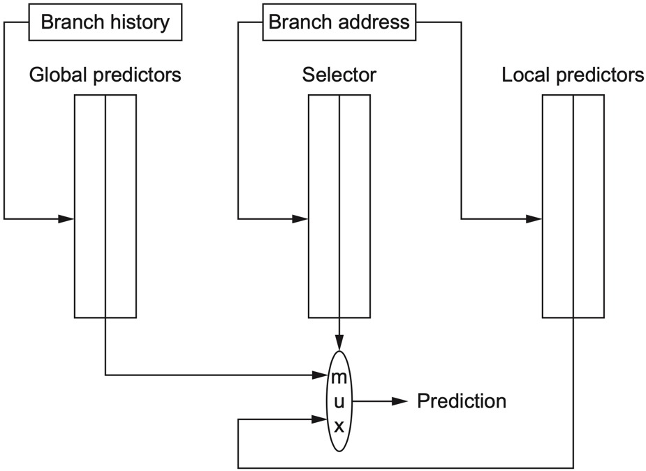
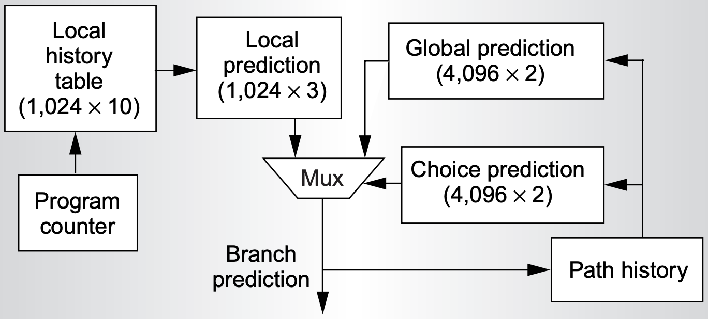
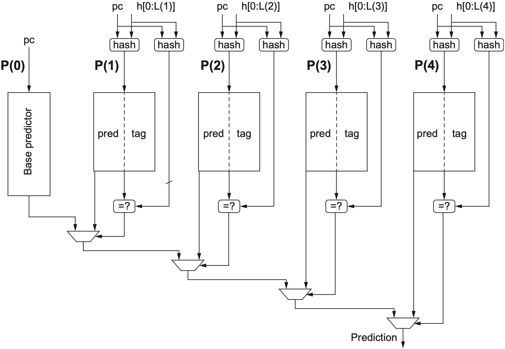
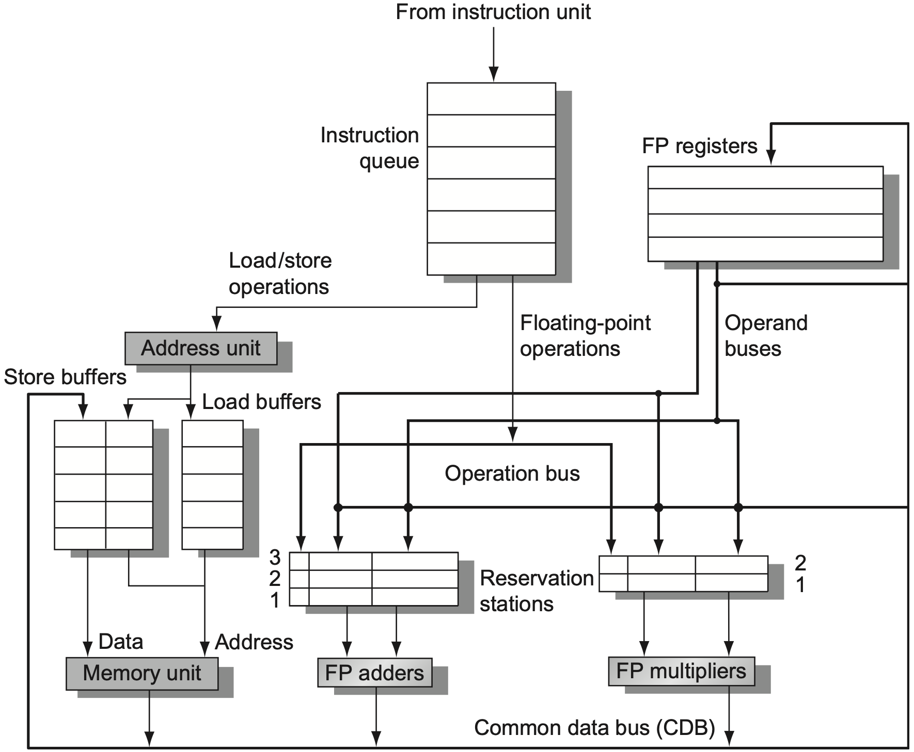
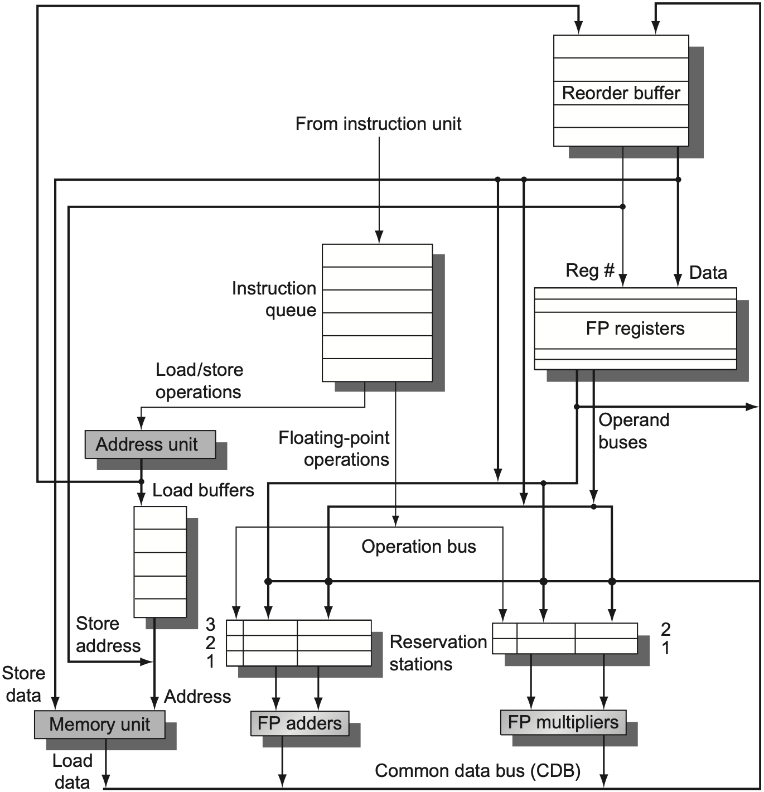

### 1. 分支预测

#### 1.1 动态预测

**动态分支预测 (Dynamic Branch Prediction)** 根据程序运行时的历史行为预测下一次分支方向。相比静态预测，它不把所有分支都视为同一种模式，而是为不同分支保存历史状态。

动态预测通常由两类结构配合完成：

- **BTB (Branch Target Buffer)**：缓存分支指令的目标地址，用于预测跳转目标；
- **BHT (Branch History Table)**：记录分支历史方向，用于预测是否跳转。

当 PC 命中 BTB，且方向预测器给出 taken 时，下一条取指地址来自 BTB 中的目标地址；否则继续按 `PC+4` 顺序取指。

动态预测的关键并不是“预测一定正确”，而是让处理器在分支结果真正算出之前先保持取指流水线不断流。对于深流水线或宽发射处理器而言，分支停顿会同时浪费多个周期、多个取指槽和多个执行槽，因此即使预测偶尔错误，只要总体准确率足够高，仍然能显著提高吞吐量。

需要注意的是，**BHT 负责方向，BTB 负责目标地址**。BHT 通常只用 PC 低位索引方向计数器，多个分支可能共享同一项；BTB 则保存 `tag+target`，必须确认 tag 匹配当前 PC。因此，BHT 可能给出 taken 倾向，但 BTB 没有当前分支的有效 target。此时前端不能凭空跳转，只能按 `PC+4` 继续取指，或等待后续流水级解析出真实目标地址。

#### 1.2 位预测器

**1-bit predictor** 也称 last-time predictor，每个分支只保存 1 位状态：

- `1` 表示上次 taken，本次预测 taken；
- `0` 表示上次 not taken，本次预测 not taken。

这种方法实现简单，但状态变化过于敏感。只要一次预测失败，下一次预测方向就会立即翻转。

> [!Note] **1-bit 局限**
> 对循环分支 `T T T T T T T T T N`，若初始预测为 not taken，则第一次进入循环和最后一次退出循环都会错，准确率为 $8/10=80\%$。但对 `T N T N ...` 这种交替模式，1-bit 预测器会每次都被上一次结果带偏，准确率可能降为 $0\%$。

**2-bit predictor** 为每个分支保存 2 位饱和计数器，只有连续两次反向结果才会改变强预测方向。四个状态可以按“强/弱”和“跳转/不跳转”理解：

| **状态** | **预测方向** | **遇到 taken** | **遇到 not taken** |
| --- | --- | --- | --- |
| `11` Strong Taken | taken | 留在 `11` | 降到 `10` |
| `10` Weak Taken | taken | 升到 `11` | 降到 `01` |
| `01` Weak Untaken | not taken | 升到 `10` | 降到 `00` |
| `00` Strong Untaken | not taken | 升到 `01` | 留在 `00` |

<div align="center">  </div>

2-bit 预测器的核心思想是 **滞后翻转**：一次偶然的反向结果只会把状态从 strong 推到 weak，而不会立刻改变预测方向。因此它对循环末尾的单次 not taken 更稳定。

例如循环分支大部分时间 taken，只有退出循环时 not taken。1-bit 预测器会在退出时被改成 not taken，下一次重新进入循环时又会错一次；2-bit 预测器在退出时通常只是从 Strong Taken 降到 Weak Taken，下次进入循环仍预测 taken，因此少错一次。

更一般地，**N-bit predictor** 使用范围为 $0\sim 2^N-1$ 的饱和计数器：

- 计数器高于或等于中点时预测 taken；
- 计数器低于中点时预测 not taken；
- taken 时计数器加一，not taken 时计数器减一，达到边界后饱和。

PPT 中给出过一个经验结果：4096 项 2-bit predictor 在整数程序上的误预测率约为 11%，在浮点程序上约为 4%。这也说明分支预测效果和程序类型关系很大，整数程序通常包含更多复杂控制流，而浮点程序往往循环结构更规则。

#### 1.3 局部历史

**局部预测器 (Local Predictor)** 认为某个分支的结果可以由它自己过去几次结果预测。每条分支维护一个 **局部历史寄存器 (local history register)**，再用该历史索引一组 2-bit 计数器。

其结构可以理解为两级：

1. 用分支 PC 找到这条分支自己的历史；
2. 用这段历史选择对应的饱和计数器，得到 taken / not taken 预测。

局部预测适合具有固定周期模式的单个分支。它的核心不是只记录“上一次跳没跳”，而是为每条分支保存一段 **局部历史 (local history)**，再用这段历史去选择对应的方向计数器。

假设 1-bit local history 初始为 `0`，两个历史状态对应的 2-bit counter 都初始为 Strong Not Taken，分支模式为 `(NNT)*`。由于 1-bit history 只能表示上一次是 N或上一次是 T，但在 `(NNT)*` 中，`N` 后面有时接 `N`，有时接 `T`，因此这个历史长度不够表达完整周期。按 PPT 的例题，100 轮中会产生 **100 次误预测**。

若希望更好地预测 `(NNT)*`，需要把 local history 加长。比如 2-bit local history 可以区分 `NN`、`NT`、`TN` 等上下文，从而把“当前处在周期的哪个位置”编码进预测索引。
#### 1.4 全局相关

**相关预测 (Correlating Prediction)** 认为一个分支的结果可能依赖于其他分支的结果，即“没有一个分支是孤岛”。例如：

```C
if(d==0) d=1;
if(d==1) ...
```

第二个分支是否成立，与第一个分支的结果强相关。若只看第二个分支自己的历史，预测器可能看不到这种跨分支关系。

**两级预测器 (Two-Level Predictor)** 使用最近 $m$ 个分支的全局历史，从 $2^m$ 组预测器中选择一组，每组包含 $n$ 位预测计数器 (常用 2-bit predictor)。常记为 **$(m,n)$ predictor**：

- $m$：使用最近多少个分支结果作为全局历史；
- $n$：每个预测计数器的位数；
- 全局历史用于选择预测表项，计数器用于给出最终方向。

这种预测器的优势在于能表达 **路径上下文**。同一条分支在不同路径下可能有不同方向，单独看它自己的历史会混在一起，而全局历史能把“从哪条路径走到这里”编码进索引中。但全局历史越长，表项数和别名冲突问题也越明显。

**gshare**：将全局历史与 PC 做哈希，减少不同分支映射到同一表项的冲突，它并不增加预测表容量，而是用改变表项映射方式。若不同分支出现在不同路径历史下，异或后可能被分散到不同计数器，从而减少有害别名；但它不能消除冲突，也不保证总是优于单纯 PC 索引。

<div align="center">  </div>

对于一个独立的 **pattern history table (PHT)**，$(m,n)$ predictor 的存储开销为 $2^m\times n$ bit。$m$ 每增加 1，表项数就翻倍，因此全局历史并不是越长越好；过长历史会带来更多容量开销，也会让不同路径哈希到同一项的冲突更难控制。

#### 1.5 混合预测

不同分支的行为模式不同，没有一种预测器适合所有分支。**混合预测器 (Hybrid Predictor)** 同时维护多种预测器，并用选择器决定采用哪一个结果。

**锦标赛预测器 (tournament predictor)**：同时使用局部预测器和全局预测器，再由 selector 根据历史表现选择更可靠的一方。

<div align="center">  </div>


<div align="center">  </div>

选择器本质上也是一个饱和计数器：当局部预测正确而全局预测错误时，选择器向局部预测器倾斜；反之则向全局预测器倾斜。

混合预测的意义在于把“选择预测器”也变成一个可学习的问题。局部预测器擅长处理单个分支的周期模式，全局预测器擅长处理跨分支相关，selector 则根据每条路径上的历史表现决定相信谁。这种结构牺牲了更多存储和访问能耗，但能显著降低难预测分支的错误率。
#### 1.6 TAGE

**TAGE (Tagged Geometric History Length Predictor)** 使用多张全局历史长度不同的预测表。短历史表覆盖简单、稳定的分支，长历史表捕捉更远距离的相关性。

<div align="center">  </div>

TAGE 的关键机制包括：

- 每张表使用不同长度的全局历史，且历史长度通常按几何级数增长；
- 每个表项带 tag，用于降低别名冲突；
- 预测时优先采用 **最长历史且 tag 命中** 的表项；
- AGE / useful 位用于替换价值较低的表项。

TAGE 的优势在于能够同时覆盖短周期分支和长距离相关分支，因此在现代高性能处理器中很常见。

从直觉上看，TAGE 相当于同时问多个观察窗口：“只看最近几个分支够不够？要不要看更长的历史？”如果长历史表命中且可信，说明这条分支确实受远距离路径影响；如果长历史表不命中，就退回较短历史表，避免用噪声历史干扰简单分支。

PPT 中也给出了性能直觉：如果分支频率约为 20% 到 25%，TAGE 一类预测器把误预测率压到约 1.8% 到 2.2% 时，整体性能影响大约落在 2.7% 到 3.4% 范围。误预测率已经很低时，继续优化预测器仍然有价值，但收益会受到分支频率和错误恢复代价共同限制。

### 2. 动态调度

#### 2.1 核心目标

**动态调度 (Dynamic Scheduling)** 让硬件在运行时重排指令执行顺序，以减少数据冒险造成的停顿，同时仍然保持程序的数据流和异常行为正确。

在静态调度中，编译器提前安排指令顺序；在动态调度中，硬件可以在发现前一条指令等待数据时，让后续无关指令先执行。

典型做法是将 ID 阶段拆成两段：

- **Issue**：按程序顺序发射指令，检查结构资源；
- **Read operands**：当操作数就绪时读取操作数并进入执行，可以乱序发生。

因此动态调度通常具有：

- **顺序发射 (in-order issue)**；
- **乱序执行 (out-of-order execution)**；
- **乱序完成 (out-of-order completion)**。

动态调度的前提是：程序顺序不等于执行顺序。只要不破坏数据依赖、名字依赖和控制依赖，硬件就可以让后面的无关指令越过正在等待的指令。典型场景是长延迟的 `fdiv.d` 阻塞了紧随其后的 `fadd.d`，但再后面的 `fsub.d` 与它们无关，此时动态调度允许 `fsub.d` 先进入执行单元。

这类机制的代价是硬件必须保存更多“半执行状态”：哪些指令已经发射、哪些操作数还没到、结果将写到哪里、发生异常时如何恢复。后面的记分牌、Tomasulo 和 ROB，都是围绕这些状态设计的。

在没有硬件推测的动态调度中，分支仍然是一个边界：位于某条分支之后的指令，通常不能在这条分支真正完成之前进入执行。也就是说，动态调度可以绕过数据等待，但还没有完全跨越未解析的控制依赖；真正把分支预测路径上的指令提前执行，需要后面的硬件推测机制。

#### 2.2 记分牌

**记分牌 (Scoreboarding)** 是一种集中式动态调度方法。它由一个全局控制表记录功能单元、寄存器结果和每条指令所处阶段，从而决定指令是否可以继续前进。

记分牌将指令推进分为四步：

1. **Issue**：如果功能单元空闲，且不存在 WAW 冒险，则发射；
2. **Read operands**：若源操作数已经可读，则读取；否则等待 RAW 消除；
3. **Execution complete**：功能单元完成运算；
4. **Write result**：若不会破坏 WAR 顺序，则写回结果。

记分牌的核心是：不通过编译器提前安排，而是由硬件持续观察哪些操作数已经可用、哪些功能单元被占用。

它的控制方式比较保守：指令能否进入下一阶段由记分牌统一判断，所有功能单元都向记分牌报告状态。因此记分牌更像“中央调度表”，能够清楚地避免结构冲突和数据冲突，但每一次判断都依赖全局状态，扩展到更宽的发射宽度时会变得复杂。

#### 2.3 状态表

记分牌维护三类状态。

**Instruction Status** 记录每条指令处于哪个阶段：Issue、Read operands、Execution complete、Write result。

**Functional Unit Status** 记录每个功能单元的使用情况，典型字段如下：

| **字段** | **含义** |
| --- | --- |
| `Busy` | 该功能单元是否正在使用 |
| `Op` | 当前执行的操作类型 |
| `Fi` | 目的寄存器 |
| `Fj/Fk` | 两个源寄存器 |
| `Qj/Qk` | 将产生源操作数的功能单元 |
| `Rj/Rk` | 源操作数是否已经可读 |

**Register Result Status** 记录每个寄存器将由哪个功能单元写入。如果为空，表示当前没有未完成指令会写该寄存器。这个表主要用于检测 WAW 和 RAW：如果某个寄存器已经登记了未来写入者，那么新的同目的寄存器指令不能随意发射，读取该寄存器的指令也需要等待对应功能单元产生结果。

#### 2.4 冒险处理

记分牌对三类数据冒险的处理方式不同：

- **RAW**：在 Read operands 阶段等待，直到产生源操作数的功能单元写回或结果可转发；
- **WAW**：在 Issue 阶段阻止发射，避免两个未完成指令写同一目的寄存器；
- **WAR**：在 Write result 阶段等待，直到更早的指令已经读取该寄存器。

记分牌能够支持乱序执行，但它并没有真正消除 WAR / WAW，只是通过暂停来避免错误。因此它的控制逻辑较直观，但并行度会受到名字依赖限制。

例如一条较早的指令还没读取 `F6`，而后面一条较晚的指令准备写 `F6`，此时若允许后者先写回，就会破坏前者应该读到的旧值，这就是 WAR。记分牌没有为 `F6` 创建新名字，只能让后写指令停在 Write result 阶段，直到旧读完成。

> [!Note] **记分牌限制**
> Scoreboard 可以让无关指令绕过正在等待的指令，但如果遇到 WAR 或 WAW，它仍然需要停顿。真正把名字依赖变成可并行执行机会的，是 Tomasulo 中基于 tag 的寄存器重命名。

### 3. Tomasulo

#### 3.1 基本结构

**Tomasulo 算法** 是一种分布式动态调度方法。它不把所有控制都集中在一个记分牌中，而是让功能单元附近的 **保留站 (Reservation Station)** 保存等待执行的操作。

<div align="center">  </div>

核心组件包括：

- **Instruction Queue**：保存按顺序取来的指令；
- **Load / Store Buffers**：保存访存指令的地址与数据状态；
- **Reservation Stations**：保存浮点加法、乘法等操作的操作码、操作数或等待标签；
- **CDB (Common Data Bus)**：广播执行结果，同时唤醒等待该结果的保留站和寄存器。

Tomasulo 相比记分牌有两个重要优势：

1. **分布式等待**：每个保留站自己记录操作数是否就绪；
2. **寄存器重命名**：用保留站编号或 ROB 编号代替寄存器名，消除 WAR 和 WAW。

在 Tomasulo 中，寄存器名不再是唯一的等待对象。指令发射后，如果源操作数还没有产生，保留站记录的不是“等待某个寄存器”，而是“等待某个生产者 tag”。当生产者把结果广播到 CDB 上，所有等待该 tag 的保留站会同时捕获结果。这种广播机制让多个依赖者可以在同一周期被唤醒。

#### 3.2 保留站

保留站状态字段如下：

| **字段** | **含义** |
| --- | --- |
| `Busy` | 当前保留站是否被占用 |
| `Op` | 要执行的操作 |
| `Vj/Vk` | 已经可用的源操作数值 |
| `Qj/Qk` | 将产生源操作数的保留站编号 |
| `A` | load/store 的地址计算信息 |

若 `Qj/Qk` 为空，说明对应操作数已经可用，保存在 `Vj/Vk` 中；若不为空，说明该操作数还在等待某个保留站或缓冲区通过 CDB 广播结果。

因此，`V` 字段和 `Q` 字段不会同时表达同一件事：`V` 保存“值已经到了”，`Q` 保存“值还没到，但知道该等谁”。这也是 Tomasulo 能够自然处理 RAW 的原因，消费者不需要反复查询寄存器文件，只要监听 CDB 上是否出现自己等待的 tag。

#### 3.3 重命名

Tomasulo 使用 tag 来实现隐式寄存器重命名。寄存器文件不只保存值，还保存 `Qi` 字段：

- `Qi=0`：该寄存器当前值可直接读取；
- `Qi!=0`：该寄存器的最新值将由某个保留站产生。

例如下面的代码同时包含 RAW、WAR 和 WAW：

```asm
fdiv.d f0, f2, f4
fadd.d f6, f0, f8
fsd    f6, 0(x1)
fsub.d f8, f10, f14
fmul.d f6, f10, f8
```

- `fadd.d` 对 `fdiv.d` 有 RAW，因为它要读 `f0`；
- `fsub.d` 写 `f8`，而前面的 `fadd.d` 还要读旧 `f8`，存在 WAR；
- `fadd.d` 和 `fmul.d` 都写 `f6`，存在 WAW。

Tomasulo 不需要真的修改程序中的寄存器名，而是在硬件内部把不同“版本”的 `f6`、`f8` 绑定到不同 tag。这样后续指令等待的是 tag，而不是寄存器名本身。

这里的“重命名”并不是修改汇编代码，而是修改硬件内部的映射关系。假设前一条指令将写 `f6`，后一条指令也将写 `f6`，Tomasulo 可以让它们分别对应不同保留站。谁最后更新体系结构可见的 `f6`，由寄存器结果状态中的最新 tag 决定。旧 tag 即使较晚广播，也不会覆盖新映射。

#### 3.4 执行流程

Tomasulo 的基本流程分为三步。

- **Issue / Dispatch**：从指令队列头部取出下一条指令。如果有空闲保留站或缓冲区，就分配给它；若源操作数已在寄存器中，直接填入 `Vj/Vk`；若源操作数尚未就绪，则记录产生者 tag 到 `Qj/Qk`。

- **Execute**：当所有源操作数可用，且功能单元空闲时开始执行。对于 load/store，先计算有效地址，再根据访存约束决定何时访问内存。

- **Write Result**：执行完成后将结果放到 CDB 上广播。所有等待该 tag 的保留站都会捕获结果，寄存器文件中仍指向该 tag 的项也会更新。

对于 load/store buffer，除了保存等待状态，还会在地址计算完成后保存有效地址 `A`。load 在地址和内存条件满足后读取数据；store 则要等待地址和待写数据都可用，才能真正写入内存。

| **阶段** | **主要动作** | **需要等待的条件** |
| --- | --- | --- |
| Issue | 分配保留站，记录操作码和目的 tag | 保留站或缓冲区必须空闲 |
| 取操作数 | 可用值写入 `Vj/Vk`，不可用值写入 `Qj/Qk` | 等待生产者 tag |
| Execute | 操作数齐全后进入功能单元 | `Qj=0` 且 `Qk=0` |
| Write Result | 通过 CDB 广播 `(tag,value)` | CDB 可用，功能单元完成 |

用流程语言描述就是：发射时先占住一个保留站；如果源操作数已经在寄存器中，就把值复制进去；如果源操作数还在路上，就记录它的生产者 tag。等两个源操作数都到齐，功能单元才开始执行。结果出来后通过 CDB 广播，所有等待该 tag 的位置同时更新。

对于 store，结果广播并不是写寄存器，而是让 store buffer 获得要写入的数据；当 store 的地址和数据都可用后，才能执行内存写入。对于 load，读取的数据会像普通运算结果一样通过 CDB 广播给依赖者。

> [!Note] **保留站释放**
> 一般在结果广播后释放保留站，而不是在指令刚开始执行时释放。因为保留站还承担“结果身份”的作用，其他指令可能正在等待它的 tag。

#### 3.5 访存处理

访存指令比普通浮点运算更复杂，因为内存地址本身也可能依赖前面指令。

**load** 通常需要等待：

- 基址寄存器可用；
- 有效地址计算完成；
- 更早的 store 不会写同一地址，或已经完成必要检查。

**store** 可以分成两部分处理：

- 地址可以在基址寄存器可用后先计算；
- 要写入的数据可以稍后到达，只要在真正写内存前准备好即可。

没有硬件推测时，Tomasulo 可以乱序执行并乱序完成，但结果一旦通过 CDB 写入寄存器，就已经修改了体系结构状态，因此还不能自然支持精确异常和错误分支回滚。

这也是 Tomasulo 与硬件推测之间的分界：Tomasulo 解决的是“如何乱序执行”，但不完整解决“乱序执行后如何按顺序生效”。如果一条较晚指令先写回寄存器，而较早指令随后发生异常，处理器就很难恢复到“异常指令之前所有指令完成、之后所有指令未完成”的精确状态。

### 4. 硬件推测

#### 4.1 引入动机

动态分支预测解决控制冒险的一半问题：预测接下来要走哪条路径。另一半问题是：**在分支尚未确认前，能不能先执行预测路径上的指令？**

**硬件推测 (Hardware Speculation)** 将分支预测、Tomasulo 和提交机制结合起来：

- 预测正确时，提前执行的指令可以继续提交；
- 预测错误时，丢弃预测路径上的结果并重新取指；
- 任何指令在真正安全之前，都不能永久修改寄存器或内存。

因此硬件推测的核心是：

$$
\text{乱序执行} + \text{顺序提交}
$$

这意味着执行结果会先进入临时结构，而不是马上改变体系结构寄存器或内存。只要分支还没有确认，或者更早的指令还没有提交，后续指令即使已经算出结果，也只能停留在“完成但未提交”的状态。

#### 4.2 ROB

**重排序缓冲区 (Reorder Buffer, ROB)** 保存已经执行完成但尚未提交的结果。它让结果先进入临时缓冲，而不是直接写入寄存器或内存。

<div align="center">  </div>

ROB 的作用包括：

- 保存推测执行产生的结果；
- 按程序顺序提交指令；
- 为后续指令提供尚未提交的源操作数；
- 在分支预测错误或异常发生时清空错误路径。

ROB 可以看成一条按程序顺序排列的“提交队列”。指令可以在队列中乱序变成 ready，但只能从队首按顺序离开队列。这样既保留了乱序执行带来的并行性，又让外部看到的寄存器和内存更新仍然像顺序执行一样。

ROB 表项常见字段如下：

| **字段** | **含义** |
| --- | --- |
| `Instruction type` | branch、store、寄存器操作、load 等 |
| `Destination` | 目的寄存器号，或 store 的内存地址 |
| `Value` | 指令执行完成后的结果 |
| `Ready` | 结果是否已经可提交 |

#### 4.3 推测流程

加入 ROB 后，Tomasulo 的三步变成四步：

1. **Issue**：分配保留站和 ROB 表项，目的寄存器重命名为 ROB 编号；
2. **Execute**：操作数可用后执行；
3. **Write result**：结果通过 CDB 写入 ROB，并广播给等待的保留站；
4. **Commit**：只有到达 ROB 队首且结果 ready 时，才正式更新寄存器或内存。

| **阶段** | **ROB 相关动作** | **结果是否生效** |
| --- | --- | --- |
| Issue | 分配 ROB 表项，目的寄存器指向该 ROB 编号 | 未生效 |
| Execute | 使用寄存器、ROB 或 CDB 提供的操作数执行 | 未生效 |
| Write result | 结果写入 ROB，并通过 CDB 唤醒依赖者 | 未生效 |
| Commit | 队首 ready 后写入寄存器或内存 | 正式生效 |

结果写回阶段不直接修改体系结构寄存器，而是写入 ROB。寄存器真正改变发生在 Commit 阶段。

因此，`Write result` 和 `Commit` 是两个不同概念：前者说明“值已经算出来”，后者说明“这条指令已经不再处于推测状态，可以影响程序可见状态”。这一区分是精确异常和分支回滚的基础。

#### 4.4 提交流程

提交必须保持程序顺序。ROB 队首指令根据类型采取不同动作：

- **普通寄存器指令 / load**：若结果 ready，将 ROB 中的值写入目的寄存器；
- **store**：若地址和数据 ready，写入内存；
- **预测正确的 branch**：释放该 ROB 表项，继续提交后续指令；
- **预测错误的 branch**：清空错误路径上的 ROB 表项和保留站，从正确目标重新取指；
- **异常指令**：在到达 ROB 队首时精确报告异常，保证此前指令都已提交，此后指令都未提交。

这就是硬件推测能够保持 **精确异常 (precise exception)** 的原因：即使执行是乱序的，体系结构状态的更新仍然是顺序的。

#### 4.5 处理冒险

硬件推测下的数据冒险处理可以概括为：

- **RAW**：后续指令等待前序 ROB 表项或 CDB 广播结果；
- **WAR / WAW**：通过 ROB 编号进行寄存器重命名，消除名字依赖；
- **控制冒险**：通过分支预测先执行，预测错误时由 ROB 回滚；
- **内存 RAW**：load 必须检查更早 store 是否可能写同一地址。

对于 store，写内存必须推迟到 Commit 阶段。否则一旦预测错误或异常发生，已经写入内存的副作用很难回滚。

load/store 还需要额外处理内存相关。寄存器相关可以通过 tag 明确知道生产者是谁，但两个内存地址是否相同，往往要等地址计算后才知道。因此较晚的 load 不能随意越过较早的未知地址 store；如果地址相同，必须先让 store 提供正确数据或等待 store 提交。

PPT 中为了简化处理，给出过更保守的策略：在没有比较所有 store 地址字段的情况下，可以要求较早的 store 先完成，再允许后续 load 访问内存。更激进的实现会做地址比较和 store-to-load forwarding，但硬件复杂度也更高。

> [!Note] **为什么要 ROB**
> Tomasulo 只解决“能不能早点执行”的问题；ROB 解决“什么时候结果才算正式生效”的问题。前者提高并行度，后者保证精确异常、分支回滚和顺序提交。

### 5. 动态并行

#### 5.1 技术对比

| **技术**   | **解决问题**  | **核心结构**        | **主要限制**      |
| -------- | --------- | --------------- | ------------- |
| 分支预测     | 控制冒险      | BHT、BTB、局部/全局历史 | 预测错误需要清空路径    |
| 记分牌      | 运行时调度     | 全局状态表           | WAR/WAW 仍靠停顿  |
| Tomasulo | 乱序执行      | 保留站、CDB、tag     | 无 ROB 时难以精确回滚 |
| 硬件推测     | 提前执行分支后指令 | ROB、顺序提交        | 需要更多缓冲和恢复逻辑   |

动态并行技术的整体目标，是在不破坏程序语义的前提下尽量突破顺序执行限制：

- 分支预测减少控制停顿；
- 动态调度减少数据等待；
- 寄存器重命名消除名字依赖；
- ROB 保证乱序执行后的顺序提交。

#### 5.2 执行模型

现代乱序处理器可以抽象为以下模型：

| **阶段** | **作用** |
| --- | --- |
| Fetch | 根据分支预测持续取指 |
| Decode / Rename | 解码并把架构寄存器映射到物理 tag 或 ROB 表项 |
| Issue | 分配保留站、Load/Store Queue 和 ROB 项 |
| Execute | 操作数就绪后乱序执行 |
| Write Result | 结果写入 ROB，并广播给依赖指令 |
| Commit | 按 ROB 顺序更新体系结构状态 |

这条路径把“执行顺序”和“提交顺序”分离开来。执行顺序由数据是否就绪、功能单元是否空闲决定；提交顺序仍然由原始程序顺序决定。

#### 5.3 核心结论

动态 ILP 的关键不在于让程序完全失去顺序，而是把顺序拆成两类：

- **必须保留的顺序**：数据流、异常行为、内存可见副作用；
- **可以打破的顺序**：无关指令的执行先后、功能单元占用顺序、预测路径上的临时计算。

因此，动态并行的本质是：

- 在保持体系结构状态顺序可解释的前提下，让微架构内部尽可能乱序。

从记分牌到 Tomasulo，再到带 ROB 的硬件推测，硬件逐步把更多“等待”转化为“暂存、标记、广播、提交”的问题，也就逐步扩大了可以挖掘的指令级并行空间。
