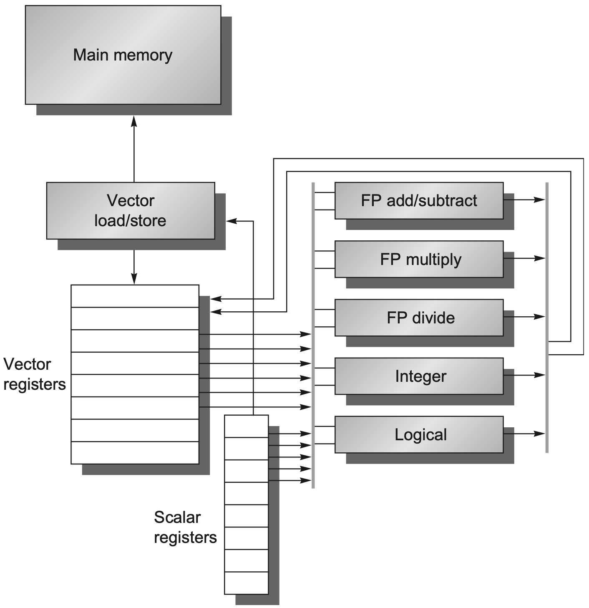
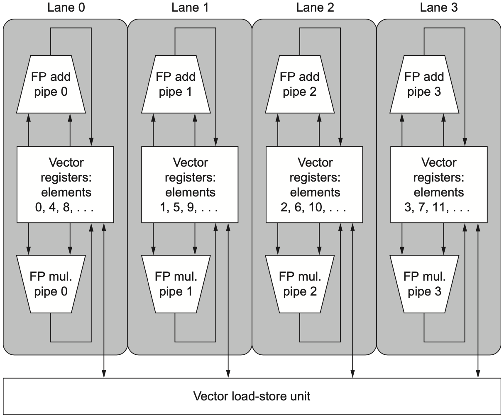
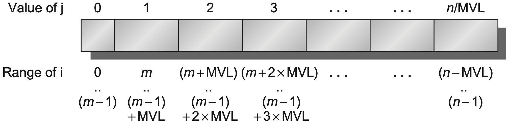
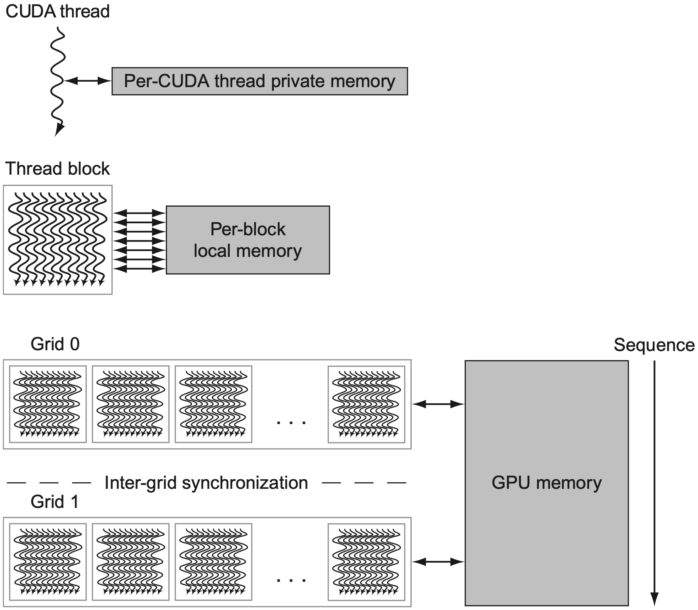
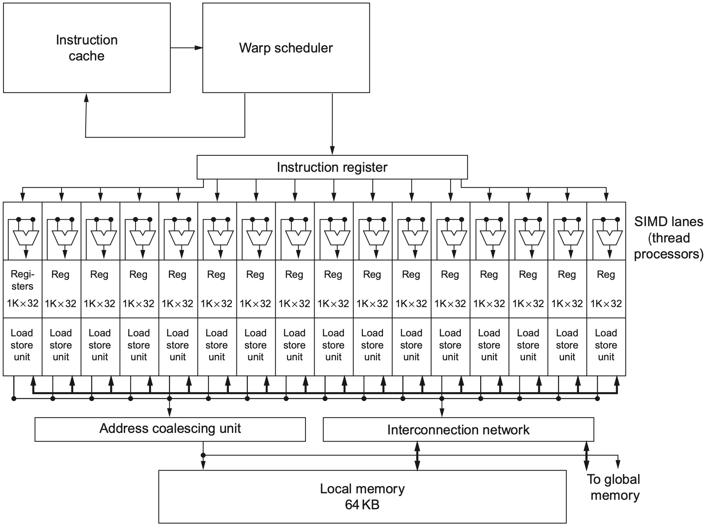
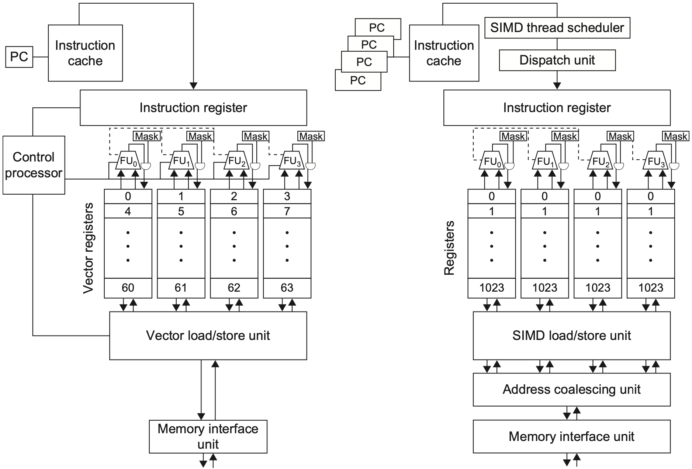

### 1. 数据级并行

#### 1.1 基本思想

**数据级并行 (Data-Level Parallelism, DLP)** 指的是：同一类操作可以同时作用在大量数据元素上。它利用的是数据集合内部的并行性，而不是多个独立控制流之间的并行性。

典型例子包括矩阵计算、图像与音频处理、机器学习中的张量运算等。这些程序常常会对数组、向量或矩阵中的许多元素执行相同操作，例如：

```C
for(i=0;i<n;i++)
{
    y[i]=a*x[i]+y[i];
}
```

从硬件角度看，DLP 的吸引力在于：一条指令可以启动很多个数据操作。指令取指、译码、发射等控制开销只付一次，却能覆盖一批元素，因此能效往往比为每个元素单独发射标量指令更好。

DLP 也比传统 MIMD 并行更容易编程。MIMD 程序员需要显式考虑线程划分、同步、通信和负载均衡；而 DLP 程序通常只需要表达“这批元素做同一件事”，剩下的并行执行细节交给向量硬件、SIMD 指令或 GPU 运行时。

常见 DLP 架构包括：

| **架构** | **基本方式** | **典型特点** |
| --- | --- | --- |
| 向量架构 | 一条向量指令处理一组元素 | 支持向量长度、步长、掩码等机制 |
| 多媒体 SIMD | 一条短向量指令处理固定数量元素 | 指令简单，适合音视频和小向量数据 |
| GPU | 大量线程以 SIMT 方式执行 | 线程数量巨大，依靠硬件调度隐藏延迟 |

#### 1.2 向量架构

**向量架构 (Vector Architecture)** 的核心思想是：先把一组数据元素从内存取入向量寄存器，再由向量功能单元对整组元素执行运算，最后把结果写回内存。

可以把它理解为四步：

1. **Grab**：从内存中取出一组数据元素；
2. **Place**：放入连续的向量寄存器；
3. **Operate**：用向量功能单元逐元素运算；
4. **Disperse**：把结果分散写回内存。

一条向量指令在语义上只是一条指令，但实际会展开成许多相互独立的寄存器-寄存器操作。例如一条向量加法可以完成几十个元素的加法，这些元素之间没有循环携带依赖，因此天然适合流水化和并行化。

<div align="center">  </div>

RV64V 这一类向量扩展通常包含：

- 多个向量寄存器，用于保存整组元素；
- 向量 load/store 单元，用于批量访问内存；
- 向量整数、浮点等功能单元，用于流水化执行；
- 标量整数寄存器和浮点寄存器，用于提供地址、标量操作数和控制信息；
- 控制逻辑，用于检测结构冒险和数据冒险。

PPT 中的 RV64V 例子包含 32 个向量寄存器，并通过 crossbar 把寄存器文件连接到多个向量功能单元。其设计目标不是让一条指令只完成一个标量操作，而是让向量功能单元在流水线填满后持续接收新元素。因此寄存器端口、load/store 带宽和功能单元启动率都会直接影响最终吞吐。

与普通标量流水线不同，向量功能单元通常是**深流水**的：第一批元素进入后，后续元素可以每个周期连续进入。只要流水线填满，就能接近每周期产生一个元素结果。

#### 1.3 指令形式

向量指令需要说明操作数来自向量还是标量。RV64V 中常见后缀可以按如下方式理解：

| **后缀** | **含义** | **例子** |
| --- | --- | --- |
| `.vv` | vector-vector | 两个向量逐元素相加 |
| `.vs` | vector-scalar | 每个向量元素都与同一个标量相乘 |
| `.sv` | scalar-vector | 标量作为第一个操作数，向量作为第二个操作数 |

例如 `vmul.vs v1,v0,f0` 表示：把向量寄存器 `v0` 中的每个元素与标量浮点寄存器 `f0` 相乘，结果写入 `v1`。

向量指令的关键不只是“并行做很多次”，还包括**减少循环控制开销**。标量代码每次迭代都要进行地址更新、循环计数和分支判断；向量代码把一批元素合成少数几条向量指令，循环控制次数明显减少。

#### 1.4 动态类型

RV64V 采用类似**动态寄存器类型 (dynamic register typing)** 的思想：指令编码中不总是显式写出数据类型和元素宽度，而是先通过配置指定当前向量寄存器如何解释。

这种做法有几个好处：

- 减少指令编码数量，不必为每种类型都设计一套独立指令；
- 同一条向量指令可以在不同配置下处理不同元素宽度；
- 未启用的向量寄存器资源可以合并给已启用寄存器，从而增加每个寄存器可容纳的元素数；
- 允许硬件根据当前配置处理必要的数据宽度转换。

例如总向量寄存器空间固定时，如果启用的向量寄存器更少，每个启用寄存器可以分到更长的向量空间。这使得架构能在“寄存器数量”和“单个向量长度”之间做折中。

> [!Note] **向量寄存器不是普通标量寄存器**
> 标量寄存器通常保存一个值；向量寄存器保存一组元素。向量指令看起来只写一个目的寄存器，但实际写入的是目的向量寄存器中的多个元素位置。

### 2. 向量执行

#### 2.1 DAXPY

PPT 用 **DAXPY** 作为向量化例子。DAXPY 来自 double-precision `a*X+Y`，即对双精度数组执行：

```C
for(i=0;i<n;i++)
{
    Y[i]=a*X[i]+Y[i];
}
```

在标量 RISC-V 中，这个循环需要反复执行 load、multiply、load、add、store、地址递增、循环判断等指令。每个元素都要走一遍循环控制。

在 RV64V 中，如果 `X` 和 `Y` 各有 32 个元素，并且向量寄存器足够容纳这 32 个双精度元素，可以写成类似：

```asm
vsetdcfg 2*FP64
fld      f0,a
vld      v0,x5
vmul.vs  v1,v0,f0
vld      v2,x6
vadd.vv  v3,v1,v2
vst      x6,v3
vdisable
```

这里 `x5`、`x6` 分别保存 `X` 和 `Y` 的起始地址。`vld` 一次装入整段向量，`vmul.vs` 完成所有 `a*X[i]`，`vadd.vv` 完成所有加法，`vst` 再一次性写回结果。

向量版本的重要特点是：不同迭代之间没有循环携带依赖。第 `i` 个元素和第 `j` 个元素的乘加相互独立，因此硬件可以流水化地处理整组数据，而不需要等待前一个元素完全结束后才开始下一个元素。

#### 2.2 链式执行

向量运算并不一定要等整条前序向量指令完全结束后，后序向量指令才能开始。**Chaining** 允许后序指令在前序指令产生某个元素结果后，立刻消费这个元素。

例如：

```asm
vmul.vs  v1,v0,f0
vadd.vv  v3,v1,v2
```

`vadd.vv` 依赖 `vmul.vs` 的结果 `v1`。如果没有 chaining，就要等 `v1` 的所有元素都算完，再开始加法；有 chaining 时，第 0 个乘法结果一出来，第 0 个加法就可以开始，之后第 1 个、第 2 个元素继续流水前进。

这样做的效果类似标量流水线中的 forwarding，但粒度是“向量元素”。它减少了相关向量指令之间的等待时间，使一串向量运算能够像流水线一样首尾相接。

**Flexible chaining** 更进一步，允许一条向量指令几乎和任意正在执行的相关向量指令相连，而不是只允许固定功能单元之间的特定转发路径。这提高了调度灵活性，但也增加了旁路网络和控制逻辑复杂度。

#### 2.3 Convoy

分析向量执行时间时，PPT 引入两个概念：

| **概念** | **含义** |
| --- | --- |
| Convoy | 一组可以潜在并行执行的向量指令 |
| Chime | 执行一个 convoy 所需的时间单位 |

同一个 convoy 中的指令不能有结构冒险。例如只有一个向量 load/store 单元时，两条 `vld` 不能放在同一个 convoy；`vld` 和 `vst` 也可能争用同一访存单元。

但 RAW 数据依赖可以在同一个 convoy 中出现，因为 chaining 可能让消费者在生产者产生元素后立刻继续执行。

以前面的 DAXPY 为例，假设只有一份向量功能单元，且 `vld/vld`、`vld/vst` 有结构冲突，可以分成：

| **Convoy** | **指令** | **原因** |
| --- | --- | --- |
| 1 | `vld v0,x5`，`vmul.vs v1,v0,f0` | 乘法可与前序 load 链接 |
| 2 | `vld v2,x6`，`vadd.vv v3,v1,v2` | 加法可等待对应元素 |
| 3 | `vst x6,v3` | store 需要单独使用访存单元 |

如果向量长度为 `n=32`，每个 chime 近似需要 32 个周期，那么 3 个 chime 约为：

$$
3\times 32=96\text{ cycles}
$$

DAXPY 对每个元素包含一次乘法和一次加法，32 个元素共 `64` 个浮点操作。因此：

$$
\frac{96}{64}=1.5\text{ cycles/FLOP}
$$

更一般地，如果一个向量指令序列包含 `m` 个 convoy，向量长度为 `n`，忽略指令发射开销和启动延迟时，总时间可粗略估为：

$$
m\times n\text{ cycles}
$$

#### 2.4 多车道

单条向量流水线每周期通常只能启动一个元素。为了进一步提高吞吐量，向量处理器可以使用**多个 lanes**。

每个 lane 拥有一部分向量寄存器存储和一组功能单元。向量元素被分散到不同 lane 中执行，因此多个元素可以在同一周期同时前进。

<div align="center">  </div>

多车道的直观效果是：原本每周期处理 1 个元素，现在可以每周期处理多个元素。假设有 4 个 lanes，并且访存和功能单元都能跟上，那么 64 个元素的向量操作理想情况下可以接近 16 个周期完成。

不过 lane 数增加后，硬件也要解决更多问题：

- 向量寄存器文件需要按 lane 分布，避免端口数爆炸；
- load/store 单元需要提供足够带宽；
- 不同 lane 的结果需要按正确元素顺序组织；
- 跨 lane 的规约、重排、压缩等操作会更复杂。

#### 2.5 向量长度

真实程序的数组长度不一定刚好等于最大向量长度。向量架构通常使用 **vector-length register**，记为 `vl`，指定本次向量指令实际处理多少个元素。

若最大向量长度为 `mvl`，则每次向量操作必须满足：

$$
vl\leq mvl
$$

对于长度为 `n` 的数组，编译器会使用 **strip mining**：把长循环切成若干段，每段最多处理 `mvl` 个元素，最后一段处理剩余元素。

<div align="center">  </div>

RV64V 中可以用 `setvl` 设置本轮长度，语义可理解为：

```text
vl=min(mvl,n)
```

因此任意长度的 DAXPY 可以写成“每轮处理 `vl` 个元素，然后移动指针并减少剩余元素数”的形式：

```asm
vsetdcfg 2*FP64
fld      f0,a
loop:
setvl    t0,a0
vld      v0,x5
vmul.vs  v1,v0,f0
vld      v2,x6
vadd.vv  v3,v1,v2
vst      x6,v3
slli     t1,t0,3
add      x5,x5,t1
add      x6,x6,t1
sub      a0,a0,t0
bnez     a0,loop
vdisable
```

其中双精度元素为 64 bit，即 8 byte，所以地址每轮增加 `vl*8`。`x5/x6` 追踪下一段 `X/Y` 的起始地址，`a0` 记录还剩多少元素。

### 3. 向量访存

#### 3.1 谓词寄存器

循环中常常包含条件判断。例如只有当 `X[i]!=0` 时才更新 `Y[i]`：

```C
for(i=0;i<n;i++)
{
    if(X[i]!=0)
    {
        Y[i]=a*X[i]+Y[i];
    }
}
```

如果直接分支，向量化会很麻烦，因为每个元素的分支方向可能不同。向量架构用**谓词寄存器 (predicate register)** 或 mask 解决这个问题。

谓词寄存器保存一组 0/1 位，每一位对应一个向量元素：

- mask 为 `1` 的元素参与后续向量操作；
- mask 为 `0` 的元素不执行操作；
- 目的寄存器中 mask 为 `0` 的对应位置保持不变。

这样，编译器可以把 `if` 转换成直线代码，也就是 **IF-conversion**。控制依赖被转化为数据掩码，硬件仍然按向量方式执行，只是对部分元素关闭写入。

> [!Note] **谓词不是预测**
> 分支预测是在不知道结果时猜下一条路；谓词执行是在已经得到条件结果后，用 mask 决定哪些元素真正生效。它减少的是向量程序中的分支控制复杂度。

#### 3.2 存储体

向量处理器需要持续给功能单元喂数据，因此内存系统必须支持高吞吐。常见做法是把内存分成多个 **memory banks**，让多个 load/store 请求可以并行访问不同 bank。

问题在于，单个 bank 的忙碌时间通常比处理器周期更长。如果连续请求总是落到同一个 bank，就会发生 bank conflict，流水线必须停顿。

PPT 中的 Cray T90 例子：

- 32 个处理器；
- 每个处理器每周期最多 4 次 load 和 2 次 store；
- 处理器周期为 `2.167 ns`；
- SRAM 周期为 `15 ns`。

满带宽下，每个处理器周期的最大访存请求数为：

$$
(4+2)\times 32=192
$$

一个 SRAM 周期约等于：

$$
\frac{15}{2.167}\approx 6.92\approx 7
$$

因此至少需要：

$$
192\times 7=1344
$$

个 memory banks，才能让所有处理器在理想情况下持续获得满内存带宽。

这个例子说明：向量机的瓶颈不只在算术单元，也在内存带宽和 bank 组织。功能单元再快，如果数据供不上，吞吐量仍然上不去。

#### 3.3 步长访问

**Stride** 表示被装入同一个向量寄存器的相邻元素在内存中的距离。

| **类型** | **含义** | **例子** |
| --- | --- | --- |
| unit stride | 步长为 1，访问连续元素 | `A[i],A[i+1],A[i+2]` |
| nonunit stride | 步长大于 1，访问间隔元素 | 矩阵按列访问 row-major 数组 |

在 C 的 row-major 二维数组中，一行内元素通常连续；如果按列访问，相邻逻辑元素在内存中会相隔一整行的大小，因此会形成 nonunit stride。

向量架构提供带步长的 load/store，例如：

```asm
vlds  v0,x5,x7
vsts  x6,x7,v1
```

这里 `x7` 可以保存 stride，表示相邻向量元素对应的内存地址间隔。

步长会直接影响 bank conflict。PPT 给出的例子：

- 8 个 memory banks；
- bank busy time 为 6 个周期；
- 总内存延迟为 12 个周期；
- 访问 64 个元素。

当 `stride=1` 时，访问会依次落到不同 bank 上。因为 bank 数 `8` 大于 busy time `6`，等再次访问同一个 bank 时，它已经空闲，因此没有 bank conflict。总时间约为：

$$
12+64=76\text{ cycles}
$$

当 `stride=32` 时，`32\%8=0`，每次访问都落到同一个 bank。第二次访问开始就会持续冲突，总时间变为：

$$
12+1+6\times 63=391\text{ cycles}
$$

判断是否容易冲突，可以看“再次访问同一个 bank 的间隔”是否小于 bank busy time：

$$
\frac{LCM(stride,banks)}{stride}<bank\_busy\_time
$$

若不等式成立，同一个 bank 还没空闲就又被访问，会产生停顿。比如 `stride=6`、`banks=16` 时，访问序列为 `0,6,12,2,8,14,4,10,0...`，再次访问 bank 0 的间隔为 `8` 次访问。

#### 3.4 聚集分散

普通 stride 访问仍然假设元素之间有固定间隔。但稀疏矩阵、图算法等程序中，非零元素位置可能完全不规则。此时需要 **gather-scatter**。

| **机制** | **作用** |
| --- | --- |
| Gather | 根据索引向量，从多个不连续地址取数并压入向量寄存器 |
| Scatter | 根据索引向量，把向量寄存器中的结果写回多个不连续地址 |

例如稀疏数组 `A` 和 `C` 的非零位置由索引向量 `K` 和 `M` 指定。Gather 会从 `A[K[i]]` 读取有效元素，形成紧凑向量；计算完成后，scatter 再把结果写回 `C[M[i]]`。

RV64V 中可以用：

```asm
vldx  v0,x5,vk
vstx  x6,vm,v1
```

`vldx` 表示 indexed load，也就是 gather；`vstx` 表示 indexed store，也就是 scatter。

Gather-scatter 扩展了向量架构能处理的数据布局，但代价也明显：访存地址不连续，容易造成 bank conflict、cache miss 或合并访存困难。因此它通常比 unit stride 访问慢，适合在数据结构无法改成连续布局时使用。

### 4. 多媒体 SIMD

#### 4.1 固定向量

**Multimedia SIMD** 可以看作向量架构的简化版本。它仍然是一条指令处理多个数据元素，但通常使用固定宽度的短向量寄存器，例如 128-bit、256-bit 或 512-bit。

这类指令常被用于多媒体处理，也依赖编译器或程序员提供更明确的并行化线索。硬件只提供固定宽度的数据通路，至于循环展开、尾部处理、对齐和数据重排，往往需要软件更多参与。

如果使用 256-bit SIMD 处理双精度浮点数，每个元素 64-bit，那么一条 SIMD 指令可以同时处理：

$$
\frac{256}{64}=4
$$

个 double 元素。

RISC-V SIMD 风格的 DAXPY 可以写成类似：

```asm
fld       f0,a
loop:
vld.4D    v0,x5
vmul.4D   v1,v0,f0
vld.4D    v2,x6
vadd.4D   v3,v1,v2
vst.4D    x6,v3
addi      x5,x5,32
addi      x6,x6,32
addi      n,n,-4
bnez      n,loop
```

`.4D` 表示一条指令同时操作 4 个 double。每轮处理 4 个元素，因此地址增加 `4*8=32` 字节。

相比完整向量架构，多媒体 SIMD 通常省略：

- vector length register；
- strided load/store；
- gather/scatter；
- mask/predicate register。

这让 SIMD 指令硬件更简单，也更容易集成到通用处理器里；但程序员或编译器需要更多处理边界元素、非连续数据和条件执行的问题。

#### 4.2 Roofline

**Roofline Model** 用二维图把浮点性能、内存带宽和算术强度联系起来，用于判断一个程序更可能受计算限制还是受内存限制。

核心指标是 **arithmetic intensity**：

$$
Arithmetic\ Intensity=\frac{FP\ operations}{Bytes\ accessed}
$$

如果一个程序每读写很多字节只做很少计算，它的算术强度低，通常受内存带宽限制。反过来，如果每个字节能带来大量计算，它更可能接近处理器峰值浮点性能。

DAXPY 每个元素做 2 次浮点操作：一次乘法和一次加法。若读 `X[i]`、读 `Y[i]`、写 `Y[i]` 都按 double 计，则每个元素访问约 24 字节，算术强度约为：

$$
\frac{2}{24}=\frac{1}{12}\text{ FLOP/byte}
$$

这说明 DAXPY 更偏向内存带宽受限。即使算术单元很强，如果内存系统无法持续提供 `X/Y` 数据，实际性能仍然很难接近峰值 FLOPS。

### 5. CUDA 与 GPU

#### 5.1 CUDA 模型

GPU 也是 DLP 架构，但它不直接暴露成传统向量寄存器模型，而是让程序员写大量轻量线程。CUDA 中的基本层次是：

| **层次** | **含义** |
| --- | --- |
| Thread | 最小执行实体，每个线程处理一小份数据 |
| Thread Block | 一组线程，可在同一个多线程 SIMD 处理器上执行 |
| Grid | 一次 kernel launch 中的所有 thread blocks |

CUDA 的全称是 **Compute Unified Device Architecture**。它把 CPU 称为 host，把 GPU 称为 device：

- host 端使用普通 C/C++；
- device 端使用 CUDA C/C++ 扩展；
- 大量 CUDA threads 通过 SIMT 方式执行；
- thread blocks 被分配到 GPU 的多线程 SIMD 处理器上。

<div align="center">  </div>

CUDA 函数常见限定符包括：

| **限定符** | **含义** |
| --- | --- |
| `__host__` | 在 CPU 上执行 |
| `__device__` | 在 GPU 上执行，由 GPU 代码调用 |
| `__global__` | kernel 函数，在 GPU 上执行，由 host 调用 |

用 `__device__` 声明的变量分配在 GPU 内存中，可以被 GPU 上的多线程 SIMD 处理器访问。

#### 5.2 Kernel

CUDA kernel 的调用形式是：

```C
name<<<dimGrid,dimBlock>>>(parameter_list);
```

其中：

- `dimGrid` 表示 grid 中有多少个 thread blocks；
- `dimBlock` 表示每个 block 中有多少 threads；
- `blockIdx` 是当前 block 的编号；
- `threadIdx` 是当前 thread 在 block 内的编号；
- `blockDim` 是每个 block 的维度。

DAXPY 的 CUDA kernel 可以写成：

```C
__global__
void daxpy(int n,double a,double *x,double *y)
{
    int i=blockIdx.x*blockDim.x+threadIdx.x;
    if(i<n)
    {
        y[i]=a*x[i]+y[i];
    }
}
```

host 端启动 kernel：

```C
int nblocks=(n+255)/256;
daxpy<<<nblocks,256>>>(n,2.0,x,y);
```

这里每个线程处理一个元素。`(n+255)/256` 是向上取整，用来保证 `n` 个元素都被覆盖。最后一个 block 可能有部分线程对应的 `i>=n`，因此 kernel 中需要 `if(i<n)` 防止越界。

GPU 硬件负责线程并行执行和线程管理。thread blocks 之间必须相互独立，可以以任意顺序执行，通常不能直接通信。这个限制让硬件调度更自由，也让同一个 kernel 能在不同规模的 GPU 上运行。

例如要处理 8192 个元素，可以让每个线程处理 32 个元素，每个 block 包含 16 个线程，总共启动 16 个 blocks。这样 grid 决定整体任务规模，block 决定调度粒度，thread 决定每份数据的具体计算。

#### 5.3 SIMD 处理器

GPU 内部并不是每个线程都有一套完整独立硬件。更常见的组织方式是：许多线程被组合成一组，以 SIMT 方式在 SIMD lanes 上执行。

<div align="center">  </div>

一个多线程 SIMD 处理器中通常包含：

- 多个 SIMD lanes，负责并行执行同一条指令的不同线程实例；
- SIMD thread scheduler，选择哪些线程组的指令可以发射；
- 寄存器文件，用于保存大量线程上下文；
- load/store 单元和互连，用于访问共享内存或全局内存。

GPU 通过大量线程隐藏延迟。当某一组线程因为内存访问而等待时，调度器可以切换到另一组已经就绪的线程继续执行。这样不需要像 CPU 那样依赖很大的 cache 和复杂乱序执行，也能维持较高吞吐。

GPU 调度可以理解为两级：

| **调度器** | **职责** |
| --- | --- |
| Thread Block Scheduler | 把 thread blocks 分配到多线程 SIMD 处理器 |
| SIMD Thread Scheduler | 在一个 SIMD 处理器内部选择就绪线程组发射 |

这种结构的关键目标不是降低单个线程延迟，而是提高整体吞吐量。

#### 5.4 PTX

NVIDIA GPU 使用 **PTX (Parallel Thread Execution)** 作为稳定的中间指令集。编译器可以生成 PTX，之后再由软件或加载阶段把 PTX 翻译成具体 GPU 代际的内部指令。

PTX 的作用类似一个可移植层：

- 对编译器提供相对稳定的目标；
- 让同一份程序可以在不同 GPU 代际上运行；
- 允许 GPU 驱动在加载时做针对具体硬件的翻译和优化。

PTX 指令格式可概括为：

```text
opcode.type d,a,b,c
```

其中 `opcode` 是操作码，`.type` 是数据类型，`d` 是目的操作数，`a/b/c` 是源操作数。对于非 store 指令，目的操作数通常是寄存器；对于 store 指令，目的位置是内存地址。

例如 DAXPY 的 PTX 会包含三类核心操作：

1. 计算线程编号：由 `blockIdx`、`blockDim`、`threadIdx` 得到全局索引；
2. 计算地址：每个 double 为 8 字节，所以地址偏移为 `i*8`；
3. 执行 load、multiply、add、store。

PTX 暴露的是“每个线程要做什么”，而硬件负责把许多线程映射到 SIMD lanes 上执行。

#### 5.5 分支处理

GPU 的 SIMT 执行对分支很敏感。一个线程组中的线程共享同一条指令流，如果它们在同一个 `if` 上走向不同路径，就会发生 **divergence**。

GPU 处理条件分支依赖几类硬件：

- predicate registers；
- internal masks；
- branch synchronization stack；
- instruction markers。

谓词寄存器在 PTX 汇编层面可见，每个线程 lane 有自己的 1-bit predicate。`setp` 指令会设置这些 predicate 位。

当执行 THEN 部分指令时，指令仍然广播到所有 SIMD lanes：

- predicate 为 `1` 的 lane 真正执行并写回；
- predicate 为 `0` 的 lane 被屏蔽；
- ELSE 部分可以使用互补 predicate。

因此，如果一个 `if-then-else` 的两条路径长度相同，并且同一个线程组中一半线程走 THEN、一半线程走 ELSE，那么硬件通常需要分别执行两条路径。每次只有一部分 lane 有效，效率可能降到 50% 或更低。若出现两层等长嵌套分支，效率甚至可能降到约 25%。

branch synchronization stack 用于记录分歧和汇合信息。表项通常包含：

| **字段** | **作用** |
| --- | --- |
| identifier token | 标识当前分支上下文 |
| target address | 需要跳转或汇合的指令地址 |
| active mask | 哪些线程 lane 当前有效 |

简单外层 `if-then-else` 有时可以完全转成谓词指令；更复杂控制流则需要谓词、分支和同步栈配合。

#### 5.6 GPU 内存

GPU 的内存层次与 CUDA 编程模型对应：

| **内存** | **作用范围** | **特点** |
| --- | --- | --- |
| Private memory | 单个 CUDA thread | 每个线程私有 |
| Shared/local memory | 一个 thread block | block 内线程可共享 |
| Global GPU memory | 整个 GPU / 多个 grids | 容量大，但延迟高 |

shared memory 让同一个 block 内的线程可以协作，例如先把全局内存中的一块数据搬到 shared memory，再进行多次复用。global memory 容量更大，但访问延迟高，因此 GPU 依靠大量线程切换和合并访存来隐藏或摊薄延迟。

> [!Note] **GPU 不是简单大向量机**
> 向量机把并行性显式表达为向量指令和向量寄存器；GPU 把并行性表达为大量线程，再由硬件把线程组映射到 SIMD lanes 上。二者都利用 DLP，但暴露给程序员的抽象不同。

### 6. 架构对比

#### 6.1 三类架构

向量架构、多媒体 SIMD 和 GPU 都利用数据级并行，但它们在抽象、硬件复杂度和适用场景上不同。

<div align="center">  </div>

| **架构** | **程序抽象** | **优势** | **限制** |
| --- | --- | --- | --- |
| 向量架构 | 向量指令处理整组元素 | 支持 `vl`、stride、gather/scatter、mask，表达能力强 | 向量寄存器和访存系统复杂 |
| 多媒体 SIMD | 固定宽度短向量指令 | 简单、低成本，适合通用 CPU 扩展 | 边界处理和不规则访存较麻烦 |
| GPU | 大量 CUDA threads | 线程数巨大，吞吐高，适合大规模数据并行 | 分支发散和不规则访存会损失效率 |

可以把三者放在一条轴上理解：

- 多媒体 SIMD 最接近“短向量标量扩展”；
- 向量架构把向量长度、访存步长和掩码都纳入 ISA；
- GPU 则把向量元素进一步包装成线程，让硬件调度大量线程来隐藏延迟。

#### 6.2 核心总结

本章的主线是：同一份数据级并行，可以被不同架构用不同方式表达。

向量架构依靠向量寄存器、向量功能单元、chaining、convoy、`vl` 和 strip mining，把循环中的许多独立迭代压缩成少数向量指令。它对连续数组和规则步长访问非常高效，也能通过 predicate 和 gather-scatter 处理条件执行与不规则布局。

多媒体 SIMD 是更轻量的方案。它保留“一条指令多个元素”的核心，但通常省略复杂向量机制，因此实现简单、适合通用处理器，不过需要软件额外处理尾部、mask 和非连续访问。

GPU 则把 DLP 表达为大量线程。CUDA 提供 thread、block、grid 的层次，GPU 硬件通过 SIMT、thread scheduler、大量寄存器上下文和多级内存来获得高吞吐。它特别适合规则、大规模、计算密集的数据并行任务；但分支发散、不规则访存和线程间通信都会削弱效率。

因此，DLP 优化的核心问题始终是三件事：让更多元素并行执行，让数据持续供给计算单元，并让控制流尽量规则。
