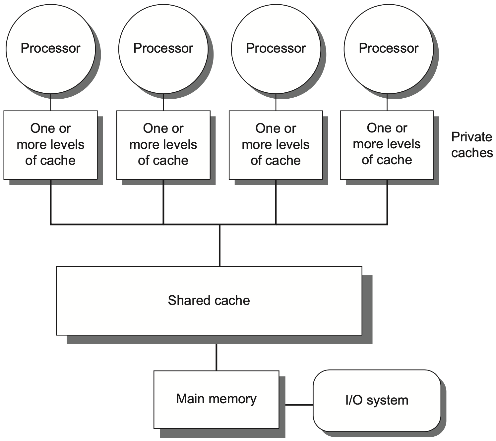
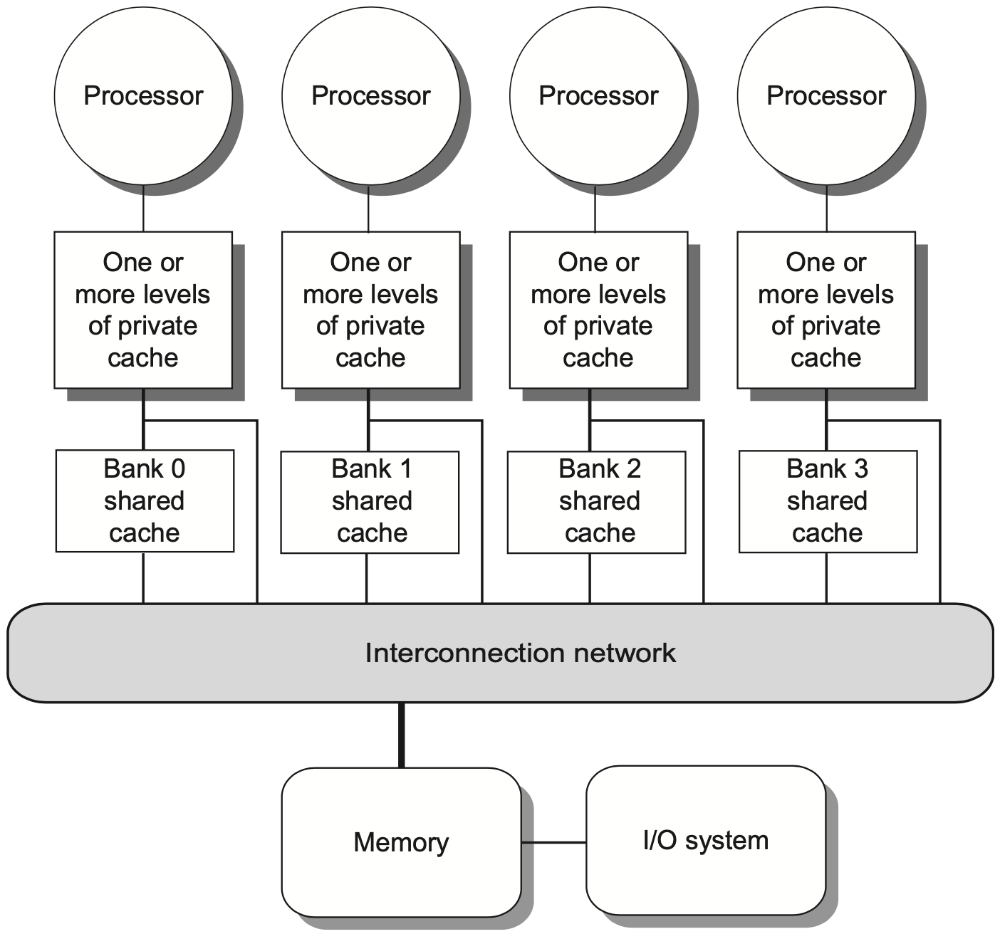
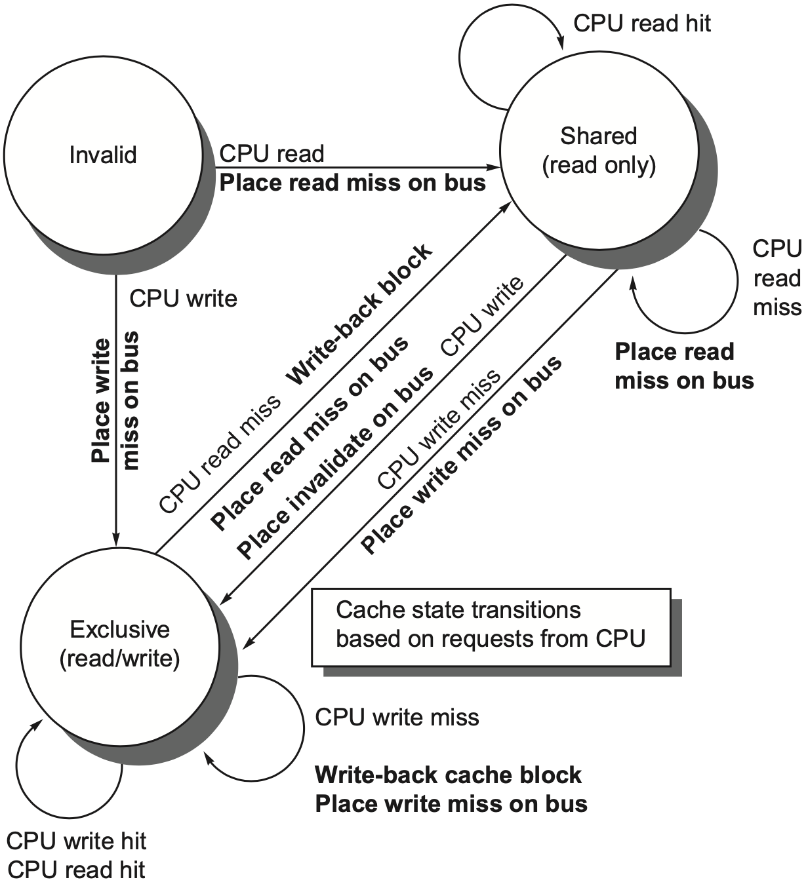
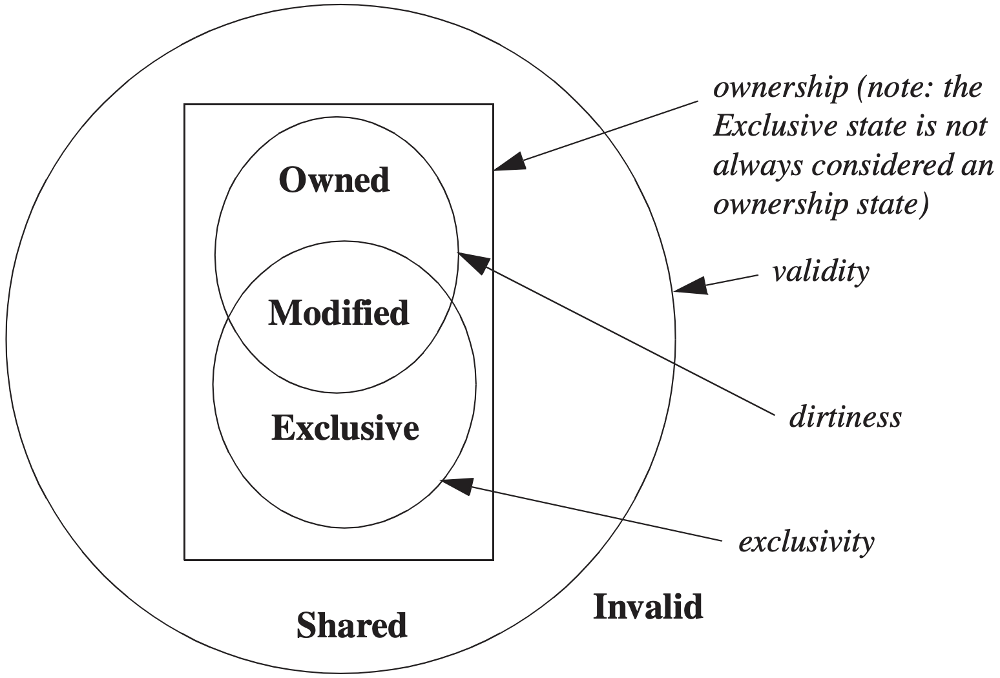
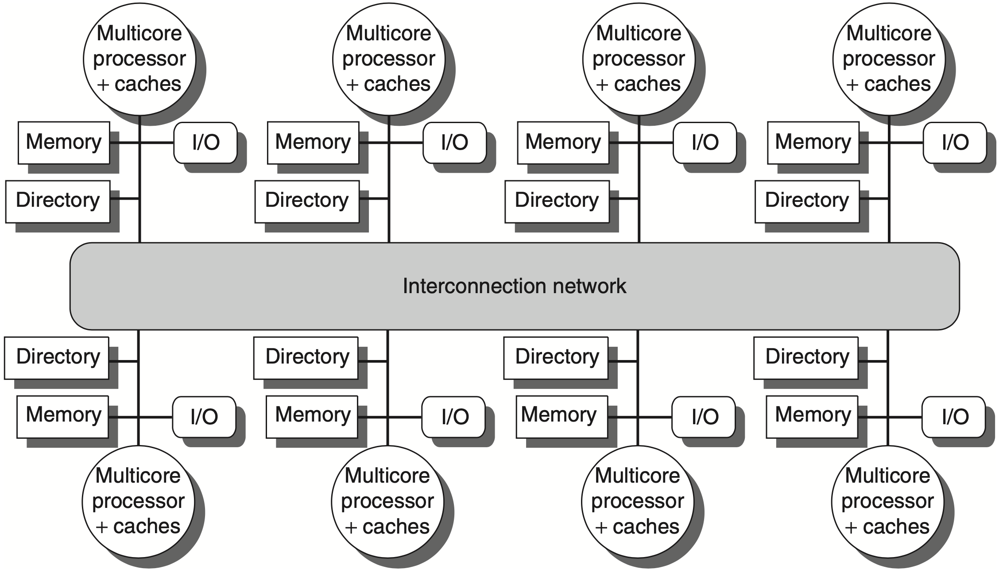
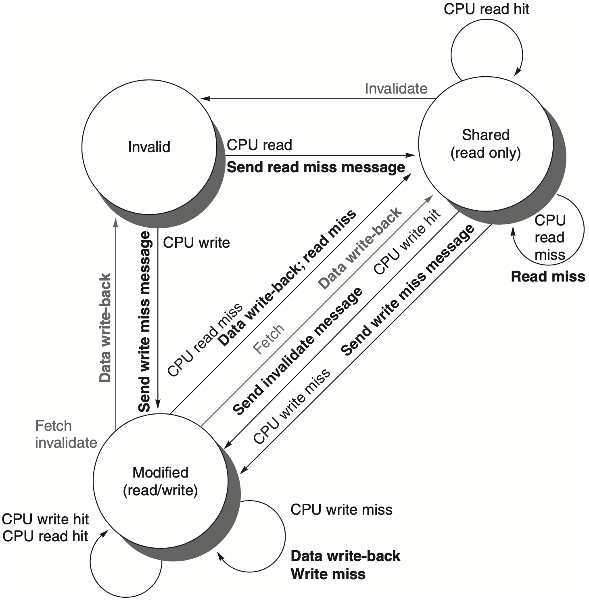

### 1. 线程与架构

#### 1.1 从 ILP 到 TLP

**线程级并行 (Thread-Level Parallelism, TLP)** 利用的是多个线程之间的并行性。与 ILP 不同，ILP 在一条指令流内部寻找可重叠执行的指令，而 TLP 通常由软件、程序员或运行时系统显式识别：程序被拆成多个线程，每个线程内部仍然包含自己的指令序列。

从 Flynn 分类看，多处理器通常属于 **MIMD (Multiple Instruction streams, Multiple Data streams)**：

- 每个处理器可以取自己的指令；
- 每个处理器可以操作自己的数据；
- 多个处理器之间通过共享地址空间或消息通信协作。

本章讨论的多处理器更关注共享地址空间下的 TLP。多个处理器或核心紧密耦合，通常由同一个操作系统协调，共享同一个地址空间中的数据。

#### 1.2 软件模型

利用 TLP 时，PPT 区分了两种软件模型：

| **模型** | **含义** | **典型场景** |
| --- | --- | --- |
| Parallel processing | 多个紧密协作的线程共同完成同一个任务 | 科学计算、并行循环、矩阵运算 |
| Request-level parallelism | 多个相对独立的请求或进程同时执行 | Web 服务、数据库查询、多用户任务 |

前者强调线程之间协作，常常需要共享数据和同步；后者强调请求之间相互独立，天然更容易扩展。缓存一致性问题主要出现在多个处理器缓存同一份共享数据时，因此和 parallel processing 的关系更密切。

#### 1.3 集中共享

**集中式共享内存 (Centralized Shared-Memory)** 又常称为 SMP。所有处理器共享一个集中式主存，访问主存的延迟基本相同，因此也称为 **UMA (Uniform Memory Access)**。

  

这种结构的特点是简单：

- 所有处理器看到同一个共享地址空间；
- 主存位置集中，访问延迟比较均匀；
- 缓存一致性可以通过共享总线上的 snooping 实现；
- 常见规模较小，PPT 中给出的范围是约 32 个或更少核心。

集中式结构的问题也很直接：处理器数增加后，集中主存、共享缓存、总线或互连会逐渐成为瓶颈。即使每个核心有私有 cache，共享数据仍然需要通过统一的存储系统协调。

#### 1.4 分布共享

**分布式共享内存 (Distributed Shared Memory)** 把物理内存分布到多个节点中，每个节点拥有本地内存，同时整个系统仍然给程序员提供共享地址空间。

  

分布式共享内存的好处是可扩展性更强：

- 内存带宽随节点数增加；
- 访问本地内存的延迟更低；
- 更适合构建较大规模的多处理器。

但它引入了 **NUMA (Nonuniform Memory Access)**：访问时间取决于数据所在位置。访问本地节点的数据较快，访问远程节点的数据较慢。程序性能因此不仅取决于并行度，还取决于数据放在哪里、线程跑在哪里，以及通信是否频繁。

分布式结构的主要代价是：

- 处理器间通信更复杂；
- 软件需要更注意数据局部性；
- 缓存一致性协议通常不能简单依赖单一共享总线。

### 2. 并行限制

#### 2.1 有限并行

并行处理的第一个障碍是：程序本身的并行部分有限。即使有很多处理器，串行部分仍然只能由少数处理器执行，这会限制总加速比。

这就是 **Amdahl 定律** 的核心：

$$
\text{Speedup}=\frac{1}{\frac{\text{Fraction}_{\text{enhanced}}}{\text{Speedup}_{\text{enhanced}}}+(1-\text{Fraction}_{\text{enhanced}})}
$$

如果并行部分比例为 $\text{Fraction}_{\text{parallel}}$，并且可以在 100 个处理器上理想加速，那么：

$$
\text{Speedup}=\frac{1}{\frac{\text{Fraction}_{\text{parallel}}}{100}+(1-\text{Fraction}_{\text{parallel}})}
$$

PPT 的例题 1 问：若使用 100 个处理器，希望获得 80 倍加速，原计算中最多有多少比例可以是串行的？

令：

$$
80=\frac{1}{\frac{\text{Fraction}_{\text{parallel}}}{100}+(1-\text{Fraction}_{\text{parallel}})}
$$

可得：

$$
\text{Fraction}_{\text{parallel}}=0.9975
$$

因此串行部分为：

$$
1-0.9975=0.0025=0.25\%
$$

这说明 100 个处理器想达到 80 倍加速，程序中串行部分必须低到 0.25%。哪怕只有很小一段不能并行，也会显著限制最终速度。

#### 2.2 分级并行

PPT 的例题 2 更接近真实情况：程序并不总是能用满所有处理器。假设程序：

- 95% 时间可以使用全部 100 个处理器；
- 剩下 5% 时间中，有一部分可以使用 50 个处理器；
- 其余部分只能串行；
- 目标总加速比仍为 80。

设剩余 5% 中使用 50 个处理器的比例为 $x$，则：

$$
80=\frac{1}{\frac{0.95}{100}+\frac{x}{50}+(0.05-x)}
$$

求得：

$$
x=0.048
$$

也就是说，除了 95% 的完全并行部分外，剩下 5% 中还必须有 4.8% 能用 50 个处理器执行，只允许约 0.2% 真正串行。

这个例子强调：并行程序不是只有“串行”和“满并行”两种模式。很多程序在不同阶段能使用的处理器数量不同，实际加速比取决于各阶段的加权平均。

#### 2.3 通信代价

第二个障碍是远程通信代价。并行程序即使有足够并行性，也可能因为访问远程内存、同步、传输共享数据而变慢。

PPT 的例题设定为：

- 程序运行在 32 处理器系统上；
- 远程内存访问延迟为 `100 ns`；
- 时钟频率为 `4.0 GHz`；
- 基础 CPI 为 `0.5`；
- 有 `0.2%` 的指令发生远程访问。

时钟周期为：

$$
\text{Cycle time}=\frac{1}{4\ \text{GHz}}=0.25\ \text{ns}
$$

一次远程访问折算为：

$$
\text{Remote cost}=\frac{100\ \text{ns}}{0.25\ \text{ns}}=400\ \text{cycles}
$$

若 0.2% 指令发生远程访问，则额外 CPI 为：

$$
\text{CPI}_{\text{extra}}=0.2\%\times 400=0.8
$$

总 CPI 变成：

$$
\text{CPI}_{\text{total}}=0.5+0.8=1.3
$$

没有远程通信时 CPI 为 `0.5`，因此无通信版本相对有通信版本快：

$$
\text{Speedup}_{\text{no comm}}=\frac{1.3}{0.5}=2.6
$$

只占 0.2% 的远程访问就能让程序慢很多。这也是多处理器设计必须缓存共享数据、降低远程通信频率的原因。

### 3. 一致性基础

#### 3.1 问题来源

多处理器使用私有 cache 后，同一个内存块可能同时出现在多个 cache 中。私有数据没有问题，因为只有一个处理器使用；共享数据则可能被多个处理器读写，导致不同 cache 中的副本不一致。

例如初始时内存中 `X=1`：

| **时间** | **事件** | **A 的 cache** | **B 的 cache** | **内存 X** |
| --- | --- | --- | --- | --- |
| 0 | 初始状态 | - | - | 1 |
| 1 | A 读 `X` | 1 | - | 1 |
| 2 | B 读 `X` | 1 | 1 | 1 |
| 3 | A 写 `X=0` | 0 | 1 | 0 |

如果没有额外措施，B 的 cache 仍然保留旧值 `1`。之后 B 再读 `X`，可能读到过期数据。这就是 **cache coherence problem**。

#### 3.2 两个概念

PPT 区分了 coherence 和 consistency：

| **概念** | **关注问题** |
| --- | --- |
| Coherence | 一次读可以返回哪些值 |
| Consistency | 某次写入什么时候必须被后续读看到 |

**Coherence** 关心的是单个地址上的值是否合理。对于同一个位置 `X`，读操作不应该凭空读出一个从未写过的值，也不应该在明显已经更新后仍长期读到旧值。

**Consistency** 关心的是写入对其他处理器可见的时间和顺序。比如一个处理器刚写完 `X`，另一个处理器几乎同时读 `X`，此时写入数据可能还没有离开第一个处理器，系统未必能保证第二个处理器立刻读到新值。这个“什么时候必须看见”的规则由内存一致性模型定义。

> [!Note] **不要混用两者**
> Coherence 更像是每个地址内部的正确性；consistency 更像是多个内存操作在时间上的可见顺序。本章重点是 cache coherence。

#### 3.3 三条性质

一个 coherent memory system 通常需要满足三条性质：

| **性质** | **含义** |
| --- | --- |
| 本地读写顺序 | 处理器 `P` 写 `X` 后，若中间没有其他处理器写 `X`，则 `P` 再读 `X` 必须读到自己写的值 |
| 远程写可见 | 一个处理器写 `X` 后，若另一个处理器在足够晚的时候读 `X`，且中间没有其他写 `X`，则应读到该写入值 |
| 写串行化 | 任意两个处理器对同一地址的写，必须被所有处理器看成相同顺序 |

第一条保证程序顺序中的基本直觉：自己刚写的值，自己再读应该能看到。第二条保证写入最终会传播到其他处理器。第三条最关键：所有处理器必须对同一地址的写入顺序达成一致，否则不同处理器可能看到互相矛盾的历史。

### 4. 监听协议

#### 4.1 基本做法

实现 cache coherence 的协议大致分为两类：

| **协议** | **基本思想** | **适用倾向** |
| --- | --- | --- |
| Snooping | 每个 cache 监听共享总线上的请求，自行维护块状态 | 集中式共享内存、小规模系统 |
| Directory | 每个内存块的共享状态集中记录在目录中 | 分布式共享内存、大规模系统 |

**Snooping coherence protocol** 的前提是：相关请求会广播到所有 cache，所有 cache 都能观察到这些请求。每个 cache 中为每个块维护状态，并根据本地处理器请求和总线请求改变状态。

写操作有两种常见策略：

| **策略** | **做法** | **特点** |
| --- | --- | --- |
| Write invalidate | 写之前使其他 cache 中的副本失效 | 带宽消耗较低，写者获得独占权 |
| Write update/broadcast | 写时把新值广播给所有副本 | 读者可继续命中，但写频繁时带宽开销大 |

现代系统更常见的是 write invalidate。因为同一个共享变量往往会被某个处理器连续写多次，第一次写时让其他副本失效，之后写者可以在本地 cache 中继续写，不必每次都广播新数据。

#### 4.2 写失效

**Write invalidate protocol** 的基本流程是：

1. 处理器想写某个共享块；
2. 它先获得总线或互连访问权；
3. 在总线上广播要失效的地址；
4. 其他处理器持续 snoop 总线；
5. 若发现自己的 cache 中有该块，就把对应块标记为 invalid；
6. 写者获得该块的独占可写副本。

如果某个处理器发现自己拥有 dirty copy，而其他处理器请求这个块，它需要提供最新数据，并让原本的内存或共享缓存访问中止。因为此时最新值不在内存中，而在拥有 modified 副本的 cache 中。

写失效协议的实现通常在每个核心内加入有限状态控制器：

- 响应本地处理器的读写请求；
- 监听总线上的其他处理器请求；
- 改变对应 cache block 的状态；
- 必要时发起总线读、写失效、写回等动作。

#### 4.3 MSI 状态

**MSI protocol** 为每个 cache block 维护三个状态：

| **状态** | **含义** | **内存是否最新** | **是否可写** |
| --- | --- | --- | --- |
| I Invalid | 本 cache 中没有有效副本 | 无意义 | 否 |
| S Shared | 本 cache 有只读副本，可能被多个 cache 共享 | 是 | 否 |
| M Modified | 本 cache 有已修改副本，且独占该块 | 否 | 是 |

`M` 状态隐含 exclusive：如果一个 cache 拥有某块的 modified 副本，其他 cache 不能同时拥有有效副本。因为内存已经过期，最新值只在这个 cache 中。

  

从本地处理器角度看：

| **当前状态** | **本地读** | **本地写** |
| --- | --- | --- |
| I | 读 miss，上总线取块，转为 S | 写 miss，上总线取独占权，转为 M |
| S | 读 hit，保持 S | 写 miss 或 upgrade，使其他副本失效，转为 M |
| M | 读 hit，保持 M | 写 hit，保持 M |

从总线请求角度看：

| **当前状态** | **看到其他读请求** | **看到其他写/失效请求** |
| --- | --- | --- |
| S | 保持 S | 转为 I |
| M | 提供或写回最新数据，通常转为 S | 提供或写回最新数据，转为 I |
| I | 无动作 | 无动作 |

MSI 的关键点是：写之前必须获得独占权；读可以共享；modified 数据被别人请求时，拥有者必须负责把最新值交出来。

#### 4.4 MESI

MSI 的一个低效之处是：当某个块只被一个 cache 持有且未修改时，它在 MSI 中仍然是 `S`。如果本地处理器随后写它，协议还会发出总线操作去使其他副本失效，但实际上根本没有其他副本。

**MESI** 在 MSI 基础上加入 `E (Exclusive)` 状态：

| **状态** | **含义** |
| --- | --- |
| M Modified | 独占且 dirty，内存过期 |
| E Exclusive | 独占但 clean，内存最新 |
| S Shared | 可能被多个 cache 共享，只读 |
| I Invalid | 无有效副本 |

`E` 表示该块只存在于当前 cache 中，且尚未被修改。它带来的优化是：

- `E` 被其他处理器读时，转为 `S`；
- `E` 被本地写时，直接转为 `M`；
- 本地 `E->M` 不需要在总线上发送 invalidation。

因此 MESI 能减少“独占干净块”的无意义总线流量。

#### 4.5 MOESI

**MOESI** 在 MESI 基础上加入 `O (Owned)` 状态，用来表示“共享但脏”的块。

  

`O` 状态的含义是：

- 该 cache 是这个块的 owner；
- 块内容比内存新，内存副本过期；
- 其他 cache 可以持有 shared 副本；
- owner 负责在其他处理器请求时提供最新数据；
- owner 替换该块时需要写回内存。

MOESI 的典型转换是：当某个 cache 中的块处于 `M`，其他处理器发生 read miss 时，原拥有者可以从 `M` 转为 `O`，并直接把数据提供给请求者，而不必立刻写回内存。这样可以减少内存写回流量。

可以从几个属性理解 MOESI：

| **维度** | **相关状态** | **说明** |
| --- | --- | --- |
| validity | M/O/E/S 都有效，I 无效 | 是否可被处理器读到 |
| exclusivity | M/E 独占 | 其他 cache 没有有效副本 |
| dirtiness | M/O 可能 dirty | 内存副本可能不是最新 |
| ownership | M/O 明确带所有权 | 谁负责提供或写回最新数据；E 有独占性，但不一定被称为 ownership 状态 |

#### 4.6 MESIF

**MESIF** 在 MESI 基础上加入 `F (Forward)` 状态。`F` 用来指定多个 shared 副本中，哪一个 cache 应该响应其他处理器的读请求。

如果很多 cache 都处于 `S`，读请求广播后可能有多个 cache 同时尝试响应。`F` 状态相当于指定一个代表：

- shared 数据仍然可以被多个 cache 持有；
- 只有 `F` 状态的 cache 负责转发数据；
- 最近请求该 cache line 的处理器常被赋予 `F` 状态。

MESIF 主要解决的是共享状态下“谁来响应”的问题，而不是改变写失效协议的基本原则。

#### 4.7 缺失类型

**Coherence miss** 是由于一致性协议动作导致的 cache miss。PPT 中区分两类：

| **类型** | **原因** |
| --- | --- |
| True sharing miss | 另一个处理器真的写了当前处理器后续要读的同一个数据字 |
| False sharing miss | 另一个处理器写了同一 cache block 中的其他字，导致整个 block 被失效 |

True sharing 反映真实的数据通信。例如 P1 写 `x`，P2 随后读 `x`，P2 必须看到 P1 的新值，因此会发生一致性相关缺失。

False sharing 则是 cache block 粒度带来的副作用。硬件通常以 cache block 为单位维护状态，而不是以单个 word 为单位。若 `x1` 和 `x2` 位于同一个 block，P1 只写 `x1`，P2 只读写 `x2`，它们逻辑上没有共享同一个变量，但仍会互相使整个 block 失效。

#### 4.8 例题分析

假设 `x1` 和 `x2` 在同一个 cache block 中，且该 block 初始在 P1 和 P2 的 cache 中都处于 shared 状态。

| **时间** | **事件** | **分类** | **原因** |
| --- | --- | --- | --- |
| 1 | P1 写 `x1` | true sharing miss | P2 之前也有该块，且 `x1` 的值确实需要对其他处理器失效 |
| 2 | P2 读 `x2` | false sharing miss | P2 读的是 `x2`，但它因为 P1 写 `x1` 被迫失效 |
| 3 | P1 写 `x1` | false sharing miss | P2 上一步读 `x2` 让块重新共享，P1 再写 `x1` 又要失效整块 |
| 4 | P2 写 `x2` | false sharing miss | P1/P2 操作不同字，但同块失效造成缺失 |
| 5 | P1 读 `x2` | true sharing miss | P1 读取的是 P2 刚写过的 `x2`，确实需要获得新值 |

这个例子说明，false sharing 不代表硬件协议错了，而是数据布局让无关变量落在同一个 cache block 中。常见优化方法是 padding 或重新排列数据，让不同线程频繁写的变量落在不同 cache block 中。

### 5. 目录协议

#### 5.1 目录思想

Snooping 协议依赖广播，适合小规模系统；当处理器数量增加时，每次 miss 都广播给所有 cache 会带来很高带宽压力。**Directory-based cache coherence protocol** 用目录记录每个内存块的共享状态，避免无差别广播。

  

目录通常放在每个节点中，负责追踪该节点本地内存地址范围内的 cache block：

- 哪些节点持有该块副本；
- 该块是否处于 shared、uncached 或 modified；
- 若处于 modified，哪个节点拥有最新副本。

当某个节点请求一个块时，请求发送到该块的 home node。home node 查询目录后，只向相关 sharers 或 owner 发送消息，而不是广播给所有节点。

#### 5.2 目录状态

目录协议中的常见块状态包括：

| **目录状态** | **含义** |
| --- | --- |
| Uncached | 没有任何节点缓存该块，内存副本最新 |
| Shared | 一个或多个节点缓存该块，内存副本也是最新 |
| Modified | 恰好一个节点拥有该块的 dirty 副本，内存副本过期 |

目录还需要保存 sharer set。例如 `Sharers={P1,P3}` 表示 P1 和 P3 持有该块的 shared 副本。若状态为 `Modified`，目录需要记录 owner，而不是一组普通 sharers。

目录协议处理请求时常见消息包括：

| **消息** | **作用** |
| --- | --- |
| Read miss | 请求读取某块 |
| Write miss | 请求写入某块并获得独占权 |
| Invalidate | 让其他 sharers 失效 |
| Fetch | 从 owner 取回最新数据 |
| Data value reply | 返回数据给请求者 |
| Data write-back | owner 替换 dirty 块时写回 |

#### 5.3 状态转换

目录协议也可以画成状态机。下面这张图描述了单个 cache block 在目录协议中的转换关系。

  

几个典型过程可以这样理解：

| **场景** | **目录动作** |
| --- | --- |
| Uncached 上发生 read miss | 从内存返回数据，状态变为 Shared，`Sharers={P}` |
| Shared 上发生 read miss | 返回数据，并把请求者加入 sharers |
| Shared 上发生 write miss | 向其他 sharers 发送 invalidate，授予请求者独占权 |
| Modified 上发生 read miss | 向 owner fetch 最新数据，请求者获得副本，状态变为 Shared |
| Modified 上发生 write miss | 向 owner fetch/invalidate，新的请求者成为 owner |

目录协议的核心优势是减少广播；核心代价是需要额外目录存储和更复杂的消息交互。系统规模越大，目录的优势越明显。

#### 5.4 本章主线

本章从 TLP 进入多处理器系统，核心问题是：当多个处理器共享地址空间并各自拥有 cache 时，如何让它们对共享数据保持一致的看法。

多处理器架构可以是集中式共享内存，也可以是分布式共享内存。集中式结构简单，适合较小规模；分布式结构带来更高带宽和更好扩展性，但引入 NUMA 和更复杂的一致性维护。

并行程序的速度不只取决于处理器数量。Amdahl 定律说明串行部分会限制加速比；远程通信例题说明极少比例的远程访问也可能显著拉高 CPI。

Cache coherence 定义了读操作能返回哪些值，而 consistency 定义写入何时对读可见。为了维持 coherence，系统通常使用 snooping 或 directory 协议。Snooping 适合小规模广播环境，directory 适合大规模分布式系统。

MSI 是最基本的写失效状态协议；MESI 用 `E` 减少独占干净块的无效总线请求；MOESI 用 `O` 避免 dirty shared 块立即写回内存；MESIF 用 `F` 指定 shared 副本中的转发者。协议越复杂，能减少的无效通信越多，但状态机和实现成本也越高。
