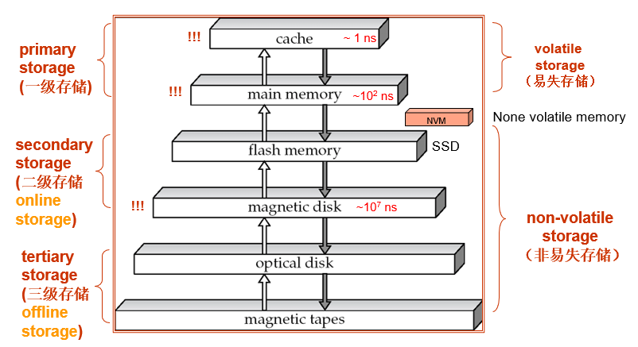
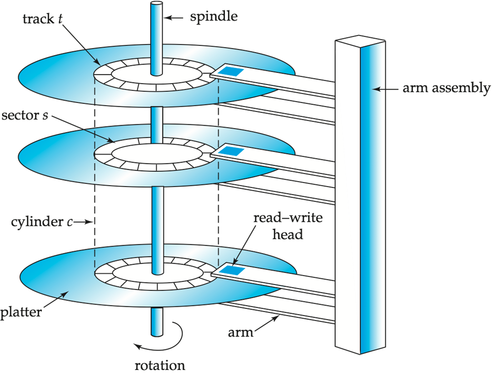
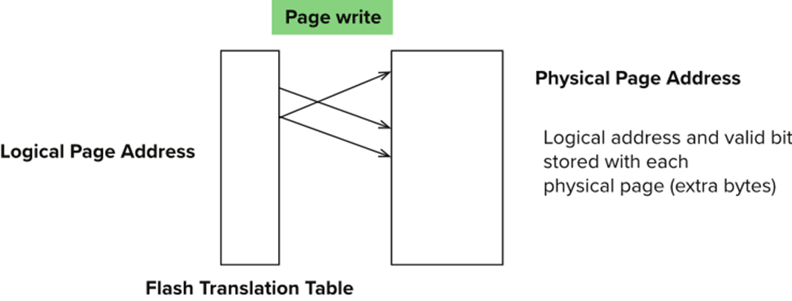

### 1. 物理存储概述

#### 1.1 物理存储分类

存储介质根据断电后数据是否仍然存在，分为以下两类：

- **易失存储 (volatile storage)**：当电源关闭时，存储内容会丢失。这类介质速度非常快，但不能作为长期持久化数据的唯一位置；
- **非易失存储 (non-volatile storage)**：即使电源关闭，内容仍然能够保留。数据库文件、日志文件和备份文件通常依赖非易失存储。

评价一种存储介质时，通常需要同时考虑三个维度：

- **访问速度 (Speed)** ：决定数据读写延迟和吞吐能力；
- **单位数据成本 (Cost per Unit of Data)**：决定能否用较低价格保存大量数据；
- **可靠性 (Reliability)** ：系统崩溃、断电或设备物理故障时数据是否会丢失。
#### 1.2 存储层级结构

**存储层次结构 (Storage Hierarchy)** 按速度和成本组织存储设备。越靠近 CPU，速度越快、容量越小、价格越高；越远离 CPU，速度越慢、容量越大、价格越低。

  

| 层级                       | 典型设备                   | 特点            |
| ------------------------ | ---------------------- | ------------- |
| 一级存储 (primary storage)   | 缓存 (Cache)、主存 (RAM)    | 最快，通常易失       |
| 二级存储 (secondary storage) | 闪存 (Flash)、磁盘 (HDD)    | 非易失，较慢，通常在线访问 |
| 三级存储 (tertiary storage)  | 磁带 (Tape)、光盘 (Optical) | 非易失，最慢，通常离线访问 |
### 2. 磁盘系统

#### 2.1 磁盘硬件结构

传统 **磁性硬盘 (Magnetic Disk)** 由盘片、主轴、读写头和磁臂组成。盘片持续旋转，磁臂移动读写头到目标位置，数据以磁性编码形式保存在盘面上。典型硬盘每个盘片有 50,000 到 100,000 条磁道。每条磁道又分为多个扇区，外圈磁道通常能容纳更多扇区。

  

| 部件  | 英文              | 功能                  |
| --- | --------------- | ------------------- |
| 盘片  | platter         | 保存磁性数据的圆盘           |
| 读写头 | read-write head | 负责读取或写入盘面数据         |
| 磁道  | track           | 盘面上的同心圆数据区域         |
| 扇区  | sector          | 最小物理读写单位，常见大小为 512B |
| 柱面  | cylinder        | 所有盘片上相同编号磁道的集合      |

一次磁盘读写通常包括两个等待：首先，磁臂移动到目标磁道，称为 **寻道 (Seek)**；然后等待目标扇区转到读写头下方，称为 **旋转延迟 (Rotational Latency)**。

>[!Note] **Note**
>硬盘读写中，真正传输数据的时间往往不是最主要的开销。机械磁盘随机访问慢，主要慢在找位置，不是慢在传数据。因此顺序访问通常明显快于随机访问。

**磁盘控制器 (disk controller)** 位于计算机系统和磁盘硬件之间。上层系统发出读写扇区的命令，控制器负责移动磁臂、执行读写、校验数据，并处理坏扇区重映射。

控制器通常会为扇区维护 **校验和 (checksum)**。如果读取数据后重新计算的校验和不匹配，就说明数据可能损坏。对于坏扇区，控制器会把逻辑扇区重新映射到可用的物理扇区上。

#### 2.2 磁盘接口与网络存储

磁盘接口决定主机和存储设备之间如何传输数据，常见接口有以下几种。

NVMe 更适合 SSD 和 NVM，因为它能降低协议开销并更好地利用高速存储设备的并行能力。

| 接口   | 全称                          | 特点               | 传输速度                      |
| ---- | --------------------------- | ---------------- | ------------------------- |
| SATA | Serial ATA                  | 常见、成本低，串行传输      | SATA 3 最高约 6 Gb/s         |
| SAS  | Serial Attached SCSI        | 企业级常见，扩展性较强      | SAS Version 3 最高约 12 Gb/s |
| NVMe | Non-Volatile Memory Express | 面向 NVM ，通常走 PCIe | 最高约 24 Gb/s               |

存储设备也可以通过网络提供服务。
- **SAN** 提供块设备接口，服务器像访问磁盘一样访问远程存储；
- **NAS** 提供文件系统接口，客户端通过网络文件协议访问文件。

| 类型  | 全称                       | 提供接口 | 适宜场景             |
| --- | ------------------------ | ---- | ---------------- |
| SAN | Storage Area Network     | 块接口  | 数据库、虚拟化、集中式高性能存储 |
| NAS | Network Attached Storage | 文件接口 | 文件共享、备份、普通网络文件服务 |

#### 2.3 磁盘性能指标

**访问时间 (access time)** 是从发出读写请求，到开始传输数据之间的时间：
$$
\text{access time}=\text{seek time}+\text{rotational latency}
$$
其中 **寻道时间 (seek time)** 是磁臂移动到正确磁道的时间。**旋转延迟 (rotational latency)** 是等待目标扇区转到读写头下方的时间。若转速为 $R\text{ rpm}$ 则平均旋转延迟为：
$$
\frac{1}{2}\times\frac{60}{R}\text{ seconds}
$$
**数据传输率 (data-transfer rate)** 表示单位时间内能读写多少数据。普通磁盘最大传输率约为 25 到 100 MB/s，内圈磁道通常低于外圈磁道。

**磁盘块 (disk block)** 是数据库和操作系统进行存储分配、读取和写入的逻辑单位，通常为 4KB 到 16KB。块太小会增加 I/O 次数，块太大可能浪费空间。

- **顺序访问**：指连续读取连续块，通常只需少量寻道，适合全表扫描、日志写入，吞吐高；
- **随机访问**：指请求分散在磁盘各处，每次都可能重新寻道，常见于索引查找、小块读取，机械磁盘上代价高，用每秒随机 IOPS 次数衡量，机械磁盘通常 50 到 200 IOPS。

[**MTTF (Mean Time To Failure)**]() 表示平均无故障运行时间。
#### 2.4 磁盘块访问优化

- **缓冲 (buffering)** 是把磁盘块暂存在内存中，后续再次访问时直接命中内存，避免重复 I/O。数据库缓冲池就是典型例子；
- **预读 (read-ahead/prefetch)** 是在读取当前块时顺带读取后续可能用到的块。它适合顺序扫描，因为相邻块很可能马上被访问；
- **磁臂调度 (disk-arm scheduling)** 通过重新排序 I/O 请求，减少磁臂移动距离。典型方法是 **电梯算法 (elevator algorithm)**：磁臂沿一个方向处理请求，处理完后再反向。这种方法的目标很直接：少来回移动磁臂，减少寻道时间。

- **非易失性写缓存 (nonvolatile write buffer)** 会先把写入内容放到非易失 RAM 或闪存中，确认安全后再慢慢写回磁盘。这样事务不必一直等待机械磁盘完成实际写入;
- **日志磁盘 (log disk)** 专门顺序写更新日志。因为顺序写几乎不需要寻道，所以速度快，也常用于保证事务恢复能力。

>[!Note] **Note** 
>**引入日志磁盘可以弥补磁盘异步写入的滞后**。系统崩溃重启后会扫描日志磁盘，通过重做已提交事务的操作来强制修补尚未写入磁盘的数据脏页，并执行撤销回滚崩溃瞬间尚未完成的事务修改，从而利用日志这种“顺序的确定性记录”，将物理磁盘中因随机写入导致的“残缺/不一致状态”强制还原至逻辑一致状态。

### 3. 闪存与 SSD

#### 3.1 硬件结构

**NAND Flash** 广泛用于存储设备。它通常以 **页 (page)** 为单位读取，页大小约为 512B 到 4KB。Flash 没有机械结构，所以随机读和顺序读差距远小于磁盘。

但 Flash 不能像磁盘那样随意原地覆盖。页通常只能写一次，重写前必须先擦除相关区域。

**SSD (Solid State Disk)** 对外表现为块设备，内部使用多个 Flash 芯片保存数据。由于没有寻道和旋转延迟，SSD 的随机访问性能远高于机械磁盘。

|      | HDD           | SDD                            |
| ---- | ------------- | ------------------------------ |
| 读取一页 | 约 5~10 ms     | 约 20~100 μ‌s                   |
| 随机访问 | 约 50~200 IOPS | 读约 10000 IOPS ，写约 40000 IOPS   |
| 传输速率 | 约 200 MB/s    | SATA 约 500 MB/s ，NVMe 约 3 GB/s |
| 更新方式 | 原地更新          | 将整块擦除后重写                       |
| 功耗效率 | 较高            | 较低                             |
#### 3.2 擦除技术

Flash 擦除以 **擦除块 (Erase Block)** 为单位，而不是以页为单位。擦除块通常为 256KB 到 1MB，包含约 128 到 256 个页，擦除一次约需 2 到 5 ms。

由于擦除次数有限，SSD 会使用 **重映射 (Remapping)**：逻辑页更新时，不直接覆盖原物理页，而是写到新的物理页，并更新映射关系。

  

**FTL (Flash Translation Layer)** 负责维护逻辑页到物理页的映射。这样上层仍然看到块设备接口，底层则可以自行处理擦除、垃圾回收和位置重映射。

每个擦除块能承受的擦除次数有限。**磨损均衡 (Wear Leveling)** 会把擦除操作尽量均匀分散到不同物理块上，避免某些块过早失效。

>[!Note] **Note** 
>SSD 随机读很快，但写入仍然受擦除、重映射和磨损均衡影响。数据库在 SSD 上仍应注意写入模式，尤其是大量随机写。

### 4. 存储级内存 NVM

**NVM (Non-Volatile Memory)** 介于 DRAM 和 SSD/HDD 之间。它的特点是：比 SSD 延迟低，断电后数据仍能保留，并且支持接近内存方式的访问。

| 指标   | DRAM | NVM  | SSD     | HDD       |
| :--- | :--- | :--- | :------ | :-------- |
| 读延迟  | 1x   | 2–4x | 约 500x  | 约 $10^5$x |
| 写延迟  | 1x   | 2–8x | 约 5000x | 约 $10^5$x |
| 持久性  | 否    | 是    | 是       | 是         |
| 字节寻址 | 是    | 是    | 否       | 否         |
| 耐久性  | 是    | 否    | 否       | 是         

NVM 的关键价值在于同时具备 **非易失性** 和 **字节寻址能力**。这会削弱传统“内存负责计算、磁盘负责持久化”的边界。