### 1. 文件组织
#### 1.1 定长记录

**定长记录 (Fixed-Length Records)** 指文件中每条记录长度相同。假设每条记录为 $n$ 字节，则第 $i$ 条记录可以从偏移量 $n \times (i-1)$ 开始存放。这种方式的优点是地址计算简单，系统只要知道记录编号，就可以直接定位记录。

定长记录的主要限制在于灵活性不足。它不适合 `varchar` 这类变长字段，也容易在记录长度不均衡时造成空间浪费。此外，如果允许一条记录跨越多个磁盘块，读写一条记录可能需要访问多个块，I/O 会变复杂。因此实际系统通常会避免记录跨块存放。

删除定长记录后，系统需要处理留下的空位。常见方法如下：

| 删除方法     | 做法                 | 主要问题       |
| -------- | ------------------ | ---------- |
| **顺序前移** | 删除后把后面的记录依次前移      | 移动成本高      |
| **末尾填补** | 用最后一条记录填补删除位置      | 会破坏原有顺序    |
| **空闲链表** | 空位不移动，加入 free list | 需要额外维护空闲位置 |

  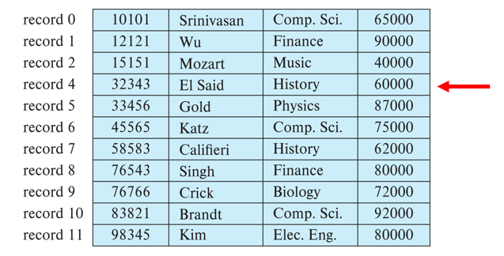
  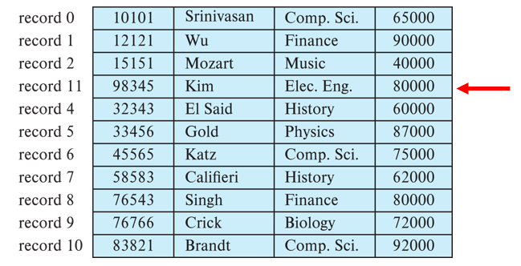
  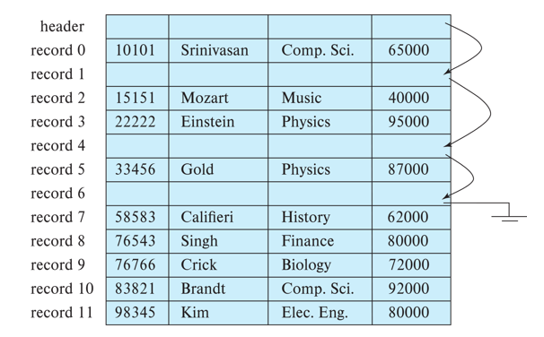

在频繁插入和删除的场景下，空闲链表更实用，因为新记录可以直接复用旧空位，不必每次都移动大量记录。
#### 1.2 变长记录

**变长记录 (Variable-Length Records)** 常见于三类情况：一个文件中保存多种记录类型；字段本身长度可变，例如 `varchar`；或者某些数据模型允许重复字段。由于每条记录大小不固定，系统不能再通过“记录编号×固定长度”的方式直接定位。

 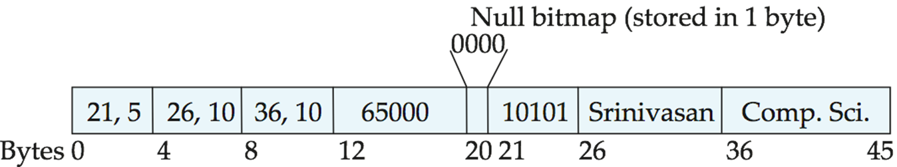 

常见做法是把记录分为固定部分和变长部分。固定长度字段仍然按顺序存放；变长字段在固定部分中保存 `(offset, length)`，实际数据放在记录后部。对于 NULL 值，系统使用 **空值位图 (null-value bitmap)** 标记哪些字段为空。

为了管理页内的变长记录，数据库常使用 **分槽页 (Slotted Page Structure)**。分槽页把页分成页头、槽目录、空闲空间和记录区。外部指针不直接指向记录本身，而是指向槽目录中的槽位；记录在页内移动时，只需要更新槽目录即可。

 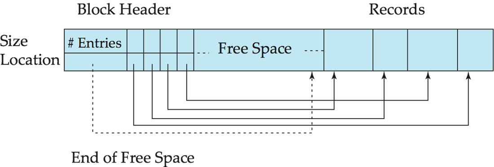 

### 2. 文件记录组织

文件组织决定记录在文件中的排列方式，也直接影响插入、删除、扫描、范围查询和连接查询的代价。不同组织方式服务于不同访问模式，没有一种方式适合所有场景。

| 文件组织方式 | 核心思想 | 更适合的场景 |
| --- | --- | --- |
| **Heap File** | 记录放到任意有空间的位置 | 插入频繁、无顺序要求 |
| **Sequential File** | 记录按搜索码顺序存放 | 顺序扫描、范围查询 |
| **Multitable Clustering** | 相关表记录靠近存放 | 经常做连接查询 |
| **B+ Tree File** | 用 B+ 树维持有序访问 | 插入删除频繁且需要范围访问 |
| **Hashing** | 哈希函数决定记录所在块 | 等值查询 |
#### 2.1 堆文件组织

**堆文件组织 (Heap File Organization)** 中，记录可以放在文件中任何有空闲空间的位置。它不维护全局顺序，因此插入非常灵活，记录一旦放入通常不会轻易移动。

堆文件的关键问题是如何快速找到有足够空间的块。系统通常使用 **free-space map** 记录每个块大约还有多少空闲空间。为了加快查找，还可以建立二级 free-space map，上层条目记录下层若干块中的最大空闲空间。

 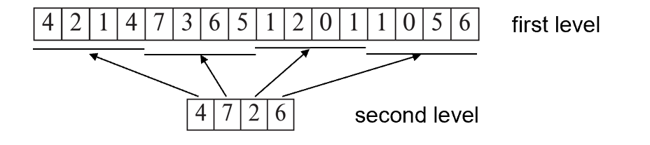 

free-space map 不一定每时每刻都完全准确。它可以周期性写回磁盘，旧值在后续访问时被发现并修正即可。这样可以避免为了维护精确空闲空间而付出过高成本。
#### 2.2 顺序文件组织

**顺序文件组织 (Sequential File Organization)** 按搜索码顺序存放记录，适合全文件顺序处理和范围查询。它的优势是逻辑顺序和物理顺序尽量一致，顺序扫描时 I/O 效率较高。

 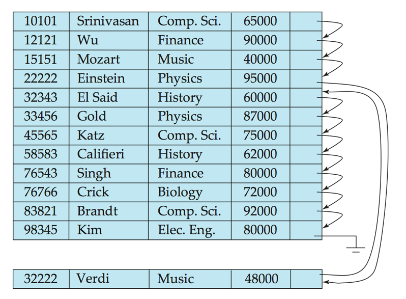 

顺序文件的难点在插入和删除。删除时通常使用指针链维护逻辑顺序；插入时先找到应插入的位置，如果附近没有空间，就把记录放入 **溢出块 (overflow block)**，并更新指针链。随着插入和删除增多，物理顺序会逐渐变差，因此需要定期重组文件。
#### 2.3 多表聚簇

**多表聚簇文件组织 (Multitable Clustering File Organization)** 把多个相关关系的记录存放在同一文件或相近块中。下例是把 `department` 与其对应的 `instructor` 记录放在一起。

 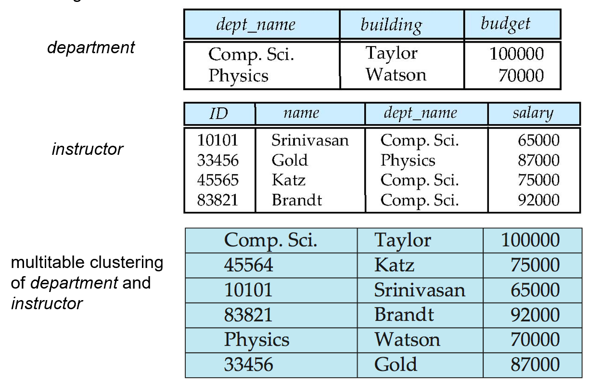 

- 若查询某个 `department` 及其 `instructors` 时，相关记录已经靠近，可以减少 I/O；
- 但若只扫描 `department` 表，块中混有 `instructor` 记录，反而可能带来额外开销。
#### 2.4 表分区

**表分区 (Table Partitioning)** 是把一个大关系拆成多个较小分区，并分别存储。例如 `transaction` 表可以按年份拆成 `transaction_2018`、`transaction_2019` 等。

如果查询条件包含 `year = 2019`，系统只需要访问对应分区，而不必扫描所有数据。分区还可以降低空闲空间管理成本，并允许不同分区放在不同设备上，例如近期数据放 SSD，历史数据放磁盘。

- **减少扫描范围**：查询条件命中某个分区时，只访问相关数据；
- **便于管理冷热数据**：新数据和历史数据可以放在不同存储设备上；
- **降低维护成本**：大表被拆成多个较小单位，便于加载、删除和归档。
### 3. 数据字典

**数据字典 (Data Dictionary)** 也叫 **系统目录 (System Catalog)**，保存的是元数据，即“关于数据的数据”。数据库系统依靠它知道有哪些表、字段、视图、约束、索引、用户权限以及物理存储位置。

| 元数据类型 | 内容示例 |
| --- | --- |
| **关系信息** | 表名、字段名、字段类型、字段长度 |
| **视图信息** | 视图名和视图定义 |
| **约束信息** | 主键、外键、完整性约束 |
| **用户信息** | 用户、权限、账号相关信息 |
| **统计信息** | 元组数量、关系规模等 |
| **物理组织信息** | 文件组织方式、物理位置 |
| **索引信息** | 索引名称、索引字段、索引结构 |

数据字典在磁盘上可以用关系形式保存，便于持久化和统一管理；在内存中则可能使用专门的数据结构，以便查询优化器和执行器快速访问。
### 4. 缓冲区管理

数据库访问磁盘的单位通常是块。由于磁盘 I/O 远慢于内存访问，数据库会尽可能把常用块缓存在主存中。**Buffer** 是主存中保存磁盘块副本的区域，Buffer Manager 则负责把块读入、替换、写回和并发保护。

 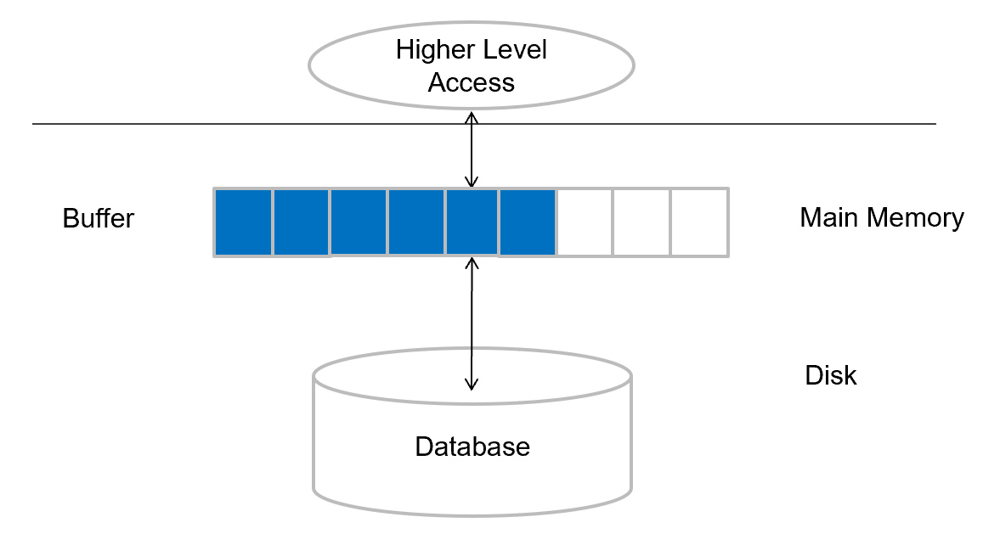 

当上层程序请求某个块时，如果块已经在缓冲区中，Buffer Manager 直接返回内存地址；如果不在，就分配一个缓冲页，必要时淘汰旧页，再从磁盘读入目标块。

如果被淘汰页被修改过，它就是 **脏块 (dirty block)**，替换前必须写回磁盘。没有被修改的页可以直接丢弃，因为磁盘上已有相同副本。正在被读写的页不能随意替换，因此系统使用 pin/unpin 机制，并维护 pin count。只有 pin count 为 0 的页才允许被淘汰。

| 机制 | 实际作用 |
| --- | --- |
| **dirty bit** | 标记页是否被修改，决定淘汰时是否写回 |
| **pin count** | 防止正在使用的页被替换 |
| **shared lock** | 支持多个读者并发访问 |
| **exclusive lock** | 保护更新、移动或重组操作 |
#### 4.1 LRU 策略

缓冲区空间有限，因此必须选择替换策略。**LRU (Least Recently Used)** 会淘汰最近最久未使用的页。它的直觉是：过去很久没访问的页，未来也不太可能马上访问。

 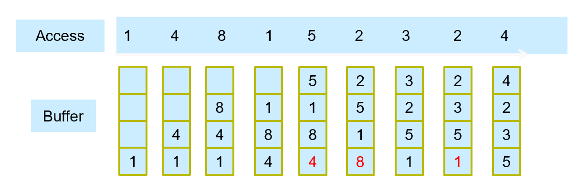 

但在数据库中，LRU 不一定总是好策略。例如顺序扫描或嵌套循环连接可能会让大量只用一次的页挤掉真正有价值的页。数据库系统通常可以利用查询执行计划判断访问模式，因此会使用更灵活的策略。

| 策略                 | 做法               | 适合场景             |
| ------------------ | ---------------- | ---------------- |
| **Toss-immediate** | 块中最后一个元组处理完后立即释放 | 明确不会再访问该块的扫描     |
| **MRU**            | 替换最近使用过的块        | 某些循环扫描或特定访问模式    |
| **Forced output**  | 强制把块写回磁盘         | 恢复、检查点、事务持久性相关场景 |
#### 4.2 时钟算法

**时钟算法 (Clock Algorithm)** 是 LRU 的近似实现。它把缓冲页组织成环，每个页有一个 reference_bit。替换时指针沿环扫描：遇到 reference_bit = 1 就改为 0，给它一次“第二次机会”；遇到 reference_bit = 0 就选择替换。

 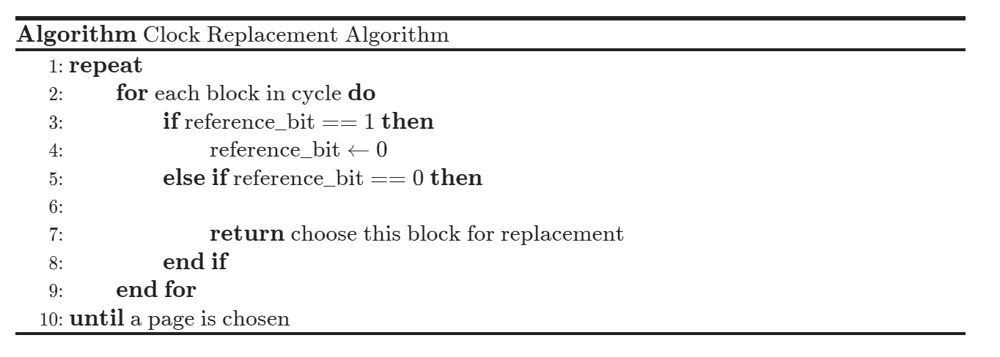 

Clock 的优势是实现成本低，不需要维护精确的 LRU 链表，但仍保留了“最近访问过的页不应立刻淘汰”的思想。
### 5. 列式存储

传统数据库多采用 **行式存储 (Row-Oriented Storage)**，即一条记录的所有字段放在一起。**列式存储 (Column-Oriented Storage)** 则把同一列的值连续存放，每个属性单独存储。

列式存储的优势很直接：如果查询只需要少数列，就不用读取整行；同一列数据类型相同，更容易压缩；连续列值也更适合 CPU cache 和向量化处理。因此列存通常更适合决策支持和分析型查询。

列存的代价也很明显。如果需要返回完整元组，系统必须从多个列中重建记录；删除和更新更复杂；如果列数据被压缩，访问前还可能需要解压。因此事务处理场景通常更偏向行存。一些数据库同时支持行存和列存，这类系统可以称为 hybrid row/column stores。

 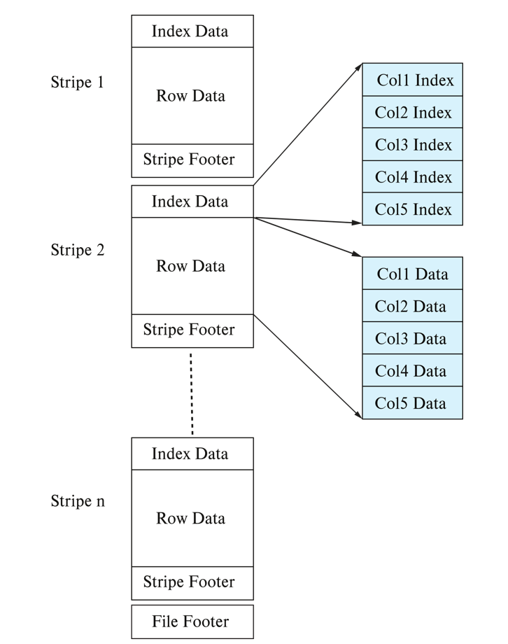 
