### 1. 索引基础

#### 1.1 基本概念

**索引 (Index)** 是数据库为了加速数据访问而维护的辅助结构。没有索引时，系统可能需要扫描整个文件；有索引时，可以先根据查找条件定位到少量候选记录，再访问真实数据。

索引使用 **搜索码 (Search Key)** 查找记录。搜索码可以是一个属性，也可以是一组属性。索引文件由若干 **索引项 (Index Entry)** 组成，形式可以抽象为：

$$
\langle \text{search-key},\ \text{pointer} \rangle
$$

其中 `pointer` 指向记录、记录桶、数据块，或下一级索引节点。索引文件通常比原始数据文件小得多，因此先访问索引再访问数据，往往能显著减少 I/O。

#### 1.2 评价指标

索引结构没有绝对最优，选择时通常看以下指标：

| 指标   | 关注点                        |
| ---- | -------------------------- |
| 访问类型 | 是否高效支持点查询、范围查询、排序扫描        |
| 访问时间 | 根据搜索码定位记录需要多少 I/O 或 CPU 时间 |
| 插入时间 | 新记录写入时维护索引的代价              |
| 删除时间 | 删除记录时维护索引的代价               |
| 空间开销 | 索引项、指针、空闲空间和辅助元数据占用多少空间    |

**点查询** 查找某个特定值，如 `ID = 12345`；**范围查询** 查找落在某个区间内的值，如 `salary between 60000 and 90000`。**有序索引** 天然适合范围查询，**哈希索引** 更适合等值查询。

#### 1.3 索引类型

索引可以先分成两大类：

| 类型                       | 组织方式           | 适用场景           |
| ------------------------ | -------------- | -------------- |
| **有序索引 (Ordered Index)** | 搜索码按排序顺序存储     | 范围查询、顺序扫描、排序访问 |
| **哈希索引 (Hash Index)**    | 搜索码通过哈希函数分布到桶中 | 等值查找           |

有序索引中还需要区分主索引和辅助索引：

- **主索引 (Primary Index)** 的搜索码决定文件中记录的顺序，也称聚集索引 (Clustering Index)。搜索码不一定是主键但通常是主键。
- **辅助索引 (Secondary Index)** 的搜索码顺序与数据文件物理顺序不同，也称非聚集索引 (Non-Clustering Index)。

<div style="display: flex; justify-content: center; gap: 10px;">
  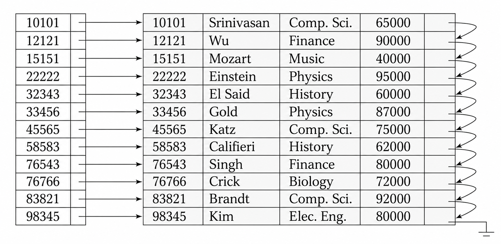
  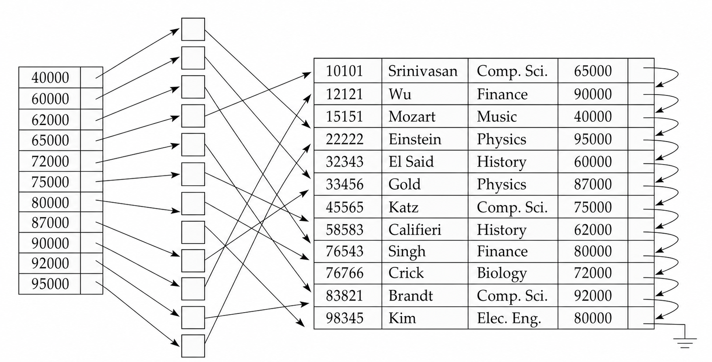
</div>

顺序文件按照主索引组织，就称为 **索引顺序文件 (Index-Sequential File)**。它结合了顺序文件的范围扫描能力和索引定位能力，但随着插入删除增加可能产生溢出块，需要周期性重组。

### 2. 顺序索引

#### 2.1 稠密索引

**稠密索引 (Dense Index)** 为文件中的每个搜索码值都建立索引项。若搜索码唯一，则每个索引项指向一条记录；若搜索码不唯一，则索引项可以指向一个记录桶，桶中保存所有具有该搜索码值的记录指针 (下图中由于按索引码排序，索引项可以直接指向第一个满足条件的记录)。

<div align="center"> 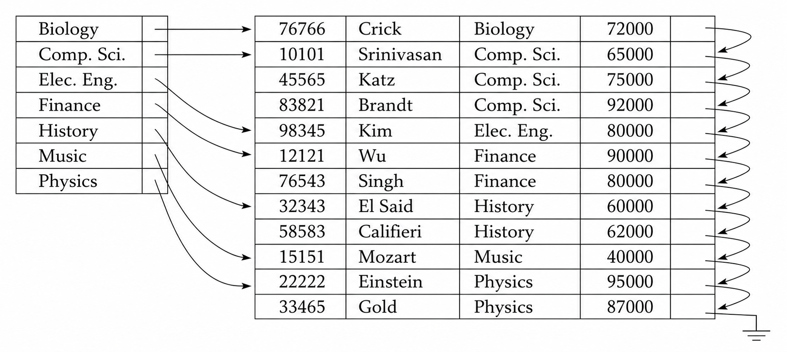 </div>

稠密索引查找速度快，因为索引中直接覆盖所有搜索码值。但它的空间开销和维护开销也更高：插入新搜索码值时要插入索引项，删除最后一个具有某搜索码值的记录时也要删除索引项。

#### 2.2 稀疏索引

**稀疏索引 (Sparse Index)** 只为部分搜索码值建立索引项。它要求数据文件本身已经按照搜索码顺序排列，否则无法从一个索引项开始顺序扫描到目标记录。

<div align="center"> 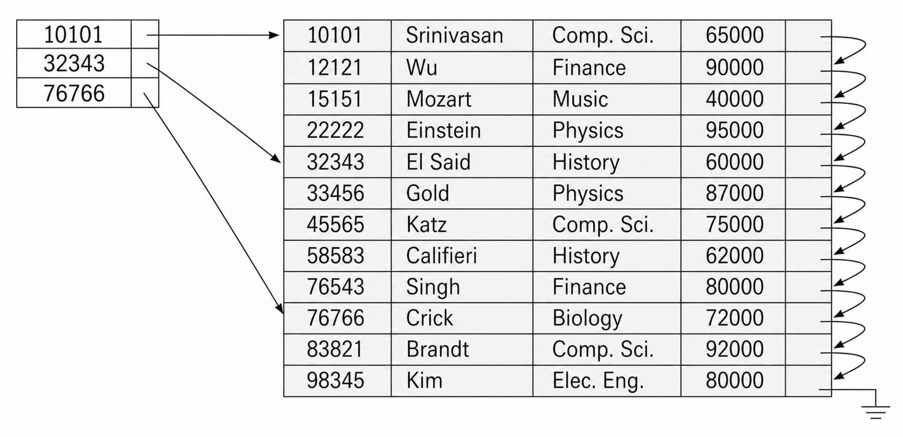 </div>

查找搜索码值 `K` 时，稀疏索引的过程是：

1. 在索引中找到小于或等于 `K` 的最大搜索码值。
2. 沿该索引项指向的数据位置开始顺序扫描。
3. 扫描到目标记录，或发现目标不存在。

稀疏索引比稠密索引更省空间，插入删除时维护成本也更低；代价是定位记录后还要顺序扫描一段数据。常见折中是 **每个数据块建立一个索引项**，索引项对应块中的最小搜索码值，这样处理，定位到记录后只需要在块内顺序查找即可，能够减少块传输次数。

#### 2.3 多级索引

如果主索引本身太大，无法放入内存，那么每次查找都需要访问磁盘上的索引块，代价仍然较高。解决方法是把磁盘上的主索引也看成一个顺序文件，再在它上面建立稀疏索引。

这样形成 **多级索引 (Multilevel Index)**：

- **内层索引 (Inner Index)**：直接指向数据文件的主索引。
- **外层索引 (Outer Index)**：建立在内层索引之上的稀疏索引。

<div align="center"> 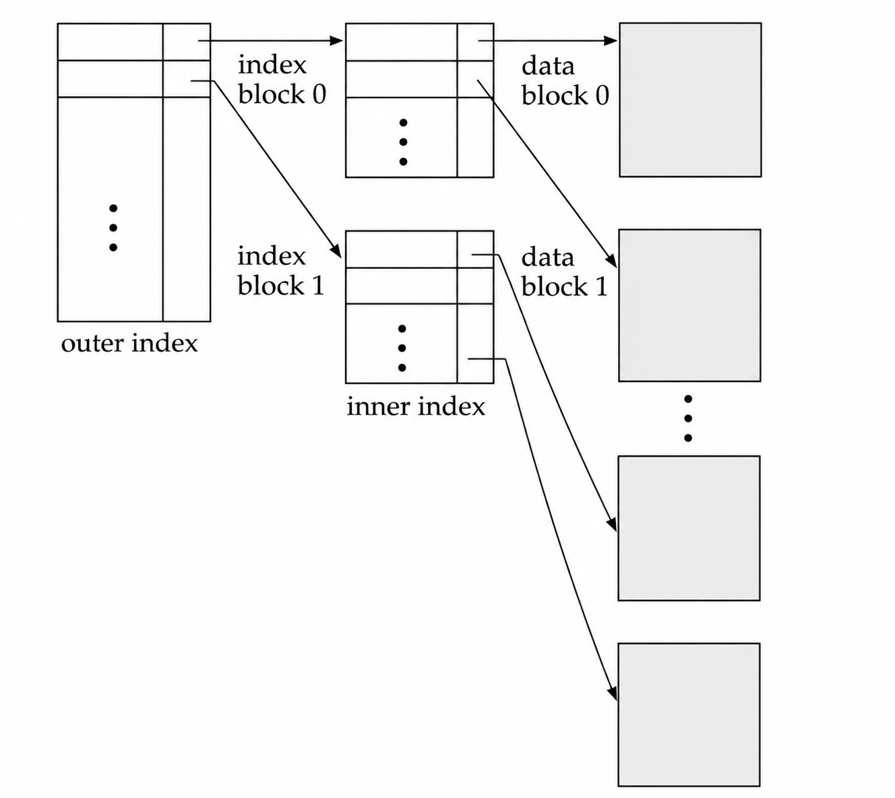 </div>

如果外层索引仍然太大，可以继续建立更高层索引。多级索引减少了查找时需要扫描的索引块数量，但插入和删除必须更新所有相关层级。

#### 2.4 聚集差异

主索引通常是聚集索引，记录顺序和搜索码顺序一致，范围查询可以顺序读取连续数据块。辅助索引通常是非聚集索引，索引项顺序和记录物理顺序不同，范围查询可能产生大量随机 I/O。

| 索引类型 | 点查询 | 范围查询 | 插入删除 |
| --- | --- | --- | --- |
| 稠密主索引 | 快 | 快，顺序扫描友好 | 索引项多，维护较多 |
| 稀疏主索引 | 较快 | 快，适合块级索引项 | 空间和维护较省 |
| 稠密辅助索引 | 快 | 可能随机访问大量记录 | 记录移动时维护复杂 |

如果辅助索引直接保存记录物理指针，那么记录移动会导致所有相关辅助索引都要更新。一个常见办法是在辅助索引中保存主索引搜索码，而不是物理记录指针。这样记录移动时辅助索引不必修改，但查询需要先走辅助索引，再走主索引定位真实记录。

### 3. B+树

#### 3.1 结构性质

**B+ 树索引 (B+ Tree Index)** 是数据库中最常用的有序索引结构。它较传统索引顺序文件的优势是：在插入和删除时，B+ 树能通过局部拆分和合并保持平衡，不需要周期性重组整个文件。

一棵阶数为 $n$ 的 B+ 树满足：

- 从根到所有叶子的路径 **长度相同**
- 非根、非叶内部节点有 $\lceil n/2 \rceil$ 到 $n$ 个子节点
- 叶节点有 $\lceil (n-1)/2 \rceil$ 到 $n-1$ 个搜索码值
- 如果根不是叶子，根至少有 $2$ 个子节点
- 如果根是叶子，根可以有 $0$ 到 $n-1$ 个搜索码值

典型节点结构可以写成：
$$
P_1,\ K_1,\ P_2,\ K_2,\ \ldots,\ P_{n-1},\ K_{n-1},\ P_n
\quad(K_1<K_2<\cdots<K_{n-1})
$$
其中 $K_i$ 是搜索码值，$P_i$ 是指针。内部节点中的指针指向子节点；叶节点中的指针指向记录或记录桶。叶节点还通过额外指针按搜索码 **顺序串联**，方便范围扫描。

<div align="center"> 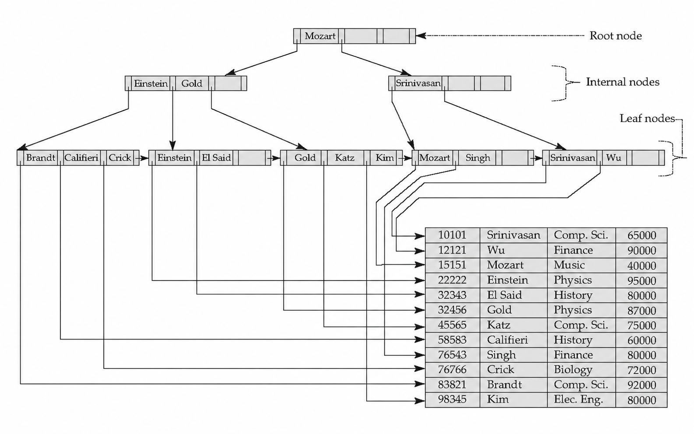 </div>

#### 3.2 节点性质

B+ 树的内部节点构成叶节点之上的 **多级稀疏索引**。对一个有 $m$ 个指针的内部节点：

- $P_i$ 指向的子树中，所有搜索码值小于 $K_i$
- $P_i$ 指向的子树中，搜索码值满足 $K_{i-1} \leq K < K_i$
- $P_m$ 指向的子树中，搜索码值大于或等于 $K_{m-1}$

叶节点保存实际的索引项。如果叶节点 $L_i$ 位于 $L_j$ 左侧，那么 $L_i$ 中的搜索码值都小于等于 $L_j$ 中的搜索码值。范围查询可以先定位第一个叶节点，然后沿链表顺序读取后续叶节点。

>[!Note] **Note**
>B+ 树中所有真实数据入口都在叶子层，内部节点主要负责导航。这一点和 B 树不同，B 树允许搜索码值只出现在内部节点中。

#### 3.3 查询过程

B+ 树查找搜索码值 $v$ 时，从根节点开始向下：

1. 在当前节点中找到最小的 $K_i$，使得 $v \leq K_i$，若不存在则沿最后一个非空指针向下
2. 如果 $v = K_i$，内部节点中通常沿 $P_{i+1}$ 向下；否则沿 $P_i$ 向下
3. 到达叶节点后，在叶节点中查找 $v$，若存在则沿对应指针访问记录

<div align="center"> 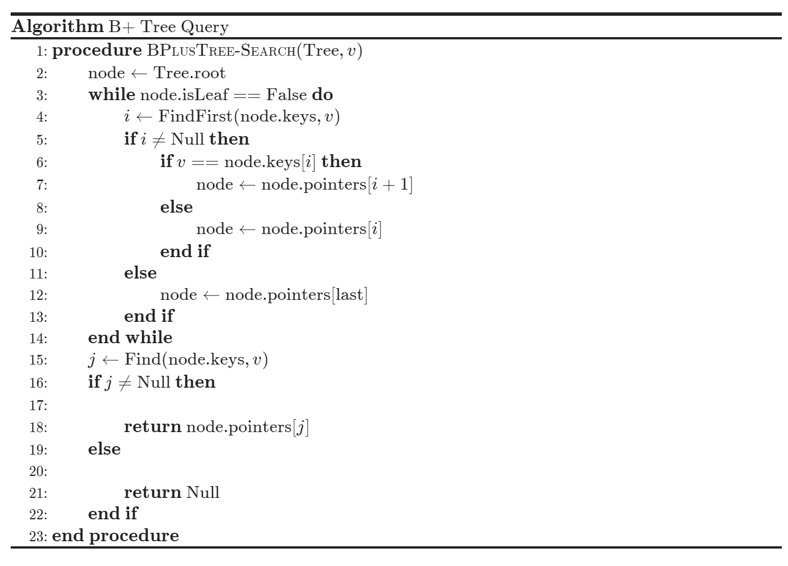 </div>

若文件中有 $K$ 个搜索码值，树高 **至多** 约为：
$$
\left\lceil \log_{\lceil n/2 \rceil}(K) \right\rceil
$$
数据库中一个 B+ 树节点通常设计为一个磁盘块大小 4KB。若一个索引项约 40 字节，$n$ 可以接近 100。对于 100 万个搜索码值，查找最多访问约 4 个节点；相比平衡二叉树约 20 层可以显著减少磁盘 I/O。

#### 3.4 插入删除

B+ 树 **插入** $(v, p)$ 时，先找到应出现的叶节点：

- 如果叶节点还有空间，直接按顺序插入。
- 如果叶节点已满，把原有 $n-1$ 个索引项和新索引项排序后分裂
- 前半部分留在原节点，后半部分放入新节点
- 把新节点的最小搜索码值和新节点指针插入父节点
- 如果父节点也满，继续向上分裂；最坏情况下根分裂，树高增加 $1$

<div align="center"> 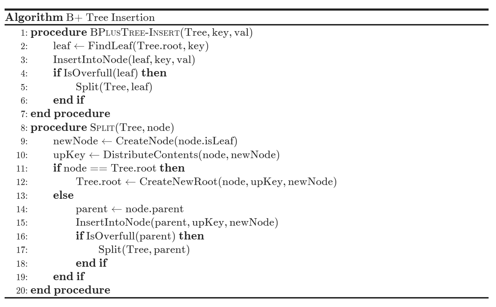 </div>

**删除** 时先从叶节点移除对应索引项：

- 如果节点仍满足最小占用要求，结束。
- 如果节点过少，先看能否和兄弟节点重新分配索引项。
- 若重新分配后两边都能满足最小占用，更新父节点分隔搜索码。
- 若两个节点合并后能放入一个节点，则合并兄弟节点，并从父节点删除对应指针。
- 删除可能向上级联；如果根只剩一个子节点，可以删除根，让唯一子节点成为新根。

<div align="center"> 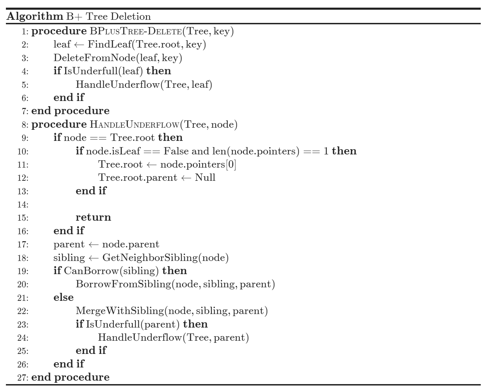 </div>

插入和删除的最坏 I/O 复杂度与 **树高** 成正比，即：

$$
\mathcal{O}\!\left(\log_{\lceil n/2 \rceil}(K)\right)
$$

实际系统中内部节点常驻缓冲区，分裂和合并也不频繁，因此多数更新只影响叶节点。

#### 3.5 大小估算

B+ 树估算的核心是节点容量和树高。以 `person` 关系为例：

```sql
person(
  pid char(18) primary key,
  name char(8),
  age smallint,
  address char(40)
)
```

记录大小约为 $18 + 8 + 2 + 40 = 68$ 字节。

若块大小为 4KB，则每个数据块约能存：$\begin{align}\left\lfloor \frac{4096}{68} \right\rfloor = 60\end{align}$条记录。

100 万条记录大约需要：$\begin{align}\left\lceil \frac{1000000}{60} \right\rceil = 16667\end{align}$ 个数据块。

搜索码 18 字节，指针 4 字节，内部节点扇出估算为：$\begin{align}n = \left\lfloor \frac{4096 - 4}{18 + 4} \right\rfloor + 1 = 187\end{align}$ 。

这说明 B+ 树高度通常很小。即使数据量达到百万级，三到四层往往已经足够。

假设索引的大小为 $m$ bytes，则 **内部节点** 扇出的估计为 $n=\begin{align}\left\lfloor\frac{4096-4}{m+4}\right\rfloor+1\end{align}$ 。
#### 3.6 文件组织

**B+ 树文件组织 (B+ Tree File Organization)** 把记录本身存放在叶节点中，而不是只在叶节点保存记录指针。这样即使有插入、删除和更新，记录仍能按搜索码聚集，范围查询仍可以沿叶节点顺序扫描。

由于记录比指针大得多，叶节点能容纳的记录数少于内部节点能容纳的指针数。空间利用率变得更重要，系统可以在分裂和合并时引入更多兄弟节点参与重新分配，减少半满节点带来的空间浪费，例如可以在叶节点 $A$ 存满时不立即分裂，而是优先将一部分记录转移到兄弟节点上。

#### 3.7 B 树比较

**B 树 (B Tree)** 与 B+ 树相似，但搜索码值只出现一次；如果搜索码在内部节点中出现，就不再出现在叶节点中。因此 B 树减少了一些重复搜索码存储，也可能在到达叶节点前找到目标值。

<div align="center"> 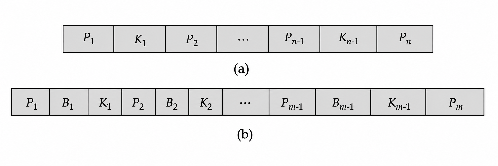 </div>

| 方面     | B 树             | B+ 树         |
| ------ | --------------- | ------------ |
| 索引项位置 | 可在内部节点或叶节点      | 统一在叶节点       |
| 内部节点大小 | 需要保存额外记录指针，扇出较小 | 内部节点只导航，扇出较大 |
| 范围查询   | 需要更复杂遍历         | 叶子链表顺序扫描简单   |
| 更新实现   | 插入删除更复杂         | 更容易实现和维护     |

### 4. 复合索引

#### 4.1 字符串搜索码

字符串作为搜索码时，长度可变会导致节点扇出可变。此时分裂节点不能只看指针数量，还要看空间利用率，当节点页内的剩余可用字节数不足以容纳新插入的索引项时，就会触发节点分裂。

**前缀压缩 (Prefix Compression)** 可以减少字符串索引占用。内部节点中的搜索码不一定保存完整字符串，只要保留足够区分相邻子树的前缀即可。例如 `Silas` 和 `Silberschatz` 可以用 `Silb` 分隔。叶节点也可以通过共享公共前缀压缩多个搜索码。

#### 4.2 复合搜索码

查询可能同时涉及多个条件。例如：

```sql
select ID
from instructor
where dept_name = 'Finance'
  and salary = 80000;
```

如果只有 **单属性索引**，可以选择：

- 用 `dept_name` 索引找出 `Finance` 系教师，再检查 `salary = 80000`。
- 用 `salary` 索引找出工资为 80000 的教师，再检查 `dept_name = 'Finance'`。
- 分别用两个索引得到记录指针集合，再取交集。

这些方法都可能读取大量只满足部分条件的记录。若查询模式稳定，建立复合索引更合适。

**复合搜索码 (Composite Search Key)** 由多个属性组成，通常按字典序排序：

$$
(\text{a}_1,\ \text{a}_2) < (\text{b}_1,\ \text{b}_2)
\quad\text{iff}\quad
\text{a}_1 < \text{b}_1\lor
(\text{a}_1 = \text{b}_1 \ \land\ \text{a}_2 < \text{b}_2)
$$

以索引 `(dept_name, salary)` 为例，它能高效支持：

```sql
where dept_name = 'Finance' and salary = 80000
where dept_name = 'Finance' and salary < 80000
```

但它不能高效支持：

```sql
where dept_name < 'Finance' and salary = 80000
```

原因是复合索引首先按 `dept_name` 排序。只有前导属性被等值限定时，后续属性的有序性才容易被利用，否则依旧需要顺序遍历进行查询。

#### 4.3 非唯一搜索码

如果搜索码 $a_i$ 不唯一，可以把它扩展成唯一复合搜索码 $(a_i, A_p)$，其中 $A_p$ 可以是主键、记录 ID 或其他能保证唯一性的属性。例如，查找 $a_i = v$ 可以转化为复合搜索码范围查询：
$$
(\text{v},\ -\infty) \ \text{到}\ (\text{v},\ +\infty)
$$

这种方法会增加搜索码存储空间，但 **简化插入和删除逻辑**。若索引是聚集索引，范围内记录访问通常是顺序的；若索引是非聚集索引，每条记录访问可能都需要一次随机 I/O。

#### 4.4 主存索引

主存中的随机访问远比磁盘便宜，但仍然比缓存访问昂贵。大型 B+ 树节点中用二分查找定位搜索码，可能产生多个缓存未命中。因此主存索引需要更关注缓存友好性。

一种思路是：磁盘层面使用大节点减少 I/O，节点内部再用适合缓存行的小结构组织搜索码，而不是简单线性数组。这样既保留 B+ 树的高扇出，又减少 CPU 缓存开销。

<div align="center"> 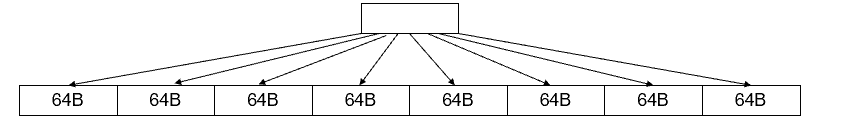 </div>

假设在 4KB 的页（存有 256 个搜索码）中查找一个值：

- **二分查找**：内存地址跳转幅度过大，除了最后几次跳转可能在同一缓存行中，几乎每次跳转都会引发一次缓存失效，全程平均会产生 **6～8 次 Cache Miss**。
- **微型树查找**：第一步读取 64B 根节点并在缓存中定位内部节点，第二步加载 64B 内部节点定位目标叶节点，第三步直接加载 64B 目标叶节点获取结果，仅产生 **3 次 Cache Miss**。

### 5. 专用索引

#### 5.1 批量装载

逐条向 B+ 树插入大量索引项很低效。如果叶子层不能放入内存，几乎每条插入都可能产生 I/O。**批量装载 (Bulk Loading)** 的核心是先排序，再自底向上构建树。

| 方法      | 做法                   | 特点                |
| ------- | -------------------- | ----------------- |
| 排序后顺序插入 | 先用外部排序得到有序索引项，再按顺序插入 | I/O 明显改善，但叶节点可能半满 |
| 自底向上构建  | 先排序再从叶子层开始逐层生成 B+ 树  | 多数数据库采用，写入更顺序     |

自底向上构建能用顺序 I/O 写出新树，适合初始化索引或批量合并索引。

#### 5.2 Flash 索引

在 Flash 存储上，随机读写延迟远低于磁盘，但写入不是原地覆盖，最终还涉及更昂贵的擦除操作，因此 Flash 上的最优页大小通常小于磁盘页。

- 批量装载仍然重要，因为它能减少页面擦除和随机写，从而延长 Flash 的使用寿命
- 写优化结构也适合 Flash，把大量小写入转换成顺序写入或批量合并，减少写磨损
#### 5.3 LSM 树

普通 B+ 树面对写密集负载时表现可能较差。即使内部节点都在内存中，每次插入仍可能修改一个叶节点。**日志结构合并树 (Log-Structured Merge Tree)** 通过分层合并降低写入成本。

LSM 的基本过程是：

1. **新记录优先插入内存中的 $L_0$ 树**：数据写入内存中以跳表等结构维持搜索码有序，并同步追加写入磁盘的预写日志（WAL）以保障数据的持久化。
2. **$L_0$ 满后批量写入磁盘上的 $L_1$ 树**：由后台线程将内存数据与磁盘现有的 $L_1$ 数据进行双路归并排序，采用大块顺序写入的方式在磁盘生成新的 $L_1$ 树。
3. **当 $L_1$ 超过阈值时与更低层合并成 $L_2$**：触发合并机制，读取两层中搜索码重叠的部分并在内存中归并，清理掉旧版本数据和删除标记，最后顺序写回 $L_2$。
4. **后续层级继续按阈值合并**：通常 $L_{i+1}$ 的大小阈值是 $L_i$ 的 $k$ 倍，倍数 $k$ 通常设为 10，通过各层容量的指数级递增来控制总层数，以此限制查询时的读放大并让冷数据有序下沉。

<div align="center"> 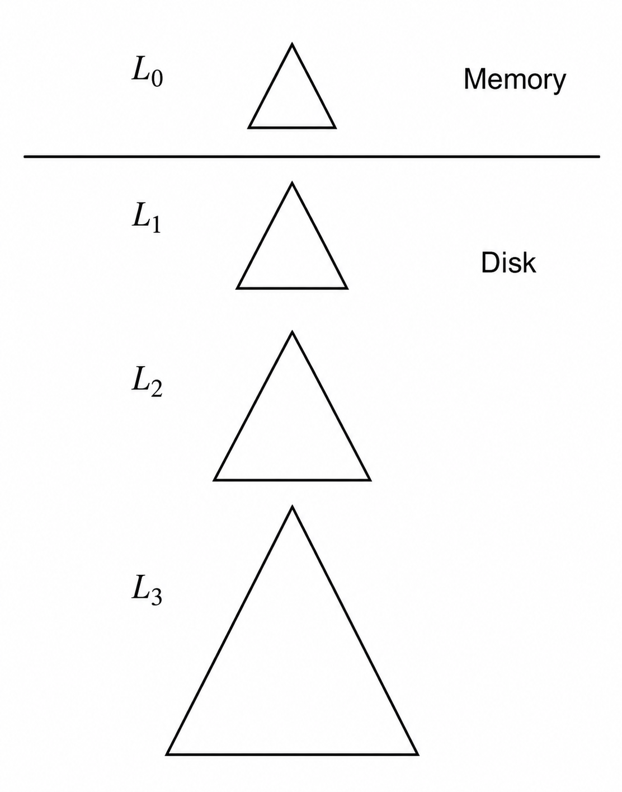 </div>

LSM 的 **优点** 是插入主要使用顺序 I/O，叶节点空间利用率高写入成本低。**缺点** 是查询可能需要查多个层级；由于层级合并，每个层级的全部内容可能会被多次复制。

**阶梯合并索引 (Stepped-Merge Index)** 在每个磁盘层级保留多个树，满 $k$ 个后再合并到下一层。它进一步减少了合并的频率，降低写成本，但查询需要检查更多树，导致读操作更加昂贵。对于点查询，可以在内存中为每一个树计算存储一个 **布隆过滤器 (Bloom filter)** ，在进行查询时，先通过布隆过滤器判断，只有在过滤器返回“可能存在”时才去查询对应的树，从而避免了大部分无意义的磁盘 I/O。

<div align="center"> 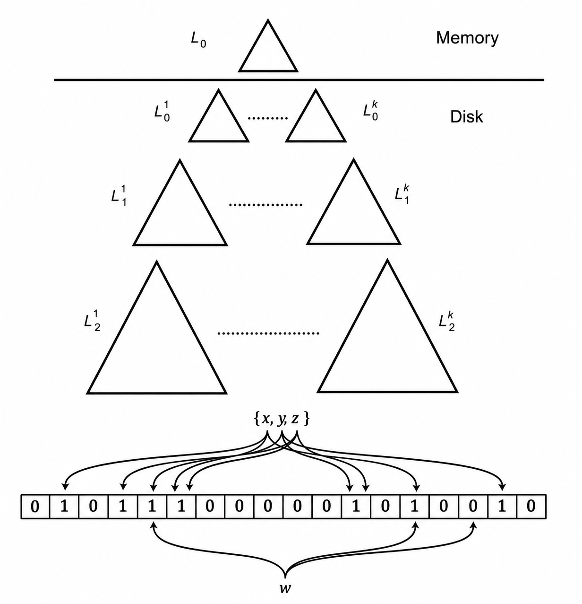 </div>

布隆过滤器由一个 **比特数组** 和多个 **哈希函数** 组成。将元素通过多个哈希函数计算，把得到的比特数组位置全部设为 $1$ ，将要查询的元素 $w$ 进行相同的哈希计算，检查对应位置的值，只要有任意一位为 $0$ ，则该元素一定不存在，若所有位均为 $1$ 则可能存在。

#### 5.4 Buffer 树

**Buffer Tree** 的思想是在 B+ 树内部节点中加入缓冲区存放插入请求。当缓冲区满时，再把一批记录一起推送到下一层。每次批量移动多条记录，可以摊薄单条记录的 I/O 成本。

Buffer Tree 的查询开销通常小于 LSM，因为它仍保留较接近普通树索引的结构；但它比 LSM 更容易产生随机 I/O。它适合作为通用树索引结构的写优化扩展。

>[!Note] **Buffer 树如何处理查询**
>- **即时查询**：从根向叶节点检索时，会沿途扫描每个节点的 Buffer。越靠上层的数据越新，系统会将路径中搜集到的最新修改与叶节点数据合并，从而获取最新的状态。
>- **批量查询**：查询操作本身也被作为记录塞进 Buffer 中排队。像普通数据一样随着缓冲区填满被向下推送，直到最终抵达叶节点时，才统一读取并返回结果。

#### 5.5 位图索引

**位图索引 (Bitmap Index)** 适合取值种类较少的属性，例如 `gender`、`country`、`state` 或离散化后的 `income_level`。假设关系中的记录按 `0, 1, 2, ...` 编号，每个属性值对应一个位图；若第 $i$ 条记录具有该值，则位图第 $i$ 位为 $1$，否则为 $0$。

<div align="center"> 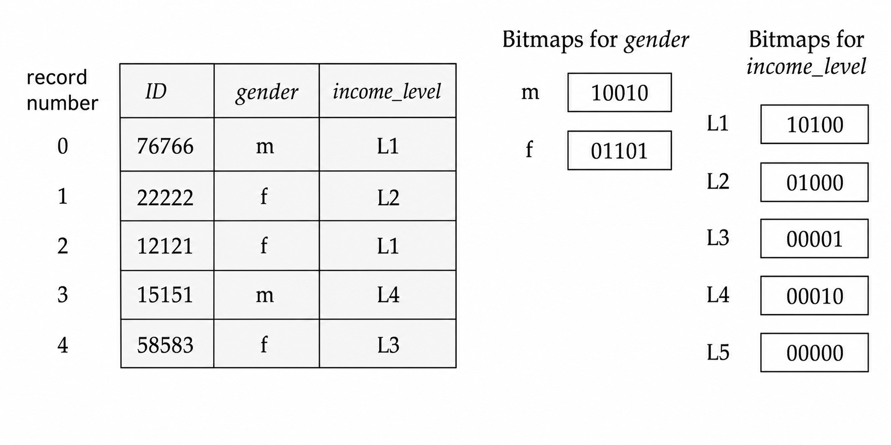 </div>

位图索引特别适合多属性组合查询，因为交、并、非都可以用按位运算完成。例如：

$$
100110\ \text{AND}\ 110011 = 100010
$$

$$
100110\ \text{OR}\ 110011 = 110111
$$

$$
\text{NOT}\ 100110 = 011001
$$

若要查找 `gender = 'm'` 且 `income_level = 'L1'` 的记录，只需把对应两个位图做 `AND`，再根据结果中为 $1$ 的位置读取记录。

位图通常很小。如果一条记录 $100$ 字节，一个单独位图只占关系大小的 $1/800$。若属性只有 $8$ 个不同取值，全部位图也约为关系大小的 $1\%$。位图还可以按机器字打包，CPU 一条按位指令能同时处理 $32$ 或 $64$ 位；统计匹配记录数时，可以用预计算表快速计算每个字节中 $1$ 的个数。