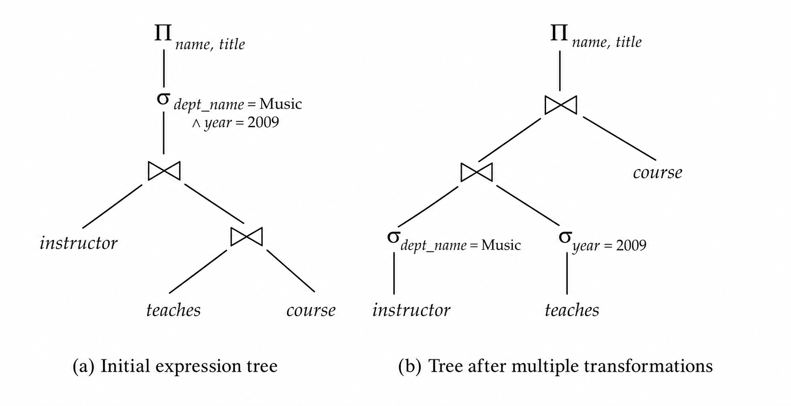
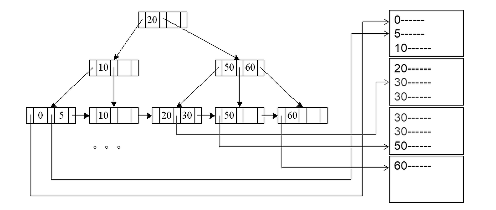
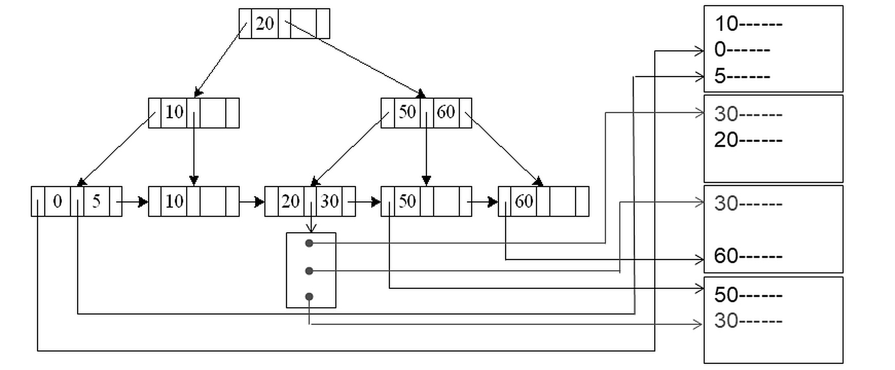
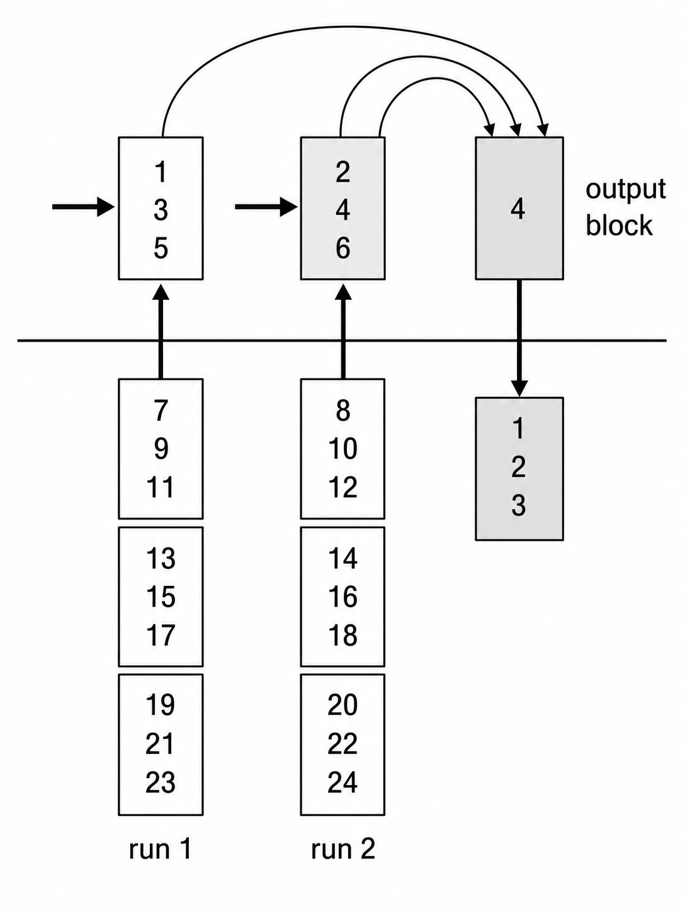
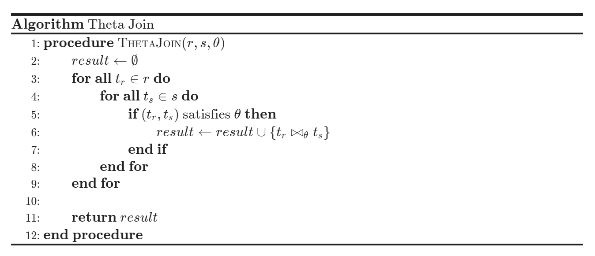
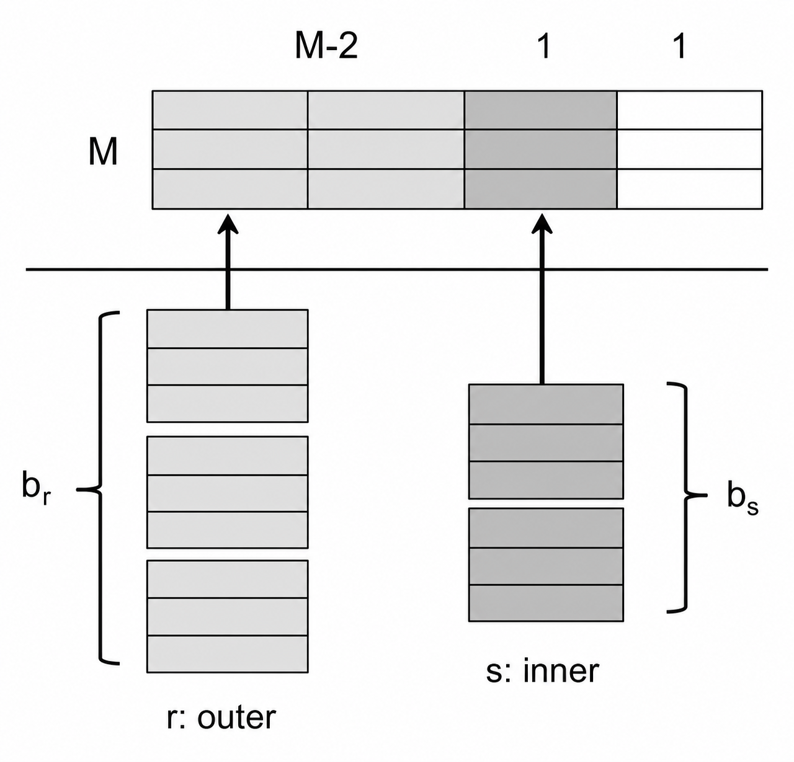
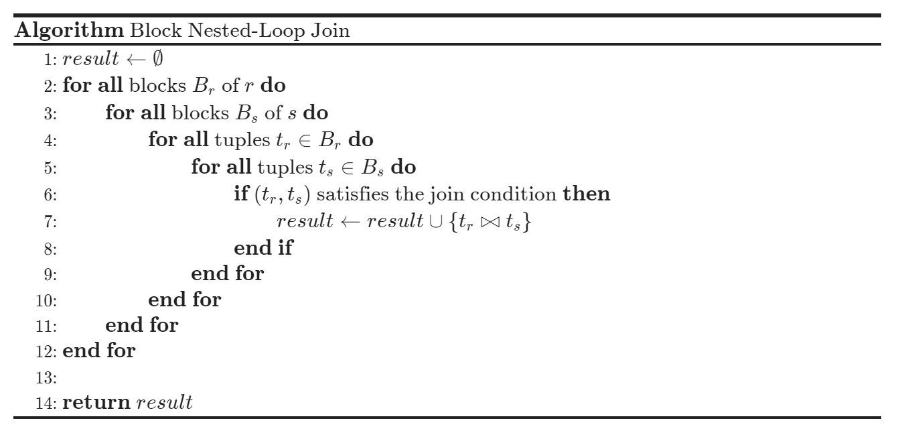
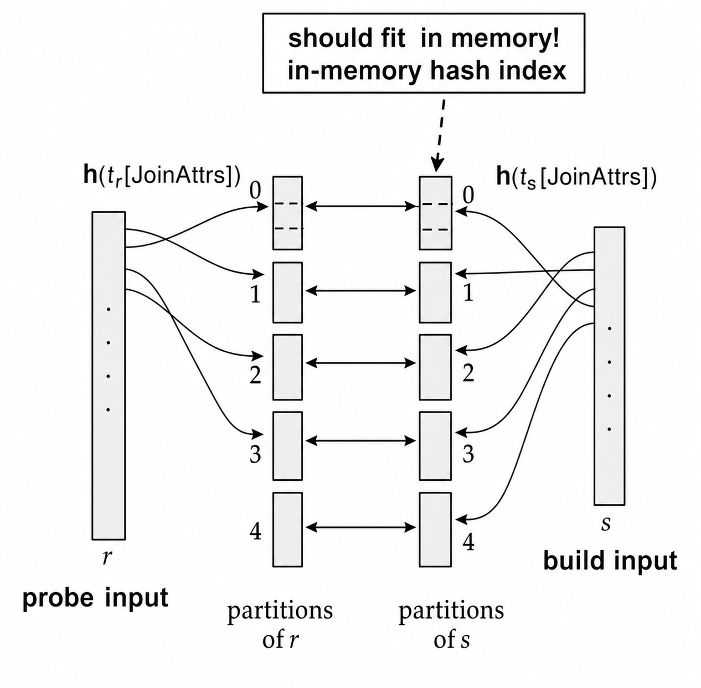

### 1. 查询处理

#### 1.1 处理流程

**查询处理 (Query Processing)** 是数据库把 SQL 查询转换为实际执行结果的过程。一个查询通常会经历 **解析翻译、查询优化、执行求值** 三个阶段。解析器负责检查语法、确认关系和属性是否存在，并把 SQL 转换成内部表示；优化器会在多个等价的关系代数表达式和执行计划中选择代价较低者；执行引擎则按照最终计划调用具体算法并返回结果。

```SQL
select name, title
from instructor natural join (teaches natural join course)
where dept_name = 'Music' and year = 2009;
```

$$
\Pi_{\text{name},\text{title}}(
\sigma_{\text{dept_name}=\text{"Music"}\land \text{year}=2009}
(\text{instructor}\bowtie(\text{teaches}\bowtie\text{course})))
$$

优化器并不一定按照这个初始表达式直接执行。它可能会把选择条件下推到连接之前，让 `instructor` 先过滤 `dept_name = 'Music'`，让 `teaches` 先过滤 `year = 2009`，从而减少后续连接的数据量。

<div align="center">  </div>

#### 1.2 计划代价

**执行计划 (Evaluation Plan)** 不只描述算子的逻辑顺序，还指定每个算子采用哪一种算法，以及算子之间如何传递数据。例如同样是连接，系统可以选择嵌套循环连接、索引嵌套连接、归并连接或哈希连接。大多数数据库都支持用 `explain` 查看优化器选择的计划；PostgreSQL 还支持 `explain analyse`，它会实际执行查询并显示真实运行统计。

查询代价通常用总运行时间衡量，教材中把磁盘 I/O 作为主要代价来源。设 $t_T$ 表示传输一个磁盘块的时间，$t_S$ 表示一次寻道时间，若算法需要传输 $b$ 个块并执行 $S$ 次寻道，则代价近似为：
$$
b \times t_T + S \times t_S
$$
实际数据库会考虑 CPU、缓存命中、并发查询和操作系统页缓存等因素，但这个简化模型足以比较不同算法的主要 I/O 差异。写块通常比读块更贵，因为系统可能需要读回数据来确认写入成功；不过后续很多公式会忽略最终结果写回磁盘的代价，因为算子输出常常直接传给父算子。

>[!Note] **Note**
>查询优化的核心不是“找到唯一正确的执行方式”，而是在许多等价方案中估算代价。不同算法适合不同数据规模、索引状态和内存条件，因此同一条 SQL 在不同数据库或不同统计信息下可能得到不同执行计划。

### 2. 单表算法

#### 2.1 选择运算

**选择运算 (Selection Operation)** 的基本任务是从关系中找出满足条件的元组。最通用的方法是 **线性扫描 (Linear Search)**：逐块读取关系 $r$，检查每条记录是否满足选择条件。若 $b_r$ 表示关系 $r$ 的块数，最坏情况下代价为：
$$
b_r\times t_T+t_S
$$
如果选择条件作用在键属性上，找到目标记录后即可停止，**平均代价** 约为：
$$
\frac{b_r}{2}\times t_T+t_S
$$
线性扫描的优点是完全不依赖数据顺序和索引；缺点是当关系很大而结果很小时，它会读取大量无关页面。二分查找通常不适合直接用于磁盘文件，因为数据块未必连续存放，而且二分查找会带来较多随机寻道。

当选择条件落在索引搜索码上时，可以使用 **索引扫描 (Index Scan)**。不同索引类型代价：

| 情况     | 适用条件         | 代价                                                   |
| ------ | ------------ | ---------------------------------------------------- |
| 主索引键等值 | 聚簇 B+ 树，键上等值 | 找到单条记录，代价约为 $(h_i+1)(t_T+t_S)$                       |
| 主索引非键  | 聚簇 B+ 树，非键等值 | 匹配记录连续存放，代价约为 $h_i(t_T+t_S)+t_S+b t_T$               |
| 辅助索引键  | 辅助 B+ 树，键上等值 | 类似主索引键等值，代价约为 $(h_i+1)(t_T+t_S)$                     |
| 辅助索引非键 | 辅助 B+ 树，非键等值 | 若匹配 $n$ 条记录、涉及 $m$ 个叶块，代价约为 <br>$(h_i+m+n)(t_T+t_S)$ |

聚簇索引的关键性质是数据记录按搜索码顺序靠近存放。下图中，B+ 树先定位到叶节点，再沿着叶节点和数据块继续顺序读取，因此多个匹配记录通常落在连续块中。这正是 $h_i(t_T+t_S)+t_S+b t_T$ 中 $b t_T$ 只按连续块传输计费的原因。

<div align="center">  </div>

辅助索引的叶节点保存的是记录指针。即使叶节点中相邻的搜索码值相同，指针指向的数据记录也可能分散在不同数据块中。下图对应辅助索引非键等值选择，代价中的 $m$ 来自索引叶块，$n$ 则表示最多需要为 $n$ 条匹配记录分别回表。

<div align="center">  </div>

聚簇索引适合 **范围查询**，因为匹配记录通常靠近存放。辅助索引在匹配记录很少时很有用，但如果匹配记录很多且分散，每条记录都可能触发随机 I/O，此时线性扫描反而可能更便宜。

对于形如 $\sigma_{A\ge V}(r)$ 或 $\sigma_{A\le V}(r)$ 的 **比较选择**，如果使用聚簇索引，可以先定位边界再顺序扫描；如果使用辅助索引，则需要扫描索引叶子并回表取记录，匹配比例较高时成本会迅速上升。

例如在聚簇 B+ 树上执行 $\sigma_{A\ge V}(r)$，若从索引定位到第一个满足条件的块后还需要顺序读取 $b$ 个数据块，代价近似为：
$$
h_i(t_T+t_S)+t_S+b t_T
$$
而 $\sigma_{A\le V}(r)$ 若关系按 $A$ 有序，可以从文件头顺序扫描到第一个大于 $V$ 的记录为止。辅助索引也能处理比较选择，但需要扫描满足范围的索引项并逐条回表，只有结果选择率较低时才划算。

复杂选择条件可以分为**合取**、**析取** 和 **取反**。对于合取条件：
$$
\sigma_{\theta_1\land\theta_2\land\cdots\land\theta_n}(r)
$$
系统可以选择 **代价最低** 的一个条件使用索引，取回元组后在内存中检查其它条件；如果存在复合索引，则可以直接使用复合索引；如果多个条件都有可用索引，也可以分别得到记录指针集合再求交集。同理，对于析取条件：
$$
\sigma_{\theta_1\lor\theta_2\lor\cdots\lor\theta_n}(r)
$$
只有当每个条件 **都有索引** 时，才适合分别取指针集合并求并集，否则通常直接线性扫描。

**位图索引扫描 (Bitmap Index Scan)** 介于辅助索引扫描和线性扫描之间。它先通过索引找到记录标识符，并在“每页一位”的位图中标记对应数据页；随后顺序扫描关系，只读取位为 $1$ 的页面。匹配页很少时，它接近普通索引扫描；匹配页很多时，它接近线性扫描；在匹配数量未知时，它通常不会比两种极端方案差太多。

#### 2.2 外部排序

**外部排序归并 (External Sort-Merge)** 用于关系无法整体放入内存的排序。设内存可容纳 $M$ 个页，算法先反复读入 $M$ 个块，在内存中排序后写出；然后执行多路归并，为每个归并段分配输入缓冲页，并保留一个输出缓冲页，选出各输入缓冲页中的最小记录写入输出。

<div align="center">  </div>

初始归并段数量为：$\begin{align}\left\lceil \frac{b_r}{M}\right\rceil\end{align}$ ，归并趟数为：$\begin{align}\left\lceil \log_{M-1}\left(\frac{b_r}{M}\right)\right\rceil\end{align}$

因此块传输次数约为：$\begin{align}b_r\left(2\left\lceil \log_{M-1}\left(\frac{b_r}{M}\right)\right\rceil+1\right)\end{align}$ （最后结果无需写回，直接使用）

如果每个归并段只分配 1 个缓冲块，归并阶段会产生大量寻道。实际系统可以为每个归并段分配 $b_b$ 个缓冲块，成批读写以降低寻道次数，但可同时归并的段数会下降为 $\lfloor M/b_b\rfloor-1$。

简单缓冲方式下，寻道次数可估计为：$\begin{align}2\left\lceil\frac{b_r}{M}\right\rceil+b_r\left(2\left\lceil \log_{M-1}\left(\frac{b_r}{M}\right)\right\rceil-1\right)\end{align}$

若每个输入或输出缓冲一次读写 $b_b$ 个块，则归并趟数变为：$\begin{align}\left\lceil \log_{\lfloor M/b_b\rfloor-1}\left(\frac{b_r}{M}\right)\right\rceil\end{align}$

对应块传输次数为：$\begin{align}b_r\left(2\left\lceil \log_{\lfloor M/b_b\rfloor-1}\left(\frac{b_r}{M}\right)\right\rceil+1\right)\end{align}$

对应寻道次数为：$\begin{align}2\left\lceil\frac{b_r}{M}\right\rceil+\left\lceil\frac{b_r}{b_b}\right\rceil\left(2\left\lceil \log_{\lfloor M/b_b\rfloor-1}\left(\frac{b_r}{M}\right)\right\rceil-1\right)\end{align}$

### 3. 连接算法

连接是查询处理中最重要也最昂贵的操作之一。不同连接算法的差异，主要来自是否利用索引、是否需要排序、是否需要哈希分区，以及内存能否容纳关键中间数据。

#### 3.1 循环连接

**嵌套循环连接 (Nested-Loop Join)** 对外层关系 $r$ 的每个元组，扫描内层关系 $s$ 的每个元组，并检查连接条件是否成立。它不需要索引，适用于任意连接条件，但会检查两个关系中的所有元组对，因此代价很高。若内存只能容纳每个关系的一个块，块传输次数为：$n_r\times b_s+b_r$ ，对应寻道次数为：$n_r+b_r$ 。

若较小关系能整体放入内存，将它作为内层关系代价可以降到 $b_r+b_s$ 次块传输和 $2$ 次寻道。

<div align="center">  </div>

**块嵌套循环连接 (Block Nested-Loop Join)** 以块为单位处理外层关系，每个外层块与内层关系的每个块配对。最坏情况下，块传输次数为：$b_r\times b_s+b_r$ ，对应寻道次数为：$2b_r$ 。

如果内存共有 $M$ 个块，可以用 $M-2$ 个块作为外层关系缓冲区，另外两个块分别缓冲内层关系和输出，此时传输代价为：$\begin{align}\left\lceil\frac{b_r}{M-2}\right\rceil b_s+b_r\end{align}$ ，寻道次数为：$\begin{align}2\left\lceil\frac{b_r}{M-2}\right\rceil\end{align}$ 。

当外层关系本身满足 $b_r\le M-2$ 时，只需把外层关系装入内存后顺序扫描内层关系，代价退化为 $b_s+b_r$ 次块传输和 $2$ 次寻道。

- 若内层关系的连接属性是键，还可以在找到第一个匹配元组后停止内层扫描
- 若顺序扫描内层关系，可交替正向和反向扫描，以便更好利用缓冲区中尚未被替换的块

<div align="center">  </div>

<div align="center">  </div>

#### 3.2 索引归并

**索引嵌套循环连接 (Indexed Nested-Loop Join)** 适用于等值连接或自然连接，并且内层关系的连接属性上存在索引。对外层关系 $r$ 的每个元组 $t_r$，系统用索引查找内层关系 $s$ 中匹配的元组。若 $c$ 表示一次内层索引查找并取回匹配元组的代价，则总代价为：

$$
b_r(t_T+t_S)+n_r\times c
$$

如果两个关系的连接属性上都有索引，通常选择元组数更少的关系作为外层关系。

**归并连接 (Merge-Join)** 先让两个关系按连接属性有序，然后像归并排序一样同步扫描两个关系。它只适用于等值连接和自然连接。

如果 **两个关系已经有序**，并且同一连接值对应的元组能放入内存，则每个块只需读取一次，块传输次数为：
$$
b_r+b_s
$$
若每次为 $r$ 和 $s$ 分别分配 $b_b$ 个缓冲块，寻道次数为：
$$
\left\lceil\frac{b_r}{b_b}\right\rceil+
\left\lceil\frac{b_s}{b_b}\right\rceil
$$
若 **关系尚未排序**，还需要加上排序代价。若总缓冲页数为 $M$，为两个输入分配 $x_r$ 和 $x_s$ 个缓冲页，且 $x_r+x_s=M$，**归并连接** 总代价中的寻道部分可写为：
$$
\left\lceil\frac{b_r}{x_r}\right\rceil+
\left\lceil\frac{b_s}{x_s}\right\rceil
$$
忽略取整时，使寻道次数较小的分配近似为：
$$
x_r=\frac{\sqrt{b_r}M}{\sqrt{b_r}+\sqrt{b_s}},
\quad
x_s=\frac{\sqrt{b_s}M}{\sqrt{b_r}+\sqrt{b_s}}
$$
对于有序关系和带辅助 B+ 树索引的关系的连接，可使用 **混合归并连接 (Hybrid Merge-Join)**：先将有序关系与未排序关系的 B+ 树索引叶子按连接属性进行归并，得到匹配元组的物理地址；再将这些地址按磁盘物理位置排序，并按顺序读取真实数据。这样避免了按索引顺序随机访问数据页，能把大量随机 I/O 转化为更接近顺序 I/O，从而降低寻道开销。

#### 3.3 哈希连接

**哈希连接 (Hash-Join)** 适用于等值连接和自然连接。它使用哈希函数 $h$ 按连接属性把两个关系划分为对应分区：
$$
i=h(t_r[\text{JoinAttrs}]),\quad i=h(t_s[\text{JoinAttrs}])
$$
如果两个元组满足连接条件，它们在连接属性上的值相同，因此一定会进入编号相同的分区。连接时只需要比较 $r_i$ 与 $s_i$，不必跨分区比较。

<div align="center">  </div>

在哈希连接的过程中，较小的关系通常作为 **构建输入 (Build Input)**，较大的关系作为 **探测输入 (Probe Input)**。先分区构建输入 $s$，再用同样的哈希函数分区探测输入 $r$；对每个分区 $i$，把 $s_i$ 装入内存并建立内存哈希索引，再顺序读取 $r_i$ 查找匹配元组。为了让构建分区能放入内存，通常要求分区数量 $n_h$ 满足：
$$
n_h\ge \left\lceil\frac{b_s}{M}\right\rceil
$$
为了给内存哈希索引和倾斜留余量，估算中常把分区数量取为 $\left\lceil b_s/M\right\rceil$ 乘调节因子 $f\approx 1.2$。

如果不需要递归分区，哈希连接块传输次数约为：$\begin{align}3(b_r+b_s)+4n_h\end{align}$ ，其中 $4n_h$ 表示分区块未填满导致的额外读写开销。

若每个输入或输出缓冲一次处理 $b_b$ 个块，对应寻道次数约为：$\begin{align}2\left(\left\lceil\frac{b_r}{b_b}\right\rceil+\left\lceil\frac{b_s}{b_b}\right\rceil\right)+2n_h\end{align}$

若构建关系分区后仍无法放入内存，就需要 **递归分区 (Recursive Partitioning)**。其过程是先用哈希函数 $h_1$ 把 $s$ 粗分一遍，对仍大于 $M$ 的分区 $s_i$ 换一个哈希函数 $h_2$ 再分一次，必要时继续递归，直到最终分区都能装入内存，$r$ 端同样处理，保证匹配元组落到对应位置。

设递归分区趟数为：$\begin{align}\left\lceil \log_{\lfloor M/b_b\rfloor-1}\left(\frac{b_s}{M}\right)\right\rceil\end{align}$

则递归分区时的块传输次数约为：$\begin{align}2(b_r+b_s)\left\lceil \log_{\lfloor M/b_b\rfloor-1}\left(\frac{b_s}{M}\right)\right\rceil+b_r+b_s\end{align}$

对应寻道次数约为：$\begin{align}2\left(\left\lceil\frac{b_r}{b_b}\right\rceil+\left\lceil\frac{b_s}{b_b}\right\rceil\right)\left\lceil \log_{\lfloor M/b_b\rfloor-1}\left(\frac{b_s}{M}\right)\right\rceil\end{align}$

第一次分区要维护输出缓冲区，$1$ 页用于输入缓冲，剩下大约 $M-1$ 页用于输出缓冲，因此分区数量还应满足 $n_h\leq M-1$ 。大致来说，当 $M>\sqrt{b_s}$ 时，可以避免递归分区。若整个构建输入都能放入内存，则无需分区，块传输次数可降为 $\begin{align}b_r+b_s\end{align}$ 。

哈希连接还可能遇到 **分区倾斜 (Skew)** 和 **哈希表溢出 (Hash-Table Overflow)**。若某些连接属性值重复过多，某个分区会远大于其它分区，即使用更好的哈希函数也可能无法完全解决，最终可能退回块嵌套循环连接处理溢出分区。

#### 3.4 算法比较

| 算法 | 适用场景 | 主要优势 | 主要限制 |
| --- | --- | --- | --- |
| 嵌套循环 | 任意条件 | 最通用 | 代价通常最高 |
| 块嵌套 | 任意条件 | 利用块缓冲 | 仍需多次扫描内层 |
| 索引嵌套 | 等值连接且有索引 | 匹配少时高效 | 每个外层元组都要查索引 |
| 归并连接 | 等值/自然连接 | 有序输入很高效 | 未排序时需排序 |
| 哈希连接 | 等值/自然连接 | 大表连接常用 | 受内存和倾斜影响 |

对于复杂连接条件，合取条件可以先选择一个简单条件执行连接，再过滤剩余条件；析取条件可以分别计算每个条件对应的连接结果，再求并集。不过如果缺少合适索引或中间结果过大，嵌套循环类算法反而可能更直接。

### 4. 其他运算

#### 4.1 去重聚集

**重复消除 (Duplicate Elimination)** 可以通过排序或哈希实现。排序时，相同元组会相邻出现，系统只保留一份；哈希时，相同元组会进入同一桶，也可以去重。投影操作通常先对每个元组取出目标属性，再执行重复消除。外部排序归并中还可以在生成初始归并段和中间归并阶段提前删除重复值，减少后续数据量。

**聚集 (Aggregation)** 与重复消除类似，也可以通过排序或哈希把同一分组的元组聚集到一起，再对每组应用聚集函数。

| 函数 | 可维护状态 | 合并方式 |
| --- | --- | --- |
| `count` | 局部计数 | 各分区计数相加 |
| `sum` | 局部和 | 各分区求和 |
| `min` | 当前最小值 | 取局部最小值的最小者 |
| `max` | 当前最大值 | 取局部最大值的最大者 |
| `avg` | `sum` 与 `count` | 最后用总和除以总数 |

#### 4.2 集合外连

集合运算 $\cup,\cap,-$ 也可以基于排序或哈希实现。哈希方法通常先用同一哈希函数分区两个关系，再逐分区处理：并集插入未出现元组，交集输出双方都存在的元组，差集则删除右侧关系中出现的元组。

**外连接 (Outer Join)** 可以先执行普通连接，再补上未匹配元组并填充 NULL；也可以直接修改连接算法。归并连接中，若扫描到 $r$ 中没有匹配的元组，就输出该元组并在 $s$ 的属性位置填充 NULL；哈希连接中，如果 $r$ 是探测关系，可以在探测时直接输出未匹配元组；如果 $r$ 是构建关系，则需要记录构建分区中哪些元组已经匹配，最后输出未匹配者。右外连接和全外连接可以用类似方式处理。

#### 4.3 半连接

**半连接 (Semijoin)** 只保留左侧关系中能够在右侧关系找到匹配的元组，不把右侧关系的属性拼接到结果中。对于：
$$
r\ltimes_{\theta}s
$$
若 $r$ 中某个元组 $t_r$ 出现 $n$ 次且至少存在一个 $s$ 中的元组 $t_s$ 满足条件 $\theta$，则 $t_r$ 在半连接结果中仍出现 $n$ 次；若没有匹配，则不出现在结果中。半连接可以用块嵌套循环、索引嵌套循环、归并连接或哈希连接改造实现，代价估算沿用对应连接算法，但输出规模通常小于完整连接。

### 5. 执行策略

前面讨论的是单个算子的算法，而一整棵查询表达式树还需要决定算子之间如何传递中间结果。常见策略是 **物化执行** 和 **流水线执行**。

#### 5.1 物化流水

**物化执行 (Materialized Evaluation)** 每次只执行一个算子，并将中间结果写入临时关系，随后上层算子再读取这些临时结果。它的优点是适用范围广、实现简单；缺点是中间结果写磁盘和再读回的代价很高。由于前面单个算子的公式通常忽略输出写盘，因此整体代价需要额外加上中间结果物化的读写成本。若一棵表达式树中有若干算子 $O_i$ 和临时结果 $e_j$，可概括为：
$$
\sum_i \text{cost}(O_i)
+\sum_j \text{write}(e_j)
+\sum_j \text{read}(e_j)
$$
其中最终结果如果直接返回给用户或上层算子，通常不计入写盘成本。实际实现中常用 **双缓冲 (Double Buffering)**：一个缓冲块正在被算子写入时，另一个缓冲块异步写盘，从而减少 CPU 等待 I/O 的时间。

**流水线执行 (Pipelined Evaluation)** 同时执行多个算子，一个算子产生的元组可以直接传递给父算子而不必写入临时关系。它通常比物化便宜，因为减少了临时关系的磁盘 I/O；但并非所有算子都天然适合流水线，如排序和普通哈希连接往往需要先看到大量输入，才能产生最终输出。

| 方式 | 核心做法 | 优点 | 限制 |
| --- | --- | --- | --- |
| 物化执行 | 中间结果写入临时关系 | 总是适用，实现简单 | 临时 I/O 代价高 |
| 流水执行 | 元组直接向上传递 | 减少中间结果读写 | 部分阻塞算子不适用 |

流水线有两种典型执行方式。**需求驱动 (Demand-Driven)** 也叫 lazy 或 pull，顶层算子不断请求下一条元组，每个算子再向子算子请求所需元组；**生产驱动 (Producer-Driven)** 也叫 eager 或 push，子算子主动产生元组并放入缓冲区，父算子从缓冲区取走元组。

需求驱动流水线通常用 **迭代器 (Iterator)** 接口实现：

```SQL
open()
next()
close()
```

`open()` 初始化算子状态，`next()` 返回下一条结果并保存当前进度，`close()` 释放资源。文件扫描、选择、投影等算子很适合这种接口；归并连接则需要在 `next()` 调用之间保存两个有序输入的扫描位置。哈希连接通常是阻塞式算法，但混合哈希连接可以把第 $0$ 个分区留在内存中，在读取探测输入时立刻输出该分区的连接结果，从而形成一部分流水线。

#### 5.2 内存优化

当数据越来越多地驻留在内存中时，查询处理的瓶颈会逐渐从磁盘 I/O 转向 CPU 和缓存效率。**查询编译 (Query Compilation)** 可以把查询计划转换为机器码、Java bytecode 或 LLVM IR，并通过 JIT 编译减少解释开销。它常与列式存储、向量化执行结合使用。

**缓存友好算法 (Cache Conscious Algorithms)** 的目标是减少 cache miss，让一次 cache line 读入的数据被尽可能充分利用。排序时，可以先生成接近 L3 cache 大小的 run；哈希连接时，可以先把关系分区到内存，再进一步细分到构建子分区和哈希索引能放入 L3 cache；元组属性布局也会影响缓存效率，经常一起访问的属性应尽量靠近存放。

>[!Note] **Note**
>传统代价模型主要关注磁盘 I/O；内存数据库、列式存储、向量化和 JIT 编译让 CPU cache 逐渐成为查询处理的重要性能来源。
