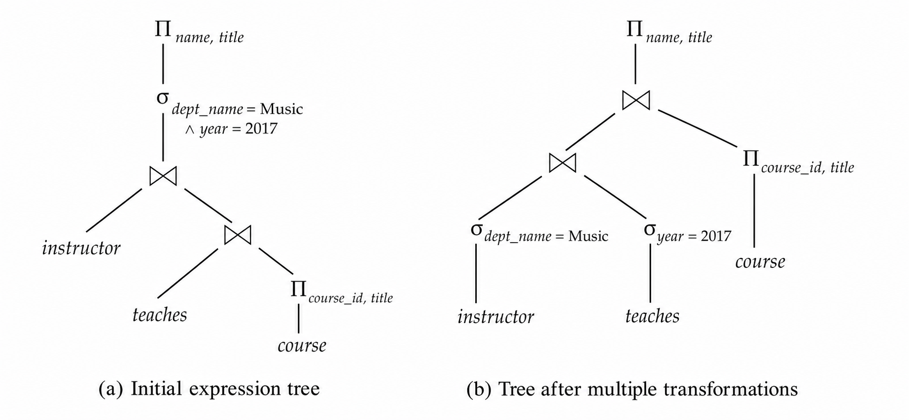
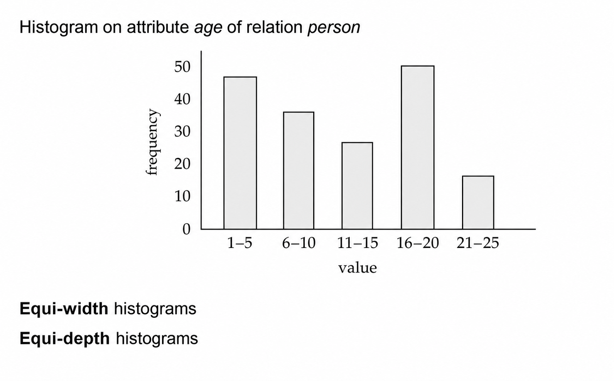
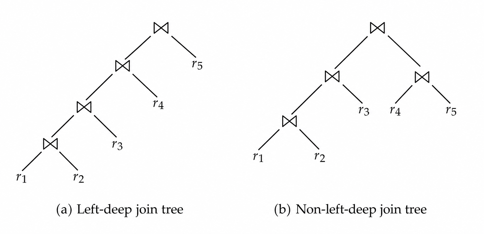

### 1. 优化概览

#### 1.1 基本思想

**查询优化 (Query Optimization)** 的目标是在多个等价执行方案中选择代价最低的方案。数据库执行一条查询时，通常会先把 SQL 翻译为关系代数表达式，然后由优化器生成多个逻辑等价的表达式，并为每个表达式选择具体物理算法，最后根据代价估计选出执行计划。

同一条查询可能有非常不同的执行方式：

- **逻辑层面**：关系代数表达式可以被改写，例如选择下推、投影下推、连接重排；
- **物理层面**：同一个算子可以用不同算法实现，例如连接可以用嵌套循环、归并连接或哈希连接；
- **执行层面**：算子之间可以物化中间结果，也可以流水线传递元组。

>[!Note] **Note**
>优化器并不是在证明某个方案“唯一正确”，而是在大量等价方案中做工程取舍。一个看似局部更贵的算子，可能因为产生了有序输出或适合流水线执行，反而降低整体代价。

#### 1.2 代价来源

基于代价的优化通常包含三个步骤：

1. 使用等价规则生成逻辑等价表达式；
2. 给逻辑表达式选择物理实现，形成候选执行计划；
3. 根据统计信息和算法代价公式，选择估计代价最低的计划。

优化器需要依赖目录中的统计信息，例如关系元组数、块数、元组大小、属性不同值数量等。对于中间结果，系统还需要做 **基数估计 (Cardinality Estimation)**，即估计某个表达式会产生多少元组。基数估计一旦偏差很大，后续连接顺序和算法选择就可能被带偏。

常见数据库可以通过 `explain` 查看执行计划。PostgreSQL 的 `explain analyse` 会真实执行查询并显示运行统计；Oracle 可使用 `explain plan for` 后配合 `dbms_xplan.display`；SQL Server 可使用 `set showplan_text on`。

### 2. 等价变换

#### 2.1 等价规则

两个关系代数表达式如果在每个合法数据库实例上都产生相同结果，就称它们 **等价 (Equivalent)**。在 SQL 中，输入和输出通常是多重集，因此更严格地说，需要在多重集语义下产生相同的元组及重复次数。

优化器通过 **等价规则 (Equivalence Rules)** 改写表达式。常见规则包括：

| 规则 | 含义 | 优化作用 |
| --- | --- | --- |
| 选择分解 | $\sigma_{\theta_1\land\theta_2}(E)=\sigma_{\theta_1}(\sigma_{\theta_2}(E))$ | 便于把不同条件下推到不同子树 |
| 选择交换 | 多个选择操作可交换顺序 | 先执行选择率低的条件 |
| 投影合并 | 连续投影只保留最后必要投影 | 删除无用属性 |
| 连接交换 | $E_1\bowtie E_2=E_2\bowtie E_1$ | 调整内外表位置 |
| 连接结合 | $(E_1\bowtie E_2)\bowtie E_3=E_1\bowtie(E_2\bowtie E_3)$ | 枚举连接顺序 |
| 选择分配 | 选择条件可下推到连接输入 | 减少连接输入规模 |
| 投影分配 | 只保留后续需要的属性 | 减少中间元组宽度 |

选择与连接的组合尤其重要。如果条件 $\theta_0$ 只涉及 $E_1$ 的属性，则：

$$
\sigma_{\theta_0}(E_1\bowtie_\theta E_2)
=
(\sigma_{\theta_0}(E_1))\bowtie_\theta E_2
$$

如果 $\theta_1$ 只涉及 $E_1$，$\theta_2$ 只涉及 $E_2$，则：

$$
\sigma_{\theta_1\land\theta_2}(E_1\bowtie_\theta E_2)
=
(\sigma_{\theta_1}(E_1))\bowtie_\theta(\sigma_{\theta_2}(E_2))
$$

#### 2.2 下推变换

**选择下推 (Selection Pushdown)** 会尽量把过滤条件放到靠近基表的位置。例如查询 Music 系教师讲授课程时，如果先连接 `instructor`、`teaches`、`course`，中间结果可能很大；如果先对 `instructor` 执行 `dept_name = 'Music'`，再参与连接，输入规模会显著减小。

**投影下推 (Projection Pushdown)** 会尽量提前删除后续不再需要的属性。比如最终只需要 `name` 和 `title`，连接过程中不必一直携带 `salary`、`semester` 等无关属性。投影下推不会减少元组数量，但会减小元组宽度，从而降低 I/O、内存和排序/哈希代价。

<div align="center">  </div>

#### 2.3 连接重排

连接顺序对代价影响很大。由于自然连接满足结合律：

$$
(r_1\bowtie r_2)\bowtie r_3
=
r_1\bowtie(r_2\bowtie r_3)
$$

优化器可以选择先连接哪两个关系。如果 $r_2\bowtie r_3$ 的结果很大，而 $r_1\bowtie r_2$ 的结果很小，就应优先计算后者，避免产生庞大的临时关系。

外连接需要更谨慎。许多对内连接成立的等价规则，对外连接并不成立。例如左外连接不满足一般意义下的结合律，选择条件是否能把外连接改写为内连接，也取决于该条件是否对 NULL 拒绝。

### 3. 统计估计

#### 3.1 基本统计

代价估计依赖关系和属性的统计信息。常见符号如下：

| 符号 | 含义 |
| --- | --- |
| $n_r$ | 关系 $r$ 中的元组数 |
| $b_r$ | 存放 $r$ 的块数 |
| $l_r$ | $r$ 中单个元组大小 |
| $f_r$ | 阻塞因子，即一个块能容纳多少个 $r$ 元组 |
| $V(A,r)$ | 属性 $A$ 在 $r$ 中出现的不同值数量 |

若关系 $r$ 的元组连续存放，则块数大致满足：

$$
b_r=\left\lceil \frac{n_r}{f_r}\right\rceil
$$

**直方图 (Histogram)** 可以描述属性值分布，比单纯的不同值数量更精细。等宽直方图把取值范围切成宽度相同的桶；等深直方图则让每个桶中的元组数量尽量接近。

<div align="center">  </div>

#### 3.2 选择估计

对于等值选择：

$$
\sigma_{A=v}(r)
$$

若没有更多分布信息，通常假设属性值均匀分布，结果大小估计为：

$$
\frac{n_r}{V(A,r)}
$$

如果 $A$ 是键属性，则结果大小最多为 1。对于比较选择 $\sigma_{A\le v}(r)$，如果目录中有 $\min(A,r)$ 和 $\max(A,r)$，可以按区间比例估计：

$$
n_r\times
\frac{v-\min(A,r)}{\max(A,r)-\min(A,r)}
$$

实际估计需要处理边界：若 $v<\min(A,r)$，结果为 0；若 $v\ge\max(A,r)$，结果接近 $n_r$。没有统计信息时，常简单估计为 $n_r/2$。

对于复杂选择，令条件 $\theta_i$ 的选择率为 $s_i$，即满足条件的元组比例。若假设各条件独立，则合取条件：

$$
\sigma_{\theta_1\land\theta_2\land\cdots\land\theta_n}(r)
$$

的大小估计为：

$$
n_r\prod_{i=1}^{n}s_i
$$

析取条件的大小估计为：

$$
n_r\left(1-\prod_{i=1}^{n}(1-s_i)\right)
$$

否定条件的大小估计为：

$$
n_r-size(\sigma_\theta(r))
$$

>[!Note] **Note**
>独立性假设很方便，但经常不真实。例如 `dept_name` 与 `building` 可能高度相关。实际优化器会用更复杂的统计信息缓解这个问题，但基数估计仍然是查询优化中最容易出错的部分。

#### 3.3 连接估计

笛卡尔积 $r\times s$ 的元组数为：

$$
n_r\times n_s
$$

若 $R\cap S=\emptyset$，自然连接就是笛卡尔积。若公共属性是 $R$ 的键，则 $s$ 中每个元组最多匹配 $r$ 中一个元组，因此：

$$
size(r\bowtie s)\le n_s
$$

若 $R\cap S$ 是 $s$ 中引用 $r$ 的外键，则每个 $s$ 元组都能在 $r$ 中找到对应元组，此时：

$$
size(r\bowtie s)=n_s
$$

如果公共属性 $A$ 既不是键也没有外键约束，常用均匀分布估计：

$$
size(r\bowtie s)
\approx
\frac{n_r n_s}{\max(V(A,r),V(A,s))}
$$

也可以分别计算 $\frac{n_r n_s}{V(A,r)}$ 与 $\frac{n_r n_s}{V(A,s)}$，取较小者作为估计。若有直方图，则可以在每个桶上分别估计后求和。

#### 3.4 其它估计

投影和聚集结果大小通常与不同值数量相关：

- $\Pi_A(r)$ 的大小可估计为 $V(A,r)$；
- 以 $A$ 分组的聚集结果大小也可估计为 $V(A,r)$；
- $\sigma_{\theta_1}(r)\cup\sigma_{\theta_2}(r)$ 可先改写为 $\sigma_{\theta_1\lor\theta_2}(r)$ 再估计；
- 外连接大小可粗略估计为内连接大小加上未匹配一侧的元组数。

优化器还需要估计中间结果中的不同值数量。对于选择结果，如果条件强制 $A$ 等于某个值，则 $V(A,\sigma_\theta(r))=1$；如果条件把 $A$ 限制在若干指定值中，则不同值数量不超过这些值的个数；一般情况下可使用：

$$
V(A,\sigma_\theta(r))=
\min(V(A,r),n_{\sigma_\theta(r)})
$$

### 4. 代价优化

#### 4.1 连接顺序

基于代价的优化器不能简单地为每个算子独立选择最便宜算法。一个归并连接可能比哈希连接本身更贵，但它产生的有序输出可以降低后续 `order by`、分组或下一次归并连接的代价；嵌套循环连接也可能因为适合流水线而减少物化开销。

连接顺序枚举的搜索空间非常大。对于：

$$
r_1\bowtie r_2\bowtie\cdots\bowtie r_n
$$

可能的连接顺序数量为：

$$
\frac{(2(n-1))!}{(n-1)!}
$$

当 $n=10$ 时，候选顺序可超过千亿级，不能直接枚举所有计划。

#### 4.2 动态规划

**动态规划 (Dynamic Programming)** 的核心思想是：对任意关系子集 $S$，只计算一次它的最优连接计划，并缓存起来供更大子问题复用。

对于关系集合 $S$，优化器考虑所有形如：

$$
S_1\bowtie(S-S_1)
$$

的划分，其中 $S_1$ 是 $S$ 的非空真子集。对子集 $S_1$ 和 $S-S_1$ 递归寻找最优计划，再尝试不同连接算法，选择总代价最低的组合。

可以把算法理解为：

```SQL
findbestplan(S):
  if bestplan[S] already exists:
    return bestplan[S]
  if S contains one relation:
    choose best access path for that relation
  else:
    for each non-empty proper subset S1 of S:
      P1 = findbestplan(S1)
      P2 = findbestplan(S - S1)
      try each join algorithm for P1 and P2
      keep the cheapest plan
  return bestplan[S]
```

在考虑 bushy tree 的情况下，动态规划的时间复杂度约为 $O(3^n)$，空间复杂度约为 $O(2^n)$。虽然仍然昂贵，但相比直接枚举所有连接顺序已经小很多。

#### 4.3 左深树

**左深连接树 (Left-Deep Join Tree)** 要求每次连接的右侧输入都是一个基关系，而不是中间连接结果。它的搜索空间更小，也更适合流水线执行，因此很多优化器会优先或只考虑左深树。

<div align="center">  </div>

如果只考虑左深树，寻找最优连接顺序的时间复杂度可降为：

$$
O(n2^n)
$$

空间复杂度仍为 $O(2^n)$。这种限制牺牲了一部分可能的最优计划，但显著降低优化开销。

#### 4.4 有趣顺序

**有趣排序 (Interesting Sort Order)** 指某个中间结果的排序顺序，虽然当前算子不一定需要，但可能被后续算子利用。例如用归并连接计算 $r_1\bowtie r_2$ 可能比哈希连接更贵，但它可以产生按属性 $A$ 排序的结果，从而让后续与 $r_3$ 的归并连接更便宜。

因此，优化器不能只为每个关系子集保留一个最低代价计划。它还需要为不同的有趣排序保留多个候选计划。通常有趣排序数量不多，不会显著改变动态规划的复杂度。

#### 4.5 启发优化

**启发式优化 (Heuristic Optimization)** 使用一组通常有效的规则快速改写查询树，以减少代价型搜索空间。常见启发包括：

- 尽早执行选择，减少元组数；
- 尽早执行投影，减少属性数；
- 优先执行选择率低、结果小的选择和连接；
- 使用左深连接树，便于流水线执行。

实际优化器常把启发式和代价型优化结合起来：先做嵌套查询、聚集、选择投影下推等规则改写，再对每个查询块做代价型连接顺序优化。对于便宜查询，优化器可能使用简单启发式；对于昂贵查询，才值得进行更充分的计划枚举。

### 5. 高级优化

#### 5.1 子查询优化

SQL 在概念上可以把嵌套子查询看作带参数的函数。若子查询引用外层查询变量，这些变量称为 **相关变量 (Correlation Variables)**。最直接的执行方式是对外层结果中的每个元组执行一次子查询，这称为 **相关执行 (Correlated Evaluation)**。

相关执行可能非常低效，因为它会产生大量子查询调用和随机 I/O。优化器会尽量把嵌套子查询改写为连接或半连接。例如：

```SQL
select name
from instructor
where exists (
  select *
  from teaches
  where instructor.ID = teaches.ID
    and teaches.year = 2022
)
```

可以改写为使用 **半连接 (Semijoin)**：

$$
\Pi_{\text{name}}
(\text{instructor}\ltimes_{\text{instructor.ID}=\text{teaches.ID}\land \text{teaches.year}=2022}\text{teaches})
$$

半连接只保留左侧关系中至少有一个匹配元组的记录，并保持左侧重复次数，因此比直接改写为普通连接更能保持 SQL 的重复语义。把相关子查询替换为连接或半连接的过程称为 **去相关 (Decorrelation)**。

#### 5.2 物化视图

**物化视图 (Materialized View)** 是把视图查询结果预先计算并存储下来。例如经常查询各院系总工资时，可以物化：

```SQL
create view department_total_salary(dept_name, total_salary) as
select dept_name, sum(salary)
from instructor
group by dept_name;
```

物化视图能减少重复计算，但底层数据更新后需要维护视图。最简单的方法是每次更新后重新计算视图，但代价很高；更好的方式是 **增量视图维护 (Incremental View Maintenance)**，即根据底层关系的插入差分 $i_r$ 和删除差分 $d_r$ 计算视图变化。

例如物化视图 $v=r\bowtie s$，若向 $r$ 插入元组集合 $i_r$，则：

$$
v_{new}=v_{old}\cup(i_r\bowtie s)
$$

若从 $r$ 删除元组集合 $d_r$，则：

$$
v_{new}=v_{old}-(d_r\bowtie s)
$$

投影维护更复杂，因为多个原始元组可能投影成同一个结果元组。系统通常需要为投影结果维护引用计数：插入时增加计数，删除时减少计数，计数降为 0 时才真正删除该投影元组。

聚集维护也需要额外状态。`count` 可以增减计数；`sum` 需要增减对应值并维护计数；`avg` 通常维护 `sum` 和 `count`，最后再相除；`min` 和 `max` 在插入时容易维护，但删除当前最小/最大值时可能需要重新扫描同组其它元组。

#### 5.3 视图选择

优化器可以把查询改写为使用已有物化视图。例如已有 $v=r\bowtie s$，用户查询 $r\bowtie s\bowtie t$ 时，可以改写为 $v\bowtie t$。是否这样做取决于代价估计：物化视图可能已有结果，但也可能缺少索引，导致直接展开为原始定义反而更便宜。

**物化视图选择 (Materialized View Selection)** 问题是：在给定工作负载、空间约束和更新成本约束下，选择哪些视图进行物化。它与索引选择密切相关，都是数据库调优的重要部分。商业数据库通常提供 tuning advisor 或 wizard 来辅助选择索引和物化视图。

#### 5.4 其它主题

查询优化还包含许多高级问题：

| 主题 | 核心问题 |
| --- | --- |
| Top-K 查询 | 只需要前 $K$ 个结果时，能否避免完整排序或完整连接 |
| 更新优化 | 避免 Halloween problem，即同一元组被更新后又被索引再次找到 |
| 连接消除 | 如果某个连接不影响结果，可删除冗余连接 |
| 多查询优化 | 多个查询共享公共子表达式时，是否统一计算更便宜 |
| 参数化优化 | 参数值运行时才知道，不同参数可能对应不同最优计划 |
| 自适应优化 | 运行时发现估计偏差后，动态调整执行计划 |

其中 **Halloween problem** 是更新优化中的经典问题。例如：

```SQL
update R set A = 5 * A
where A > 10;
```

如果系统用 `A` 上的索引查找满足条件的元组，并在扫描过程中立即更新 `A`，同一元组可能因为新值仍满足条件而被再次扫描和更新。解决方法是先收集待更新元组，第二阶段再统一更新；或者仅在更新会影响扫描条件时延迟更新。
