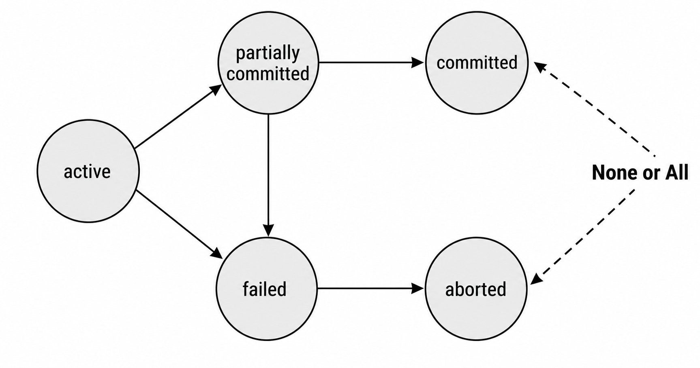
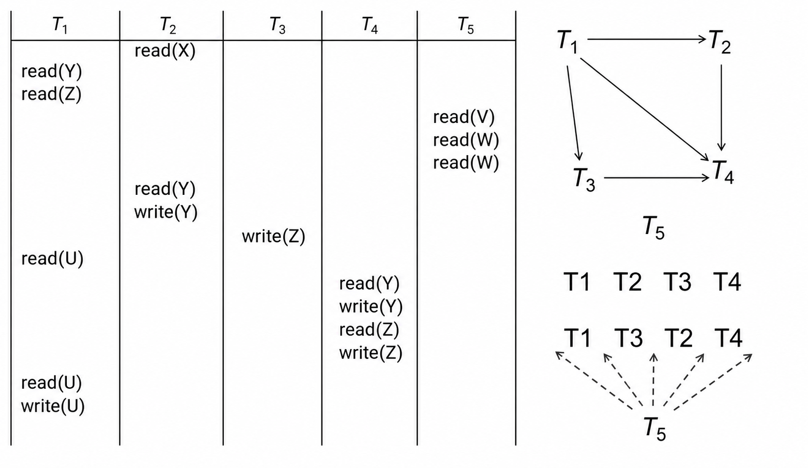
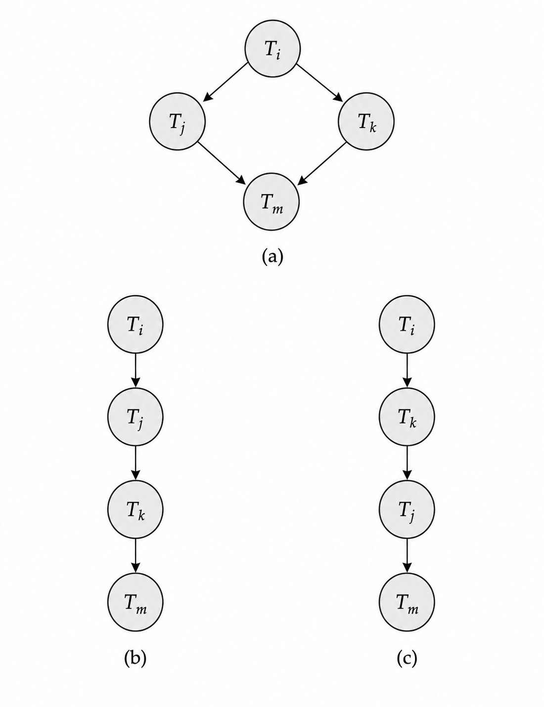

### 1. 事务基础

#### 1.1 事务概念

**事务 (Transaction)** 是数据库系统中一个逻辑执行单元，它会访问并可能更新若干数据项。用户通常把一次业务动作看成一个整体，例如从账户 `A` 向账户 `B` 转账 50 元：

```sql
update account
set balance = balance - 50
where account_number = 'A';

update account
set balance = balance + 50
where account_number = 'B';

commit;
```

这三条语句在业务上不能被拆开理解：如果只扣减 `A` 的余额，没有增加 `B` 的余额，数据库就进入了错误状态。因此事务系统主要处理两个问题：一是各种故障，例如系统崩溃、硬件错误；二是多个事务并发执行时，如何避免互相干扰。

需要注意的是，事务不是单条 SQL 的同义词。一个事务可以只包含一条语句，也可以包含多条语句，边界取决于业务中“必须一起成功或一起失败”的最小动作。对数据库系统而言，事务边界一旦确定，后续的恢复机制、并发控制机制和隔离级别都会围绕这个边界工作。

#### 1.2 ACID性质

事务通常用 **ACID** 四个性质刻画。

| 性质 | 含义 |
| --- | --- |
| **原子性 (Atomicity)** | 事务中的操作要么全部反映到数据库中，要么全部不反映。 |
| **一致性 (Consistency)** | 单独执行一个正确事务时，数据库会从一个一致状态变到另一个一致状态。 |
| **隔离性 (Isolation)** | 并发执行时，每个事务不应看到其他事务尚未完成的中间结果。 |
| **持久性 (Durability)** | 一旦事务成功提交，其结果即使遇到系统故障也应保留下来。 |

>[!Note] **Note**
>一致性不是数据库系统凭空保证的。数据库系统可以维护主键、外键等显式约束，也可以通过事务机制避免中间状态暴露；但如果事务程序本身逻辑错误，仍然可能把数据库带入不一致状态。

四个性质的侧重点不同：原子性和持久性主要依赖恢复系统，隔离性主要依赖并发控制，一致性则同时依赖完整性约束、事务程序的正确性和前面几个机制。后续讨论调度、恢复和隔离级别，本质上都是在说明数据库系统如何实现这些性质。

#### 1.3 简单模型

为了讨论事务性质，可以先采用一个简化模型：事务只通过 `read(X)` 和 `write(X)` 访问数据库。

- `read(X)`：把数据库中的数据项 `X` 读入事务私有工作区的变量 `X`。
- `write(X)`：把事务工作区中变量 `X` 的值写回数据库中的数据项 `X`。

转账事务可以写成：

$$
\text{read}(\text{A});\ \text{A} := \text{A} - 50;\ \text{write}(\text{A});
\text{read}(\text{B});\ \text{B} := \text{B} + 50;\ \text{write}(\text{B})
$$

如果事务在 `write(A)` 之后、`write(B)` 之前失败，数据库会出现只扣减 `A`、尚未增加 `B` 的中间状态。原子性要求系统撤销已经完成的部分更新；持久性要求一旦用户收到提交成功的反馈，更新就不能因为后续故障丢失。

#### 1.4 事务状态

事务执行过程中会在几个状态之间转换。

<div align="center">  </div>

| 状态 | 含义 |
| --- | --- |
| **活动 (Active)** | 初始状态，事务正在执行。 |
| **部分提交 (Partially Committed)** | 最后一条语句已经执行完，但提交结果尚未完全保证。 |
| **失败 (Failed)** | 系统发现事务无法继续正常执行。 |
| **中止 (Aborted)** | 事务已经回滚，数据库恢复到该事务开始前的状态。 |
| **提交 (Committed)** | 事务成功完成，结果被系统确认。 |

从 `failed` 进入 `aborted` 后，系统可以选择重新启动事务，也可以彻底终止事务。图中 “None or All” 对应原子性：事务结果不应停留在一半生效的状态。

`partially committed` 和 `committed` 的区分也很关键。前者表示事务逻辑已经执行完，但系统还没有完成确保提交结果可持久保存的工作；后者才表示事务真正提交成功。因此用户看到提交成功之前，系统仍然需要保留回滚或故障恢复的能力。

### 2. 并发调度

#### 2.1 为什么并发

多个事务并发执行可以提升系统吞吐量和响应速度。数据库系统同时利用 CPU 与磁盘：一个事务等待磁盘读写时，另一个事务可以使用 CPU；短事务也不必一直排在长事务之后。

但并发不是简单地把操作交错执行。事务之间可能读写同一数据项，如果没有约束，就会产生错误结果。因此并发控制的核心目标是：允许尽可能多的交错执行，同时让最终效果像某种合理的串行执行。

串行执行最容易保证正确性，但会浪费大量等待时间。并发执行的困难在于，系统既想保留交错带来的性能收益，又不能让事务读到不该看到的中间状态，或者让两个写入以不可控的顺序覆盖彼此。

#### 2.2 并发异常

常见并发异常可以按“读写关系”理解。

| 异常 | 典型情形 | 问题本质 |
| --- | --- | --- |
| **丢失修改 (Lost Update)** | 两个事务都读到旧值并分别写回，新写入覆盖旧写入。 | 一个事务的更新被另一个事务覆盖。 |
| **脏读 (Dirty Read)** | `T_j` 读到了 `T_i` 尚未提交的写入。 | 如果 `T_i` 回滚，`T_j` 已经基于不存在的值继续执行。 |
| **不可重复读 (Unrepeatable Read)** | 同一事务两次读取同一记录，中间被其他已提交事务修改。 | 单条记录在事务内部前后不一致。 |
| **幻影问题 (Phantom Problem)** | 同一查询条件两次扫描，第二次多出或少了记录。 | 谓词范围内的记录集合发生变化。 |

>[!Note] **Note**
>不可重复读关注“同一条记录的值变了”，幻影问题关注“满足条件的记录集合变了”。二者都可能让事务内部看到不稳定的数据视图。

这些异常对应不同的隔离要求。只禁止脏读并不等于禁止不可重复读；能保证同一记录重复读取一致，也不一定能阻止满足某个范围条件的新记录出现。因此隔离级别通常是按可接受异常逐步加强的。

#### 2.3 调度定义

**调度 (Schedule)** 是多个事务中各条指令按时间顺序交错形成的序列。一个合法调度必须包含这些事务的全部指令，并保持每个事务内部原有的指令顺序。

如果事务成功完成，最后一步是 `commit`；如果事务不能成功完成，最后一步是 `abort`。因此，讨论并发正确性时，不能只看中间读写操作，还要看提交与回滚顺序。

#### 2.4 串行调度

**串行调度 (Serial Schedule)** 中事务一个接一个执行，没有交错。例如先执行 `T_1` 再执行 `T_2`，或先执行 `T_2` 再执行 `T_1`，都是串行调度。

假设 `T_1` 把 50 元从 `A` 转到 `B`，`T_2` 把 `A` 余额的 10% 转到 `B`。不同串行顺序可能得到不同的 `A`、`B` 值，但只要每个事务本身保持一致性，串行执行整体仍保持一致性。

**可串行化 (Serializability)** 把这个思想推广到并发调度：如果一个并发调度与某个串行调度等价，就认为它是正确的。

#### 2.5 冲突等价

两个不同事务的指令在访问同一数据项 `Q`，且至少有一个是写操作时，称它们 **冲突 (Conflict)**。

| 指令对 | 是否冲突 |
| --- | --- |
| `read(Q)` 与 `read(Q)` | 不冲突 |
| `read(Q)` 与 `write(Q)` | 冲突 |
| `write(Q)` 与 `read(Q)` | 冲突 |
| `write(Q)` 与 `write(Q)` | 冲突 |

如果相邻的两条指令不冲突，交换它们不会改变调度结果。若调度 `S` 能通过一系列非冲突指令交换变成 `S'`，则称二者 **冲突等价 (Conflict Equivalent)**。如果 `S` 冲突等价于某个串行调度，则 `S` 是 **冲突可串行化 (Conflict Serializable)**。

冲突等价只关心会影响读写结果的相对顺序。例如两个事务都只读 `Q`，先后顺序不会改变任何数据项，也不会改变读到的值；但只要其中一个事务写 `Q`，顺序就可能决定另一个事务读到旧值还是新值，或者决定最终写回数据库的是哪个版本。

### 3. 可串行化

#### 3.1 前驱图

判断冲突可串行化通常使用 **前驱图 (Precedence Graph)**。图中每个顶点是一个事务；如果 `T_i` 和 `T_j` 在某个数据项上冲突，并且 `T_i` 的冲突操作先出现，就画一条从 `T_i` 到 `T_j` 的有向边。

<div align="center">  </div>

一个调度冲突可串行化，当且仅当前驱图无环。若图无环，可以对图做拓扑排序，得到与该并发调度等价的串行顺序。

<div align="center">  </div>

图中的无环前驱图可以对应不止一种拓扑排序，这意味着同一个并发调度可能等价于多个满足偏序约束的串行顺序。

前驱图的判定过程可以概括为三步：先列出所有事务作为顶点；再扫描调度中来自不同事务、访问同一数据项且至少一个为写的操作对；最后按操作出现的先后方向加边。只要出现环，就说明这些事务之间形成了互相要求先于对方的顺序约束，不可能重排成任何串行顺序。

#### 3.2 视图等价

**视图等价 (View Equivalent)** 比冲突等价更关注“读到的值来自哪里”。两个包含相同事务集合的调度 `S` 和 `S'` 视图等价，需要对每个数据项 `Q` 满足三点：

1. 如果 `T_i` 在 `S` 中读到 `Q` 的初始值，那么它在 `S'` 中也必须读到 `Q` 的初始值。
2. 如果 `T_i` 在 `S` 中读到的是 `T_j` 写出的 `Q`，那么在 `S'` 中也必须读到同一次写出的值。
3. 如果 `S` 中最后写 `Q` 的事务是 `T_i`，那么 `S'` 中最后写 `Q` 的事务也必须是 `T_i`。

若一个调度视图等价于某个串行调度，则它是 **视图可串行化 (View Serializable)**。每个冲突可串行化调度一定是视图可串行化的，但反过来不一定成立。

视图等价比冲突等价更宽松，因为它不要求所有冲突操作保持同样顺序，只要求每次读取的来源和每个数据项的最终写入者一致。不过这种判定通常更复杂，工程实现中更常使用容易检查、容易由协议保证的冲突可串行化。

#### 3.3 等价层次

还可以讨论一种更弱的等价：有些调度最终结果和某个串行调度相同，但既不冲突等价，也不视图等价。例如加法和减法在某些表达式中可以交换：

$$
(\text{B} - 10) + 50 = (\text{B} + 50) - 10
$$

这种等价依赖操作本身的语义，而不仅是 `read` 与 `write` 的顺序。实际事务可能是复杂 SQL 或应用程序代码，系统很难自动分析任意操作的代数性质，所以数据库并发控制通常采用更保守、可判定的协议。

### 4. 恢复隔离

#### 4.1 可恢复性

**可恢复调度 (Recoverable Schedule)** 要求：如果事务 `T_j` 读到了事务 `T_i` 之前写入的数据，那么 `T_i` 的 `commit` 必须出现在 `T_j` 的 `commit` 之前。

原因很直接：如果 `T_j` 先提交，而 `T_i` 后来中止，那么 `T_j` 已经把一个依赖脏数据的结果固定下来，甚至可能已经把错误结果展示给用户。数据库系统必须避免这种不可恢复的提交顺序。

#### 4.2 级联回滚

**级联回滚 (Cascading Rollback)** 指一个事务失败导致多个依赖它中间结果的事务也必须回滚。例如 `T_11` 读了 `T_10` 写出的值，`T_12` 又读了 `T_11` 写出的值；如果 `T_10` 中止，后续事务都要撤销。

**无级联调度 (Cascadeless Schedule)** 进一步要求：如果 `T_j` 要读 `T_i` 写出的数据，那么 `T_i` 必须先提交，`T_j` 才能读。无级联调度一定是可恢复调度，并且能避免一个失败事务导致大量已执行工作被撤销。

| 调度性质 | 约束 | 效果 |
| --- | --- | --- |
| 可恢复 | 读依赖者后提交，写入者先提交。 | 避免已提交事务依赖后来回滚的数据。 |
| 无级联 | 只读取已经提交的数据。 | 避免级联回滚，恢复代价更小。 |
| 严格调度 | 未提交事务写过的数据，其他事务既不能读也不能写。 | 更方便恢复与撤销，常与锁协议结合。 |

可恢复性解决的是提交顺序问题，无级联解决的是读取未提交数据的问题，严格调度进一步限制未提交写入的可见性和可覆盖性。三者从弱到强，越强越有利于恢复，通常也会限制更多并发。

#### 4.3 弱一致性

并非所有应用都必须使用最高隔离级别。有些只读分析任务只需要近似结果，例如统计账户总额、收集查询优化器使用的统计信息。此时系统可以用较弱一致性换取更高性能。

这种取舍必须明确：较低隔离级别允许更多并发，也可能允许某些异常出现。事务隔离级别就是 SQL 层面对这种取舍的标准化表达。

#### 4.4 SQL隔离

SQL 标准中常见隔离级别如下。

| 隔离级别 | 允许读取 | 可能问题 |
| --- | --- | --- |
| **Serializable** | 效果等价于串行执行。 | 并发度最低，开销较高。 |
| **Repeatable Read** | 只能读已提交记录，同一记录重复读值不变。 | 仍可能出现幻影问题。 |
| **Read Committed** | 只能读已提交记录。 | 同一记录两次读取可能得到不同已提交值。 |
| **Read Uncommitted** | 可以读未提交记录。 | 可能出现脏读。 |

>[!Note] **Note**
>许多数据库默认隔离级别不一定是 `Serializable`。例如一些系统默认采用快照隔离一类机制，它在工程上很有用，但不完全等同于 SQL 标准中的可串行化。

选择隔离级别时，需要同时考虑正确性要求和性能成本。资金转账、库存扣减这类更新事务通常需要较强隔离；统计报表、近似分析、优化器统计信息则可能接受较弱隔离。隔离级别越低，系统越容易并发执行事务，但应用层越需要明确自己能否接受相应异常。

### 5. 事务控制

#### 5.1 边界定义

在 SQL 中，事务通常隐式开始。事务结束有两种方式：

- `commit work`：提交当前事务，并开始一个新事务。
- `rollback work`：中止当前事务，撤销其影响。

很多数据库默认开启自动提交，即每条 SQL 语句成功执行后都会立即提交。在 JDBC 中，可以通过：

```java
connection.setAutoCommit(false);
```

关闭自动提交，让多条语句被包进同一个事务边界。隔离级别可以在数据库级别设置，也可以在事务开始时设置，例如：

```sql
set transaction isolation level serializable;
```

#### 5.2 边界取舍

事务边界不是越大越好，也不是越小越好。边界太小，无法保证业务动作的整体一致性；边界太大，会持有更多资源、降低并发度，并增加失败时回滚的代价。

例如订票场景中，“预订一张票”可以是一个事务；如果用户一次购买多张票，则可能需要把多张票的锁定与订单生成放在同一个更大的事务中。支付场景也类似：订票与支付合并在一个事务中，业务原子性更强，但系统耦合和等待时间更高；拆成多个事务，则需要额外的状态机和补偿逻辑处理失败。

实际系统常把事务边界设计成“数据库内强一致，外部系统用补偿”。例如订单写入数据库可以在一个本地事务内完成，而支付网关、消息队列、邮件通知等外部动作通常不能简单放进同一个数据库事务中。此时需要用订单状态、重试、幂等操作和补偿逻辑保证最终业务结果可控。

#### 5.3 协议目标

数据库不能等调度执行完之后才检查是否可串行化，因为那时错误结果可能已经产生。并发控制协议的任务是在执行过程中施加规则，保证产生的调度满足可串行化、可恢复，最好还满足无级联。

常见并发控制协议大致可以分成三类。

| 协议 | 基本思想 | 适用直觉 |
| --- | --- | --- |
| **基于锁的协议 (Lock-Based Protocols)** | 事务访问数据前先申请锁，可以区分共享锁与排他锁。 | 冲突较多、需要强隔离时常用。 |
| **基于时间戳的协议 (Timestamp-Based Protocols)** | 为事务分配时间戳，数据项记录读/写时间戳，用时间顺序检测违规访问。 | 用时间戳顺序定义串行化顺序。 |
| **基于验证的协议 (Validation-Based Protocols)** | 事务先读，提交前验证冲突，再进入写阶段。 | 适合冲突率低的乐观并发控制。 |

这些协议允许不同程度的并发，也付出不同的运行时开销。可串行化测试帮助我们理解协议为什么正确，而实际系统通常依靠协议本身避免产生不可接受的调度。

可以把协议和前面的正确性目标对应起来看：锁协议通过限制读写进入临界区来控制冲突顺序；时间戳协议把事务排序固定为时间戳顺序；验证协议则假设冲突较少，先执行读阶段，提交前再检查是否破坏可串行化。它们的目标相同，差别在于什么时候检测冲突、冲突发生时让谁等待或回滚。
