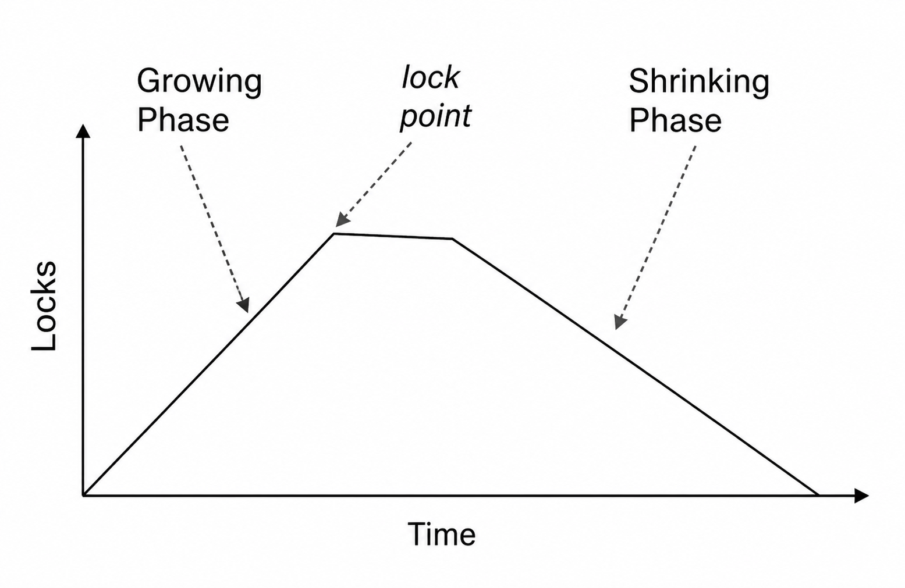
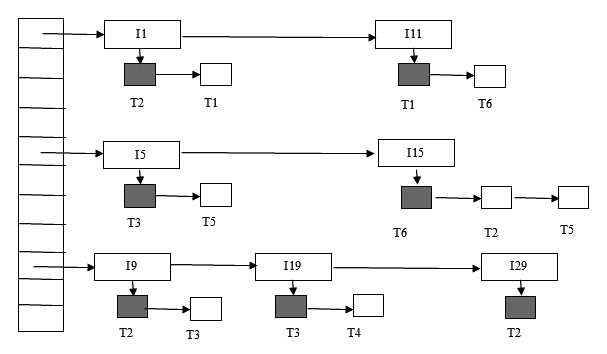
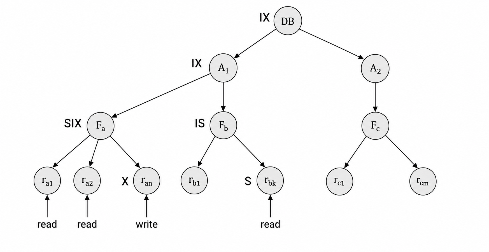
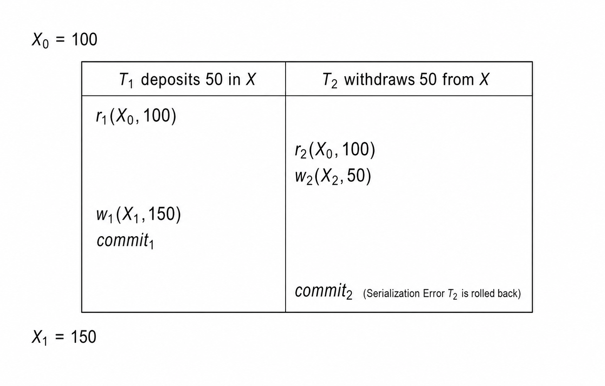

### 1. 锁协议

#### 1.1 锁的模式

**锁 (Lock)** 是数据库系统控制并发访问的基本机制。事务在访问某个数据项之前先向并发控制管理器申请锁，只有申请被批准后才能继续执行。最基本的锁有两种模式：

| 锁模式 | 含义 | 典型指令 |
| --- | --- | --- |
| **共享锁 (Shared Lock, S)** | 事务只能读取数据项。多个事务可以同时持有同一数据项的共享锁。 | `lock-S(Q)` |
| **排他锁 (Exclusive Lock, X)** | 事务可以读取并修改数据项。只要某事务持有排他锁，其他事务不能再持有该项上的任何锁。 | `lock-X(Q)` |

锁能否授予取决于已有锁和请求锁是否兼容。

| 已持有 \ 请求 | S | X |
| --- | --- | --- |
| S | 兼容 | 不兼容 |
| X | 不兼容 | 不兼容 |

如果请求的锁与已有锁不兼容，事务必须等待，直到不兼容锁被释放。锁协议的目标不是简单地阻止并发，而是限制可能出现的调度集合，使这些调度满足可串行化或更强的恢复性质。

#### 1.2 两阶段锁

只在读写前加锁、读写后立即释放锁，并不能保证可串行化。例如事务读完 $A$ 后释放 $A$ 的锁，再去读 $B$；在两次读取之间，另一个事务可能更新 $A$ 和 $B$，导致前后读到的数据不属于同一个一致状态。

**两阶段封锁协议 (Two-Phase Locking, 2PL)** 要求每个事务的锁操作分为两个阶段：

| 阶段 | 允许操作 | 禁止操作 |
| --- | --- | --- |
| **增长阶段 (Growing Phase)** | 可以申请锁。 | 不能释放锁。 |
| **收缩阶段 (Shrinking Phase)** | 可以释放锁。 | 不能再申请锁。 |

事务获得最后一个锁的时刻称为 **锁点 (Lock Point)**。2PL 保证冲突可串行化，并且等价的串行顺序可以按事务锁点排序。

<div align="center">  </div>

2PL 的直觉是：如果 $T_i$ 和 $T_j$ 在某个数据项上发生冲突，并且冲突顺序要求 $T_i$ 在 $T_j$ 之前，那么 $T_i$ 必须先获得相关锁并释放后，$T_j$ 才能继续获得不兼容锁。因此在前驱图中若有边 $T_i \to T_j$，通常可以推出 $LP(T_i) < LP(T_j)$。所有边都沿锁点递增方向，就不会形成环。

>[!Note] **Note**
>2PL 是保证冲突可串行化的充分条件，不是必要条件。有些冲突可串行化调度无法由 2PL 产生，因为 2PL 对加锁和解锁顺序施加了额外约束。

#### 1.3 严格变体

基本 2PL 保证冲突可串行化，但不一定保证可恢复和无级联。为了和恢复机制配合，常见系统会使用更强的变体。

| 变体 | 规则 | 效果 |
| --- | --- | --- |
| **基本两阶段锁 (Basic 2PL)** | 释放第一个锁后不能再获得新锁。 | 保证冲突可串行化。 |
| **严格两阶段锁 (Strict 2PL)** | 所有排他锁一直持有到 `commit` 或 `abort`。 | 保证可恢复，并避免级联回滚。 |
| **强两阶段锁 (Rigorous 2PL)** | 所有共享锁和排他锁都持有到 `commit` 或 `abort`。 | 事务可以按提交顺序串行化。 |

许多数据库实际实现的是严格或强两阶段锁，但文档中可能仍简称为 2PL。严格性带来的代价是锁持有时间更长，等待更容易发生；收益是恢复逻辑更简单，其他事务不会读取尚未提交的写入结果。

#### 1.4 锁转换

在实际事务中，读后再写很常见。若事务已经持有 $S$ 锁，后来需要修改同一数据项，可以把 $S$ 锁升级为 $X$ 锁，这称为 **锁升级 (Lock Upgrade)**。相反，把 $X$ 锁降为 $S$ 锁称为 **锁降级 (Lock Downgrade)**。

带锁转换的 2PL 通常要求：

- 增长阶段可以获得 $S$ 锁或 $X$ 锁，也可以把 $S$ 锁升级为 $X$ 锁。
- 收缩阶段可以释放锁，也可以把 $X$ 锁降级为 $S$ 锁。
- 一旦进入收缩阶段，就不能再升级或获得新锁。

这样仍可保证可串行化，因为决定冲突顺序的关键仍是事务最后一次获得足够强锁的时刻。

#### 1.5 锁管理器

事务不一定显式写出 `lock-S`、`lock-X`。系统可以在执行 `read(Q)` 与 `write(Q)` 时自动申请锁：

- 执行 `read(Q)` 时，如果事务已有合适的锁，直接读取；否则等待没有其他事务持有 $X$ 锁后授予 $S$ 锁。
- 执行 `write(Q)` 时，如果事务已有 $X$ 锁，直接写入；若只有 $S$ 锁，则尝试升级；若没有锁，则等待所有不兼容锁释放后授予 $X$ 锁。

**锁管理器 (Lock Manager)** 通常维护一张锁表。锁表以数据项名称为索引，记录已经授予的锁和等待队列。新的锁请求加入对应数据项的等待队列；释放锁时，系统删除相应请求并检查队列中后续请求是否可以被授予。为了高效释放某个事务持有的全部锁，系统也会维护“事务到锁集合”的反向列表。

锁表可以看成以内存哈希表实现的队列结构：每个数据项对应一个队列，队列中既有已经授予的锁，也有正在等待的请求。读锁表时，要先区分 **已授予锁** 和 **等待请求**，再把等待关系转成等待图。

<div align="center">  </div>

上图中，实心方块表示已经授予的锁，空心方块表示等待中的锁请求。判断死锁时，对每个等待请求画一条边，方向从等待事务指向当前阻塞它的事务。

例如 $T_1$ 在 $I_1$ 上等待 $T_2$。

$T_2$ 在 $I_{15}$ 上等待 $T_6$。

$T_6$ 在 $I_{11}$ 上等待 $T_1$。

因此等待图中出现环 $T_1\to T_2\to T_6\to T_1$，这三个事务卷入死锁。若只按持有锁数量粗略估计回滚代价，$T_1$ 或 $T_6$ 比 $T_2$ 更适合作为牺牲者；实际系统还会考虑事务已执行工作量、释放后能解除多少等待、以及该事务此前被回滚过多少次。

### 2. 死锁处理

#### 2.1 死锁与饥饿

锁协议可能导致 **死锁 (Deadlock)**。如果存在一组事务，其中每个事务都在等待组内另一个事务释放锁，那么这组事务都无法继续执行。例如 $T_1$ 已经写 $X$，接下来等待写 $Y$；$T_2$ 已经写 $Y$，接下来等待写 $X$，二者就可能互相等待。

**饥饿 (Starvation)** 是另一个问题：某个事务一直得不到所需资源，例如它等待 $X$ 锁时，系统不断授予其他事务对同一数据项的 $S$ 锁；或者它在死锁处理中总是被选为回滚对象。并发控制管理器需要在公平性和吞吐量之间做设计。

#### 2.2 死锁预防

**死锁预防 (Deadlock Prevention)** 的思路是在系统进入死锁之前就限制事务行为。

| 方法 | 做法 | 代价 |
| --- | --- | --- |
| 预声明 | 事务开始前一次性申请所有数据项的锁。 | 降低并发度，事务也可能难以提前知道所有访问项。 |
| 数据项排序 | 给数据项规定偏序，事务只能按顺序申请锁。 | 需要设计合适顺序，访问灵活性下降。 |
| 超时 | 事务等待超过一定时间后回滚。 | 简单，但超时时间难设，可能误伤长等待事务。 |
| 时间戳策略 | 根据事务新旧决定等待或回滚。 | 可避免死锁，并能减少长期饥饿。 |

基于时间戳的预防策略有两种经典形式：

| 策略 | 规则 | 类型 |
| --- | --- | --- |
| **等待-死亡 (Wait-Die)** | 老事务可以等待新事务；新事务请求老事务持有的锁时回滚。 | 非抢占式 |
| **伤害-等待 (Wound-Wait)** | 老事务请求新事务持有的锁时，强制新事务回滚；新事务可以等待老事务。 | 抢占式 |

回滚后事务通常保留原时间戳重新开始，因此它会逐渐变成“老事务”，从而降低饥饿风险。

#### 2.3 检测恢复

**死锁检测 (Deadlock Detection)** 使用 **等待图 (Wait-For Graph)**。图中顶点是事务；若 $T_i$ 正在等待 $T_j$ 释放某个数据项，就加入边 $T_i \to T_j$。系统处于死锁状态，当且仅当等待图中存在环。

检测到死锁后，系统需要选择一个或多个事务作为 **牺牲者 (Victim)** 回滚，以打破环。选择时通常考虑：

- 已经执行了多少工作，回滚代价有多大。
- 事务持有多少锁，释放后能解除多少等待。
- 事务之前被回滚过多少次，避免同一事务反复成为牺牲者。

回滚可以是完全回滚，也可以只回滚到足以打破死锁的位置。后者代价更低，但需要系统有更精细的日志和恢复能力。

#### 2.4 图协议

**基于图的协议 (Graph-Based Protocols)** 是 2PL 之外的另一类锁协议。系统为所有数据项规定一个偏序，例如 $d_i \to d_j$ 表示访问两者的事务必须先访问 $d_i$ 再访问 $d_j$。这类协议可以把数据项看成一个有向无环图。

**树协议 (Tree Protocol)** 是一种简单图协议：

- 只允许排他锁。
- 事务第一次加锁可以在任意数据项上。
- 之后事务只能锁住当前已持有锁节点的子节点。
- 数据项可以随时解锁。
- 某事务已经锁住并释放过的数据项，不能再次被该事务加锁。

树协议保证冲突可串行化，并且无死锁。它允许比 2PL 更早释放某些锁，因此可能减少等待；但它不保证可恢复和无级联，而且事务可能为了到达目标节点而锁住本来不需要的数据项。

### 3. 粒度幻影

#### 3.1 多粒度锁

**多粒度锁 (Multiple Granularity Locking)** 允许数据项具有不同大小，例如数据库、区域、文件或表、记录。层次越低，粒度越细；层次越高，粒度越粗。

| 粒度 | 优点 | 缺点 |
| --- | --- | --- |
| 细粒度 | 并发度高，不同事务更容易访问不同记录。 | 锁数量多，锁管理开销高。 |
| 粗粒度 | 锁数量少，管理成本低。 | 并发度低，容易阻塞无关操作。 |

当事务显式锁住层次树中的某个节点时，它会隐式锁住该节点的所有后代。例如锁住一张表，就不必再逐行申请记录锁。但为了让系统判断“某个高层节点是否能被整体加锁”，需要引入意向锁。

#### 3.2 意向锁

多粒度锁在 $S$、$X$ 之外增加三种模式：

| 锁模式                                               | 含义                           |
| ------------------------------------------------- | ---------------------------- |
| **意向共享锁 (Intention Shared, IS)**                  | 表示事务将在更低层节点申请共享锁。            |
| **意向排他锁 (Intention Exclusive, IX)**               | 表示事务将在更低层节点申请共享锁或排他锁。        |
| **共享意向排他锁 (Shared and Intention Exclusive, SIX)** | 当前节点以共享方式锁住，同时还会在更低层节点申请排他锁。 |

完整兼容矩阵如下。

| 已持有 \ 请求 | IS | IX | S | SIX | X |
| --- | --- | --- | --- | --- | --- |
| IS | 兼容 | 兼容 | 兼容 | 兼容 | 不兼容 |
| IX | 兼容 | 兼容 | 不兼容 | 不兼容 | 不兼容 |
| S | 兼容 | 不兼容 | 兼容 | 不兼容 | 不兼容 |
| SIX | 兼容 | 不兼容 | 不兼容 | 不兼容 | 不兼容 |
| X | 不兼容 | 不兼容 | 不兼容 | 不兼容 | 不兼容 |

多粒度锁的申请顺序是从根到叶，释放顺序是从叶到根。事务必须先锁根节点；若要在某节点上申请 $S$ 或 `IS`，父节点必须已经持有 `IX` 或 `IS`；若要申请 $X$、`SIX` 或 `IX`，父节点必须已经持有 `IX` 或 `SIX`。事务仍需满足两阶段规则，释放过节点后不能再申请新锁。

<div align="center">  </div>

如果事务在某一层持有太多细粒度锁，系统可能进行 **锁粒度升级 (Lock Escalation)**，把大量低层锁替换成更高层的 $S$ 或 $X$ 锁。这样可以减少锁表压力，但也会降低并发度。

#### 3.3 插入删除

在 2PL 下，删除元组前需要获得该元组的 $X$ 锁；插入新元组时，新元组也会被加 $X$ 锁。但只锁已有元组并不能解决 **幻影现象 (Phantom Phenomenon)**。

幻影问题的本质是谓词范围冲突。例如一个事务扫描 `Perryridge` 分行所有账户并求和，另一个事务插入一个新的 `Perryridge` 账户。二者可能没有访问同一个已有元组，但它们都影响了“哪些元组属于这个查询结果”的信息。如果只对已有记录加锁，扫描事务可能看不到新插入记录，从而产生不可串行化调度。

一种粗略办法是为关系额外设置一个代表“元组集合信息”的数据项。扫描事务在该数据项上申请 $S$ 锁，插入或删除事务申请 $X$ 锁。这能阻止幻影，但并发度很低，因为所有插入和范围扫描都会互相冲突。

#### 3.4 索引加锁

**索引加锁 (Index Locking)** 用索引叶节点捕捉谓词范围冲突。基本规则包括：

- 每个关系至少有一个索引。
- 事务访问元组前必须通过某个索引找到它们。
- 查找时，事务对访问到的索引叶节点申请 $S$ 锁，即使该叶节点中没有满足条件的元组。
- 插入、更新或删除元组时，事务必须更新相关索引，并对受影响的索引叶节点申请 $X$ 锁。
- 这些锁仍然遵守 2PL。

**下一键锁 (Next-Key Locking)** 进一步缩小锁范围。范围查询不仅锁住满足条件的键值，还锁住下一个键值，从而让并发插入、删除或更新与范围查询发生冲突。它比锁整个叶节点更细，有助于提高插入并发度。

索引结构本身也有特殊性。索引的主要作用是帮助定位数据，内部节点会被频繁访问。若对 B+ 树内部节点严格使用普通 2PL，会严重降低并发。实际索引并发协议常允许较早释放内部节点锁，只要保证最终能到达正确叶节点，并维护索引结构的一致性。

### 4. 多版本

#### 4.1 MVCC 思想

**多版本并发控制 (Multiversion Concurrency Control, MVCC)** 通过保留数据项的旧版本来提高并发。每次成功写入都会创建一个新版本，版本用时间戳标记；当事务执行 $\text{read}(Q)$ 时，系统根据事务时间戳选择合适版本返回。

可以把版本序列写成：

$$
\text{Q}: \langle \text{Q}_1, 1 \rangle,\ \langle \text{Q}_2, 2 \rangle,\ \langle \text{Q}_3, 3 \rangle
$$

读事务通常不需要等待写事务，因为它可以读取某个已经提交的旧版本。这显著提升了读多写少场景的并发能力，但代价是需要额外存储版本信息，并定期清理不再可能被任何活跃事务读取的旧版本。

#### 4.2 多版本 2PL

**多版本两阶段锁 (Multiversion Two-Phase Locking)** 区分只读事务和更新事务。

| 事务类型 | 处理方式 |
| --- | --- |
| 只读事务 | 开始时读取当前 `ts-counter` 作为时间戳；读取 $Q$ 时返回时间戳不超过自身时间戳的最新版本。 |
| 更新事务 | 使用严格 2PL 获取读写锁；写入时创建新版本，新版本时间戳先记为无穷；提交时统一设置为 `ts-counter + 1`。 |

更新事务提交时，会把自己创建的版本时间戳改为新的提交时间戳，然后递增 `ts-counter` 并释放锁。提交之后启动的只读事务能看到这些新版本；提交之前启动的只读事务仍看到旧版本。因此只读事务可以获得稳定视图，而更新事务仍通过锁保证冲突顺序。

#### 4.3 快照隔离

**快照隔离 (Snapshot Isolation, SI)** 给每个事务一个开始时刻的已提交数据快照。事务读取和修改自己的快照；并发事务的更新对它不可见；它自己的写入在事务内部可见，并在提交时对外生效。

快照隔离通常使用 **先提交者获胜 (First-Committer-Wins)** 规则：若某事务提交时发现另一个并发事务已经写过它也想写的数据项，则该事务不能提交。

<div align="center">  </div>

SI 的优点很明显：读操作不会被写操作阻塞，也不会阻塞写操作；它通常能避免脏读、丢失修改、不可重复读和普通幻影问题，性能接近 `Read Committed`。但 SI 不等同于真正的可串行化，因为两个并发事务可能都基于同一旧快照做决策，且修改不同数据项，从而绕过写写冲突检测。

#### 4.4 写偏斜

SI 的典型异常是 **写偏斜 (Write Skew)**。假设初始 $x = 3$、$y = 17$，事务 $T_1$ 执行 $x := y$，事务 $T_2$ 执行 $y := x$。串行执行时，最终结果必然体现其中一个事务看到了另一个事务的写入；但如果两个事务在同一快照上并发执行，可能得到 $x = 17$、$y = 3$，二者都没有看到对方的更新。

插入场景也会发生类似问题。例如两个事务都读取当前最大订单号，然后各自插入 `max + 1` 的新订单。如果没有共同更新的冲突数据项，仅靠快照可能无法阻止不一致。应用在使用 SI 时，需要特别检查跨多行、多表的完整性约束是否依赖可串行化。

#### 4.5 弱一致性

实际系统还会提供弱一致性级别。**二级一致性 (Degree-Two Consistency)** 允许共享锁随时释放，也允许随时重新获得共享锁，但排他锁必须持有到事务结束。**游标稳定性 (Cursor Stability)** 是它的特例：读取每个元组时加锁，读完立即释放；排他锁仍持有到事务结束。

SQL 中常见隔离级别可以和这些思想对应起来：

| 隔离级别 | 行为 |
| --- | --- |
| `Serializable` | 要求可串行化。 |
| `Repeatable Read` | 重复读取同一已提交记录应返回相同值，但不一定阻止幻影。 |
| `Read Committed` | 只能读已提交记录，许多系统用游标稳定性或 MVCC 实现。 |
| `Read Uncommitted` | 允许读取未提交数据。 |

很多数据库默认不是 `Serializable`，需要在确有强一致性要求时显式设置。

### 5. 时间戳验证

#### 5.1 时间戳排序

**时间戳排序协议 (Timestamp-Ordering Protocol)** 在事务进入系统时分配时间戳。若 $T_i$ 比 $T_j$ 更早进入系统，则 $TS(T_i) < TS(T_j)$。协议强制所有冲突读写都按照时间戳顺序执行，因此时间戳决定等价串行顺序。

每个数据项 $Q$ 维护两个时间戳：

| 时间戳 | 含义 |
| --- | --- |
| `W-timestamp(Q)` | 成功执行 `write(Q)` 的最大事务时间戳。 |
| `R-timestamp(Q)` | 成功执行 `read(Q)` 的最大事务时间戳。 |

读规则如下：

| 操作 | 条件 | 结果 |
| --- | --- | --- |
| $\text{read}(Q)$ | $TS(T_i) \leq W\text{-timestamp}(Q)$ | $T_i$ 需要读的旧值已经被覆盖，回滚 $T_i$ |
| $\text{read}(Q)$ | $TS(T_i) > W\text{-timestamp}(Q)$ | 允许读取，并更新 $R\text{-timestamp}(Q)$ |

写规则如下：

| 操作 | 条件 | 结果 |
| --- | --- | --- |
| $\text{write}(Q)$ | $TS(T_i) < R\text{-timestamp}(Q)$ | $T_i$ 写出的版本本应被某个更晚读操作看到，但该读已经发生，回滚 $T_i$ |
| $\text{write}(Q)$ | $TS(T_i) < W\text{-timestamp}(Q)$ | $T_i$ 试图写入过时版本，回滚 $T_i$ |
| $\text{write}(Q)$ | 其他情况 | 执行写入，并设置 $W\text{-timestamp}(Q) = TS(T_i)$ |

时间戳排序不会产生死锁，因为事务不会等待锁；冲突不满足顺序时直接回滚。但它可能不是无级联的，甚至可能不是可恢复的，因为事务可能读取另一个尚未提交事务写出的值。

#### 5.2 可恢复性

为了解决时间戳排序的恢复问题，可以使用几种方法：

- 让事务把所有写操作推迟到执行末尾，并把这些写作为原子动作执行。
- 事务中止后用新的时间戳重新开始。
- 使用有限锁机制，让事务等待读取的数据先提交。
- 使用提交依赖，确保读依赖关系中的提交顺序满足可恢复性。

这些方法本质上是在“无等待、无死锁”的优点之外，额外补上提交顺序和读取可见性的约束。

#### 5.3 Thomas 规则

**Thomas 写规则 (Thomas' Write Rule)** 是时间戳排序的一种修改。普通时间戳排序中，如果 $TS(T_i) < W\text{-timestamp}(Q)$，事务 $T_i$ 试图写入过时值，会被回滚。Thomas 写规则认为这种过时写入可以直接忽略，而不必回滚整个事务。

它能产生更多并发，因为某些不会影响最终视图的旧写入不再造成事务失败。代价是它允许一些视图可串行化但非冲突可串行化的调度，因此正确性依据从冲突可串行化放宽到视图可串行化。

#### 5.4 验证协议

**基于验证的协议 (Validation-Based Protocol)** 也称 **乐观并发控制 (Optimistic Concurrency Control)**。它假设冲突概率较低，让事务先执行，提交前再验证是否可以安全写回。

每个事务按三个阶段执行：

| 阶段 | 行为 |
| --- | --- |
| 读和执行阶段 | 读取数据库，写入只保存在本地临时变量。 |
| 验证阶段 | 检查把本地结果写回是否会破坏可串行化。 |
| 写阶段 | 验证成功则写回数据库，失败则回滚。 |

事务 $T_i$ 有三个时间点：$Start(T_i)$、$Validation(T_i)$、$Finish(T_i)$。串行化顺序由验证时间决定，即 $TS(T_i) = Validation(T_i)$。

对于要验证的事务 $T_j$，所有更早验证的事务 $T_i$ 必须满足以下条件之一：

$$
\text{Finish}(T_i) < \text{Start}(T_j)
$$

或

$$
\text{Start}(T_j) < \text{Finish}(T_i) < \text{Validation}(T_j)
$$

并且 $T_i$ 的写集合与 $T_j$ 的读集合不相交。第一种情况表示二者没有重叠执行；第二种情况允许重叠，但要求较早事务的写入没有影响较晚事务已经读过的数据。

验证协议适合冲突率低的场景。它避免了长时间持锁，也不会预先固定串行化顺序；但如果冲突频繁，事务可能在接近提交时才失败，浪费较多已经完成的工作。

#### 5.5 用户交互

许多应用需要跨用户交互维持并发控制，例如用户打开页面、阅读数据、稍后提交修改。此时不适合长期持有数据库锁，也不应为每个用户长期占用数据库连接。

常见做法是在应用层使用版本号。读取元组时同时读取版本：

```sql
select r.balance, r.version
from r
where acctId = 23;
```

更新时检查当前版本是否仍等于读取时的版本：

```sql
update r
set r.balance = r.balance + :deposit
where acctId = 23
  and r.version = :version;
```

若更新影响行数为 0，说明数据已经被其他事务修改，应用可以提示用户重试。这相当于一种简化的乐观并发控制，只验证被写元组的版本，而不保证所有读取都来自同一个快照。
