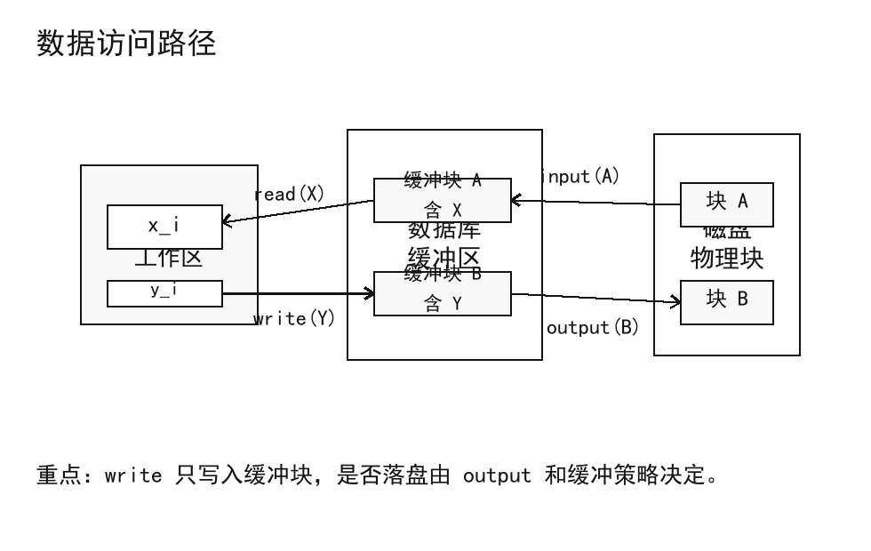
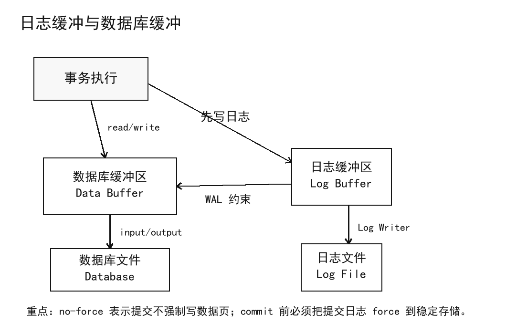
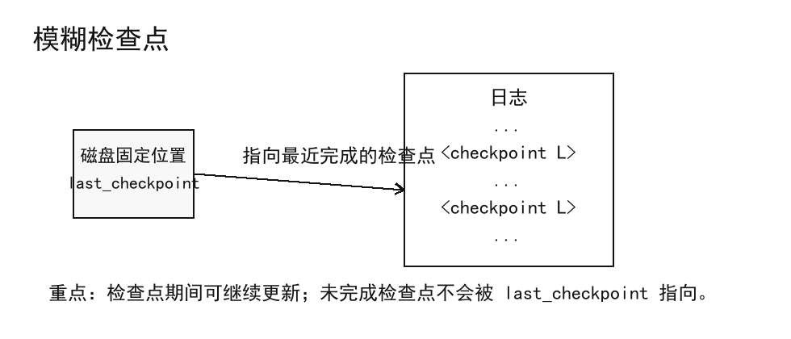
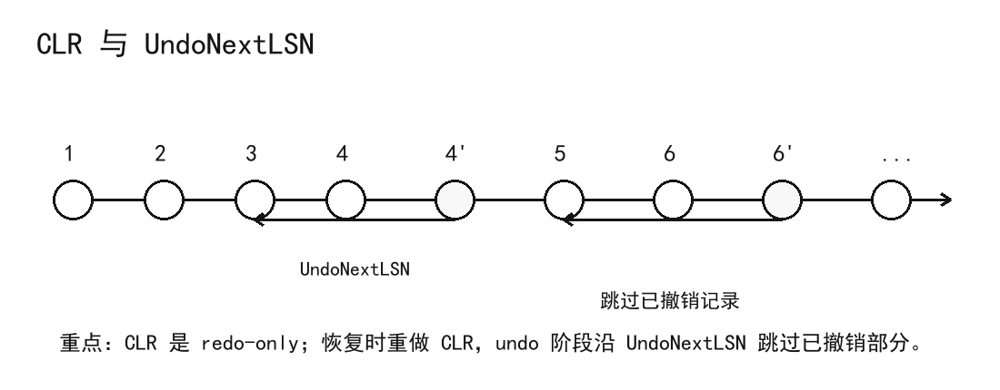
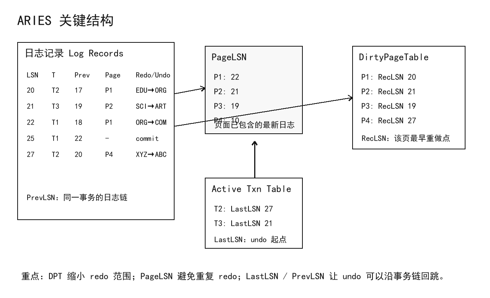
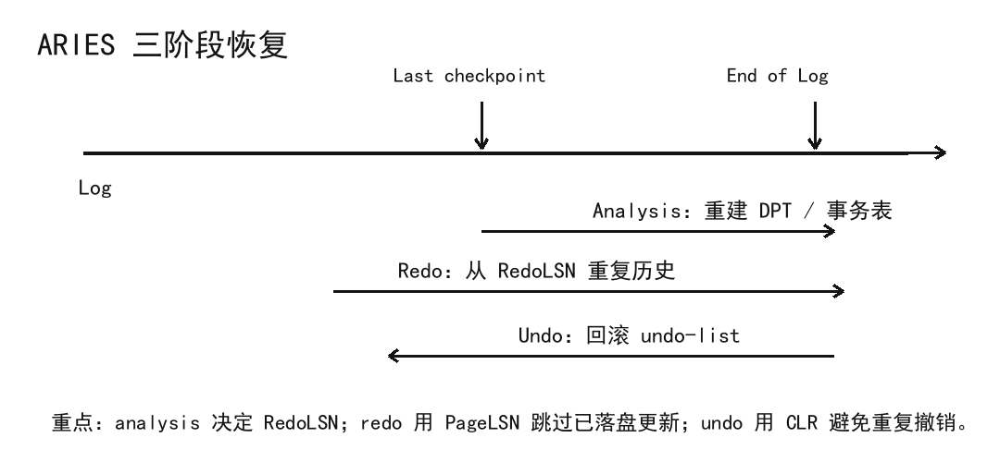

### 1. 故障基础

#### 1.1 故障分类

**恢复系统 (Recovery System)** 的目标是在故障发生后，仍然保证数据库的一致性、事务原子性和持久性。故障通常分为四类：

| 故障 | 含义 | 例子 |
| --- | --- | --- |
| 事务故障 | 单个事务无法继续执行 | 逻辑错误、输入不合法 |
| 系统错误 | 系统主动终止事务 | 死锁检测后回滚事务 |
| 系统崩溃 | DBMS、操作系统或硬件导致系统停止 | 断电、操作系统崩溃 |
| 磁盘故障 | 非易失存储的一部分被破坏 | 磁头损坏、磁盘块损坏 |

系统崩溃通常采用 **fail-stop assumption**：系统停止时，非易失存储中的内容不会被静默破坏。磁盘故障则不同，它可能破坏磁盘内容；不过磁盘通常通过校验和检测损坏，因此恢复系统可以知道哪些块可能不可用。

#### 1.2 存储结构

数据库恢复依赖不同层次的存储性质：

| 存储 | 是否跨系统崩溃保存 | 例子 |
| --- | --- | --- |
| 易失存储 | 不能保存 | 主存、CPU cache |
| 非易失存储 | 通常能保存，但自身仍可能故障 | 磁盘、磁带、闪存 |
| 稳定存储 | 理想上能抵抗所有故障 | 通过多副本近似实现 |

稳定存储不是现实中单个设备天然具有的性质，而是通过在多个独立介质上维护副本来近似实现。副本可以位于不同磁盘，甚至位于远程站点，用来抵抗火灾、洪水等灾难。

写入稳定存储时仍可能在传输过程中失败。若每个块有两个副本，可以先写第一个物理块，成功后再写第二个物理块，只有第二个写入也成功才认为输出完成。若恢复时发现两个副本不一致，则优先用校验和判断哪个副本损坏；若两者校验和都正常但内容不同，通常用第一个副本覆盖第二个副本。

#### 1.3 数据访问

磁盘上的块称为 **物理块 (Physical Block)**，主存缓冲区中的块称为 **缓冲块 (Buffer Block)**。数据库系统通过 `input(B)` 把物理块 $B$ 读入主存，通过 `output(B)` 把缓冲块 $B$ 写回磁盘。

事务并不直接操作磁盘块。每个事务 $T_i$ 有自己的私有工作区，数据项 $X$ 在事务工作区中的本地副本记为 $x_i$。`read(X)` 把缓冲块中的 $X$ 复制到 $x_i$，`write(X)` 把 $x_i$ 写回缓冲块中的 $X$。

<div align="center">  </div>

需要注意的是，`write(X)` 只说明事务把本地值写入缓冲块，不意味着对应磁盘块已经被 `output(B)` 写回磁盘。系统可以在事务提交前或提交后按缓冲管理策略写回磁盘块。

#### 1.4 恢复目标

恢复算法由两部分组成：正常执行时记录足够信息，故障后利用这些信息恢复数据库。正常执行时通常会写日志、管理缓冲区和执行检查点；故障后则根据日志决定哪些动作需要重做，哪些动作需要撤销。

恢复算法还应具有 **幂等性 (Idempotence)**：同一恢复动作执行多次，与执行一次的结果相同。系统可能在恢复过程中再次崩溃，因此幂等性是恢复算法能反复执行的关键。

后续讨论默认并发控制使用严格两阶段锁，避免事务读取未提交数据。这样恢复时不需要处理“一个事务读到另一个未提交事务结果后又继续提交”的级联问题。

### 2. 日志恢复

#### 2.1 日志记录

**日志 (Log)** 是保存在稳定存储上的记录序列，用来描述事务对数据库的修改。为了在故障后恢复原子性，系统会先把修改信息写入日志，再允许数据库本身被修改。

常见日志记录如下：

| 日志记录 | 含义 |
| --- | --- |
| `<T_i start>` | 事务 $T_i$ 开始 |
| `<T_i, X, V_1, V_2>` | $T_i$ 把 $X$ 从旧值 $V_1$ 改为新值 $V_2$ |
| `<T_i commit>` | $T_i$ 提交 |
| `<T_i abort>` | $T_i$ 回滚完成 |
| `<T_i, X, V>` | 补偿日志，表示撤销时把 $X$ 恢复为 $V$ |

更新日志同时保存旧值和新值。旧值用于 undo，新值用于 redo。

```text
<T1 start>
<T1, A, 200, 100>
<T2 start>
<T2, B, 300, 200>
<T1 commit>
```

#### 2.2 WAL 原则

**先写日志原则 (Write-Ahead Logging, WAL)** 要求：主存中的数据块写入数据库之前，与该数据块相关的日志记录必须已经写入稳定存储。

WAL 的核心是让磁盘上出现未提交更新时，系统仍有足够 undo 信息可以撤销；让事务提交后，即使数据页还没写回磁盘，也有足够 redo 信息可以重做。

事务进入提交状态的时刻，是它的 `<T_i commit>` 日志记录写入稳定存储的时刻。事务此前的所有日志记录也必须已经写入稳定存储。事务已经提交并不要求它修改过的数据块立刻写回磁盘，这一点会在缓冲策略中继续使用。

#### 2.3 修改策略

数据库修改策略主要有两类：

| 策略 | 做法 | 特点 |
| --- | --- | --- |
| 即时修改 | 未提交事务的更新可以进入缓冲区甚至磁盘 | 需要 undo 和 redo |
| 延迟修改 | 提交时才把更新写入缓冲区或磁盘 | 恢复较简单，但要保存本地更新 |

即时修改更贴近实际系统。它允许脏页在事务提交前被写回磁盘，因此恢复时必须撤销未完成事务；同时也允许提交事务的数据页在提交后才写回磁盘，因此恢复时必须重做已提交事务。

#### 2.4 undo redo

对于更新日志 `<T_i, X, V_1, V_2>`，undo 是把 $X$ 恢复为旧值 $V_1$，redo 是把 $X$ 设置为新值 $V_2$。

撤销事务 `undo(T_i)` 时，从 $T_i$ 的最后一条日志开始向前扫描，对每条更新记录恢复旧值，并写出补偿日志 `<T_i, X, V_1>`。当扫描到 `<T_i start>` 后，写出 `<T_i abort>`。

重做事务 `redo(T_i)` 时，从 $T_i$ 的第一条更新日志开始向后扫描，把每条更新的新值重新写入数据库。redo 本身不再产生普通更新日志。

补偿日志是恢复过程中很重要的记录。它描述“撤销动作已经做过”，所以若系统在回滚中再次崩溃，下一次恢复可以重做这些撤销动作，而不是重复推理整个回滚过程。

#### 2.5 故障恢复

故障后判断事务状态的规则如下：

| 日志状态 | 恢复动作 |
| --- | --- |
| 有 `<T_i start>`，但没有 `<T_i commit>` 或 `<T_i abort>` | 需要 undo |
| 有 `<T_i start>`，且有 `<T_i commit>` 或 `<T_i abort>` | 需要 redo |

这里 `abort` 事务也要 redo，是因为它的回滚动作已经写入补偿日志。恢复时重做历史，会重做原始更新，也会重做之前已经发生的撤销动作。这种策略称为 **repeating history**。

repeating history 看起来会多做一些工作，但它让恢复过程非常统一：先把数据库恢复到崩溃时的状态，再撤销崩溃时仍未完成的事务。

#### 2.6 检查点

如果每次恢复都从日志开头扫描，系统运行时间越长，恢复越慢。**检查点 (Checkpoint)** 用来缩短恢复需要处理的日志范围。

一次普通检查点包括三步：

1. 把主存中的所有日志记录写入稳定存储。
2. 把所有已修改缓冲块写回磁盘。
3. 写入 `<checkpoint L>`，其中 $L$ 是检查点时仍然活跃的事务列表。

有了检查点，恢复时从日志尾向前找到最近的 `<checkpoint L>`。只有 $L$ 中的事务，以及检查点之后开始的事务，需要继续考虑。检查点前已经提交或中止的事务，其更新已经反映到稳定数据库中，不需要再参与恢复。

对于 $L$ 中的活跃事务，undo 可能仍需要它们在检查点之前的日志。因此系统还要继续向前找到这些事务的 `<T_i start>`，更早的日志部分才可以安全清理。

#### 2.7 基本算法

基本恢复算法分为 redo 和 undo 两阶段。

redo 阶段从最近的 `<checkpoint L>` 开始，初始化 `undo-list = L`，向后扫描日志直到末尾。遇到普通更新日志就重做新值；遇到补偿日志就重做补偿值；遇到 `<T_i start>` 就把 $T_i$ 加入 `undo-list`；遇到 `<T_i commit>` 或 `<T_i abort>` 就把 $T_i$ 从 `undo-list` 删除。

undo 阶段从日志末尾向前扫描，只处理 `undo-list` 中事务的日志。遇到普通更新日志就写回旧值并写出补偿日志；遇到 `<T_i start>` 就写出 `<T_i abort>` 并把 $T_i$ 从 `undo-list` 删除。`undo-list` 为空时，恢复完成。

### 3. 缓冲检查

#### 3.1 日志缓冲

实际系统不会每产生一条日志就立即写稳定存储，而是把日志记录先放在主存日志缓冲区中。日志缓冲区满，或系统执行 **log force** 时，才批量写出。

<div align="center">  </div>

事务提交时必须执行 log force，确保该事务的所有日志记录以及提交记录已经到达稳定存储。多个事务的日志可以一起写出，这称为 **group commit**，能减少日志 I/O 次数。

日志缓冲必须遵守三个规则：日志按产生顺序写入稳定存储；事务只有在提交日志写入稳定存储后才进入提交状态；数据块写回数据库前，该块相关日志必须已写入稳定存储。

#### 3.2 数据缓冲

数据库缓冲区保存数据页。当缓冲区满时，系统要选择一个页面淘汰；如果页面已修改，则要写回磁盘。

恢复算法通常支持两种高性能策略：

| 策略 | 含义 | 恢复影响 |
| --- | --- | --- |
| no-force | 事务提交时不强制写回其修改过的数据页 | 已提交事务可能需要 redo |
| steal | 未提交事务修改过的页可以被写回磁盘 | 未完成事务可能需要 undo |

`no-force + steal` 能提升正常执行性能，但也使恢复必须同时支持 undo 和 redo。

若包含未提交更新的页面要写回磁盘，系统必须先把对应 undo 信息写入稳定日志。为了保证页面写出时没有并发修改，系统会对页面加短期排他闩锁 **latch**：先获得页面 latch，再执行 log flush，然后输出页面，最后释放 latch。

#### 3.3 双重分页

数据库缓冲区可以由数据库自己在主存中管理，也可以依赖操作系统虚拟内存。虚拟内存更灵活，但可能带来 **dual paging** 问题。

当操作系统淘汰一个被修改过的数据库缓冲页时，它可能把该页写入交换区；后来数据库想把该页写回数据库文件时，又要从交换区读回，再写到数据库文件，产生额外 I/O。

理想情况下，操作系统需要淘汰数据库缓冲页时，应把控制交给数据库，让数据库先按 WAL 刷日志，再把页写到数据库文件，并释放该页。但通用操作系统通常不直接提供这种接口。

#### 3.4 模糊检查点

普通检查点要求暂停更新并把所有脏页写回磁盘，暂停时间可能很长。**模糊检查点 (Fuzzy Checkpointing)** 允许检查点期间事务继续执行。

模糊检查点的流程是：

1. 短暂停止事务更新。
2. 写入 `<checkpoint L>` 并强制日志到稳定存储。
3. 记录当前脏页列表 $M$。
4. 允许事务继续执行。
5. 后台把 $M$ 中的脏页写回磁盘，写页时仍遵守 WAL。
6. 把该检查点位置写入磁盘固定位置 `last_checkpoint`。

恢复时从 `last_checkpoint` 指向的检查点开始扫描。未完成的检查点不会被 `last_checkpoint` 指向，因此即使检查点过程中崩溃，也不会破坏恢复正确性。

<div align="center">  </div>

这张图的关键在于 `last_checkpoint` 只指向已经完成的检查点。若系统在检查点过程中崩溃，磁盘固定位置不会提前改写，恢复仍会从更早的完整检查点开始。

#### 3.5 介质故障

前面的讨论默认非易失存储没有丢失。若磁盘损坏，需要依靠数据库备份。系统会周期性执行 **dump**，把数据库完整内容复制到稳定存储，并在日志中写入 `<dump>`。

发生磁盘故障后，恢复流程是先从最近一次 dump 恢复数据库，再根据日志重做 dump 之后已提交的事务。实际系统可以支持 **fuzzy dump** 或在线备份，使备份时仍允许事务运行，其思想与模糊检查点相似。

### 4. 远程备份

#### 4.1 接管恢复

**远程备份系统 (Remote Backup System)** 通过在远程站点维护数据库副本，提高系统可用性。即使主站点被破坏，备份站点仍能接管事务处理。

备份站点必须区分主站点故障和网络链路故障。实际系统常使用多条通信链路和心跳消息检测主站点是否存活。

当备份站点接管时，它先用自己收到的数据库副本和日志执行恢复：重做已完成事务，回滚未完成事务。接管完成后，备份站点成为新的主站点。若旧主站点之后恢复，需要从新主站点取得 redo 日志，并把缺失更新应用到本地，才能重新加入系统。

#### 4.2 热备份

为了缩短接管延迟，备份站点可以周期性处理主站点传来的 redo 日志、执行检查点，并删除更早日志。

**Hot-spare** 配置中，备份站点持续处理到达的 redo 日志，并把更新应用到本地副本。主站点故障被检测到后，备份站点只需要回滚未完成事务，就可以开始处理新的事务。

远程备份相比完全复制的分布式数据库通常更快、更便宜，但容错能力较弱，因为它主要围绕一个主站点和一个备份站点工作。

#### 4.3 持久级别

远程备份涉及事务何时可以提交的问题。提交越早，性能和可用性越好；提交越晚，持久性越强。

| 级别 | 提交条件 | 特点 |
| --- | --- | --- |
| one-safe | 提交日志写入主站点即可提交 | 快，但日志可能还没到备份站点 |
| two-very-safe | 提交日志写入主站点和备份站点才提交 | 持久性强，但任一站点故障都会阻塞提交 |
| two-safe | 两站点都活跃时按 two-very-safe；只有主站点活跃时按 one-safe | 在持久性和可用性之间折中 |

one-safe 的风险是主站点确认提交后立刻故障，而日志还没到备份站点，备份接管后可能丢失这笔事务。two-very-safe 避免这个问题，但降低可用性。two-safe 在两站点正常时避免丢失提交事务，在备份不可用时仍允许主站点继续服务。

### 5. 逻辑撤销

#### 5.1 提前解锁

严格两阶段锁让恢复更简单，但某些高并发结构需要提前释放锁，例如 B+ 树并发控制中的插入和删除。提前释放锁后，不能总是通过恢复旧物理值来撤销操作，因为其它事务可能已经在同一页面或结构上继续修改。

这时需要 **逻辑 undo (Logical Undo)**：插入操作的撤销不是恢复旧页面，而是执行对应的删除；删除操作的撤销则执行对应的插入。与之相对，普通的按旧值恢复称为 **物理 undo (Physical Undo)**。

redo 仍通常采用物理或生理方式。逻辑 redo 很复杂，因为崩溃时磁盘上的数据库状态可能不是一个完整操作边界处的状态；物理 redo 不会与提前释放锁冲突。

#### 5.2 操作日志

对逻辑操作，系统会记录操作开始、操作内部的物理更新，以及操作结束。操作结束记录中保存逻辑撤销所需的信息。

```text
<T1, O1, operation-begin>
...
<T1, X, 10, K5>
<T1, Y, 45, RID7>
<T1, O1, operation-end, (delete I9, K5, RID7)>
```

如果崩溃或回滚发生在 `operation-end` 之前，说明操作没有完成，系统使用操作内部的物理 undo 信息撤销。若已经有 `operation-end`，说明操作已经完成，系统用其中的逻辑撤销信息 $U$ 来撤销整个操作，并跳过该操作内部的物理 undo 记录。

#### 5.3 回滚规则

带逻辑 undo 的事务回滚仍然从日志尾向前扫描。遇到普通更新日志，就执行物理 undo 并写补偿日志。遇到 `<T_i, O_j, operation-end, U>`，就按 $U$ 执行逻辑 undo；逻辑 undo 过程中产生的更新像正常操作一样写日志，但最后写 `<T_i, O_j, operation-abort>`。

随后系统跳过该事务在 `operation-begin` 之前的操作内部日志，避免对同一个已完成操作既执行逻辑 undo，又重复执行物理 undo。

如果扫描时遇到 `operation-abort`，说明该操作已经被撤销过，也应跳过到对应的 `operation-begin`。这能处理“回滚过程中再次崩溃”的情况，防止同一逻辑操作被撤销多次。

### 6. ARIES

#### 6.1 基本思想

**ARIES** 是经典的恢复算法。前面介绍的基本算法可以看作 ARIES 的简化版，而 ARIES 加入了许多优化，用来降低正常执行开销并加快恢复。

ARIES 的核心特征包括：

| 机制 | 作用 |
| --- | --- |
| LSN | 给每条日志记录一个递增编号 |
| PageLSN | 记录页面上已经反映到哪条日志 |
| DirtyPageTable | 记录可能需要 redo 的脏页 |
| CLR | 记录 undo 动作，避免重复撤销 |
| physiological redo | 物理定位页面，在页面内部按逻辑动作重做 |
| fuzzy checkpoint | 检查点只记录状态，不强制写出所有脏页 |

#### 6.2 LSN 与页面

**LSN (Log Sequence Number)** 是日志记录的唯一递增编号，通常可以看作日志文件中的偏移量。每个数据页保存一个 **PageLSN**，表示该页已经包含了哪条日志记录的效果。

更新页面时，系统先对页面加排他 latch，写日志记录，再修改页面，并把该日志记录的 LSN 写入页面的 PageLSN，最后释放 latch。

页面写回磁盘前要获得共享 latch，使页面状态在写出期间保持一致。恢复时若磁盘页的 PageLSN 已经大于等于某条日志的 LSN，就说明该日志效果已经反映在页面上，不需要重复 redo。这正是 ARIES 保证 redo 幂等的重要依据。

ARIES 常使用 **生理重做 (Physiological Redo)**：日志会物理标识受影响的页面，但页面内部的动作可以是逻辑描述。例如删除页面中的一条记录时，不必记录整个页面移动前后的物理值，只要记录“在某页删除某记录”的动作即可。这样能减少日志量，但要求页面写出具有原子性；若页面半写入失败，通常要靠校验和检测，并按介质故障处理。

#### 6.3 日志结构

ARIES 的普通日志记录包含事务号、PrevLSN、redo 信息和 undo 信息。PrevLSN 指向同一事务的上一条日志记录，使 undo 可以沿事务日志链向前跳转。

**CLR (Compensation Log Record)** 是 redo-only 日志，记录恢复或回滚中已经执行过的撤销动作。CLR 不需要再被 undo。CLR 中的 `UndoNextLSN` 指向下一条仍需撤销的日志记录，中间日志说明已经撤销过，可以跳过。

<div align="center">  </div>

这个跳转机制支持部分回滚。事务可以先回滚一部分操作以释放死锁需要的锁，之后继续执行；若后来完整回滚，ARIES 可以跳过已经撤销过的部分。

#### 6.4 脏页表

**DirtyPageTable** 记录缓冲区中被修改但可能尚未写回磁盘的页面。每个脏页记录两个重要值：

| 字段 | 含义 |
| --- | --- |
| PageLSN | 页面当前反映的最后一条日志 |
| RecLSN | 使该页变脏的最早日志位置 |

当一个干净页第一次被更新并加入 DirtyPageTable 时，RecLSN 设置为当前日志末尾附近的 LSN。恢复时，小于该页 RecLSN 的日志不需要为该页 redo，因为它们已经反映在磁盘版本上。

ARIES 的检查点日志记录保存 DirtyPageTable 和活跃事务表。对每个活跃事务，检查点还保存该事务的 LastLSN。检查点时不要求写出脏页，脏页可以由后台持续刷盘，因此检查点开销很低，可以更频繁执行。

<div align="center">  </div>

这几个结构配合起来减少恢复工作量：DirtyPageTable 让 redo 不必从日志开头开始；PageLSN 让已经反映到磁盘页上的更新不会被重复执行；Active Txn Table 中的 LastLSN 则给 undo 阶段提供每个未完成事务的回跳起点。

#### 6.5 三阶段恢复

ARIES 恢复包含 analysis、redo 和 undo 三个阶段。

<div align="center">  </div>

analysis 阶段从最近完成的检查点开始，重建崩溃时的 DirtyPageTable 和活跃事务表。它计算 `RedoLSN`，即 redo 阶段应从哪里开始；通常取 DirtyPageTable 中所有 RecLSN 的最小值。analysis 结束时，活跃事务表中的事务就是需要 undo 的事务。

redo 阶段从 `RedoLSN` 向前扫描日志，重复历史。遇到更新日志时，先检查该页是否在 DirtyPageTable 中，以及日志 LSN 是否不小于该页 RecLSN；若不满足，直接跳过，甚至不需要读取页面。若需要进一步判断，则取出磁盘页，只有当 PageLSN 小于日志 LSN 时才真正 redo。

undo 阶段回滚所有未完成事务。每个待撤销事务维护一个下一条要撤销的 LSN。每次选择其中最大的 LSN 处理，以便按日志逆序撤销。普通日志撤销后，下一个位置变为 PrevLSN；CLR 则根据 UndoNextLSN 跳转，跳过已经撤销过的日志。

#### 6.6 其它特性

ARIES 支持 **recovery independence**，即页面可以相对独立地恢复。例如某些磁盘页损坏时，可以只从备份中恢复这些页，而其它页面继续可用。

ARIES 还支持保存点 **savepoint**。事务可以回滚到某个保存点，而不是必须整体回滚；这对复杂事务很有用，也可用于死锁处理时只回滚足够释放锁的一部分操作。

在优化方面，DirtyPageTable 可以帮助 redo 阶段预取页面；redo 也不一定严格按页面到达顺序执行，若某页正在从磁盘读取，可以先处理其它日志，等页面到达后再补做该页的 redo。
