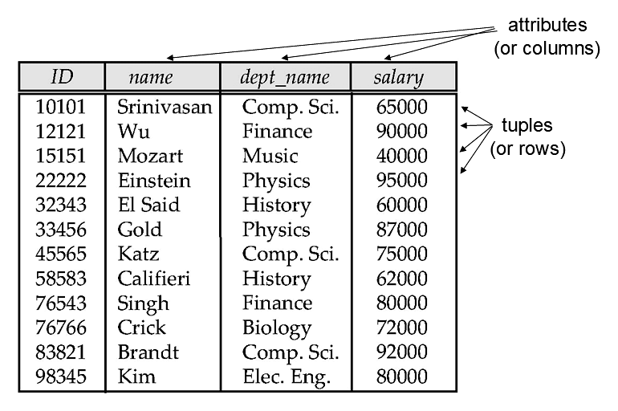
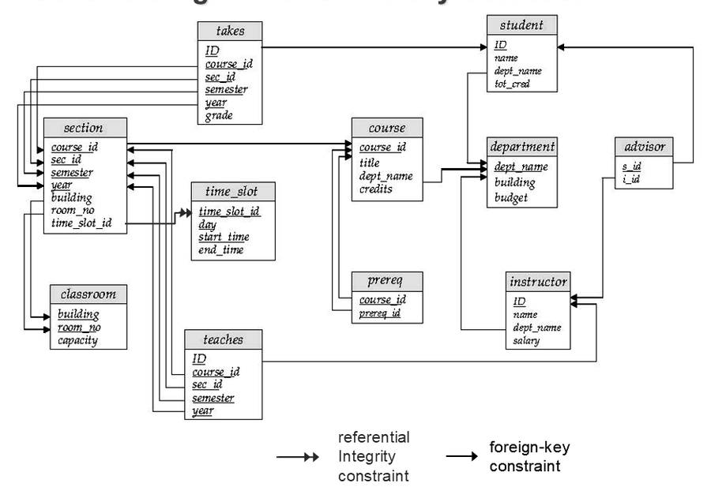
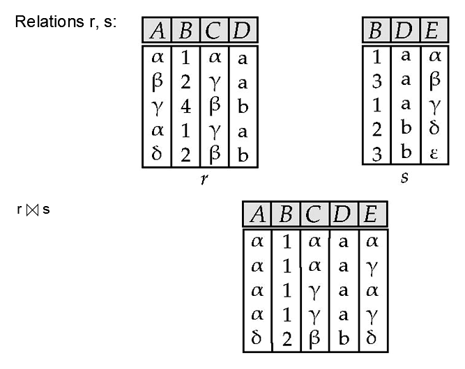
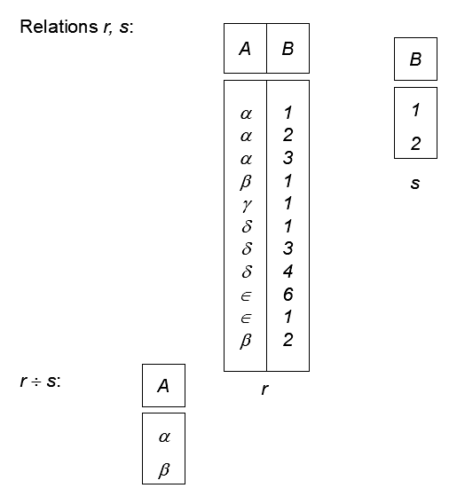
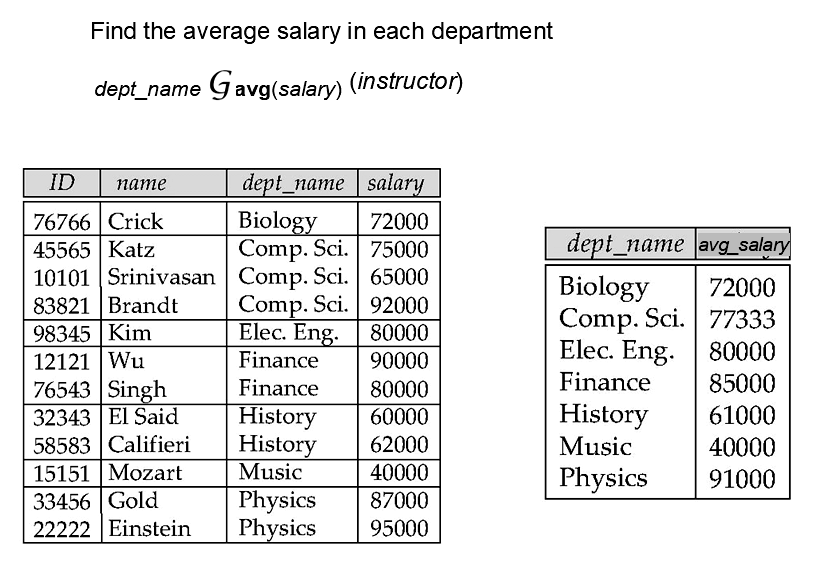

### 1. 关系结构

#### 1.1 关系定义

**关系模型 (Relational Model)** 用关系表示数据。关系在直观上就是一张表，表中的列是属性，表中的行是元组。

形式化地，若 $D_1,D_2,\cdots,D_n$ 是若干域，则关系 $r$ 是这些域的笛卡尔积的一个子集：

$$
r\subseteq D_1\times D_2\times\cdots\times D_n
$$

因此，关系中的每个元素都是一个 $n$ 元组：

$$
(a_1,a_2,\cdots,a_n),\quad a_i\in D_i
$$

例如 `instructor` 可以由 `ID`、`name`、`dept_name`、`salary` 等属性组成；每一行对应一位教师的记录。

<div align="center">  </div>

#### 1.2 模式实例

**关系模式 (Relation Schema)** 描述关系的结构。

若属性为 $A_1,A_2,\cdots,A_n$，关系模式可写为 $R=(A_1,A_2,\cdots,A_n)$。

在具体数据库中，常把关系名和属性列表写在一起，例如：

```SQL
instructor(ID, name, dept_name, salary)
```

**关系实例 (Relation Instance)** 是某一时刻关系中实际包含的元组集合。

如果关系实例定义在模式 $R$ 上，通常记为 $r(R)$。

模式相对稳定，实例会随插入、删除和更新变化。类似地，**数据库模式 (Database Schema)** 是整个数据库的逻辑结构，**数据库实例 (Database Instance)** 是某一时刻数据库中的实际内容。

#### 1.3 域与空值

**域 (Domain)** 是某个属性允许出现的值集合。例如 `salary` 的域可以是合法工资数值集合，`dept_name` 的域可以是合法院系名称集合。

经典关系模型要求属性值是 **原子值 (Atomic Value)**，也就是不可再分的单个值。这一要求使得关系操作可以把每个属性当作单独的比较和投影单位。

>[!Note] **Note**
>现代数据库中可以使用数组、JSON、嵌套记录等复杂类型，但在关系模型的基本理论中，通常先假定属性值是原子的。

`null` 是一个特殊值，可出现在任意域中，用于表示未知、不存在或尚未填写。它会让比较、连接和聚集的语义变复杂，因此后续需要三值逻辑来处理。

#### 1.4 无序性质

关系是元组的集合，因此元组顺序没有语义。数据库可以按任意物理顺序存储元组，查询结果如果没有显式 `order by`，也不应该依赖某种固定顺序。

属性通常也通过名称引用，而不是通过位置引用。实际 SQL 表虽然有列顺序，但查询语义主要依赖属性名。

### 2. 键与约束

#### 2.1 超键候选键

**超键 (Superkey)** 是能够唯一标识关系中元组的一组属性。

设 $K\subseteq R$。

若任意两个元组在 $K$ 上取值相同就必然是同一个元组，则 $K$ 是 $R$ 的超键：

$$
t_1[K]=t_2[K]\Rightarrow t_1=t_2
$$

超键不要求最小。例如在 `instructor` 中，`ID` 可以唯一标识教师，那么 `{ID, name}` 也能唯一标识教师，但它包含了多余属性。

**候选键 (Candidate Key)** 是最小的超键。最小的意思是不能再删去任何属性，否则就不再能唯一标识元组。

**主键 (Primary Key)** 是从候选键中选出的一个键，用作关系中元组的主要标识。主键应该稳定、简洁，并且不应为空。

#### 2.2 外键约束

**外键 (Foreign Key)** 描述两个关系之间的引用关系。

若关系 $r_1$ 的属性 $A$ 引用关系 $r_2$ 的主键 $B$，则引用值必须能在被引用关系中找到。

更具体地说，$r_1$ 中每个非空 $A$ 值都应出现在 $r_2$ 的 $B$ 中。

这个约束可以写成：

$$
\forall t_1\in r_1,\ \exists t_2\in r_2,\ t_1[A]=t_2[B]
$$

其中 $r_1$ 称为 **引用关系 (Referencing Relation)**。

其中 $r_2$ 称为 **被引用关系 (Referenced Relation)**。

**参照完整性 (Referential Integrity)** 要求引用不能指向不存在的元组。例如 `teaches.ID` 引用 `instructor.ID` 时，任意授课记录中的教师编号都必须能在教师关系中找到。

#### 2.3 模式图

模式图把关系、主键、外键和参照完整性画在一起，便于理解整个数据库的结构。大学数据库中，`student`、`instructor`、`course`、`section`、`takes`、`teaches` 等关系通过主键和外键连接起来。

<div align="center">  </div>

图中下划线属性表示主键。箭头从引用关系指向被引用关系，表示外键和参照完整性约束。

### 3. 基本代数

#### 3.1 查询语言

关系查询语言可以分为 **过程式 (Procedural)** 和 **非过程式 (Non-Procedural)**。关系代数属于过程式语言，因为它不仅说明要什么结果，也说明通过哪些操作一步步得到结果。

三类经典纯查询语言是：

| 语言 | 特点 |
| --- | --- |
| 关系代数 | 用操作组合表达查询过程 |
| 元组关系演算 | 用元组变量和谓词描述结果 |
| 域关系演算 | 用属性域变量和谓词描述结果 |

这三类语言在表达能力上等价。它们不是图灵完备语言，而是专门用于表达关系查询。

#### 3.2 六个基本操作

**关系代数 (Relational Algebra)** 的操作以关系为输入，并产生新的关系作为输出。六个基本操作如下：

| 操作 | 记号 | 含义 |
| --- | --- | --- |
| 选择 | $\sigma$ | 保留满足谓词的行 |
| 投影 | $\Pi$ | 保留指定属性并去重 |
| 并 | $\cup$ | 合并两个兼容关系 |
| 差 | $-$ | 保留只在左侧出现的元组 |
| 笛卡尔积 | $\times$ | 两个关系的元组两两拼接 |
| 重命名 | $\rho$ | 给关系或属性改名 |

选择操作保留满足谓词 $P$ 的元组：

$$
\sigma_P(r)=\{t\mid t\in r\land P(t)\}
$$

投影操作保留指定属性。由于关系是集合，投影后产生的重复元组会被去除：

$$
\Pi_{A_1,A_2,\cdots,A_k}(r)
$$

并、差要求两个输入关系 **兼容 (Compatible)**：属性个数相同，并且对应属性的域兼容。

笛卡尔积把两个关系中的元组两两拼接，若 $r$ 和 $s$ 的属性名冲突，需要先重命名：

$$
r\times s=\{tq\mid t\in r\land q\in s\}
$$

重命名用于给中间结果命名，或在同一个关系参与多次运算时区分副本：

$$
\rho_x(E)
$$

#### 3.3 组合查询

关系代数表达式可以嵌套组合。例如查询物理系教师讲授过的课程编号，可以先选择物理系教师，再与 `teaches` 做连接条件筛选，最后投影所需属性。

一种写法是先做笛卡尔积，再用选择表达连接条件：

$$
\Pi_{\text{instructor.name},\text{course_id}}(\sigma_{\text{dept_name}=\text{"Physics"}\land \text{instructor.ID}=\text{teaches.ID}}(\text{instructor}\times \text{teaches}))
$$

也可以先把 `instructor` 中物理系教师过滤出来，再与 `teaches` 组合。后者通常中间结果更小：

$$
\Pi_{\text{instructor.name},\text{course_id}}(\sigma_{\text{instructor.ID}=\text{teaches.ID}}(\sigma_{\text{dept_name}=\text{"Physics"}}(\text{instructor})\times \text{teaches}))
$$

查询大学中最高工资也可以只用基本操作表达。先找出所有不是最高工资的工资值：

$$
\Pi_{\text{instructor.salary}}(\sigma_{\text{instructor.salary}<\text{d.salary}}(\text{instructor}\times\rho_d(\text{instructor})))
$$

再用所有工资减去这些非最高工资，得到最高工资：

$$
\Pi_{\text{salary}}(\text{instructor})-\Pi_{\text{instructor.salary}}(\sigma_{\text{instructor.salary}<\text{d.salary}}(\text{instructor}\times\rho_d(\text{instructor})))
$$

#### 3.4 形式定义

关系代数的基本表达式可以是数据库中的一个关系，也可以是一个常量关系。

若 $E_1$ 和 $E_2$ 是关系代数表达式，则以下表达式仍然是关系代数表达式：

| 类型 | 表达式 |
| --- | --- |
| 集合操作 | $E_1\cup E_2$ |
| 集合差 | $E_1-E_2$ |
| 笛卡尔积 | $E_1\times E_2$ |
| 选择 | $\sigma_P(E_1)$ |
| 投影 | $\Pi_S(E_1)$ |
| 重命名 | $\rho_x(E_1)$ |

这个封闭性很重要：每一步操作的结果仍是关系，因此可以继续作为下一步操作的输入。

### 4. 扩展运算

#### 4.1 交与连接

扩展运算不会增加关系代数的表达能力，但能让常见查询更简洁。

**交 (Set Intersection)** 保留两个关系中都出现的元组：

$$
r\cap s=\{t\mid t\in r\land t\in s\}
$$

交可以用差表示：

$$
r\cap s=r-(r-s)
$$

**自然连接 (Natural Join)** 会在两个关系的同名属性上做相等匹配，并且同名属性只保留一份。

<div align="center">  </div>

设 $r(R)$ 和 $s(S)$ 是两个关系，自然连接的结果模式是 $R\cup S$。

如果 $R=(A,B,C,D)$，且 $S=(E,B,D)$。

则公共属性是 $B$ 和 $D$。

自然连接可以写成：

$$
r\bowtie s=\Pi_{r.A,r.B,r.C,r.D,s.E}(\sigma_{r.B=s.B\land r.D=s.D}(r\times s))
$$

**条件连接 (Theta Join)** 把笛卡尔积和选择合并成一个操作：

$$
r\bowtie_{\theta}s=\sigma_{\theta}(r\times s)
$$

自然连接满足交换律和结合律。若忽略属性显示顺序，$r\bowtie s$ 与 $s\bowtie r$ 等价。

#### 4.2 外连接

普通连接只保留匹配成功的元组，未匹配的元组会丢失。**外连接 (Outer Join)** 在连接结果之外，把某一侧或两侧未匹配的元组补回，并用 `null` 填充缺失属性。

| 类型 | 记号 | 保留内容 |
| --- | --- | --- |
| 左外连接 | $r\mathbin{\text{⟕}}s$ | 保留左侧所有元组 |
| 右外连接 | $r\mathbin{\text{⟖}}s$ | 保留右侧所有元组 |
| 全外连接 | $r\mathbin{\text{⟗}}s$ | 保留两侧所有元组 |

左外连接可以理解为自然连接结果加上左侧未匹配元组：

$$
r\mathbin{\text{⟕}}s=(r\bowtie s)\cup((r-\Pi_R(r\bowtie s))\times\{(\text{null},\cdots,\text{null})\})
$$

右外连接对称地补回右侧未匹配元组：

$$
r\mathbin{\text{⟖}}s=(r\bowtie s)\cup(\{(\text{null},\cdots,\text{null})\}\times(s-\Pi_S(r\bowtie s)))
$$

全外连接同时保留两侧未匹配元组：

$$
r\mathbin{\text{⟗}}s=(r\mathbin{\text{⟕}}s)\cup(r\mathbin{\text{⟖}}s)
$$

#### 4.3 半连接

**半连接 (Semijoin)** 只保留左侧中至少能在右侧找到匹配的元组，不把右侧属性拼接进结果。

半连接可以由条件连接和投影定义：

$$
r\ltimes_{\theta}s=\Pi_R(r\bowtie_{\theta}s)
$$

例如相关子查询中的 `exists` 常可改写为半连接。查询 2022 年授课教师姓名可表示为：

$$
\Pi_{\text{name}}(\text{instructor}\ltimes_{\text{instructor.ID}=\text{teaches.ID}}\sigma_{\text{teaches.year}=2022}(\text{teaches}))
$$

半连接的重点是“判断存在匹配”，而不是把两侧属性完整拼接出来。

#### 4.4 空值逻辑

涉及 `null` 的比较不会得到普通的 true 或 false，而会得到 **unknown**。SQL 因此采用三值逻辑。

| 表达式 | 结果 |
| --- | --- |
| `unknown or true` | true |
| `unknown or false` | unknown |
| `unknown and true` | unknown |
| `unknown and false` | false |
| `not unknown` | unknown |

在 `where` 条件中，结果为 unknown 的元组不会被选中。若要判断谓词本身是否为 unknown，可以使用 `is unknown`。

#### 4.5 赋值除法

**赋值 (Assignment)** 用于把复杂查询拆成多个临时关系。它不增加表达能力，但能让推导更清晰。

**除法 (Division)** 用于表达“对所有”的查询。

给定 $r(R)$ 和 $s(S)$，并且 $S\subset R$。

$r\div s$ 是最大的关系 $t(R-S)$，使得：

$$
t\times s\subseteq r
$$

换句话说，结果中的每个 $t$ 都必须能和 $s$ 中每个元组组合，并且组合结果都出现在 $r$ 中。

<div align="center">  </div>

例如设 $r(\text{ID},\text{course_id})$ 表示学生选过的课程。

设 $s(\text{course_id})$ 表示生物系开设的所有课程。

则 $r\div s$ 得到选过所有生物系课程的学生。

除法可用基本操作表示。先取所有可能的左侧候选：

$$
\text{temp}_1\leftarrow \Pi_{R-S}(r)
$$

再找出那些缺少某个 $s$ 元组匹配的候选：

$$
\text{temp}_2\leftarrow \Pi_{R-S}((\text{temp}_1\times s)-\Pi_{R-S,S}(r))
$$

最后从候选中删去不合格者：

$$
r\div s=\text{temp}_1-\text{temp}_2
$$

### 5. SQL 语义

#### 5.1 广义投影

**广义投影 (Generalized Projection)** 允许在投影列表中使用算术表达式，而不仅是属性名：

$$
\Pi_{F_1,F_2,\cdots,F_n}(E)
$$

其中 $F_i$ 可以由常量和 $E$ 中的属性组成。

例如 `salary` 表示年薪时，可以投影出月薪：

$$
\Pi_{\text{ID},\text{name},\text{dept_name},\text{salary}/12}(\text{instructor})
$$

#### 5.2 聚集操作

**聚集函数 (Aggregate Function)** 接收一组值并返回一个值。常见聚集函数包括 `avg`、`min`、`max`、`sum` 和 `count`。

聚集操作的一般形式是：

$$
_{G_1,G_2,\cdots,G_n}\mathcal{G}_{F_1(A_1),F_2(A_2),\cdots,F_m(A_m)}(E)
$$

其中 $G_1,G_2,\cdots,G_n$ 是分组属性，可以为空。

其中 $F_i(A_i)$ 表示对属性 $A_i$ 使用聚集函数 $F_i$。

<div align="center">  </div>

按院系求平均工资可以写成：

$$
_{\text{dept_name}}\mathcal{G}_{\text{avg}(\text{salary})}(\text{instructor})
$$

聚集结果默认没有属性名，实际使用时常通过重命名给它命名：

$$
_{\text{dept_name}}\mathcal{G}_{\text{avg}(\text{salary})\ \text{as}\ \text{avg_sal}}(\text{instructor})
$$

#### 5.3 数据修改

数据库内容可以通过删除、插入和更新修改。这些操作也能用赋值思想表达。

| 操作 | 关系代数表达 |
| --- | --- |
| 删除满足 $P$ 的元组 | $r\leftarrow r-\sigma_P(r)$ |
| 插入关系 $E$ 的结果 | $r\leftarrow r\cup E$ |
| 更新属性值 | 删除旧元组后插入新元组 |

关系代数本身主要用于查询表达；数据修改语句需要额外考虑约束检查、触发器、并发控制和日志恢复。

#### 5.4 多重集语义

纯关系代数使用集合语义，会自动去除重复元组。SQL 默认使用 **多重集 (Multiset)** 语义，除非显式使用 `distinct`，否则会保留重复行。

多重集语义下，设元组 $t$ 在 $r$ 中出现 $m$ 次。

再设同一元组在 $s$ 中出现 $n$ 次。

集合操作的重复次数如下：

| 操作 | 重复次数 |
| --- | --- |
| 并 | $m+n$ |
| 交 | $\min(m,n)$ |
| 差 | $\max(0,m-n)$ |

选择操作保留输入中的重复次数，只要元组满足谓词。

投影操作对每个输入元组产生一个输出元组，因此可能保留重复投影结果。

笛卡尔积中，若左侧元组出现 $m$ 次、右侧元组出现 $n$ 次，拼接结果出现 $mn$ 次。

#### 5.5 SQL 对应

不含聚集的 SQL 查询可以看作选择、投影和笛卡尔积的组合：

```SQL
select A1, A2, ..., An
from r1, r2, ..., rm
where P;
```

它对应的多重集关系代数表达式是：

$$
\Pi_{A_1,A_2,\cdots,A_n}(\sigma_P(r_1\times r_2\times\cdots\times r_m))
$$

带分组聚集的 SQL 查询可以先做笛卡尔积和选择，再按分组属性聚集：

```SQL
select A1, A2, sum(A3)
from r1, r2, ..., rm
where P
group by A1, A2;
```

它对应的关系代数表达式是：

$$
_{A_1,A_2}\mathcal{G}_{\text{sum}(A_3)}(\sigma_P(r_1\times r_2\times\cdots\times r_m))
$$

如果 `select` 中只输出部分分组属性，则可先按完整 `group by` 属性聚集，再对最终结果投影。
