### 1. 数据库设计

#### 1.1 设计四阶段

- **需求说明 (Requirement Specification)**：与用户沟通了解系统需要存储哪些信息；
- **概念设计 (Conceptual Design)**：将抽象的需求转化为结构化的概念模型，如 ER 图；
- **逻辑设计 (Logical Design)**：将概念模型映射到具体的数据库实现模型上；
- **物理设计 (Physical Design)**：关注数据库在底层的物理布局、存储结构等物理模式。

#### 1.2 设计陷阱

- **避免冗余 (Redundancy)**：糟糕的设计会导致信息在多个地方重复存储，极易引发数据更新时的不一致。例如，不合理设计可能每次记录学生选课时都重复存储学生所属学院；
- **避免不完整 (Incompleteness)**：糟糕的设计会使应用某些特定层面的建模变得困难甚至无法实现 。例如，学校需要记录部分学生的双学位信息，但如果系统设计硬性规定一个学生只能对应一条专业记录，这就导致了数据模型的不完整 。

> [!Note] **Note**
> 
> 仅仅避免糟糕的设计是不够的，数据库设计面临着一个巨大的设计空间，我们必须从大量切实可行的优秀设计方案中，根据业务场景挑选出最合适的一个 。

### 2. ER 模型基础

#### 2.1 基本组成

- **实体 (Entity)**：现实世界中客观存在且可以与其他对象相互区分的对象；
- **实体集 (Entity Set)**：是一系列具有相同属性的实体构成的集合；
- **联系 (Relationship)** ：用于描述多个实体之间的关联；
- **联系集 (Relationship set)** ：是多个实体之间的关联的集合，每个实体均取自相应的实体集： $\{(e_1,e_2,\cdots,e_n)|e_1\in E_1,e_2\in E_2,\cdots,e_n\in E_n\}$ 每一个元组就是一个联系；
- **属性 (Attributes)**：实体所具备的各种具体特征，实体是由属性描述的，联系中也可以包含属性。例如 `student` 和 `instructor` 的联系 `advisor` 可以含有属性结对日期。

ER 图是实体和实体间关系的集合。在图形化建模 ER 图时，使用矩形表示实体集，实体的属性直接列在矩形内部，其中主键必须带有下划线，用菱形表示多个实体之间的相互关联。
#### 2.2 角色

参与同一个联系的实体集 **不必是互不相同的**。下图 `course_id` 和 `prereq_id` 都是角色。
* 实体集在联系中每一次出现都扮演某种特定的**角色 (Role)**。

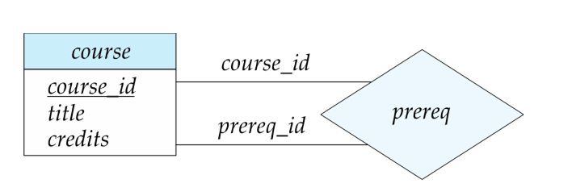

#### 2.3 联系集的度

**二元联系 (binary relationship)**：两个实体集。大部分数据库系统的联系集都是二元的，在实际设计联系的时候 **尽量不要使用多元联系**。联系集的度即涉及实体集的数量，下图是三元联系的例子。

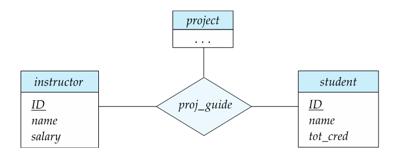

#### 2.4 属性

* **简单属性 (simple attributes)**：不可再分的基本属性；
* **复合属性 (composite attributes)**：可拆分为更小的子属性，如 `name` 可以拆分；
* **单值属性 (single-valued attributes)**：对于一个实体，该属性最多只有一个值；
* **多值属性 (multivalued attributes)**：一个实体可以对应多个值，如 `phonenumber`；
* **派生属性 (derived attributes)**：可从其他属性计算或推导出来无需直接存储，如`age`。

>[!Note] **Note**
>1. 一些数据库并不支持符合属性，一般通过将层次结构 **打散平面化** 进行存储，但是这样做可能导致语义上的变化或不清晰；
>2. 多值属性可以通过字符串拼接实现，但是这样并不符合数据库的初衷，一般需要单独取出多值属性，**用关系模式来实现** 。

#### 2.5 映射基数约束

**一对一**： $A$ 中的一个实体最多与 $B$ 中的一个实体关联，反之亦然。

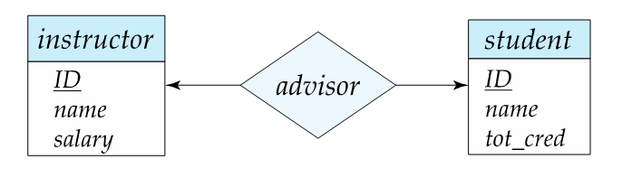

**一对多**：$A$ 中的实体可关联 $B$ 中多个实体，但 $B$ 中实体最多关联 $A$ 中一个实体。

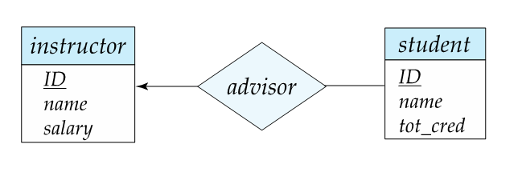

**多对一**：多个 $A$ 中实体可关联到 $B$ 中一个实体，$B$ 中实体可关联多个 $A$ 中实体。

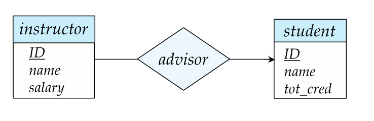

**多对多**：$A$ 和 $B$ 中的实体都可以与对方的多个实体相关联。

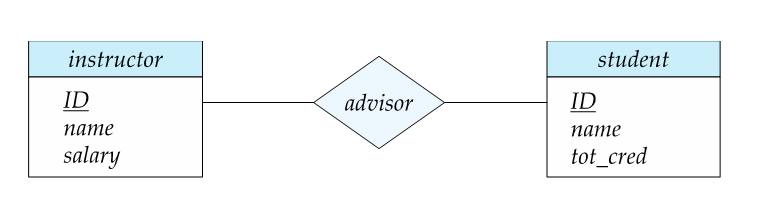

#### 2.6 实体参与度

- **全部参与 (Total Participation)**：实体集中的每个实体都必须参与到关系集中，在 ER 图中用 **双线** 表示。例如规定每个学生必须有导师，学生实体在 `advisor` 关系中是全部参与；
- **部分参与 (Partial Participation)**：允许实体集中的某些实体不参与任何关系，在 ER 图中用 **单线** 表示。例如并非所有教师都担任导师，教师实体在 `advisor` 关系中是部分参与。

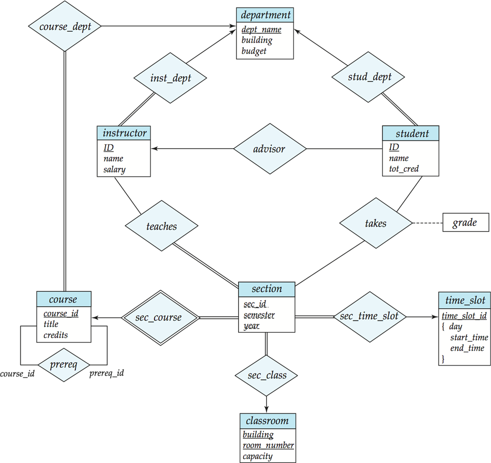


>[!Note] **ER 图几何表示整理**
>
>1. **箭头** ：表示映射基数约束中“一”的一侧，没有表示“多”的一侧；
>2. **单线** ：两侧实体均可只出现在部分联系中，即部分参与；
>3. **双线** ：该侧实体必须至少出现一个联系中，即完全参与；
>4. **花括号** ：将多个属性括在一起，表示这些属性共同构成一个复合属性；
>5. **双线联系集**：联系集两端的所有实体都必须至少参与一次该联系，连接强弱实体。

>[!Note] **多元基数约束**
>
>允许在三元或更高阶关系上最多画出一个箭头表示基数约束，但是为了避免混淆，在二元以上关系中 **禁止出现多于一个箭头**，下面是一个混淆的例子：
>
>假设有一个三元关系 `项目(学生,项目,课程)` 如果既标注了 `项目` 指向 `学生` 又标注了 `项目` 指向 `课程` 就会产生两种解释：
>1. 组合约束：给定一个学生和一门课程，只能对应一个项目；
>2. 独立约束：一个学生只能选一个项目，一门课程只能有一个项目。
#### 2.7 复杂约束表示

可以在 ER 图的关系线上使用 `l..h` 的形式来精确标出最小和最大关联基数。

例如：如果线上标有 `0..*`，表示该教师可以指导0个或不限数量的多个学生，如果线上标有 `1..1`，表示该学生必须拥有且只能拥有1位导师 。
### 3. 键与弱实体

#### 3.1 主键的定义

**主键 (Primary Key)** 提供了一种区分实体和关系的绝对唯一方法 。
1. **实体集主键**：实体中某组属性的值必须能唯一标识该实体，即同一个实体集内，绝不允许两个实体拥有完全相同的主键值；
2. **关系集主键**：其主键的构成取决于参与实体的映射基数类型，对于多对多关系，主键通常是两端参与实体主键的组合：
	* **多对多**：两个实体集的主键的并集是一个最小超键，被选作主键；
	* **一对多**：“多”的那一侧实体集的主键是一个最小超键，被用作主键；
	* **多对一**：“多”的那一侧实体集的主键是一个最小超键，被用作主键；
	* **一对一**：两个参与实体集中任意一个的主键都能构成一个最小超键。
#### 3.2 弱实体集

**弱实体集 (Weak Entity Set)**：没有足够的属性来形成主键，依附于其他实体的实体集。

- 弱实体必须依赖于 **标识实体集 (Identifying Entity Set)** 及其之间的标识关系而存在 。在其内部，需使用 **分辨符 (Discriminator)** 进行相互区分；
- **弱实体主键** 由标识实体集的主键加上弱实体集自身的分辨符共同构成 。例如，`section` 是弱实体，它的主键是强实体课程的 `course_id` 加上自身的分辨符 `sec_id` 等属性；
- 强实体集的主键 **不会显式存储** 在弱实体集中，因为它已经隐含在标识性联系之中了。

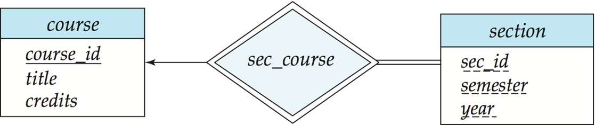

在 ER 图中多对多一定要转换成关系模式，一对多可以不转换成关系模式，将箭头所指的 primary key 加到另一侧即可。
### 4. 模式转换

#### 4.1 实体与关系

- **强实体集**：直接转换为具有相同属性的同名关系模式。例如，`course` 实体直接转换为表 `course(course_id, title, credits)`；
- **弱实体集**：转换为一个新模式，除了包含自身属性外，还必须引入标识强实体的主键列作为外键。例如，`section` 转换为表 `section(course_id, sec_id, semester, year)`；
- **关系集**：多对多关系被表示为一个独立模式，其列由参与实体的两端主键及关系自身的描述属性构成。例如，导师关系转为表 `advisor(s_id, i_id)`。关系转换见 3.1 小节。
#### 4.2 特殊属性

- **复合属性处理**：将复合属性内部的每个组件展开为独立的列 。例如，实体若带有 `name` 属性（`name` 内含 `first_name` 和 `last_name`），在建表时会生成 `name_first_name` 和 `name_last_name` 两个字段来替代原来的 `name`；
- **多值属性处理**：为该多值属性建立一张单独的新表，包含原实体主键和多值属性本身。例如，针对教师的多个电话号码，创建新表 `inst_phone(ID, phone_number)`。若主键为 `001` 的教师有两个号码，该表会插入两条对应的独立记录 。

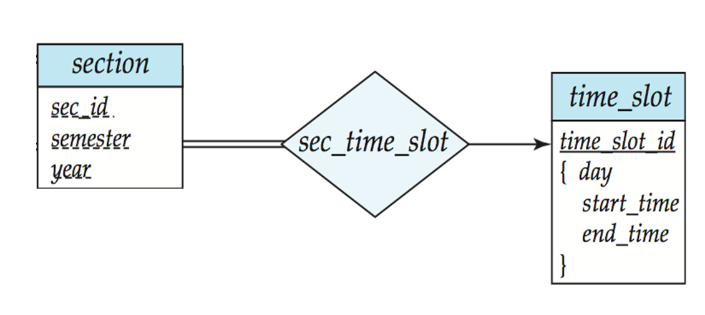

对于上图中的多值属性 `time_slot_id` 有两种处理方式：
```SQL
-- Definition 1
time_slot(time_slot_id)
time_slot_detail(time_slot_id,day,start_time,end_time)
-- Definition 2
time_slot(time_slot_id,day,start_time,end_time)
```
* 第一种定义方式造成了 `time_slot_id` 的 **数据冗余**，但是表 `time_slot` 有助于实现 foreign key 完整性约束条件；
* 第二种定义优化后去除了冗余，但是 **不能** 将 `section` 表中的 `time_slot_id` 属性作为 foreign key 使用（因为多值导致 `time_slot_id` 不能唯一确定 `time_slot`）。
### 5. 设计问题

#### 5.1 设计误区

1. 在 ER 图中外键 **不应** 出现在实体集的属性中，而体现在联系集中；
	* 在 `员工` 实体中不要加 `部门编号` 属性，而应该让 `员工` 和 `部门` 建立属于的联系；
2. 复杂对象 **不应** 被作为属性而应当作为独立的实体；
	- 如果员工只有一个手机号，那么用 `电话` 作为属性没有问题，但是如果要记录座机、手机或者多个手机号，那么 `电话` 应该作为实体和 `员工` 建立拥有的联系；
3. 用来描述多个实体之间的交互或动作，应该用联系集而不应建立一个新的实体；
	* 读者借阅图书，`借阅` 应该作为 `读者` 和 `图书` 间的联系，而不是 `借阅记录` 实体。
#### 5.2 设计抉择

- **关系属性的放置**：关系属性放在哪里取决于映射基数。例如，访问日期 `date`，如果是多对多关系，它必须挂在关系集上；如果是一对多，它甚至可以作为属性挂载到实体上；
- **转换二元关系**：任何非二元关系都可以被转换为二元形式，非二元关系能更自然地展示多实体的协同参与，但是在实际中还是尽量使用二元关系；
- **使用实体集还是联系集**：根据实际情况判断是交互动作还是主体；
- **强实体集还是弱实体集**：该实体集是否能够建立主键以唯一区分实体。

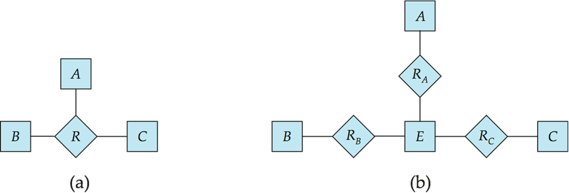

以上图为例，从三元联系 $R(A,B,C)$ 转换为多个二元联系的步骤如下：
1. **构造人工实体**：废弃原联系集 $R$ 建立一个新的实体集 $E$ 代表一种时间或记录；
2. **标识符生成与属性迁移**：为 $E$ 生成一个代理主键作为其唯一标识符，将原联系集的所有属性完全迁移至新实体，即 $\text{Attr}(E)\leftarrow\text{Attr}(R)$；
3. **建立二元联系**：构建三个全新的二元联系集 $R_A,R_B,R_C$ 将新实体 $E$ 与原实体集关联$$
\begin{cases}
R_A=\{(e,a)|e\in E,a\in A\}\\
R_B=\{(e,b)|e\in E,b\in B\}\\
R_C=\{(e,c)|e\in E,c\in C\}
\end{cases}
$$ 此时 $E$ 到 $A,B,C$ 的基数比通常为多对一，即一个 $E$ 实体精准对应一个 $A,B,C$ 实体。但在上图中为多对多，这需要根据实际情况来判断。
### 6. 扩展特性

#### 6.1 特化与泛化

1. **特化 (specialization)**：
	- **自顶向下 (top-down)** 在实体集中划分出于其他实体具有显著区别的子集；
	- **属性继承 (attribute inheritance)** 低层实体集会自动继承高层实体集所有属性，以及高层实体集所参与的所有联系。
2. **概化 (generalization)**：
	- **自底向上 (bottom-up)** 将多个共享相同特征的实体集提取成更高层的实体集。
#### 6.2 互斥性约束

**互斥性约束 (disjointness constraint)** 定义了在同一个特化或概化结构中，低层实体集之间是否允许存在交集：
1. **互斥 (disjoint)** 表示一个父类实体最多只能属于一个子类，子类之间是互斥的；
	* 例如下图中的 `instructor` 和 `secretary` ，不能既是讲师又是自己的助手。
2. **重叠 (overlapping)** 表示一个父类实体可以同时属于多个子类，子类身份允许叠加；
	* 例如下图中的 `student` 和 `employee` ，例如助教可以同时具备两个身份。

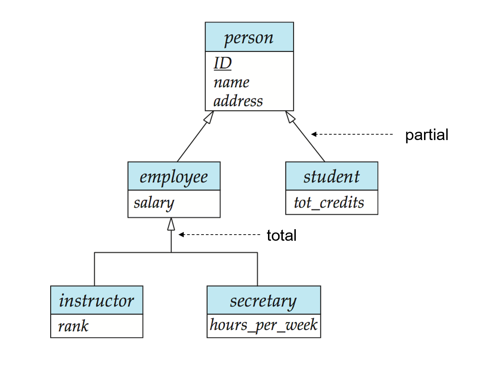

#### 6.3 完全性约束

**完全性约束 (completeness constraint)** 定义了对于父类实体能不能不属于任何子类：
1. **完全 (total)** 表示一个父类实体必须属于底下的至少一个子类，不存在纯粹的父类；
	- 例如下图中 `employee` 只能是 `instructor` 或 `secretary` ，不允许不特化；
2. **部分 (partial)** 表示父类实体不必属于任何子类，允许只拥有父类属性，无子类属性。
	- 例如下图中一个 `person` 实体可以不是 `employee` 或 `student`。


#### 6.4 面向继承的模式转换

1. **实体分表法**：完全忠实于 ER 图，无论父子每个实体集都建立一张独立的表，子类表只包含自身特有属性，通过主键与父类表关联；
	- **缺陷**：查询代价高，想要查找完整信息必须进行 join 操作，子类越多代价越大；
2. **向下合并法**：让子类完全独立，不仅包含自己的局部属性，还将父类的所有属性继承；
	- **缺陷**：如果存在重叠约束，父类数据会存在 **冗余**，极易造成数据不一致；
3. **单标聚类法**：将所有父类和子类压扁塞到一张表中引入 **类型标识列 (type attribute)**；
	- **缺陷**：如果子类的特有属性非常多，表内会包含大量的 NULL 值，导致数据密度降低浪费空间，并且 **无法对子类特有属性加入 NOT NULL 约束**。
```SQL
-- Method 1
schema   | attributes
person   | ID,name,street,city
student  | ID,tot_cred
employee | ID,salary
-- Method 2
schema   | attributes
person   | ID,name,street,city
student  | ID,name,street,city,tot_cred
employee | ID,name,street,city,salary
-- Method 3
schema   | attributes
persion  | ID,name,street,city,person_type,tot_cred,salary
```
### 7. UML类图

 **统一建模语言 (UML)** 提供多种组件对软件系统进行建模，其中的 UML类图 (Class Diagrams) 在概念上与 ER 图高度对应，但在表达上有所区别：
- **二元关系绘制**：在UML中，直接用一条直线连接两个实体集即可表示二元关系，关系名称通常直接写在连线的旁边；
- **角色表示**：在UML中实体在关系中扮演的角色名可以直接写在连线靠近实体集的一端；
- **关系属性表示**：如果关系集自带属性，UML中会用虚线将包含属性的方框连接到那条表示关系的实线上 。

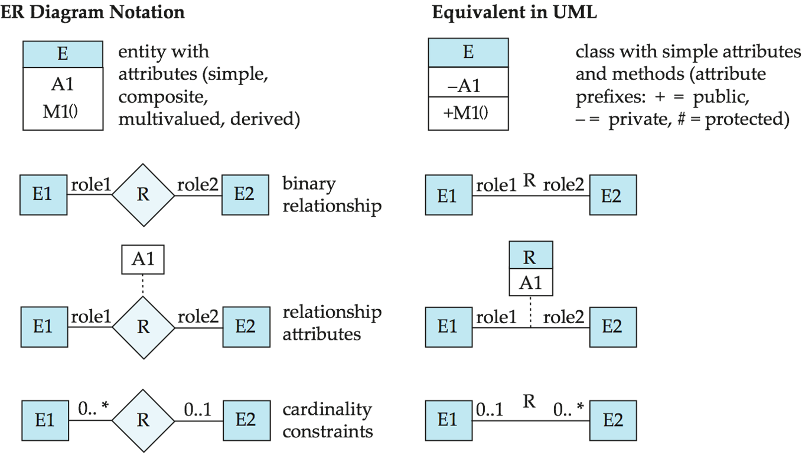

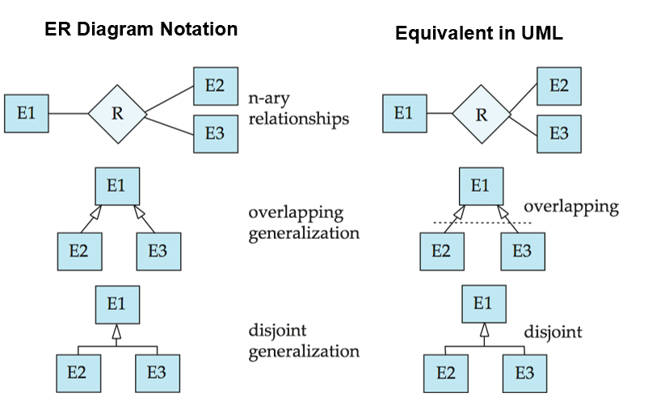