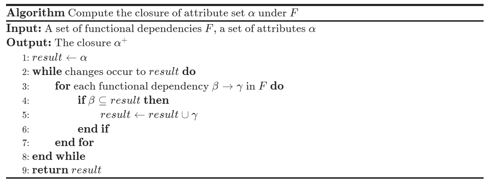
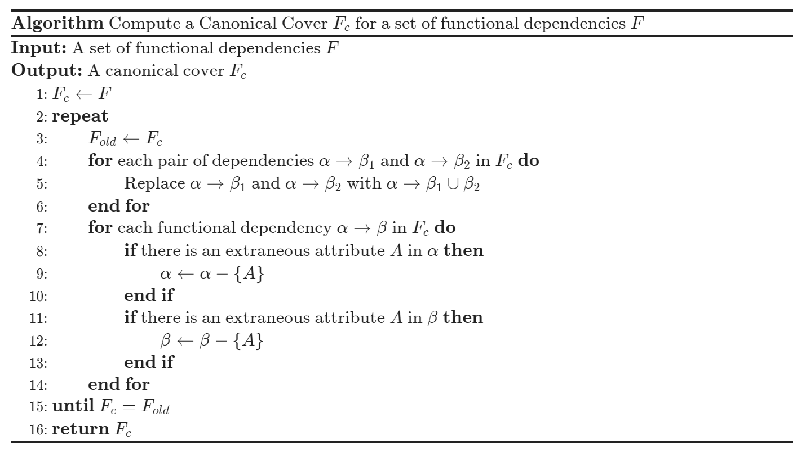
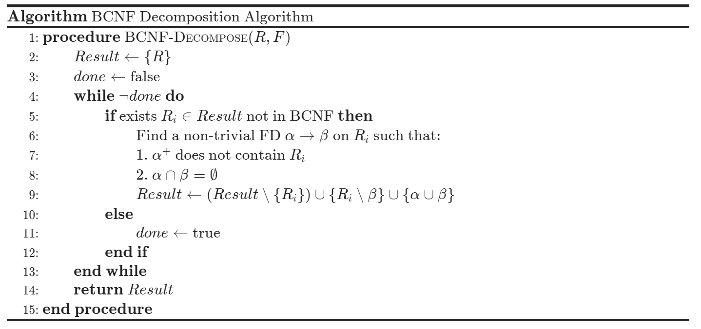
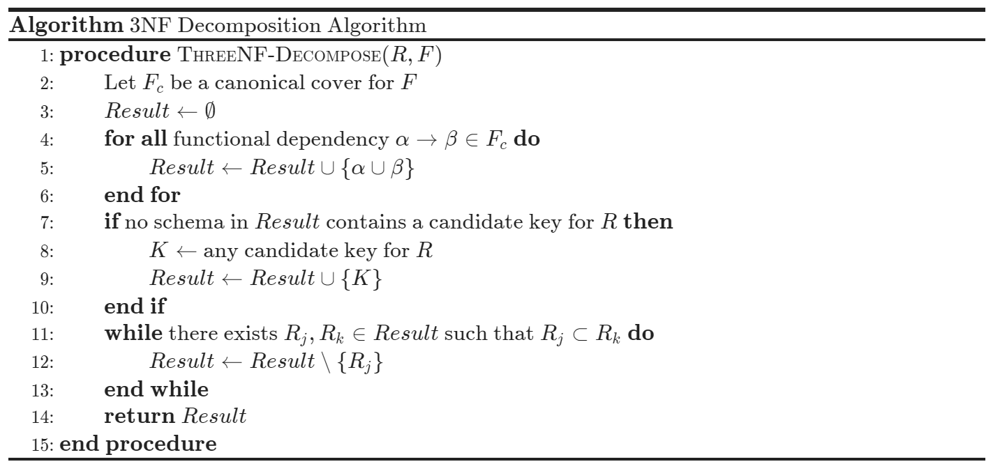
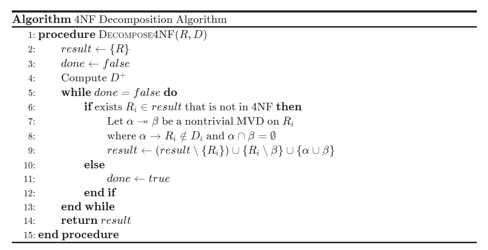

### 1. 关系设计基础

#### 1.1 常见异常

不合理的数据库模式会导致 **数据冗余 (Data Redundancy)**，并可能引发以下异常现象：

- **插入异常 (Insertion Anomaly)**：若某个实体的信息不完整，就无法将其插入到数据库中。表“学生-课程-系主任”中，若一个新系还没有学生选课，就无法录入该系的系主任信息；
- **删除异常 (Deletion Anomaly)**：删除某条记录时，意外丢失了其他本该保留的信息。表“学生-课程-系主任”中，若删除该系所有学生的选课记录，该系的系主任信息也会丢失；
- **更新异常 (Update Anomaly)**：当修改某个重复出现的数据时，如果只修改了部分记录，会导致数据不一致。表“学生-课程-系主任”中，同一个系的多名学生记录里系主任姓名重复存储，若该系主任更换，只更新了部分学生的系主任字段，就会造成数据不一致。
#### 1.2 设计目标

关系数据库设计的核心目标是寻找一个合适的 **模式分解 (Decomposition)**，使得分解后的子模式能够消除数据冗余和操作异常，同时保留原有的数据信息和约束条件。具体地主要需要达到两个要求：消除冗余，节约存储空间和保证数据一致性。
### 2. 模式分解
#### 2.1 无损连接

若将关系模式 $R$ 拆分为 $R_1,R_2$ 且满足 $R=R_1\cup R_2$ ，则称之为 **分解 (decomposition)**。

- **无损连接分解 (Lossless Decomposition)** 指分解后的子关系通过自然连接可以精确还原为原始关系的模式分解，形式化表示为：$\prod_{R_1}(r)⋈\prod_{R_2}(r)=r$ ；
- **有损连接分解 (Lossy Decomposition)** 指连接结果中出现了原关系中不存在的伪元组的模式分解，形式化表示为：$r\subset\prod_{R_1}(r)⋈\prod_{R_2}(r)$。

判定一个分解是否具备无损连接性的标准是：两个子模式的公共属性必须是其中 **至少一个模式的超键**。在函数依赖层面，需要满足以下任意一个条件：
$$
(R_1\cap R_2)\rightarrow R_1,\quad(R_1\cap R_2)\rightarrow R_2
$$
#### 2.2 依赖保持

如果分解后的所有子模式依赖集的并集，其闭包与原始依赖集的闭包相等，即满足：
$$
(F_1\cup F_2\cup\cdots\cup F_n)^+=F^+
$$
则称该分解是 **依赖保持 (dependency preservation)** 的，这意味着原始模式中的所有约束关系在分解后依然能完整体现。
### 3. 函数依赖
#### 3.1 函数依赖定义

**函数依赖 (Functional Dependency, FD)** 是一种完整性约束。 $r(R)$ 中的任意两个元组 $t_1$ 和 $t_2$，若它们在属性集 $\alpha$ 上的取值相等，则它们在属性集 $\beta$ 上的取值也必定相等，即：
$$
t_1[\alpha]=t_2[\alpha]\space\Rightarrow\space t_1[\beta]=t_2[\beta]
$$
则称 $\alpha$ 函数决定 $\beta$，或 $\beta$ 函数依赖于 $\alpha$，记作 $\alpha \rightarrow \beta$。

* $K$ 是关系模式 $R$ 的 **超键** 当且仅当 $K\rightarrow R$ ；
* $K$ 是关系模式 $R$ 的 **候选键** 当且仅当 $K\rightarrow R$ 且 $\not\exists\space\alpha\subset K,\alpha\rightarrow R$ 。

**平凡依赖 (Trivial FD)**：若 $\beta\subseteq\alpha$，那么 $\alpha\rightarrow\beta$ 永远成立，称为平凡的函数依赖。
#### 3.2 函数依赖的闭包

在数据库理论中，给定的函数依赖集 $F$ 往往蕴含着其他潜在的依赖关系。例如，若已知 $A \to B$ 且 $B \to C$，根据逻辑推导可以得出 $A \to C$，即从已有依赖中推导出新依赖的过程。

我们将由 $F$ 逻辑蕴含的 **所有** 函数依赖的集合称为 $F$ 的 **闭包 (Closure)**，通常记作 **$F^+$**。

以 $F=\{A \to B, B \to C\}$ 为例，其闭包 $F^+$ 不仅包含原始的 $A \to B$ 和 $B \to C$，还包含 $A \to C,AB \to B, AB \to C$ 。闭包为判定模式的等价性和候选键提供了理论依据。
#### 3.3 阿姆斯特朗公理

闭包可以通过反复使用 **阿姆斯特朗公理 (Armstrong's Axioms)** 得到：
$$
\begin{cases}
\beta\subseteq\alpha
&\Rightarrow\quad
\alpha\rightarrow\beta,&\text{(reflexivity, 自反律)}\\
\alpha\rightarrow\beta
&\Rightarrow\quad
\gamma\alpha\rightarrow\gamma\beta&\text{(augmentation, 增补律)}\\
\alpha\rightarrow\beta,\beta\rightarrow\gamma
&\Rightarrow\quad
\alpha\rightarrow\gamma&\text{(transitivity, 传递律)}
\end{cases}
$$
阿姆斯特朗公理是 **正确有效 (sound)** 且 **完备 (complete)** 的，有以下补充推论：
$$
\begin{cases}
\alpha\rightarrow\beta,
\alpha\rightarrow\gamma
&\Rightarrow\quad
\alpha\rightarrow\gamma\beta
&\text{(union, 合并)}\\
\alpha\rightarrow\gamma\beta,
\alpha\rightarrow\beta
&\Rightarrow\quad
\alpha\rightarrow\gamma
&\text{(decomposition, 分解)}\\
\alpha\rightarrow\beta,
\gamma\beta\rightarrow\delta
&\Rightarrow\quad
\gamma\alpha\rightarrow\delta
&\text{(pseudotransitivity, 伪传递)}
\end{cases}
$$
#### 3.4 属性集的闭包

在函数依赖的背景下，给定属性集 $\alpha$ ，我们将其在函数依赖集 $F$ 下的 **属性集闭包 (Closure of Attribute Sets)** 记作 $\alpha^+$ 定义为：在 $F$ 的约束下，所有由 $\alpha$ 函数决定的属性集合，即从 $\alpha$ 出发，利用已有的依赖规则所能推导出来的全部属性。 ./ch-7-closure.png

  

属性集闭包有如下应用：
- **判定超键**：要判断属性集 $\alpha$ 是否为超键，只要验证 $\alpha^+$ 是否包含关系模式中的所有属性；
- **验证函数依赖**：要检查 $\alpha\rightarrow\beta$ 是否成立，只需要判断 $\beta$ 是否为 $\alpha^+$ 的子集；
- **计算函数依赖闭包**：通过遍历 $R$ 中每一个属性子集 $\gamma$ 并计算闭包 $\gamma^+$ 即可找出所有逻辑蕴含的函数依赖。对于任何 $S\subseteq\gamma^+$ 都可以输出一个成立的函数依赖 $\gamma\rightarrow S$。
#### 3.5 正则覆盖

在函数依赖集 $F$ 中，冗余可能源于整个依赖的多余，也可能源于内部属性的多余。**正则覆盖 (Canonical Cover)** 就是 $F$ 的最简等价集合，记为 $F_c$ 。

在不改变函数依赖闭包 $F^+$ 的前提下，可以从依赖 $\alpha\rightarrow\beta$ 中删除某个属性，则该属性是**无关属性 (Extraneous Attributes)** ，根据无关属性的位置分为两类：
- **左侧无关**：若从 $\alpha$ 中删除 $A$ ，剩余属性仍能推导出 $\beta$ ，即 $A$ 是多余的条件；
- **右侧无关**：若从 $\beta$ 中删除 $A$ ，用 $F$ 中的其它依赖仍能推导出 $A$ ，即 $A$ 是多余的结论。

一个集合要成为正则覆盖，必须满足以下条件：
- **等价性**：$F_c$ 与 $F$ 逻辑等价，即满足 $F_c^+=F^+$；
- **极小化**：$F_c$ 中不包含任何无关属性；
- **左侧唯一**：$F_c$ 中每个依赖的左侧必须唯一， $\alpha\rightarrow\beta_1,\alpha\rightarrow\beta_2$ 要合并为 $\alpha\rightarrow\beta_1\beta_2$ 。

  

#### 3.6 多值依赖

在关系模式 $R$ 中，设 $\alpha\subseteq R$ 且 $\beta\subseteq R$ ，若 **多值依赖 (Multivalued Dependencies)** $\alpha\twoheadrightarrow\beta$ 成立，则对于 $R$ 的任何合法关系 $r$ 中的任意元组对 $t_1,t_2$ ，只要满足 $t_1[\alpha]=t_2[\alpha]$ ，则 $r$ 中必然存在元组 $t_3,t_4$ 使得：
* **决定因素一致**：$t_3[\alpha]=t_4[\alpha]=t_1[\alpha]=t_2[\alpha]$ ；
* $t_3$ 结合了 $t_1$ 的 $\beta$ 属性与 $t_2$ 的其余属性值：$t_3[\beta]=t_2[\beta],t_3[R-\beta]=t_2[R-\beta]$ ；
* $t_4$ 结合律 $t_2$ 的 $\beta$ 属性与 $t_1$ 的其余属性值：$t_4[\beta]=t_2[\beta],t_4[R-\beta]=t_1[R-\beta]$ 。

>[!Note] **Note**
>多值依赖 $\alpha \twoheadrightarrow \beta$ 的本质是：在 $\alpha$ 给定的情况下，属性集 $\beta$ 的取值与剩余属性集 $R - \beta$ 的取值是 **相互独立** 的。这意味着对于同一个 $\alpha$，$\beta$ 的所有可能值必须与 $R - \beta$ 的所有可能值进行全排列组合，否则就会导致信息丢失或冗余。
>
>例如有一个关系 `R(Teacher,Course,Hobby)` ，如果一个老师可以教多门课程，一个老师可以有多个爱好，且课程与爱好之间没有任何关系，如果我们要把这些信息存在一张表里，为了不丢失信息，老师的每一个课程都必须和他的每一个爱好组合出现一次。
### 4. 规范化范式

#### 4.1 第一范式

在数据库规范化过程中，**第一范式 (First Normal Form, 1NF)** 是最基础的要求，关系模式 $R$ 属于 1NF 的充要条件是 $R$ 中所有属性的域都是原子性的。

当属性的域中的所有元素被认为是不可分割的单元时，我们认为这个域是原子性的。例如姓名可以被拆解为名和姓，因此是非原子性的，而性别被认为是原子性的。
#### 4.2 BCNF 范式

**BCNF 范式 (Boyce-Codd Normal Form, BCNF)** 是一种非常严格的范式。设关系模式 $R$ 的函数依赖集闭包为 $F^+$ ，如果 $F^+$ 中所有形如 $\alpha\rightarrow\beta$ 的函数依赖，以下两个条件中至少有一个成立，则称关系模式 $R$ 属于 BCNF 范式：

- $\alpha\rightarrow\beta$ 是一个平凡的函数依赖，即 $\beta\subseteq\alpha$ 成立；
- $\alpha$ 是关系模式 $R$ 的超键。

>[!Note] **Note**
>在 BCNF 范式中，任何非平凡的依赖关系，其箭头左侧的属性集合必须能唯一标识整行数据，如果不满足就意味着存在数据冗余。例如：通过非主键属性去决定其他属性，会导致这些关联信息在多行中重复存储。

当一个关系模式不符合 BCNF 时，说明存在某个非平凡依赖 $\alpha\rightarrow\beta$ 违背了上述定义，即 $\alpha$ 不是超键。为了 **消除冗余**，首先要确保 $\alpha\cap\beta=\emptyset$ ，将 $R$ 分解为两个较小的关系模式。

- **模式一**：产生依赖的属性集，即 $\alpha\cup\beta$ ；
- **模式二**：原模式中剔除 $\beta$ 后的剩余属性，即 $R-\beta$。

【注】由于保证了 $\alpha\cap\beta=\emptyset$ ，直接在原模式中剔除 $\beta$ 不会剔除 $\alpha$ 中的属性。严格来说，模式二应该表述为：原模式中剔除 $\beta$ 中不与 $\alpha$ 重合的属性后得到的剩余属性。

  

>[!Note] **Note**
>将关系模式分解到 BCNF 有明显的优缺点，是数据库设计中必须权衡的理论基础：
>- **优点**：通过上述策略进行 BCNF 分解可以从数学上保证分解是无损连接的，这意味这分解后的表通过自然连接能够完全还原原始数据，不会产生信息丢失或伪元组；
>- **缺点**：BCNF 分解可能无法保持函数依赖，更新数据时系统必须跨越多个表执行高昂的连接操作才能检验约束是否被破坏。
#### 4.3 第三范式

设关系模式 $R$ 的函数依赖集闭包为 $F^+$ ，如果 $F^+$ 中所有形如 $\alpha\rightarrow\beta$ 的函数依赖，以下三个条件至少有一个成立则关系模式 $R$ 为 **第三范式 (Third Normal Form, 3NF)** ：

- $\alpha\rightarrow\beta$ 是一个平凡的函数依赖，即 $\beta\subseteq\alpha$ 成立；
- $\alpha$ 是关系模式 $R$ 的超键；
- $\beta-\alpha$ 中的每一个属性 $A$ 都包含在 $R$ 中的某个候选键中。

【注】$\beta-\alpha$ 中的不同属性可以在 $R$ 不同的候选键中。

>[!Note] **Note**
>第三范式允许决定因素 $\alpha$ 不是超键，但是要求被决定的非平凡属性必须在候选键中。这种妥协的核心目的，是为了在消除绝大部分数据冗余的同时，确保分解能 **保持函数依赖**。

显然如果一个关系模式满足 BCNF，那么它也一定满足 3NF，即 BCNF 是 3NF 的 **真子集**。

  

**算法正确性证明**：从极小函数依赖集 $F_c$ 中取出 $\alpha\rightarrow\beta$ 构造模式 $R_k=\alpha\cup\beta$。显然 $\alpha$ 是 $R_k$ 的候选键，$\alpha$ 包含的属性均是**主属性**。

假设 $R_k$ 违反了 3NF，即存在非平凡函数依赖 $X\rightarrow Y\ (X,Y\subset R_k)$ 导致违规。根据阿姆斯特朗公理的分解律，必定存在 $Y$ 中的某个属性 $A$，使得 $X\rightarrow A$ 同样违反 3NF，即 $X$ 不是超键，且 $A$ 不是主属性。由于 $R_k=\alpha\cup\beta$，属性 $A$ 的位置只有以下两种情况：

* **当 $A \in \alpha$ 时**：$\alpha$ 作为候选键，其内部的属性 $A$ 必然是**主属性**，与前提矛盾。
* **当 $A \notin \alpha$ 时**：由于 $A \in R_k$，必然有 $A \in \beta$。故原极小依赖集 $F_c$ 中必定包含 $\alpha\rightarrow A$。现已知 $X\rightarrow A$ 成立，考察其在 $F_c$ 中的推导过程：
  - 若推导**未用到** $\alpha\rightarrow A$：说明该依赖可被替代，违背了 $F_c$ 的**无冗余性**。
  - 若推导**用到了** $\alpha\rightarrow A$：推导链必为 $X\rightarrow\dots\rightarrow\alpha\rightarrow A$，则 $X$ 是超键与前提矛盾。

综上所述，两种情况讨论属性 $A$ 的所有可能，且均推导出矛盾。故反证假设不成立，合成模式 $R_k$ 必定满足 3NF。证明完毕。
#### 4.4 第四范式

**第四范式 (4NF)** 是针对多值依赖 (MVD) 的规范化要求。关系模式 $R$ 满足 4NF，当且仅当对于 $D^+$ 中所有形如 $\alpha\twoheadrightarrow\beta$ 的多值依赖，至少满足以下条件之一：

- **平凡性**：$\alpha\twoheadrightarrow\beta$ 是平凡的（即 $\beta\subseteq\alpha$ 或 $\alpha\cup\beta=R$）；
- **超键性**：$\alpha$ 是模式 $R$ 的一个**超键**。

第四范式的核心要点与要解决的问题：
- **约束强度**：4NF 的定义在形式上与 BCNF 高度相似，但扩展到了更一般的多值依赖。
- **范式层级**：4NF 是一级更强的规范化标准。若一个关系满足 4NF，则它必然满足 **BCNF**
- **设计目标**：4NF 的本质是消除由于多个独立的“一对多”关系导致的非平凡多值依赖，从而解决 3NF 和 BCNF 无法处理的数据冗余问题。

  

#### 4.5 非规范化策略

在实际生产环境中，为了追求极致的查询性能，有时会刻意违反规范化原则。为了避免高频率查询中的多表连接开销，通常有两种替代方案：

**物理反规范化关系 (Denormalized Relation)** 创建一个包含所有冗余属性的物理表：
- **优势**：消除了 JOIN 操作，实现单表快速查找；
- **代价**：占用额外的磁盘空间、数据更新时需同步多处，增加执行时间、程序员需要编写额外的逻辑来维护数据一致性，极易引入人工编码错误。

**物化视图 (Materialized View)** 定义一个预计算并存储结果的视图：
- **优势**：由数据库管理系统（DBMS）自动处理同步逻辑，无需程序员手动编写一致性维护代码，从根源上避免了逻辑错误；
- **代价**：其在空间占用和更新延迟上的弊端与方案一相同。

|           | 规范化模式 | 物理反规范化表    | 物化视图          |
| :-------- | :---- | :--------- | :------------ |
| **查询性能**  | 低     | 高          | 高             |
| **更新性能**  | 高     | 低          | 低             |
| **数据一致性** | 易于保证  | 难 (依赖人工代码) | 易 (由 DBMS 保证) |
| **开发负担**  | 低     | 高          | 低             |
