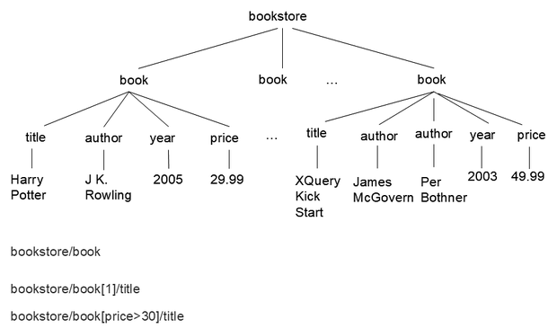
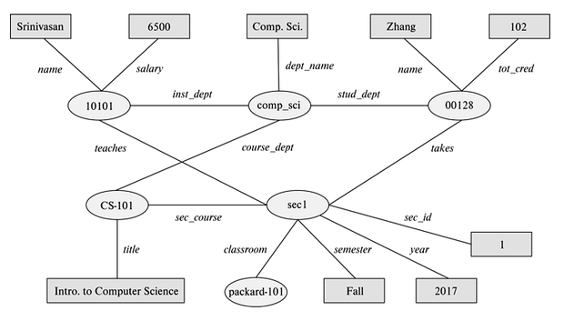
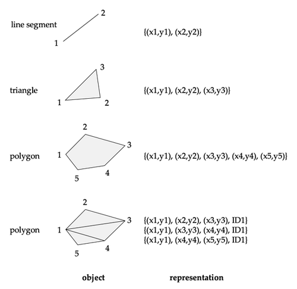
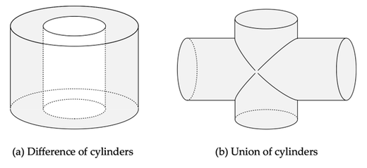

### 1. 对象关系

#### 1.1 复杂类型

**复杂数据类型 (Complex Data Types)** 用于表示普通关系表不容易直接表达的数据。高级数据库应用常需要集合、数组、嵌套记录、对象引用、大对象、空间对象等结构；这些结构和传统关系模型中“属性值必须原子”的要求并不完全一致。

对象化需求通常来自两个方向：应用程序常用面向对象语言编写，而数据库采用关系模型；复杂应用又希望把对象的嵌套结构、继承关系和引用关系更自然地保存下来。

常见整合方式如下：

| 方式 | 做法 | 特点 |
| --- | --- | --- |
| 对象数据库 | 原生支持对象、类、继承和对象标识 | 模型统一，但生态较窄 |
| 对象关系数据库 | 在关系数据库中加入对象特性 | 保留 SQL 和关系系统优势 |
| ORM | 在程序对象和关系表之间自动映射 | 工程常用，但映射有代价 |

**对象关系数据库 (Object-Relational Database, ORDB)** 通常是在关系模型上扩展复杂类型，而不是完全放弃关系表。

#### 1.2 嵌套关系

以图书信息为例，一本书可能有一个标题、一组作者、一个出版社和一组关键词。如果直接把作者集合和关键词集合放在一个元组中，就得到非第一范式的嵌套关系。

若强行展开为第一范式关系，会把作者和关键词组合成多行，容易产生冗余。

若假设标题多值决定作者、关键词和出版社信息，可用多值依赖描述：

$$
\text{title}\twoheadrightarrow \text{author}
$$

标题也多值决定关键词：

$$
\text{title}\twoheadrightarrow \text{keyword}
$$

标题还决定出版社名称和分支：

$$
\text{title}\to \text{pub-name},\text{pub-branch}
$$

于是可分解为三个关系：

| 关系模式 | 含义 |
| --- | --- |
| `book_author(title, author)` | 图书与作者 |
| `book_keyword(title, keyword)` | 图书与关键词 |
| `book_publisher(title, pub_name, pub_branch)` | 图书与出版社 |

这种分解符合传统规范化思想，但查询时需要连接；嵌套类型则保留了对象结构，读写某本书的完整信息更直接。

#### 1.3 SQL 扩展

SQL:1999 引入了若干对象关系特性，包括集合类型、结构化类型、继承、对象标识、引用类型和大对象类型。不同数据库的支持程度差异很大，实际使用时要以具体系统语法为准。

数组和多重集可以直接作为属性类型：

```SQL
create type Publisher as (
    name varchar(20),
    branch varchar(20)
);

create type Book as (
    title varchar(20),
    author_array varchar(20) array[10],
    pub_date date,
    publisher Publisher,
    keyword_set varchar(20) multiset
);

create table books of Book;
```

结构化类型可以模拟嵌套记录。表类型可以把一个属性声明为“表”，适合表示用户兴趣、多个地址、多个电话等多值属性。

```SQL
create type Interest as table (
    topic varchar(20),
    degree_of_interest int
);

create table users (
    ID varchar(20),
    name varchar(20),
    interests Interest
);
```

#### 1.4 继承引用

对象关系系统可以支持 **类型继承 (Type Inheritance)**。

例如，`Student` 和 `Teacher` 都可以继承 `Person`：

```SQL
create type Person as (
    ID varchar(20),
    name varchar(20),
    address varchar(20)
) ref from (ID);

create type Student under Person (
    degree varchar(20)
);

create type Teacher under Person (
    salary integer
);
```

**引用类型 (Reference Type)** 保存对象引用，不复制被引用对象的全部属性。

例如，`Department.head` 可以引用 `Person`：

```SQL
create type Department as (
    dept_name varchar(20),
    head ref(Person) scope people
);
```

引用可用于路径表达式。若 `head` 指向教师对象，可通过 `head->name` 访问姓名。

#### 1.5 ORM 映射

**对象关系映射 (Object-Relational Mapping, ORM)** 在应用对象和数据库表之间建立映射。它负责创建、更新、删除元组，并把查询结果组装成程序对象。

Java 中的 Hibernate、Python 中的 Django ORM 都属于这类工具。

下面的类可以映射到学生关系：

```Java
@Entity
public class Student {
    @Id
    String ID;
    String name;
    String department;
    int tot_cred;
}
```

`@Entity` 表示该类映射到数据库关系，`@Id` 表示主键属性。ORM 的好处是应用代码更贴近对象模型；代价是开发者仍然需要理解底层 SQL、连接代价、事务边界和对象加载策略，否则容易产生隐藏的性能问题。

### 2. 半结构化

#### 2.1 基本特征

**半结构化数据 (Semi-Structured Data)** 用于描述结构灵活的数据。

它适合模式多变、属性稀疏、嵌套明显的场景。

它介于关系表和纯文本之间：对象不必共享固定模式，但仍保留可查询结构。

半结构化数据常见特征如下：

| 特征 | 含义 | 例子 |
| --- | --- | --- |
| 灵活模式 | 每个对象可有不同属性 | 用户资料逐步新增字段 |
| 稀疏属性 | 只存实际出现的属性 | 商品参数很多但每类商品不同 |
| 多值属性 | 一个属性可有多个值 | 用户兴趣集合 |
| 键值映射 | 属性名和值成对存储 | `{brand: Apple, size: 13}` |
| 嵌套结构 | 对象中包含对象或数组 | 订单包含多个商品项 |

宽列表示允许每个元组有不同属性；稀疏列表示保留一个很大的固定属性集合，但每个元组只存其中一部分。二者都在放松传统关系模型的规则。

#### 2.2 数组集合

数组适合时间序列、传感器读数、科学计算等场景。

例如，连续四个时刻的读数可写成：

```JSON
[5, 8, 9, 11]
```

若按传统关系表示，则需要保存时刻和值：

```text
{(1, 5), (2, 8), (3, 9), (4, 11)}
```

数组表示更紧凑，也更适合压缩和批量计算。专门支持数组的数据库还会提供数组压缩、数组切片、范围计算和查询语言扩展。

集合、多重集和数组都属于非第一范式数据模型的一部分。它们牺牲了一部分规范化带来的统一性，换取对复杂应用对象更自然的表示。

#### 2.3 XML 模型

**XML (Extensible Markup Language)** 使用标签标记数据。标签让数据具有自描述能力，也可以形成层次结构。

```XML
<course>
  <course_id>CS-101</course_id>
  <title>Intro. to Computer Science</title>
  <dept_name>Comp. Sci.</dept_name>
  <credits>4</credits>
</course>
```

XML 文档本质上是一棵树。节点表示元素、属性或文本；路径表达式定位节点。

<div align="center">  </div>

例如 `bookstore/book` 选择所有 `book` 元素。

`bookstore/book[1]/title` 选择第一个 `book` 的标题。

`bookstore/book[price>30]/title` 选择价格大于 `30` 的图书标题。

**DTD (Document Type Definition)** 可以约束 XML 文档结构。例如 `book` 必须含有 `title`、一个或多个 `author`、`year`、`price`，并且可选 `publisher` 和 `edition`。

```XML
<!ELEMENT book (title, author+, year, price, publisher*, edition*)>
<!ATTLIST book category CDATA #REQUIRED>
<!ATTLIST book ISBN ID #REQUIRED>
```

`+` 表示至少一次，`*` 表示零次或多次。DTD 类似模式约束，服务于层次化文档。

#### 2.4 查询 XML

**XPath** 用路径表达式查询 XML 树。路径谓词过滤节点，`text()` 提取文本。

```XPath
bookstore/book[1]/title/text()
bookstore/book/author
bookstore/book[price > 30]/year
```

**XQuery** 用 `for`、`where`、`return` 表达嵌套查询，并构造 XML 结果。

```XQuery
<book_pairs>
{
  for $a in /bookstore/book
  for $b in /bookstore/book
  where $a/author[1] = $b/author[1]
    and $a/price > $b/price
  return
    <book_pair>
      <first_author>{ data($a/author[1]) }</first_author>
      { $a/title }
      { $b/title }
    </book_pair>
}
</book_pairs>
```

关系数据库也可用 SQL 扩展来存储、生成和提取 XML。XML 常见于配置、文档交换和企业集成；Web 应用更常使用 JSON。

#### 2.5 JSON 数据

**JSON (JavaScript Object Notation)** 是轻量级、语言无关的文本数据表示。它支持字符串、整数、实数、布尔值、`null`、对象和数组。

```JSON
{
  "ID": "22222",
  "name": {
    "firstname": "Albert",
    "lastname": "Einstein"
  },
  "deptname": "Physics",
  "children": [
    {"firstname": "Hans", "lastname": "Einstein"},
    {"firstname": "Eduard", "lastname": "Einstein"}
  ]
}
```

对象 `{}` 是键值映射，数组 `[]` 可以看成从位置偏移到值的映射。JSON 在 Web 服务和前后端数据交换中非常常见。

许多关系数据库提供 JSON 类型、路径提取、JSON 构造和 JSON 聚集函数。

例如，MySQL 可以直接存储和查询 JSON：

```SQL
create table users (
    id int auto_increment primary key,
    info json
);

insert into users(info)
values ('{"name":"Alice", "age":30}');

select *
from users
where info->'$.age' > 28;

update users
set info = json_set(info, '$.age', 31)
where id = 1;
```

JSON 的优点是表达灵活、贴近应用层结构；缺点是文本形式较冗长，约束和优化通常比普通列更困难。为了提高存储和解析效率，一些系统会使用 BSON。

### 3. 知识图谱

#### 3.1 RDF 三元组

**RDF (Resource Description Format)** 用三元组表示事实。

其基本形式是：

$$
(\text{subject},\ \text{predicate},\ \text{object})
$$

例如，几个常见事实可写成：

```text
(NBA-2019, winner, Raptors)
(Washington-DC, capital-of, USA)
(Washington-DC, population, 6200000)
```

RDF 可以表示对象的属性，也可以表示对象之间的关系。属性事实类似：

$$
(\text{ID},\ \text{attribute-name},\ \text{value})
$$

关系事实类似：

$$
(\text{ID}_1,\ \text{relationship-name},\ \text{ID}_2)
$$

图中实体是节点，谓词是边或属性标签。它接近 E-R 模型，模式也更灵活。

<div align="center">  </div>

#### 3.2 SPARQL

**SPARQL** 是查询 RDF 的语言。它通过三元组模式匹配图中事实，变量以 `?` 开头。

```text
select ?name
where {
  ?cid title "Intro. to Computer Science" .
  ?sid course ?cid .
  ?id takes ?sid .
  ?id name ?name .
}
```

这个查询沿着课程标题、开课、选课和姓名关系逐步匹配，最后返回选修指定课程的学生姓名。SPARQL 还支持聚集、可选匹配、子查询和路径上的传递闭包。

#### 3.3 多元关系

RDF 三元组天然表示二元关系。若事实本身是多元关系，需要额外建模。

一种做法是创建人工实体，把多元关系拆成若干二元关系。

例如“某人在某时间段担任某国总统”，可引入事件实体 `e1`：

```text
(e1, person, Barack Obama)
(e1, country, USA)
(e1, president-from, 2008)
(e1, president-till, 2016)
```

另一种做法是使用四元组，把上下文实体放进事实中：

```text
(Barack Obama, president-of, USA, c1)
(c1, president-from, 2008)
(c1, president-till, 2016)
```

RDF 常用于知识库和知识图谱，例如 DBPedia、Yago、Wikidata 等。开放链接数据的目标是把不同知识图谱连接起来，使查询可以跨数据源执行。

### 4. 文本检索

#### 4.1 文本查询

**信息检索 (Information Retrieval)** 关注非结构化文本上的查询。最简单的关键词查询模型是：给定一组关键词，返回包含这些关键词的文档。

实际系统还需要相关性排序，因为匹配关键词的文档可能非常多。排序不仅看词是否出现，还会利用词的重要性、词距、链接关系和点击反馈。

结构化数据库和知识图谱也可以支持关键词查询。若用户不知道模式，关键词搜索可以把数据看成图，返回包含关键词且彼此连接紧密的元组集合。

#### 4.2 TF-IDF

**词频 (Term Frequency, TF)** 衡量词项 $t$ 对文档 $d$ 的重要性。

一个常见定义是：

$$
\text{TF}(d,t)=\log\left(1+\frac{n(d,t)}{n(d)}\right)
$$

其中 $n(d,t)$ 是词项 $t$ 在文档 $d$ 中出现的次数。

其中 $n(d)$ 是文档 $d$ 中的词项总数。

**逆文档频率 (Inverse Document Frequency, IDF)** 衡量词项区分文档的能力。

一个简单定义是：

$$
\text{IDF}(t)=\frac{1}{n(t)}
$$

其中 $n(t)$ 是包含词项 $t$ 的文档数量。

给定查询词集合 $Q$，文档 $d$ 的相关性可估计为：

$$
r(d,Q)=\sum_{t\in Q}\text{TF}(d,t)\cdot\text{IDF}(t)
$$

实际系统还会忽略停用词，并考虑词距、短语匹配、字段权重等因素。

#### 4.3 PageRank

超链接能反映页面的重要性。被许多页面链接的页面通常更重要；被重要页面链接的页面也会更重要。PageRank 用随机游走模型形式化这个想法。

设 $T[i,j]$ 表示随机浏览者位于页面 $i$ 时点击到页面 $j$ 的概率。

若页面 $i$ 的所有出边等概率被点击，且出边数量为 $N_i$，则 $T[i,j]=1/N_i$。

页面 $j$ 的 PageRank 可定义为：

$$
P[j]=\frac{\delta}{N}+(1-\delta)\sum_{i=1}^{N}T[i,j]P[i]
$$

其中 $N$ 是页面总数。

其中 $\delta$ 是随机跳转概率，常取 $0.15$。

这个定义是递归的，可以用迭代法求解。初始化所有页面得分为 $1/N$，然后反复按公式更新，直到变化足够小或达到迭代次数上限。

#### 4.4 检索效果

检索效果常用 **精确率 (Precision)** 和 **召回率 (Recall)** 衡量。

精确率表示返回结果中真正相关的比例：

$$
\text{precision}=\frac{\text{relevant returned}}{\text{returned}}
$$

召回率表示所有相关结果中被返回的比例：

$$
\text{recall}=\frac{\text{relevant returned}}{\text{relevant}}
$$

实际评估常看 `precision@10`、`recall@10` 等指标，也就是只考察前若干个结果。搜索系统通常在精确率、召回率、排序质量和响应时间之间取舍。

### 5. 空间数据

#### 5.1 空间类型

**空间数据库 (Spatial Database)** 存储和查询与位置、几何形状相关的数据。它常用于地理信息系统、地图、土地使用、道路网络、地形、建筑设计和电路布局。

空间数据大致分为两类：

| 类型 | 坐标体系 | 例子 |
| --- | --- | --- |
| 地理数据 | 经纬度、高程等地球坐标 | 道路、行政区、地形图 |
| 几何数据 | 二维或三维欧氏坐标 | 建筑、飞机、芯片布局 |

地理数据需要考虑地球曲面和投影，几何数据通常使用二维或三维坐标系。

#### 5.2 几何表示

线段可用两个端点表示。折线或线串由顺序连接的线段组成，也可用端点列表表示。

多边形可用有序顶点列表表示；复杂多边形可三角剖分为若干三角形。

<div align="center">  </div>

三维中的点和线段与二维类似，只是点多一个 $z$ 坐标。任意多面体可以拆成四面体保存，也可以保存一组面，并标明每个面的内侧方向。

许多数据库支持 `geometry` 和 `geography` 类型。常见几何对象包括 `point`、`linestring`、`curve`、`polygon`，以及它们的集合类型。

```SQL
LINESTRING(1 1, 2 3, 4 4)
POLYGON((1 1, 2 3, 4 4, 1 1))
```

常见空间函数包括 `ST_Union()`、`ST_Intersection()`、`ST_Contains()` 和 `ST_Overlaps()`。

#### 5.3 设计数据

**设计数据库 (Design Database)** 用于保存设计组件及其连接关系。

组件通常表示为空间对象，连接关系表示整体设计结构。

二维对象可由点、线、三角形、矩形、多边形组成。

三维对象可由球体、圆柱、长方体等基本体组合。

复杂对象可以通过并、交、差构造。

下面的例子展示了圆柱差和圆柱并两种组合方式：

<div align="center">  </div>

设计数据库还需要保存非空间属性，例如材料、颜色、型号等。空间完整性约束也很重要，例如管道不应相交，导线之间距离不能过近。

#### 5.4 地理数据

地理数据可以用 **栅格数据 (Raster Data)** 或 **矢量数据 (Vector Data)** 表示。

栅格数据由像素或位图组成，可以扩展到多维。例如卫星云图可以让每个像素保存某个区域的云量；再增加维度后，还可以保存高度、温度或时间序列。

矢量数据由几何对象组成，例如点、线段、曲线、多边形、圆柱、球体和多面体。地图数据通常使用矢量表示：道路可表示为线或曲线，湖泊和行政区可表示为多边形。

#### 5.5 空间查询

空间查询不仅关心属性值，还关心位置关系和几何关系。

| 查询类型 | 含义 | 例子 |
| --- | --- | --- |
| 区域查询 | 查找位于指定区域内或与区域相交的对象 | 某行政区内的学校 |
| 邻近查询 | 查找距离某位置足够近的对象 | 附近医院 |
| 最近邻查询 | 查找满足条件的最近对象 | 最近加油站 |
| 空间图查询 | 在道路网络等空间图上查询 | 两点间最短路径 |
| 空间连接 | 用位置关系连接两个空间关系 | 找出穿过城市的河流 |
| 几何运算 | 计算区域的交、并、差 | 两个地块的重叠面积 |

空间查询通常需要专门索引支持，例如 R 树或 GiST 索引。没有空间索引时，大量几何相交和距离计算会非常昂贵。
