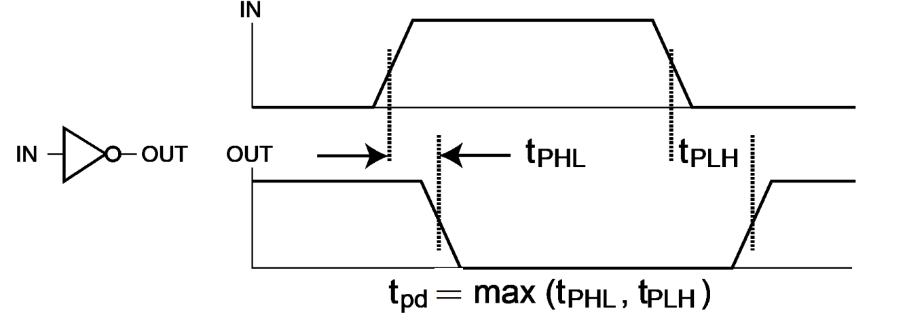

### 1. 逻辑与逻辑门

#### 1.1 基本逻辑门

**逻辑门（Logic Gates）** 是在硬件层面上实现布尔运算的物理单元，操作对象为高低电平：
* **与门**（串联开关）、**或门**（并联开关）、**非门**（常闭开关）；
* 由于物理实现限制，信号跃迁时会产生 **延迟（Delay** 现象，在设计时序电路需要考虑；
* 在与门和或门与线连接处画小圆圈可以表达非的意思。
#### 1.2 晶体管模型

现代集成电路主要通过晶体管来实现：
* **n-Channel**：高电平导通，相当于常开（NO）开关。
* **p-Channel**：低电平导通，相当于常闭（NC）开关。
* **CMOS电路**：由拉高网络（p型晶体管）和拉低网络（n型晶体管）互补构成。

逻辑门的工艺有 CMOS 和 TTL，其中 COMS 的功耗低，TTL 的效率更高。
### 2. 布尔代数
#### 2.1 基本法则

布尔代数是进行逻辑函数指定与转换的数学系统。优先级为：括号，非，与，或。

| Law               | Formulas                                                                                                           |
| ----------------- | ------------------------------------------------------------------------------------------------------------------ |
| 0-1 Law           | $X+0=X,\quad X\cdot1=X,\quad X+1=1,\quad X\cdot0=0$                                                                |
| Overlapping Law   | $X+X=X,\quad X\cdot X=X$                                                                                           |
| Complementary Law | $X+\overline{X}=1,\quad X\cdot\overline{X}=0$                                                                      |
| Involution Law    | $\overline{\overline{X}}=X$                                                                                        |
| Commutative Law   | $X+Y=Y+X,\quad XY=YX$                                                                                              |
| Associative Law   | $X+(Y+Z)=(X+Y)+Z,\quad X(YZ)=(XY)Z$                                                                                |
| Distributive Law  | $X(Y+Z)=XY+XZ,\quad X+YZ=(X+Y)(X+Z)$                                                                               |
| DeMorgan's Law    | $\overline{X+Y}=\overline{X}\cdot\overline{Y},\quad\overline{X\cdot Y}=\overline{X}\cdot\overline{Y}$              |
| Absorptive Law    | $\begin{align}&X(X+Y)=X,\quad X+XY=X,\\& X(\overline{X}+Y)=XY,\quad X+\overline{X}Y=X+Y\end{align}$                |
| Including Law     | $\begin{align}&(X+Y)(\overline{X}+Z)(Y+Z)=(X+Y)(\overline{X}+Z)\\&XY+\overline{X}Z+YZ=XY+\overline{X}Z\end{align}$ |

> [!NOTE]  **对偶（Dual）法则**
> 将表达式中的与和或互换，0 和 1 互换。若某等式成立，那么它的对偶等式也必然成立

#### 2.2 规范形式

**最小项（minterm）** 是所有变量均出现且仅出现一次的 **逻辑与表达式**：

* 所有变量均需要出现在最小项中，一项最小项与真值表中一行对应（仅该行为真）；
* 若变量带非则记为 0，不带非则记为 1，则 $m_i$ 表示变量取值为二进制下 $i$ 的各位时值为 1 的最小项，如 $n=3$ 时 $m_5=A\overline{B}C$ ；
* 对于一组变量的取值，只有一个最小项为 1；
* 任意两个最小项的积，无论变量的取值，结果一定为 0；
* 所有最小项的和为 1，即 $\begin{align}\sum_{i=0}^{2^n-1}m_i=1\end{align}$ 。

**最大项（maxterm）** 是所有变量均出现且仅出现一次的 **逻辑或表达式**：

* 所有变量均需要出现在最大项中，一项最大项与真值表中一行对应（仅该行为假）；
* 若变量带非则记为 1，不带非则记为 0，则 $M_i$ 表示变量取值为二进制下 $i$ 的各位时值为 0 的最大项，如 $n=3$ 时 $M_5=\overline{A}+B+\overline{C}$ ；
* 对于一组变量的取值，只有一个最大项为 0；
* 任意两个最大项的和，无论变量的取值，记过一定为 1；
* 左右最大项的积为 0，即 $\begin{align}\prod_{i=0}^{2^n-1}M_i=0\end{align}$ 。

**最小项之和（sum of minterm, SOM）** 和 **最大项之积（product of maxterm, POM）** 任意一个真值表均可化简成这两种形式，这两种形式被称为**规范形式**，可通过德摩根律互相转化。

>[!Note] **Note**
>最小项和最大项的中变量带非和不带非表示的 **值相反**，如：
>* $m_0=\overline{A}\cdot\overline{B}\cdot\overline{C},\quad M_0=A+B+C$
>* $m_4=A\cdot\overline{B}\cdot\overline{C},\quad M_4=\overline{A}+B+C$

#### 2.3 标准形式

* **积之和（sum-of-product, SOP）**：由多个“与项”经过“或”运算构成。
* **和之积（product-of-sum, POS）**：由多个“或项”经过“与”运算构成。

> [!NOTE]  
> **标准形式（SOP/POS）** 与规范形式的区别在于，标准形式中的乘积项 **不强制要求** 包含所有变量。基于SOP/POS设计的二级电路延迟低，且更易于化简。

### 3. 卡诺图化简

**卡诺图（K-map）** 是真值表在拓扑学上的变形（类似维恩图），保证相邻的方格仅有一个变量发生取值变化（即使用格雷码）。通过把将所有为 1 的最小项填入表中，相邻的 1 组合成 $2^k$ 个大小的矩形框，可直接消除冗余变量，从而实现表达式简化。

#### 3.1 蕴含项

* **蕴含项（Implicant）**：卡诺图中完全由 1 组成且大小为 2 的幂次的矩形框；
* **主蕴含项（prime implicant, PI）**：无法被进一步扩大（不能再向外拓展）的矩形框；
* **质主蕴含项（essential PI, EPI）**：覆盖了至少一个仅能被该矩形覆盖的 1的主蕴含项。

> [!NOTE]  **化简步骤**
> 寻找所有主蕴含项 $\rightarrow$ 选定所有质主蕴含项 $\rightarrow$ 选用最少的主蕴含项覆盖剩余的 1。切记考虑卡诺图跨越上下左右边界的**循环相邻**关系。

#### 3.2 无关项

**无关项（don't care condition）** 指永远不会出现的输入组合，或不关心的输出状态（用 X 标注），在最小项中用 $\begin{align}\sum d(\cdots)\end{align}$ 表示。在化简时，X 可以视情况当作 1 或当作 0。我们仅在“包含 X 能让卡诺图矩形框变得更大”时去覆盖它，借此极大降低电路成本。

### 4. 电路优化

电路优化的核心是求得最低成本实现方式。常用标准：

* **文字成本（L）**：布尔表达式中变量出现的总次数，重复也要计入。
* **门输入代价（G）**：逻辑门的输入端总数量（不统计非门的输入）。
* **计入非门代价（GN）**：G 的基础上，额外加上非门的输入数。
$$
\begin{align}
F=BD+A\overline{B}C+A\overline{C}\overline{D}
&\quad\Rightarrow\quad
\text{L}=8,\space \text{G}=11,\space \text{GN}=14\\
F=BD+A\overline{B}C+A\overline{BD}+AB\overline{C}
&\quad\Rightarrow\quad
\text{L}=11,\space\text{G}=15,\space\text{GN}=18
\end{align}
$$
>[!Note] **重复问题**
>* 对于重复出现的变量，在文字成本中 **需要** 重复计数；
>* 对于非门单字段，如 $\overline{A},\overline{B}$ ，非门 **不需要** 重复计数；
>* 对于表达式重复，如上例中的 $A\overline{B}$ ，**需要** 重复计数门输入。

**在两级（Two-Level）电路** 优化中，通过卡诺图或者计算机算法来求得最优 SOP 或 POS。选择主蕴含项时，尽量减少重叠区域，以降低最终成本指标。

**多级（Multi-Level）电路** 以通过代数因式分解进一步缩小面积。例如：$F = AD + BD + C$ 可以提取公因式转为 $F = (A+B)D + C$。其代价是增加逻辑层级，牺牲部分传播速度，设计中需要进行成本/性能的权衡。
### 5. 其它逻辑门

#### 5.1 与非与或非

* **与非门 (NAND)** 和 **或非门 (NOR)** 是实际集成电路制造中最基础的逻辑门。因为在目前的晶体管工艺下，它们占地面积更小、运行速度更快。
* **通用门 (Universal Gates)**：NAND 和 NOR 被称为通用门，因为数字逻辑中的任何布尔函数（包括与、或、非运算），都可以仅通过 NAND 门或仅通过 NOR 门的组合来实现。

#### 5.2 缓冲与三态

* **缓冲器 (Buffer)**：在逻辑功能上不改变信号（$F=X$），但在物理电路上起到放大微弱信号、恢复电压电平的作用，用于增强电路的驱动能力。
* **三态门 (3-State Gate)**：在标准输入输出之外，附加了一个使能端 (Enable)。
* **高阻态 (Hi-Z)**：当使能端无效时，输出既不是0也不是1，而是呈现高阻态。这等效于电路在物理上断开（悬空）。这一特性使得我们可以将多个器件的输出端连接在同一根总线 (Bus)上，只要保证同一时刻只有一个器件使能，就不会发生电气短路。

#### 5.3 异或与同或

* **异或 (XOR)**：相异为 1（$X \oplus Y = \overline{X}Y + X\overline{Y}$）。多变量扩展时表现为奇函数，即输入中 1 的个数为奇数时输出为1。
* **同或 (XNOR)**：相同为 1（等价运算）。多变量扩展时表现为偶函数。
* **电路实现**：在卡诺图上，这类函数的 1 呈国际象棋棋盘状交错分布，无法通过圈组化简。因此，当变量较多时，极难用两级逻辑电路实现，工程上通常采用多个两输入 XOR 门级联构成的树状结构来实现。

#### 5.4 传播与延迟

物理硬件中，电压信号的改变需要时间，这就产生了延迟。
* **传播延迟 (Propagation Delay)**：输入变化传导至输出发生翻转所需的时间，通常在波形的 50% 电压节点处进行测量，也可以用其他的参考电压；
* **非对称性**：当输入发生变化时，输出从高电平降至低电平的延迟 $t_\text{PHL}$，与从低电平升至高电平的延迟 $t_\text{PLH}$ 往往是不相等的，传播延迟 $t_\text{pd}$ 取二者中的较大值、平均值等；
* **拒绝时间**：若输入变化使输出在一个小于拒绝时间间隔内发生两次变化，则第一次不会发生。拒绝时间是一个确定的值，不大于传播延迟，通常等于传播延迟；
* **扇出 (Fan-out)**：一个门电路的输出端能直接驱动的后级标准负载的数量。扇出越大意味着负载越重，传播延迟越长（固定延迟加单个标准负载延迟乘以驱动的标准延迟负载数量）。

  

