### 1. 组合逻辑电路
#### 1.1 基本定义

**组合逻辑电路 (Combinational Logic Circuit)** 具有 $m$ 个布尔输入和 $n$ 个布尔输出。其最核心的特征是：**当前输出仅取决于当前输入的值**，电路中没有任何记忆或状态保持元件。

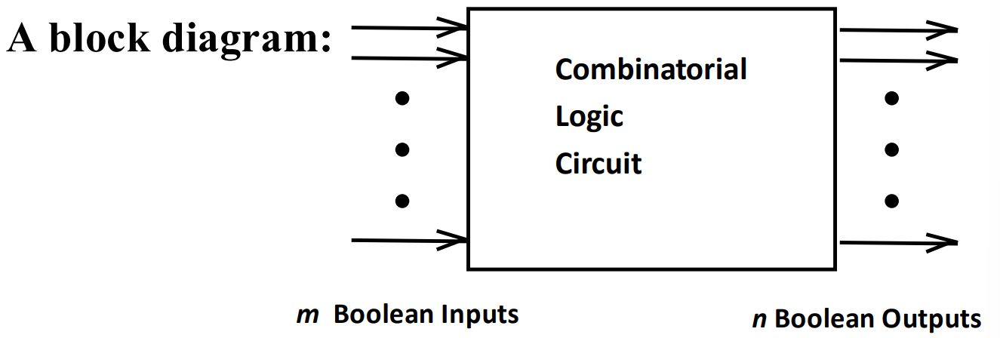

#### 1.2 层次化设计

为了控制复杂性，通常采用 **层次化设计 (Hierarchical Design)**：
* 将复杂功能分解为小 **块 (Blocks)**，直到分解为不可再分的 **原语块 (Primitive Block)**；
* 提倡使用经过验证的 **可复用功能块 (Reusable Functions)** 以提高设计效率。

组合逻辑电路的设计方法分为 **自顶向下** 和 **自底向上** 两种：
* **自顶向下 (Top-Down)**：从抽象的高层规范开始，逐步分解细化直到基础元件；
* **自底向上 (Bottom-Up)**：从底层的原语块开始，组合拼装成复杂的功能块；

一般从两个方向同时进行设计，自顶向下控制设计的复杂程度，自底向上设计细节。

#### 1.3 设计流程

1. **规范 (Specification)**：明确电路需要实现的功能（如：设计BCD到余三码的转换器）；
2. **列式 (Formulation)**：将规范转化为严格的数学模型，如推导输入和输出关系的 **真值表 (Truth Table)** 或 **初始的布尔逻辑方程**。如果合适就采用层次化设计；
3. **优化 (Optimization)**：对逻辑方程进行化简，得出逻辑图或"与或非" **网表 (Netlist)**：
	* **两级优化 (2-level)**：通常使用卡诺图化简，得到"与-或"形式的表达式；
	* **多级优化 (Multiple-level)**：通过代数变换提取公共因子（如 $T_1 = C+D$），减少总的逻辑门数量，但会增加电路的逻辑级数（级数增多会增加传播延迟）；
4. **技术映射 (Technology Mapping)**：将逻辑图或网表映射到所选实现技术；
5. **验证 (Verification)**：通过手动方式或使用仿真验证最终设计的正确性。

### 2. 芯片与单元
#### 2.1 芯片设计风格

芯片的**设计风格 (Chip Design Styles)** 主要有三种，成本与性能各异：
* **全定制 (Full custom)**：从底层的物理版图细节开始全面设计。成本极高，仅适用于对密度和速度要求极高且销量巨大的芯片；
* **标准单元 (Standard cell)**：使用预先设计好的逻辑块。成本和性能处于中间水平；
* **门阵列 (Gate array)**：芯片上预制了规则的晶体管阵列，设计时只需定制它们之间的连线。成本最低，但密度和速度受限。

#### 2.2 单元库技术

* **单元 (Cell)**：预先设计的原始块，用于门阵列、标准单元以及某些情况下的全定制芯片；
* **单元库 (Cell Libraries)**：特定实现技术下可用的预设计原语块集合；
* **单元表征 (Cell characterization)**：详细说明单元的物理和电气特性，如输入负载。
#### 2.3 集成电路

**集成电路 (integrated circuit)** 根据逻辑门的数量和复杂程度，分为以下几个等级：

| 集成电路                                        | 逻辑门数量         |
| ------------------------------------------- | ------------- |
| 小规模集成电路 (small-scale integrated, SSI)       | 不到 10 个逻辑门    |
| 中等规模集成电路 (medium-scale integrated, MSI)     | 10 ~ 100 个逻辑门 |
| 大规模集成电路(large-scale integrated, LSI)        | 成百上千个逻辑门      |
| 超大规模集成电路(very large-scale integrated, VLSI) | 成千上亿个逻辑门      |
### 3. 技术映射

**技术映射 (Technology Mapping)** 是将优化后的抽象逻辑图（通常由与、或、非门组成）转换并映射到目标单元库中实际存在的门（如仅使用 NAND 或仅使用 NOR 门）。
#### 3.1 映射与非门

将电路转换为仅用**与非门 (NAND)** 实现的算法：
1. **替换**：用等效的 NAND 模板替换原电路中的 AND 和 OR ；
2. **推入反相器 (Pushing inverters)**：将线路上的反相器沿着连线的扇出节点向后推移；
3. **消除成对反相 (Canceling inverter pairs)**：同一连线上相邻的两个反相器相互抵消。

    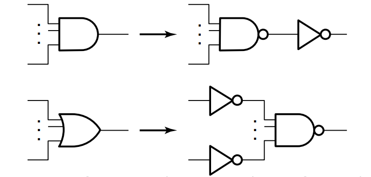
    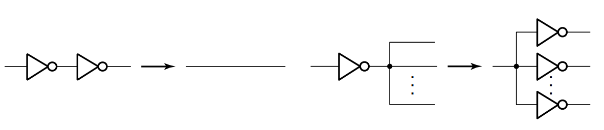

#### 3.2 映射或非门

映射为**或非门 (NOR)** 的过程与同样基于等效替换、节点推移和反相器消除的规则来进行。

    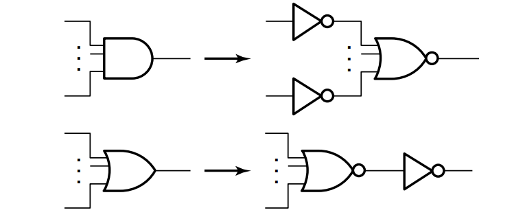
    

### 4. 电路验证
#### 4.1 手动分析

**手动分析 (Manual Logic Analysis)** 是一种逆向推导方法：从最终生成的逻辑电路图中提取出布尔方程，进而推导出其真值表，最后与步骤2（列式阶段）的原始真值表逐项对比。若完全一致则验证通过。
#### 4.2 仿真验证

* **仿真 (Simulation)**：通过提供测试输入序列，模拟电路实际运行情况并观察输出波形；
* 测试必须覆盖所有可能出现的**关心的输入组合 (Care input combinations)**。对于未定义的非法输入（如 BCD 码中的 1111），即 Don't Cares，仿真时不要求特定输出。
### 5. 基本逻辑函数

1. **定值函数 (value-fixing)**：$F=1$ 或 $F=0$ ，表示接高电平或低电平；
2. **传输函数 (transferring)**：$F=X$ ，不含布尔运算符；
3. **反相函数 (inverting)**：$F=\overline{X}$ ，包含一个逻辑门；
4. **使能函数 (enabling)**：$F=X\cdot EN$ 或 $F=X+\overline{EN}$ 包含一个或两个逻辑门：
	* $F=X\cdot EN$ 表示使能信号 $EN=1$ 时激活，否则输出恒为 $0$ ；
	* $F=X+\overline{EN}$ 表示使能信号 $EN=1$ 时激活，否则输出恒为 $1$ 。
### 6. 译码器

**译码器 (decoder)** 是将 $n$ 位二进制位转化到 $m$ 位二进制输出的器件，保证 $n\leq m\leq 2^n$ 使得每一个合法输入都有一个不同的输出。
#### 6.1 二进制译码器

给定 $n$ 位二进制代码，输出其对应的 **最小项**。因为任何组合逻辑函数都可以写成最小项之和的形式，所以 **可以用二进制译码器和或门来表示任意的组合逻辑**。译码器构造如下：
$$
\begin{cases}
2^{\frac{n}{2}}\text{ and }2^{\frac{n}{2}},&n\equiv0\mod2\\
2^{\frac{n-1}{2}}\text{ and }2^{\frac{n+1}{2}},&n\equiv1\mod2
\end{cases}
$$
重复以上步骤直到 $n=1$，当 $n=1$ 时使用 1-to-2 译码器即可完成构建。3-8译码器如下：

 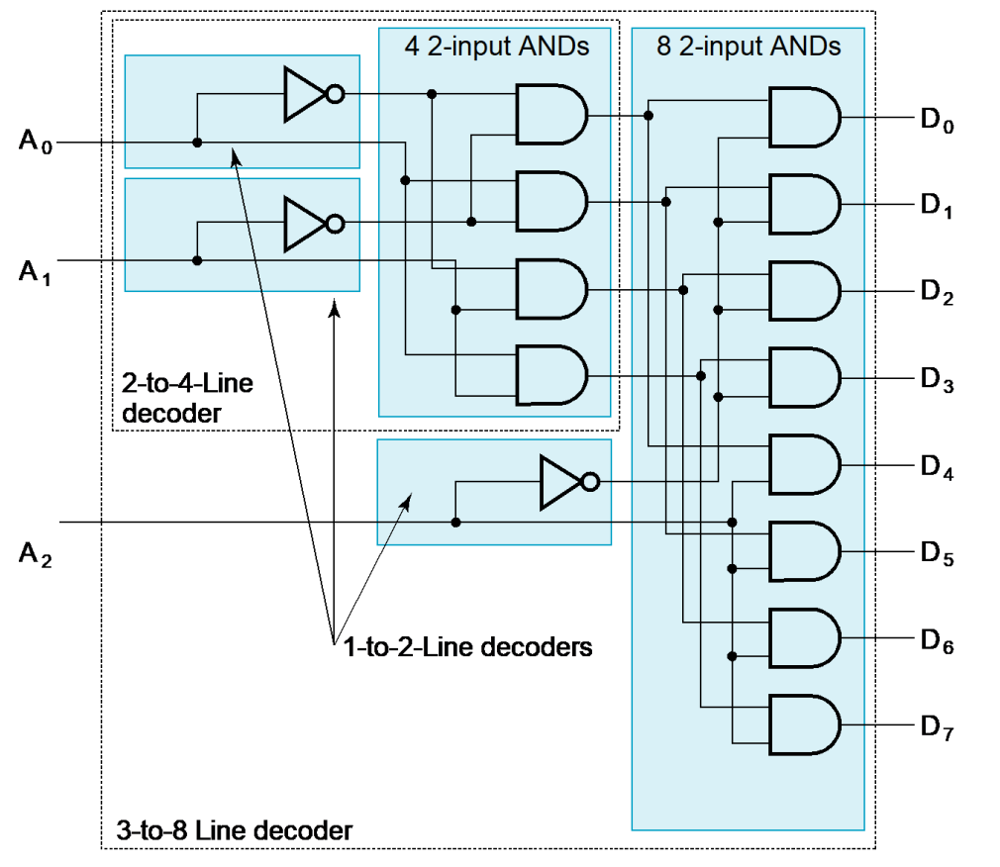 

#### 6.2 带使能的译码器

在译码器的基础上加入 **使能信号 EN** 来控制：当 EN 为 0 时无论输入，输出全为零；当 EN 为 1 时，输出对应的最小项。下图中为带使能的 2-4 译码器结构。

 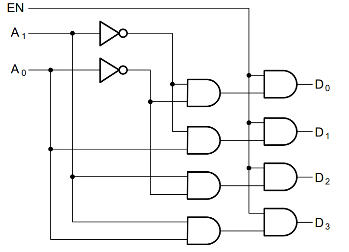 

带使能的译码器又称为 **解复用器 (demultiplexer)** 。可以通过解复用器，将来自一条输入线上的信息传送到 $2^n$ 条输入线中的指定一条，实现分配功能。一个带使能的 $n\text{-}2^n$ 译码器同时又是一个 $1\text{-}2^n$ 解复用器，输入为使能信号。 
### 7. 编码器

**编码 (encoding)** 是解码的逆过程，将 $m$ 位输入码转换为 $n$ 位输出码，其中 $n\leq m\leq 2^n$ ，使得每个有效输入产生一个唯一的输出码，执行编码的期间被称为 **编码器 (encoder)**。
#### 7.1 优先编码器

**优先编码器 (priority encoder)** 的作用是解决多个输入同时为 $1$ 时普通编码器输出不确定的问题，它会优先处理优先级最高的输入。以下表为例，当 $D_0$ 为 $1$ 时，无论剩余的输入是怎样的，输出的结果均为 $000$ 。该表有很多的无关项可以用于化简。

 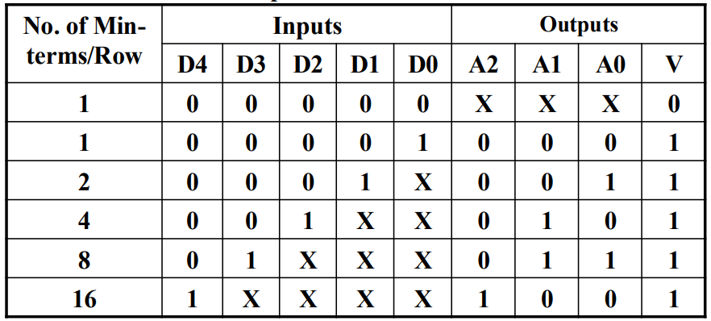 

#### 7.2 多路选择器

**多路选择器 (multiplexer)** 的功能是用一组 $n$ 位的输入信号，选择 $2^n$ 位的输入信号中的一路分配到输出。一般来说一个 $2^n\text{-}1$ 多路选择器需要有 $n\text{-}2^n$ 译码器和 $2^n$ 个与门及 $1$ 个或门。 

 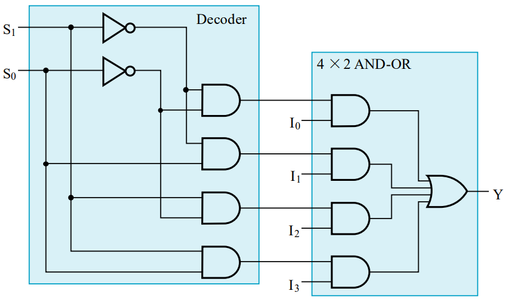 

对于一些场合，多选器需要选择的输入不止一位，下图是 $\text{4 bits 4-1 MUX}$ 的例子：

 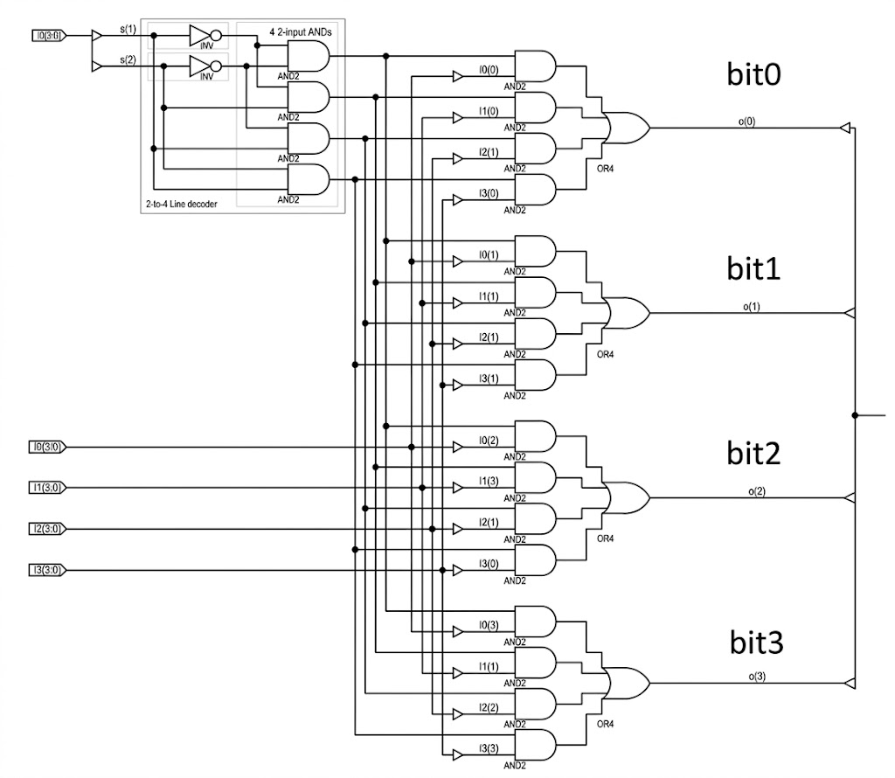 

可以通过一个 $m$ 位宽的 $2^n\text{-}1$ 多路选择器和一个反相器实现 $n+1$ 个变量的任意 $m$ 个函数：
1. 列出函数的真值表；
2. 根据前 $n$ 个变量的取值，将真值表的行分成若干对；
3. 针对每一对及每一个输出，定义一个关于最后一个变量的基本逻辑函数；
4. 以前 $n$ 个变量作为索引，将相应的初等函数固定到多路选择器的输入；
5. 使用反相器生成基本逻辑函数 $\overline{X}$ 。

 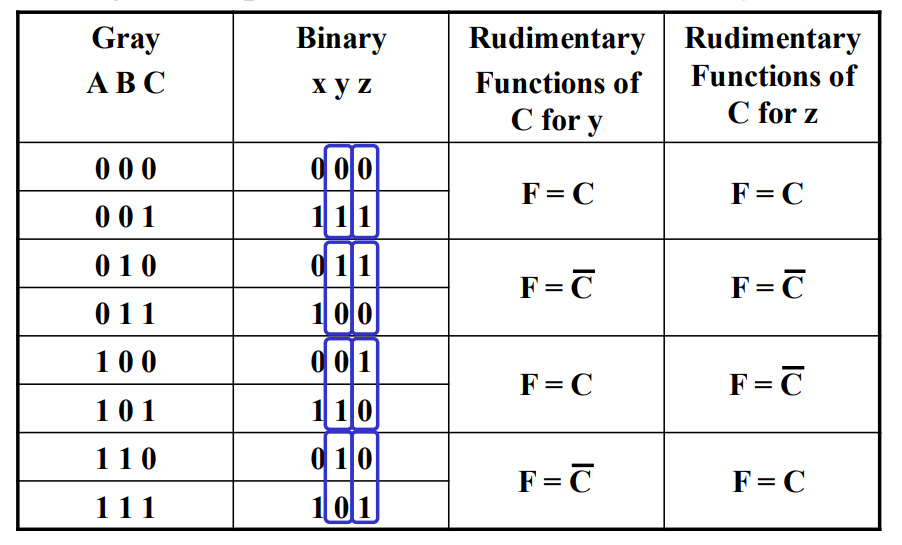 

 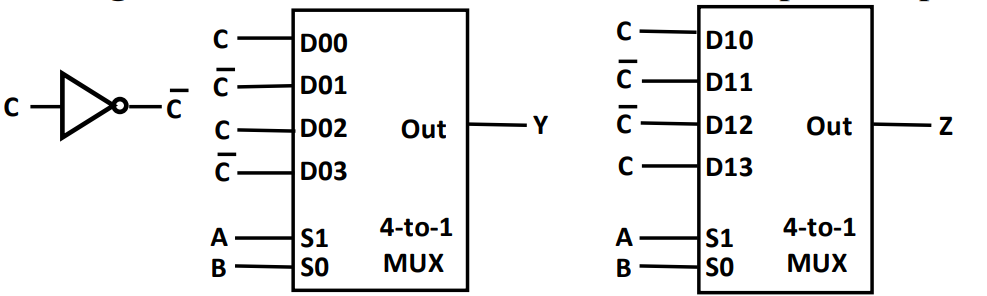 

### 8. 加法器
#### 8.1 半加器

**半加器 (half-adder)** 是实现两位相加的组合电路，定义 $X,Y$ 为输入，$S$ 为加和，$C$ 为进位，则根据真值表可以推导出输出 $S,C$ 的组合逻辑表达式和电路实现。

 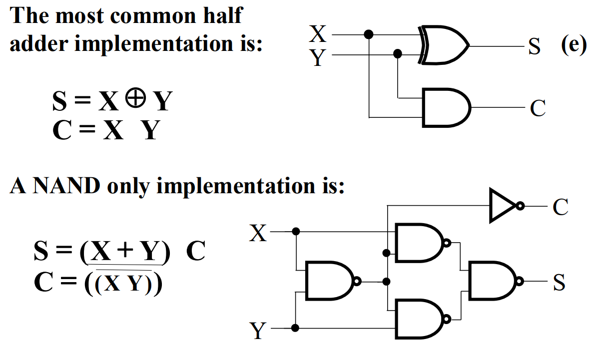 

#### 8.2 全加器

**全加器 (full-adder)**：是实现三位相加的组合逻辑电路，在半加器的基础上还引入进位。定义 $X,Y,Z$ 为输入，$S$ 为加和， $C$ 为进位，可以推导出 $S,C$ 的组合逻辑表达式和电路实现。

    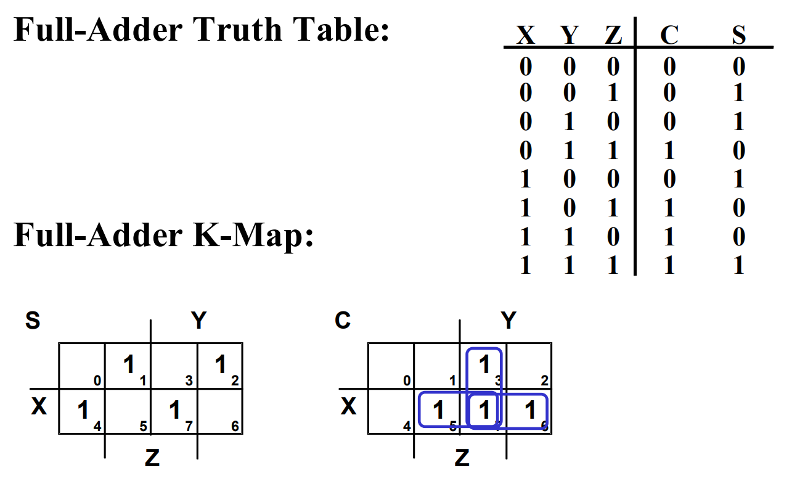
    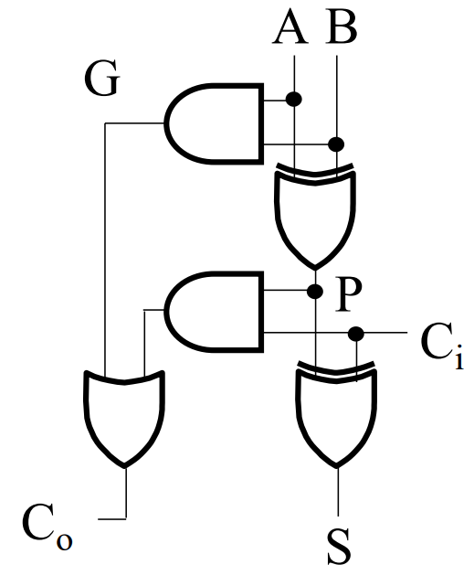

$$
\begin{align}
S&=X\overline{Y}\overline{Z}+\overline{X}Y\overline{Z}+\overline{XY}Z+XYZ=X\oplus Y\oplus Z\\
C&=XY+XZ+YZ=XY+(X\oplus Y)Z
\end{align}
$$
* **进位产生函数(carry generate function)**：$X\cdot Y$ 当 $X,Y$ 均为 $1$ 发生进位，记为 $G$；
* **进位传递函数(carry propagate function)**：$X\oplus Y$ 当 $X,Y$ 中恰有一个为 $1$ 时，如果收到来自低位的进位，就一定会进一步进位给高位，记为 $P$ 。

一个全加器相当于两个半加器组成，即先将 $X,Y$ 半加，再将进位与 $Z$ 半加。
#### 8.3 行波加法器

从低位开始，每一位等待低一位的进位计算完成后进行计算，并向高一位返回进位。

 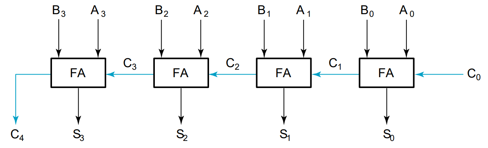 

#### 8.4 超前进位加法器

等待低一位的进位浪费了很多时间，可以通过把进位展开，直接计算进位。
$$
\begin{align}
&C_1=G_0+P_0\cdot C_0\\
&C_2=G_1+P_1\cdot C_1=G_1+P_1G_0+P_1P_0C_0\\
&C_3=G_2+P_2\cdot C_2=G_2+P_2G_1+P_2P_1G_0+P_2P_1P_0C_0\\
&C_4=G_3+P_3\cdot C_3=G_3+P_3G_2+P_3P_2G_1+P_3P_2P_1G_0+P_3P_2P_1P_0C_0
\end{align}
$$

 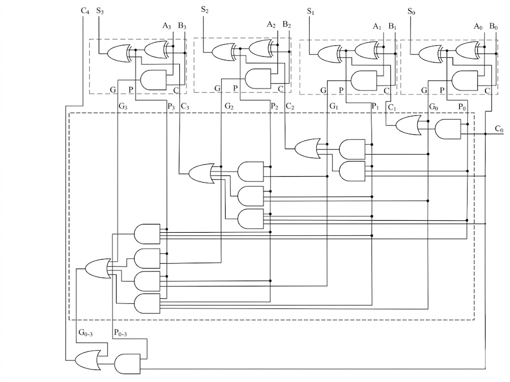 

考虑 4bit **超前进位加法器 (Carry Look-ahead Adder)** 的最大延迟：
1. 全加器部分：计算 $P_i$ 和 $G_i$ ，其中 $P_i$ 的异或门速度较慢，消耗 $3$ 单位时间； 
2. CLA 部分：均为经过一个与门和一个或门，消耗 $2$ 单位时间；
3. 最终进位：需要将进位与 $P_i$ 再进行依次异或，消耗 $3$ 单位时间。

因此该 4bit 超前进位加法器的最大延迟为 $3+2+3=8$ 个单位时间。

对于位数更多的超前进位加法器，由于逻辑门的扇入限制，无法只用一个逻辑门完成单一的与、或操作，且 CLA 的部分会以 $\mathcal{O}(n^2)$ 的复杂度上升，消耗的成本会很高。如果用分组超前进位加法器，将上图中的全加器用 4bit 超前进位加法器替代，就能实现 16bit 超前进位加法器。该分组超前进位加法器的最大延迟为：$3+2+2+2+3=12$ 个单位时间。

 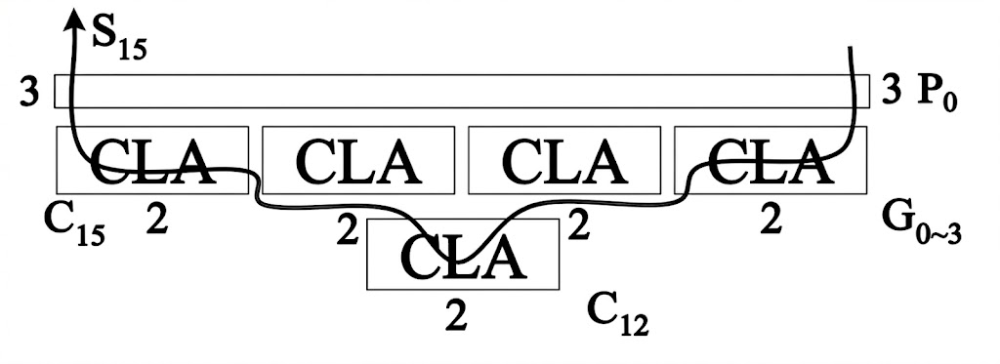 

#### 8.5 无符号减法

* **反码 (Binary 1's Complement)**：在原码的基础上，对负数的位取反；
* **补码 (Binary 2's Complement)**：在反码的基础上再加 $1$。

减法可以通过加上补码来完成，对每一位 **减数(subtrahend)** 的每一位取反后加上 **被减数(minuend)** 再加上 $1$ 即可得到结果。具体地，加法和减法通过控制是否取反的信号 $S$ 进行控制，下图为 4bit 支持减法的加法器实现。

 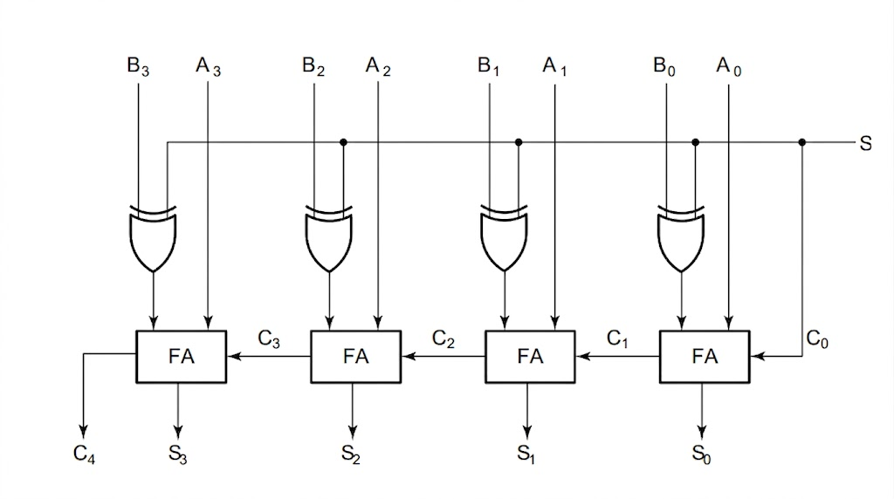 

当上图电路执行减法 ($S=1$) 时，实际结果和输出结果具有以下关系：
* 当 $C_4=0$ 时，则 $A-B>0$ ，此时得到的结果就是实际结果；
* 当 $C_4=1$ 时，即 $A-B\leq 0$ ，此时得到的结果是实际结果补码的相反数。

#### 8.6 有符号减法

* **原码 (Signed-Magnitude)**：包含符号位，低 $n-1$ 位表示其绝对值；
* **反码 (Signed 1's Complement)**：在原码的基础上，低 $n-1$ 位取反；
* **补码 (Signed 2's Complement)**：在反码的基础上再加1。

|  数值  |  原码   |  反码   |  补码   |
| :--: | :---: | :---: | :---: |
| $+2$ | $010$ | $010$ | $010$ |
| $+1$ | $001$ | $001$ | $001$ |
| $+0$ | $000$ | $000$ | $000$ |
| $-0$ | $100$ | $111$ |  $-$  |
| $-1$ | $101$ | $110$ | $111$ |
| $-2$ | $110$ | $101$ | $110$ |

对于有 $n$ 位的加法器，在同符号数字相加、异符号相减时均可能发生 **溢出**，判断溢出的条件是：$C_n\oplus C_{n-1}$ ，当该表达式的值为 $1$ 时发生了溢出，解释如下：
* $C_n=1,C_{n-1}=0$ 时，说明符号位没有被进位，但是相加发生了进位，说明 $A,B$ 符号位均为 $1$ 两数 **均为负数**，相加后结果的符号位为 $0$ 变成了正数；
* $C_n=0,C_{n-1}=1$ 时，说明符号位相加没有发生进位，但是被进位了，说明 $A,B$ 符号位均为 $0$ 两数 **均为正数**，相加后结果的符号位为 $1$ 变成了负数。