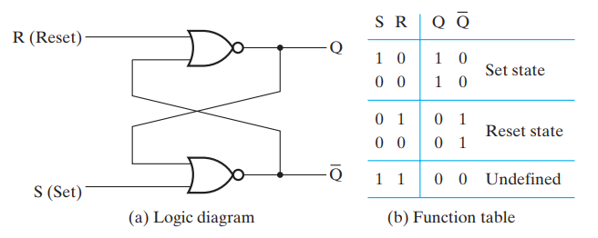

### 1. 时序电路

#### 1.1 时序电路定义

组合逻辑电路存在一个明显局限：输出仅取决于当前输入，无法实现信息的存储。而 **时序逻辑电路 (Sequential Logic Circuit)** 拥有存储信息的能力，某一时刻存储元件中的二进制信息称为该时刻时序电路的 **状态 (State)**。其任何时刻的稳态输出不仅取决于当前的输入，还与过去的输入（即电路当前的状态）有关。

根据内部状态改变的时间和机制，时序电路主要分为两类：

- **同步时序电路 (Synchronous)**：电路的状态变化由统一的时钟发生器产生的周期性时钟脉冲同步触发，其行为可以在离散的时间点上定义，设计相对容易且鲁棒性强；
- **异步时序电路 (Asynchronous)**：电路中没有统一的时钟信号，状态的变化直接由输入信号的改变引起。其行为与逻辑门的传播延迟密切相关，设计相对困难，但响应速度快。
#### 1.2 有限状态机

时序逻辑电路通常被抽象为 **有限状态机 (Finite State Machine, FSM)**。根据输出信号的依赖关系，状态机可分为两种经典模型：

- **摩尔型电路 (Moore Model)**：输出信号 **仅仅取决于当前状态**；
- **米利型电路 (Mealy Model)**：输出信号不仅取决于当前状态，**还取决于当前输入**。
### 2. 锁存器
#### 2.1 SR/S'R' 锁存器

  

SR 锁存器通过两个 **或非门** 实现。在四种状态中 $(S,R)=(1,1)$ 输入是 **未定义的**，虽然此时 $(Q,\overline{Q})=(0,0)$ 状态是确定的，但是当下一步输入变为 $(S,R)=(0,0)$ 时，由于电路延迟的存在，无法确定 $S$ 和 $R$ 哪一个先变为 $0$ ，导致无法确定下一状态。因此在实际电路设计中，一般避免使用这种未定义的状态。

  

S'R' 锁存器通过两个 **与非门** 实现。同样在四种状态中 $(\overline{S},\overline{R})=(0,0)$ 输入是未定义的。

SR 锁存器是 $1$ 触发的，即当 $(S,R)=(1,0)$ 时将 $Q$ 置为 $1$ ；S'R' 锁存器是 $0$ 触发的，即当 $(\overline{S},\overline{R})=(0,1)$ 时将  $Q$ 置为 $1$ 。从输入电平和输出电平的关系上来看，当输入的两个电平满足异或值为 $1$ 时（即不处于未定义装填和保持状态时），**对角的电平是相同的**。
#### 2.2 钟控 SR 锁存器

#### 2.3 D 锁存器

### 3. 触发器

### 4. 状态机

### 5. 延时分析
