### 1. 二值图像

| 彩色图像                                                                                     | 灰度图像                                                                                     | 二值图像                                                                                         |
| ---------------------------------------------------------------------------------------- | ---------------------------------------------------------------------------------------- | -------------------------------------------------------------------------------------------- |
| 

 | 

 | 

 |
#### 1.1 二值图像定义

**二值图像 (binary image)**：像素值只有 0 和 1 两种值，因此每个像素仅需 1 bit 空间。但是在实际编程中，我们通常用 0 和 255 两个值来分别表示 0 和 1。

二值图像具有以下 **优点**：更小的内存需求、运行速度更快、为二值图像开发的算法往往可以用于灰度级图像、更便宜。

二值图像具有以下 **缺点**：应用范围有限、无法推广到三维空间中、表现力欠缺，不能表现图像内部细节、无法控制对比度 (contrast)。
#### 1.2 大津法二值化

设图像总像素数为 $N$ ，全局平均灰度为 $\mu$ ，全局方差为 $\sigma^2$ ，在给定阈值 $T$ 下，图像被分为 **前景 (FG)** 和 **背景 (BG)** 两部分，令其像素数分别为 $N_\text{FG}$ 和 $N_\text{BG}$ ，则它们占全图权重为：
$$
W_\text{FG}=\frac{N_\text{FG}}{N},\quad 
W_\text{BG}=\frac{N_\text{BG}}{N}
$$
则有 $W_\text{FG}+W_\text{BG}=1$ ，全局平均灰度可以表示为两类均值的加权和：
$$
\mu=W_\text{FG}\cdot\mu_\text{FG}+W_\text{BG}\cdot\mu_\text{BG}
$$
类内方差 $\sigma^2_\text{within}$ 定义为两类方差的加权和，类间方差 $\sigma^2_\text{between}$ 等于全局方差减去类内方差：
$$
\begin{align}
\sigma_\text{within}^2
&=W_\text{FG}\cdot\sigma^2_\text{FG}+W_\text{BG}\cdot\sigma^2_\text{BG}\\
\sigma_\text{between}^2
&=\sigma^2-\sigma^2_\text{within}\\
&=\left(\frac{1}{N}\sum_{x,y}(f^2[x,y]-\mu^2)\right)
-W_\text{FG}\left(\frac{1}{N_\text{FG}}\sum_{x,y\in\text{FG}}(f^2[x,y]-\mu_\text{FG}^2)\right)\\
&\quad\quad
-W_\text{BG}\left(\frac{1}{N_\text{BG}}\sum_{x,y\in\text{BG}}(f^2[x,y]-\mu_\text{BG}^2)\right)
\end{align}
$$
>[!Note] **方差分解定理**
>设 $X$ 和 $Y$ 是两个随机变量，且 $Y$ 的方差 **有限**，则有以下公式：$$\text{Var(Y)=E[Var(Y|X)]+Var(E[Y|X])}$$
>* $\text{Var(Y)}$：全方差，表示随机变量 $Y$ 整体的波动程度；
>* $\text{E[Var(Y|X)]}$：条件方差的期望，表示在给定 $X$ 的情况下， $Y$ 仍然存在的波动（即 $X$ 无法解释的 $Y$ 的方差，又称 **组内方差** 或 **残差方差**）；
>* $\text{Var(E[Y|X])}$：条件期望的方差，表示由于 $X$ 的变化导致 $Y$ 的条件均值发生变化而产生的波动（即 $X$ 能解释的 $Y$ 的方差，又称为 **组间方差** 或 **解释方差**）。
>$$\begin{align}&\begin{cases}\text{E}[\text{Var}(Y|X)] = \text{E}[Y^2] - \text{E}\big[(\text{E}[Y|X])^2\big]\\\text{Var}(\text{E}[Y|X]) = \text{E}\big[(\text{E}[Y|X])^2\big] - (\text{E}[Y])^2\end{cases}\\&\Rightarrow\quad\text{E}[\text{Var}(Y|X)]+\text{Var}(\text{E}[Y|X])= \text{E}[Y^2]- (\text{E}[Y])^2=\text{Var}(Y)\end{align}$$

而由于 $\sum_{x,y}f^2[x,y]=\sum_{x,y\in\text{FG}}f^2[x,y]+\sum_{x,y\in\text{BG}}f^2[x,y]$ ，代入上式化简得：
$$
\begin{align}
\sigma^2_\text{between}
&=-\mu^2+W_\text{FG}\cdot\mu_\text{FG}^2+W_\text{BG}\cdot\mu_\text{BG}^2\\
&=W_\text{FG}\cdot(\mu_\text{FG}-\mu)^2+W_\text{BG}\cdot(\mu_\text{BG}-\mu)^2
\end{align}
$$
将 $\mu = W_\text{FG}\cdot\mu_\text{FG} + W_\text{BG}\cdot\mu_\text{BG}$ 代入上式，并利用 $W_\text{FG}+W_\text{BG}=1$ 进行展开：
$$
\begin{aligned}
\sigma_\text{between}^2
&= W_\text{FG} \big( (1 - W_\text{FG})\mu_\text{FG} - W_\text{BG}\cdot\mu_\text{BG} \big)^2 + W_\text{BG} \big( (1 - W_\text{BG})\mu_\text{BG} - W_\text{FG}\cdot\mu_\text{FG} \big)^2 \\
&= W_\text{FG} \big( W_\text{BG}\cdot\mu_\text{FG} - W_\text{BG}\cdot\mu_\text{BG} \big)^2 + W_\text{BG} \big( W_\text{FG}\cdot\mu_\text{BG} - W_\text{FG}\cdot\mu_\text{FG} \big)^2 \\
&= W_\text{FG}\cdot W_\text{BG}^2 \cdot (\mu_\text{FG} - \mu_\text{BG})^2 + W_\text{BG}\cdot W_\text{FG}^2 \cdot (\mu_\text{BG} - \mu_\text{FG})^2 \\
&= W_\text{FG}\cdot W_\text{BG} \cdot (W_\text{BG} + W_\text{FG}) \cdot (\mu_\text{FG} - \mu_\text{BG})^2 \\
&= W_\text{FG}\cdot W_\text{BG} \cdot (\mu_\text{FG} - \mu_\text{BG})^2
\end{aligned}
$$
综合以上推导过程，得到最终结果：
$$
\boxed
{
\begin{align}
\sigma_\text{within}^2
&=W_\text{FG}\cdot\sigma^2_\text{FG}+W_\text{BG}\cdot\sigma^2_\text{BG}\\
\sigma_\text{between}^2
&=W_\text{FG}\cdot W_\text{BG}\cdot(\mu_\text{FG}-\mu_\text{BG})^2
\end{align}
}
$$
>[!Note] **大津法加速原理**
>* $\sigma^2 = \sigma_\text{within}^2 + \sigma_\text{between}^2$，所以**最小化类内方差**在数学上等价于**最大化类间方差**。
>* 直接计算“类内方差”需要遍历每个像素来求像素值与类均值的差的平方，计算量极大。
>* 大津法发现，类间方差可以仅用 **类权重** 和 **类均值** 来表示。寻找最佳阈值 $T$ 时，不需要做复杂的像素级方差计算。只需要利用图像的灰度直方图快速算出不同 $T$ 下的前景/背景像素占比和均值，就能得到 $\sigma_\text{between}^2$。使该式最大的 $T$，即为最佳分割阈值。

### 2. 形态学操作

|    结构元素     |                                               腐蚀图像                                               |                                               膨胀图像                                               |                                              开操作图像                                               |                                              闭操作图像                                               |
| :---------: | :----------------------------------------------------------------------------------------------: | :----------------------------------------------------------------------------------------------: | :----------------------------------------------------------------------------------------------: | :----------------------------------------------------------------------------------------------: |
| $3\times 3$ | 
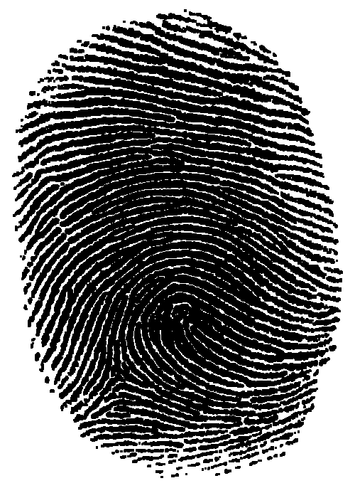
 | 
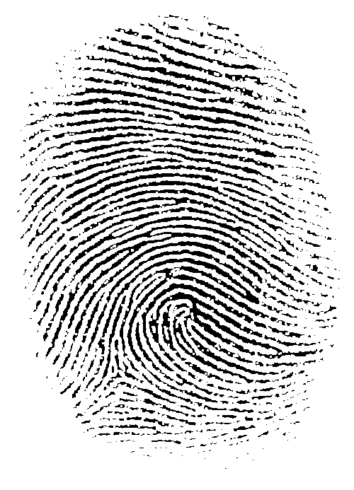
 | 
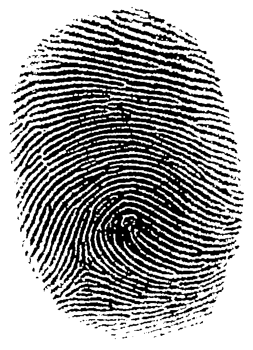
 | 
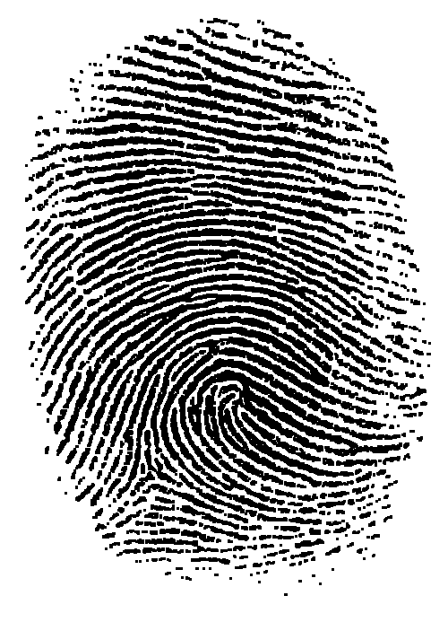
 |
| $5\times 5$ | 
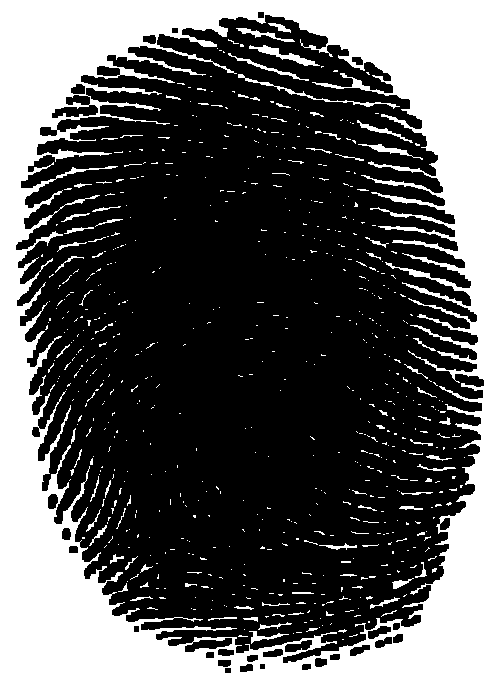
 | 
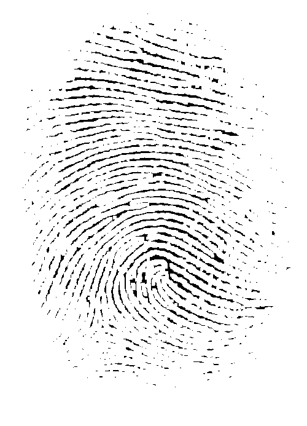
 | 
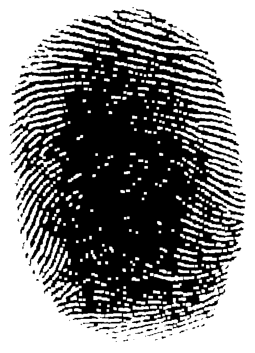
 | 
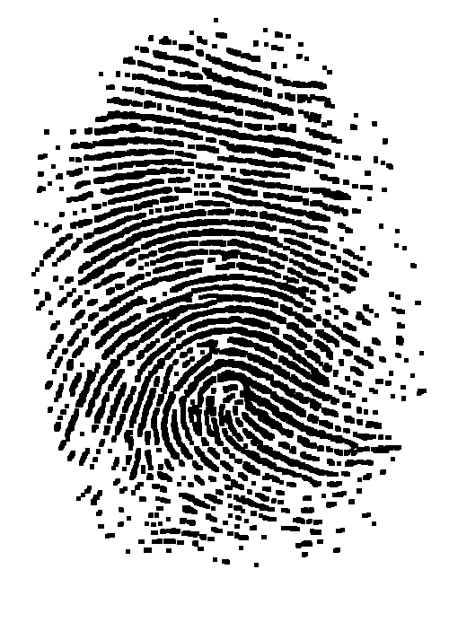
 |
| $7\times 7$ | 
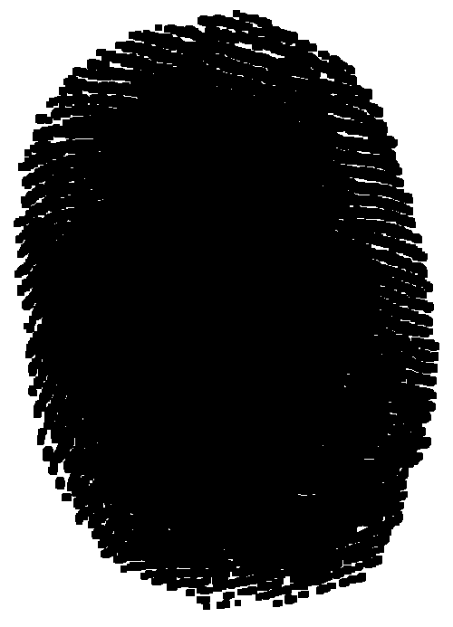
 | 
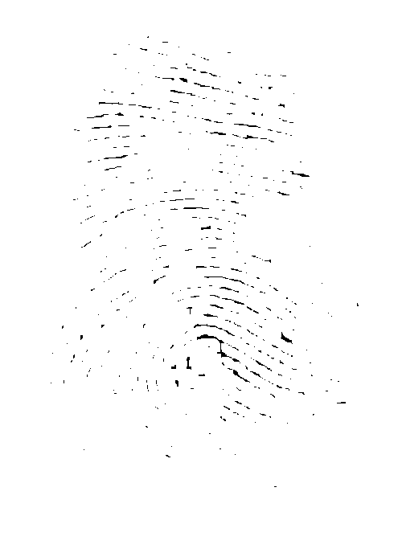
 | 
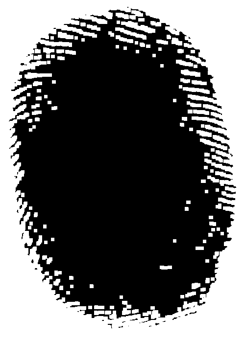
 | 
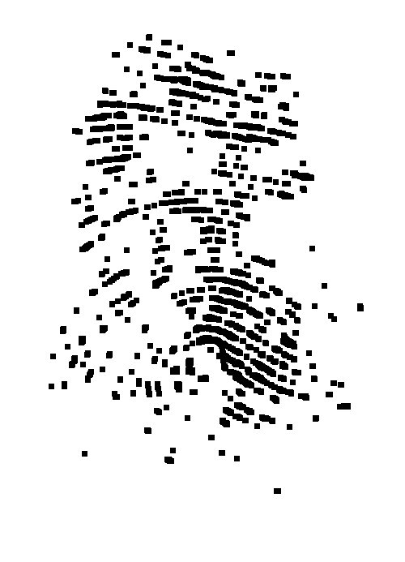
 |

【注】上图中黑色为背景，白色为前景。
#### 2.1 腐蚀操作

图像 $A$ 被结构元素 $B$ **腐蚀 (erosion)** ，记为 $A\ominus B$ 。数学定义为，所有使得平移后的结构元素 $B_z$ 完全包含于 $A$ 的原点 $z$ 的集合：
$$
A\ominus B=\{z|B_z\subseteq A\}
$$
或者等效表示为：对于结构元素覆盖的区域，只有当所有对应像素全为 $1$ 时，中心像素才输出 $1$ ，只要有一个为 $0$ ，中心像素就变成 $0$ 。

>[!Note] **腐蚀的物理意义与效果**
>* **剥皮效应**：是目标边界向内收缩，消除边界上一层等于结构元素半径的像素；
>* **消除噪点**：能够彻底去除尺寸小于结构元素的孤立亮点（毛刺或背景中的小块噪声）；
>* **断开连接**：可以将两个原本通过细长“桥梁”连接的较大物体断开。
#### 2.2 膨胀操作

图像 $A$ 被结构元素 $B$ **膨胀 (dilation)** ，记为 $A\oplus B$ 。数学定义为，反射后的结构元素 $\hat{B_z}$ 与 $A$ 的交集不为空的所有原点 $z$ 的集合：
$$
A\oplus B=\{z|(\hat{B_z}\cap A)\neq\emptyset\}
$$
或者等效表示为：对于结构元素覆盖的区域，只要有一个像素为 1，中心像素就输出 1；只有全部像素均为 0，才输出 0。

>[!Note] **膨胀的物理意义与效果**
>* **长肉效应**：使目标边界向外扩张，增加目标物体的面积；
>* **填补孔洞**： 能够填补目标物体内部尺寸小于结构元素的孔洞和裂缝；
>* **桥接连通域**：可以将两个距离非常近的物体合并连通在一起。

>[!Note] **膨胀与腐蚀的对偶性**
>对前景的膨胀等价于对背景的腐蚀；对前景的腐蚀等价于对背景的膨胀：$$\begin{cases}(A\ominus B)^c=A^c\oplus\hat{B}\\(A\oplus B)^c=A^c\ominus\hat{B}\end{cases}$$
>【注】上标 $c$ 表示集合的补集，即将前景与背景翻转。
#### 2.3 开运算操作

图像 $A$ 被结构元素 $B$ 的 **开运算 (opening)**，记为 $A\circ B$ ，它是先对图像进行腐蚀，接着利用相同的结构元素进行膨胀的过程：
$$
A\circ B=(A\ominus B)\oplus B=\bigcup_{B_z\subseteq A}B_z
$$
或者等效表示为：将结构元素 $B$ 在图像 $A$ 的内部到处平移，所有 $B$ 能够完全放进去的区域的并集，就是开运算的结果。

>[!Note] **开运算的物理意义与效果**
>* **断开狭窄连接，去除细小突出物**：第一步的腐蚀消除了细小噪点和细小连接，第二步的膨胀恢复了主要目标物体的原本尺寸，但已经被腐蚀掉的噪点无法被恢复；
>* **平滑对象轮廓**： 其过程类似于非线性的低通滤波器。它能有效剔除目标边缘向外突出的尖锐毛刺，使物体轮廓在几何形态上更趋于圆滑；
>* **适用场景**：去除背景中的孤立小噪点，同时保持主题的全局几何比例不发生显著扩张。
#### 2.4 闭运算操作

图像 $A$ 被结构元素 $B$ 的 **闭运算 (closing)** ，记为 $A\bullet B$ ，它是对图像先进行膨胀，截止利用相同的结构元素进行腐蚀的过程：
$$
A\bullet B=(A\oplus B)\ominus B=\bigcap\{(B_z)^c|B_z\cap A=\emptyset\}
$$或者等效表示为：将结构元素 $B$ 在图像 $A$ 的外部（背景区域）到处平移，所有 $B$ 无法完全进入的区域的并集，就是闭运算的结果。

>[!Note] **闭运算的物理意义与效果**
>* **填充孔洞与桥接裂缝：** 第一步的膨胀能够填充物体内部的小型空洞，并连接相邻较近的断裂区域；第二步的腐蚀则恢复了主要目标的原本尺寸。由于膨胀已将细小缝隙填满，随后的腐蚀无法再将其“还原”为缺失状态；
>* **平滑内凹轮廓：** 其过程类似于非线性的高通分量抑制。它能有效填补目标边缘向内凹陷的细小沟槽，使物体轮廓在几何形态上更趋于饱满和连滑；
>* **适用场景：** 消除目标物体内部的孤立小孔洞或连接断开的邻近区域，同时保持主题的全局几何比例不发生显著扩张。