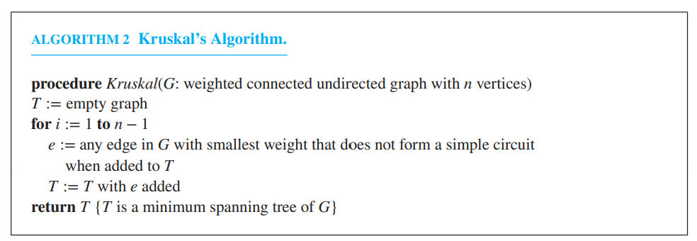
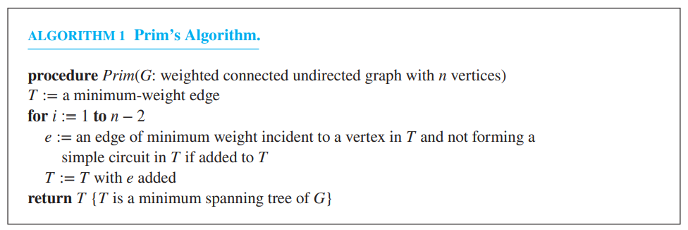

### Word Table
| 术语             | 翻译   | 术语                | 翻译   | 术语        | 翻译   |
| -------------- | ---- | ----------------- | ---- | --------- | ---- |
| parent         | 父节点  | child             | 子节点  | leaf      | 叶子节点 |
| ancestor       | 祖先节点 | internal vertices | 内部节点 | subtree   | 子树   |
| sibling        | 兄弟节点 | descendant        | 后代节点 | encode    | 编码   |
| preorder       | 先序   | inorder           | 中序   | postorder | 后序   |
| spanning trees | 生成树  |                   |      |           |      |
### Definition of Trees 

A tree is a connected undirected graph with no simple circuits

An undirected graph is a tree if and only if there is a unique simple path between any two of its vertices
### Rooted Trees

A rooted tree is a tree in which one vertex has been designated as the root and every edge is directed away from the root.

**m-ary tree**: every internal vertex has no more than $m$ children.
**full m-ary tree**: every internal vertex has exactly $m$ children
**binary tree**: An m-ary tree with $m=2$

An **ordered rooted tree** is a rooted tree where the children of each internal vertex are ordered.
### Properties of Trees

A tree with $n$ vertices has $n-1$ edges
A full m-ary tree with $i$ internal vertices contains $n=mi+1$ vertices

A full m-ary with
* $n$ vertices has $i=(n-1)/m$ internal vertices and $l=[(m-1)n+1]/m$ leaves
* $i$ internal vertices has $n=mi+1$ vertices and $l=(m-1)i+1$ leaves
* $l$ leaves has $n=(ml-1)/(m-1)$ vertices and $i=(l-1)/(m-1)$ internal vertices

The level of a vertex $v$ is the length of the unique path from the root to this vertex. 
The level of the root is defined to be zero. 
The height of a rooted tree is the maximum of the levels of vertices.
A rooted m-ary tree of height $h$ is balanced if all leave are at level $h$ or $h-1$
There are at most $m^h$ leaves in an m-ary tree of height $h$ 

If an m-ary tree of height $h$ has $l$ leaves, then $h\geq\lceil \log_ml\rceil$  
If the m-ary tree if full and balanced, then $h=\lceil\log_ml\rceil$
### Expression Notations

We obtain the prefix form of an expression when we traverse its rooted tree in **preorder**
Expressions written in prefix form are said to be in **Polish notation**

We obtain the postfix form of an expression by traversing its binary tree in **postorder**
Expressions written in postfix form are said to be in reverse **Polish notation**
### Spanning Trees

Let $G$ be a simple graph. A spanning tree of $G$ is a subgraph of $G$ is a tree obtaining every vertex of $G$

A simple graph is connected if and only if it has a spanning tree
### Minimum Spanning Trees

A minimum spanning tree in a connected weighted graph is a spanning tree that has the smallest possible sum of weights of its edges.

