### 1. 随机事件的信息

#### 1.1 概率空间

对于随机变量的 **概率空间** $\{X,\mathcal{X},p(x)\}$ ，有如下定义与约束： 

*  $\mathcal{X}$ 为 $X$ 的 **取值空间**，$\mathcal{X}=\{x_k|k=1,2,\cdots,K\}$
* $p(x)$ 为事件 $\{X=x\}$ 发生的 **概率**，$p(x)\geq0,\sum_{x\in\mathcal{X}}p(x)=1$

对于 **联合变量对** $(X,Y)$ 的二维随机变量 $\{(X,Y),\mathcal{X}\times\mathcal{Y},p(x,y)\}$ ,有如下定义与约束：

* $p(x,y)=P\{X=x,Y=y\}$
* $\mathcal{X}=\{x_k|k=1,2,\cdots,K\},\mathcal{Y}=\{y_j|j=1,2,\cdots,J\}$
#### 1.2 事件的自信息

对于概率空间 $\{X,\mathcal{X},p(x)\}$ ，事件 $\{X=x\}$ 的 **自信息** 定义为：$$
I(x)=-\log_ap(x)
$$ 当 $a=2$ 时单位为 **比特** bit ，当$a=e$ 时单位为 **奈特** nat。

- **性质1**：$p(x)$ 越大，$I(x)$ 越小，概率越小的事件其自信息越大。
- **性质2**：$p(x)=1$ , $I(x)=0$ ，确定事件的自信息为零。
- **性质3**：$p(x)\rightarrow0$ , $I(x)=\infty$。

> [!Note] **事件自信息的本质**
> 1、事件发生后对外界所提供的信息量；\
> 2、事件发生前外界为确证该事件发生所需的信息量；\
> 3、事件的自信息 **不代表** 事件的不确定性。

二维随机变量 $\{(X,Y),\mathcal{X}\times\mathcal{Y},p(x,y)\}$ ，事件 $\{Y=y\}$ 与事件 $\{X=x\}$ 之间的 **联合自信息**定义为：
$$
I(x,y)=-\log p(x,y)
$$
> [!Note] **事件的联合自信息的本质**
> 事件 $\{X=x\}$ 和 $\{Y=y\}$ 同时发生需要的或同时发生后对外界提供的信息量。

二维随机变量 $\{(X,Y),\mathcal{X}\times\mathcal{Y},p(x,y)\}$ ，事件 $\{Y=y\}$ 发生的条件下事件 $\{X=x\}$ 的**条件自信息定义**为：
$$
I(x|y)=-\log p(x|y)=-\log p(x,y)+\log p(y)=I(x,y)-I(y)
$$
- **性质1**：若 $\{Y=y\}$ 与 $\{X=x\}$ 为 **无关事件**，则有 $I(x)=I(x|y)$。

 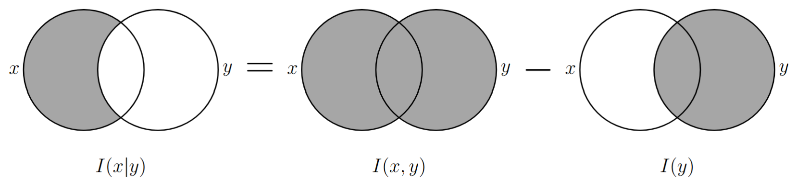 

> [!Note] **事件条件自信息的本质**
> 1、事件 $\{Y=y\}$ 发生后，$\{X=x\}$ 如果再发生需要的新的信息量；\
> 2、事件 $\{Y=y\}$ 发生后，如果 $\{X=x\}$ 再发生提供给外界的信息量。

#### 1.3 事件的互信息

二维随机变量 $\{(X,Y),\mathcal{X}\times\mathcal{Y},p(x,y)\}$ ，事件 $\{Y=y\}$ 与事件 $\{X=x\}$ 之间的 **互信息** 定义为：
$$
\begin{align}
I(x;y)
&=I(x)-I(x|y)
=-\log p(x)-\{-\log p(x|y)\}\\
&=\log\frac{p(x|y)}{p(x)}
=\log\frac{p(x,y)}{p(x)\cdot p(y)}
=\log\frac{p(y|x)}{p(y)}
=I(y;x)
\end{align}
$$
- **性质1**：$I(x;y)=I(y;x)$ 用条件概率的定义展开即可证明。
- **性质2**：若 $\{Y=y\}$ 与 $\{X=x\}$ 为 **无关事件**，则有 $I(x;y)=0$。

 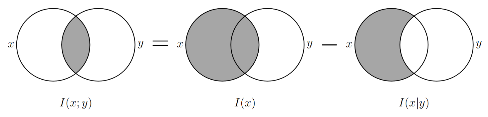 

> [!Note] **事件互信息的本质**
> 事件 $\{Y=y\}$ 发生后对事件 $\{X=x\}$ 不确定性的 **降低量（可正可负）**。
>
> **注：** 此处的解释不甚完美，在事件的自信息的解释中不将 $I(x)$ 视为不确定性的表现，此处却引入了不确定性。由于 $x$ 和 $y$ 的位置互换不影响互信息的值，不妨观察上述定义式，对于等式第二行的中间结果可以得到：
>$$I(x;y)=I(x)+I(y)-I(x,y)$$即事件 $\{X=x\}$ 与 $\{Y=y\}$ 的自信息之和与二者的联合自信息之差，因此互信息应解释为：两个信息同时发生时，是产生了新信息（负）还是产生了冗余信息（正），或解释为两个信息同时发生时产生冗余信息的程度。

联合事件 $\{Y=y,Z=z\}$ 与事件 $\{X=x\}$ 之间的 **互信息** 为：
$$
I(x;y,z)=\log\frac{p(x|y,z)}{p(x)}=\log\frac{p(x,y,z)}{p(x)\cdot p(y,z)}
$$
$$
\begin{align}
I(x;y,z)
&=\log\frac{p(x|y,z)}{p(x)}
=\log\frac{p(x|y)\cdot p(x|y,z)}{p(x)\cdot p(x|y)}
=\log\frac{p(x|y)}{p(x)}+\log\frac{p(x|y,z)}{p(x|y)}\\
&=I(x;y)+I(x;z|y)
\end{align}
$$

 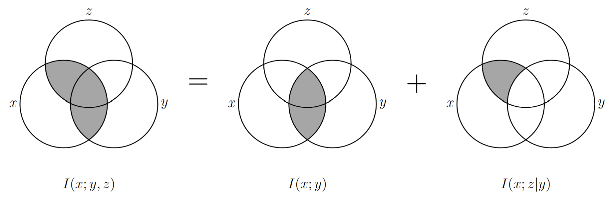 

>[!Note] **事件的联合互信息的本质**
>表示事件 $\{Y=y,Z=z\}$ 联合提供给事件 $\{X=x\}$ 的信息量。

在给定 $Z=z$ 的条件下，事件 $X=x$ 与 $Y=y$ 之间的 **条件互信息** 为：
$$
I(x;y|z)=\log\frac{p(x|y,z)}{p(x|z)}=\log\frac{p(x,y|z)}{p(x|z)\cdot p(y|z)}=I(x|z)+I(y|z)-I(x,y|z)
$$

 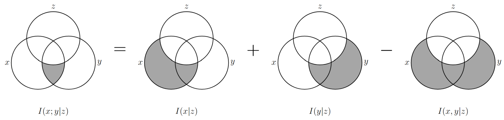 

>[!Note] **事件的条件互信息的本质**
>表示事件 $\{Z=z\}$ 发生时，事件 $\{X=x\}$ 与 $\{Y=y\}$ 相互之间提供的信息量。
### 2. 随机变量的熵

#### 2.1 香农熵的定义

随机变量的 **熵** 定义为随机变量各个事件的 **平均自信息**：
$$
H(X)
=E[I(X)]
=\sum_{x\in\mathcal{X}}p(x)I(x)
=-\sum_{x\in\mathcal{X}}p(x)\log p(x)
$$
> [!Note] **熵与自信息的区别：**
> 熵针对的是随机变量，自信息针对具体的事件。熵是随机 **变量不确定性** 的度量。

随机变量的 **联合熵** 定义为随机变量各个事件的 **平均联合自信息**：
$$
H(X,Y)=E[I(X,Y)]=-\sum_{x\in\mathcal{X},y\in\mathcal{Y}}p(x,y)\log p(x,y)
$$
给定 $Y=y$ 的条件下，$X$ 的 **条件熵** 为：
$$
H(X|y)
=\sum_{x\in\mathcal{X}}p(x|y)I(x|y)
=-\sum_{x\in\mathcal{X}}p(x|y)\log p(x|y)
$$
随机变量 $X$ 相对于随机变量 $Y$ 的 **条件熵** 为：
$$
H(X|Y)
=E[H(X|y)]
=-\sum_{x\in\mathcal{X}}\sum_{y\in\mathcal{Y}}p(x,y)\log p(x|y)
$$
- **性质1**：$X$ 和 $Y$ **统计独立** 时，有 $H(X|Y)=H(X)$。
- **性质2**：$X$ 和 $Y$ 的联合熵满足 **链式法则**。
$$
H(X,Y)=H(X)+H(Y|X)=H(Y)+H(X|Y)
$$
$$
\begin{align}
H(X,Y)&=E[I(X,Y)]
=-\sum_{x\in\mathcal{X}}\sum_{y\in\mathcal{Y}}p(x,y)\log p(x,y)\\
&=-\sum_{x\in\mathcal{X}}\sum_{y\in\mathcal{Y}}p(x,y)\log p(x)-
\sum_{x\in\mathcal{X}}\sum_{y\in\mathcal{Y}}p(x,y)\log p(y|x)\\
&=H(X)+H(Y|X)
\end{align}
$$
$$
H(X,Y,Z)=H(X)+H(Y,Z|X)=H(X)+H(Y|Z)+H(Z|X,Y)
$$

 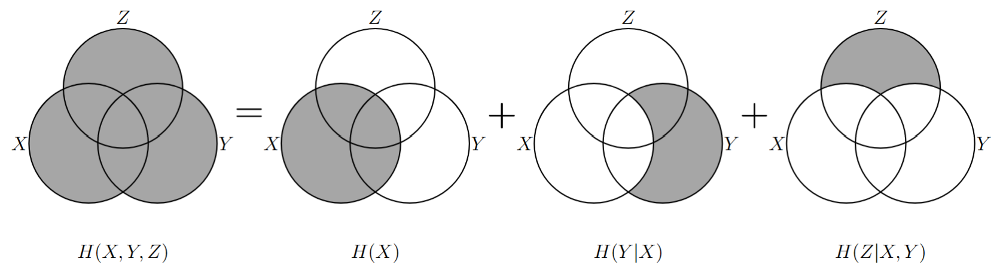 

- **性质3**：$X$ 和 $Y$ **统计独立** 时，有 $H(X,Y)=H(X)+H(Y)$。
#### 2.2 香农熵的性质

$$
X\sim
\begin{pmatrix}
x_1&x_2&\cdots&x_K\\
p_1&p_2&\cdots&p_K
\end{pmatrix}
$$$$
H(X)
\triangleq H_K(p_1,p_2,\cdots,p_K)
\triangleq H_K(P)
=-\sum_{k=1}^{K}p_k\log p_k
$$
- **对称性**，香农熵的值与概率矢量各分量的排列顺序无关，仅取决于概率值的集合；
- **非负性** ，即 $H_K(P)\geq 0$ ，由于随机事件的自信息非负，香农熵是平均自信息也非负；
- **确定性** ，若 $P=(p_1,p_2,\cdots,p_K)$ 中有一个分量为 $1$ ，其余均为零，则 $H_K(P)=0$；
- **可扩展性** ，即 $\lim_{\epsilon\rightarrow0}H_{K+1}(p_1,p_2,\cdots,p_K-\epsilon,\epsilon)=H_K(p_1,p_2,\cdots,p_K)$；
- **可加性** ，$H(X_2)|_{X_2\in\mathcal{X}_2}=H(X_1)|_{X_1\in\mathcal{X}_1}+H(X_2|X_1)|_{X_2\in\mathcal{X}_2}^{X_1\in\mathcal{X}_1}$；

 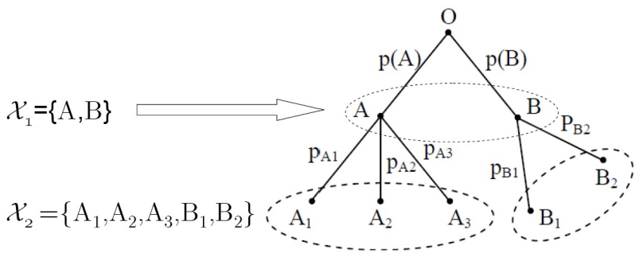 

> [!Note] **链式法则**
> - 对变量 $X$ 可以进行多步分层的观察，每一步都可从上一步的观察结果中得到更为细致的结果，变量 $X$ 在最后的观察结果集合中的不确定性等于第一次观察结果的不确定性，加上其后每次观察结果在前一次观察结果已知的前提下的条件不确定性。
> - 熵的可加性对应前文 $H(X,Y)=H(X)+H(Y|X)$ ，其中 $X=X_1,Y=X_2$ ，而在此场景下确定了 $X_2$ 就能确定其对应的 $X_1$ ,有 $H(X_1,X_2)=H(X_2)$。

- **极值性** ，$H_K(p_1,p_2,\cdots,p_K)\leq H_K(\frac{1}{K},\frac{1}{K},\cdots,\frac{1}{K})=\log K$；
$$
\begin{align}
&H_K(p_1,p_2,\cdots,p_K)+\sum_{k=1}^Kp_k\log q_k=\sum_{k=1}^K p_k\log\frac{q_k}{p_k}\leq\log\mathrm{e}\cdot\sum_{k=1}^Kp_k(\frac{q_k}{p_k}-1)=0\\
&\Rightarrow H_K(p_1,p_2,\cdots,p_K)\leq-\sum_{k=1}^Kp_k\log q_k
\end{align}
$$
-  **条件熵小于熵**，增加条件使熵减少 $H(X|Y)\leq H(X)$；
$$
\begin{align}
H(X|Y)
&=E[H(X|y)]=-\sum_{x\in\mathcal{X}}\sum_{y\in\mathcal{Y}}p(x,y)\log p(x|y)\\
&=-\sum_{y\in\mathcal{Y}}p(y)(\sum_{x\in\mathcal{X}}p(x|y)\log p(x|y))\\
&\leq -\sum_{y\in\mathcal{Y}}p(y)(\sum_{x\in\mathcal{X}}p(x|y)\log p(x))\\
&=-\sum_{x\in\mathcal{X}}p(x)\log p(x)=H(X)
\end{align}
$$
- **凸性**， $H_K(P)$ 是 $P=(p_1,p_2,\cdots,p_K)$ 的 **严格上凸函数**，即对任何 $\theta,0<\theta<1$ ，和任何两个 $K$ 维概率矢量 $P_1,P_2,P_1\neq P_2$ ，有：
$$
H_K(\theta P_1+(1-\theta)P_2)>\theta H_K(P_1)+(1-\theta)H_K(P_2)
$$
#### 2.3 凸集与凸函数

令 $\alpha=(\alpha_1,\alpha_2,\cdots,\alpha_k),\beta=(\beta_1,\beta_2,\cdots,\beta_k)$ 是 $k$ 维矢量空间集合 $R$ 中的任何两个矢量，如果对于任何实数 $\theta (0\leq\theta\leq1)$ 有：$\theta\alpha+(1-\theta)\beta\in R$ ，则称 $R$ 为 **凸集合**。

定义在凸集合 $R$ 上的实值矢量函数 $f$ 被称为 **上凸函数**，当且仅当对任何两个矢量 $\alpha,\beta$ 及实数 $\theta (0\leq\theta\leq1)$ 有 $\theta f(\alpha)+(1-\theta)f(\beta)\leq f[\theta\alpha+(1-\theta)\beta]$。若不等号翻转为下凸函数。

 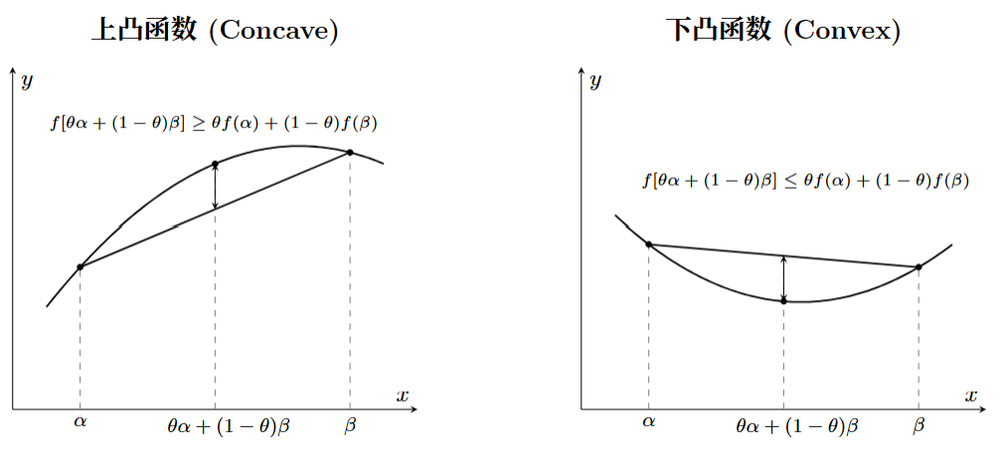 

- 若 $f_1(\alpha),f_2(\alpha),\cdots,f_L(\alpha)$ 是 **上凸函数**，$C_1,C_2,\cdots,C_L$ 为正，有 **上凸函数**：
$$
\sum_{l=1}^L C_lf_l(\alpha)
$$
- **一元函数** $f(\alpha)$ 上凸的充要条件是在所定义的区间中满足：
$$
\frac{\mathrm{d}^2f(\alpha)}{\mathrm{d}\alpha^2}\leq 0
$$
- **Jensen 不等式**，令 $(\alpha_1,\alpha_2,\cdots,\alpha_L)$ 是凸集中的一组矢量， $f(\alpha)$ 是该凸集中的一个上凸函数，$(\theta_1,\theta_2,\cdots,\theta_L)$ 是一组概率分布，则有：
$$
\sum_{l=1}^L\theta_lf(\alpha_l)\leq f
\left[
\sum_{l=1}^L\theta_l\alpha_l
\right]
$$

> [!Note] **Jensen 不等式的证明**
> 1. 当 $n=2$ 时： 由上凸函数定义，$\theta_1 f(\alpha_1) + \theta_2 f(\alpha_2) \leq f(\theta_1 \alpha_1 + \theta_2 \alpha_2)$ 成立。 
> 2. 假设当  $n=k$ 时 Jensen 不等式成立。 
> 3. 当 $n=k+1$ 时： 令 $\lambda = \sum_{i=1}^k \theta_i$（$\lambda>0$ ）： $$ \begin{aligned} f\left( \sum_{i=1}^{k+1} \theta_i \alpha_i \right) &= f\left( \lambda \sum_{i=1}^k \frac{\theta_i}{\lambda} \alpha_i + \theta_{k+1} \alpha_{k+1} \right) \\ &\geq \lambda f\left( \sum_{i=1}^k \frac{\theta_i}{\lambda} \alpha_i \right) + \theta_{k+1} f(\alpha_{k+1})\\ &\geq \lambda \sum_{i=1}^k \frac{\theta_i}{\lambda} f(\alpha_i) + \theta_{k+1} f(\alpha_{k+1}) \\ &= \sum_{i=1}^{k+1} \theta_i f(\alpha_i) \end{aligned} $$ 

**非负凸集**： $f(\alpha)$ 是定义在 $K$ 维非负凸集 $\{\mathcal{R}^+\}^K$ 上的上凸函数，若 $f(\alpha)$ 对于任一分量连续可导，则 $f(\alpha)$ 在 $\alpha=(\alpha_1,\alpha_2,\cdots,\alpha_K)$ 处取得极大值的充要条件为：
$$
\frac{\partial f(\alpha)}{\partial\alpha_k}
\begin{cases}
=0,&\forall\alpha_k>0\\
<0,&\forall\alpha_k=0
\end{cases}
$$
**概率空间**： $f(\alpha)$ 是定义在 $K$ 维概率空间上的上凸函数，若 $f(\alpha)$ 对于任一分量连续可导，则 $f(\alpha)$ 在 $\alpha=(\alpha_1,\alpha_2,\cdots,\alpha_K)$ 处取得极大值的充要条件为：
$$
\frac{\partial f(\alpha)}{\partial\alpha_k}
\begin{cases}
=\lambda,&\forall\alpha_k>0\\
<\lambda,&\forall\alpha_k=0
\end{cases}
$$
#### 2.4 其它熵的定义

香农熵仅考虑事件发生的客观概率，无法描述主观意义上对事件判断的差别。**加权熵** 定义为：
$$
X\sim\begin{pmatrix}
x_1 & x_2 & \cdots & x_K\\
w_1 & w_2 & \cdots & w_K\\
p_1 & p_2 & \cdots & p_K
\end{pmatrix}
$$
$$
H_W(X)=-\sum_{k=1}^Kw_kp_k\log p_k
$$
当加权熵满足 $w_k=1,k=1,2,\cdots,K$ 成立时，该加权熵等价于香农熵。

随机变量的 **Rényi 熵** 定义为：
$$
H_\alpha(X)=\frac{1}{1-\alpha}\log(\sum_{k=1}^Kp_k^\alpha)
$$
当 $\alpha=0$ 时，该式为定值：
$$
H_0(X)=\log K
$$
当 $\alpha\rightarrow1$ 时，利用洛必达法则求解，发现该式等价于香农熵：
$$
H_1(X)=-\sum_{k=1}^Kp_k\log p_k
$$
### 3. 随机变量的互信息

#### 3.1 平均互信息

两个事件 $X=x$ 与 $Y=y$ 之间相互提供的信息量定义为：
$$
I(x;y)=I(x)-I(x|y)=\log\frac{p(x|y)}{p(x)}
$$
随机变量 $X,Y$ 相互提供的平均互信息量称为二者之间的 **平均互信息**，简称互信息：
$$
I(X;Y)=E\{I(x;y)\}=\sum_x\sum_yp(x,y)\log\frac{p(x|y)}{p(x)}
$$
- **非负性**： $I(X;Y)\geq0$，证明过程如下：
$$
\begin{align}
I(X;Y)
&=\sum_x\sum_yp(x,y)\log\frac{p(x\vert y)}{p(x)}\\
&=\sum_x\sum_yp(x,y)\log\frac{p(x,y)}{p(x)\cdot p(y)}\\
&\geq-\sum_x\sum_yp(x,y)\left\{\frac{p(x)p(y)}{p(x,y)}-1\right\}\\
&=0
\end{align}
$$
- **对称性**： $I(X;Y)=I(Y;X)$ ；
- $I(X;Y)=H(X)+H(Y)-H(X,Y)=H(X)-H(X|Y)$ ；

 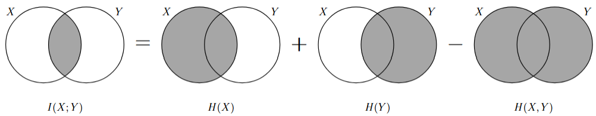 

- $I(X;Y)\leq H(X)$ 等号成立当且仅当 $X$ 是 $Y$ 的 **确定函数**。
 
>[!Note] **Note**
>在公式 $I(X;Y)=H(X)+H(Y)-H(X,Y)=H(X)-H(X|Y)$ 中，等式的左侧是 $I$ 而右侧全是 $H$，为什么左侧不统一使用 $H(X;Y)$？
>
>可以理解为：$H$ 是对变量的 **不确定的衡量**，而 $I$ 是对 **提供的确定的衡量**，$I(X;Y)$ 的意义是 $X$ 和 $Y$ 之间相互提供了多少确定，如果使用 $H(X;Y)$ 则表示相互提供了多少不确定，显然前者更符合定义。
>

#### 3.2 条件互信息

**事件的条件互信息** 为：
$$
I(x;y\vert z)=\log\frac{p(x|y,z)}{p(x|z)}=\log\frac{p(x,y\vert z)}{p(x\vert z)p(y\vert z)}
$$
在随机变量 $Z$ 已知的条件下变量 $X$ 与 $Y$ 相互提供的信息量为：
$$
\begin{align}
I(X;Y\vert Z)
&=E\{I(x;y\vert z)\}=\sum_x\sum_y\sum_zp(x,y,z)\log\frac{p(x\vert y,z)}{p(x\vert z)}\\
&=\sum_x\sum_y\sum_zp(x,y,z)\log\frac{p(x,y,z)/p(z)}{[p(y,z)/p(z)]\cdot[p(x,z)/p(z)]}\\
&=H(X|Z)+H(Y|Z)-H(X,Y|Z)
\end{align}
$$

 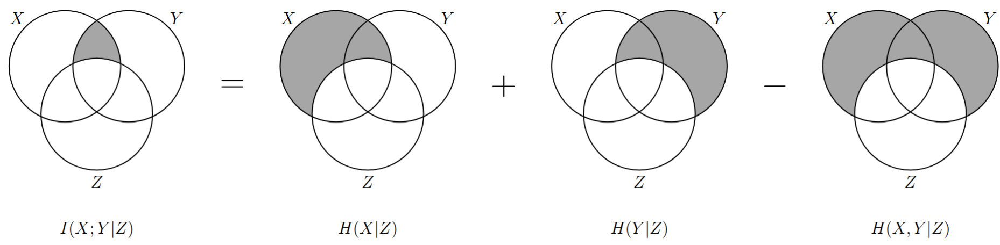 

#### 3.3 联合互信息

**事件的联合互信息** 为：
$$
I(x;y,z)=I(x)-I(x|y,z)=\log\frac{p(x\vert y,z)}{p(x)}=\log\frac{p(x,y,z)}{p(x)p(y,z)}
$$
随机变量 $Y$ 和 $Z$ 共同提供给变量 $X$ 的信息量为：
$$
\begin{align}
I(X;Y,Z)&=\sum_x\sum_y\sum_zp(x,y,z)\log\frac{p(x\vert y,z)}{p(x)}\\
&=\sum_x\sum_y\sum_zp(x,y,z)\log\frac{p(x\vert z)p(x\vert y,z)}{p(x)p(x\vert z)}\\
&=I(X;Z)+I(X;Y|Z)
\end{align}
$$
该公式又被称为 **互信息的链式法则**。

 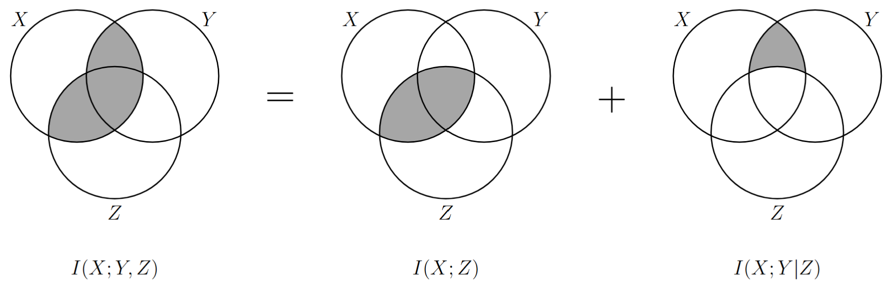 

#### 3.4 相对熵/KL散度

定义在相同字符表 $\mathcal{X}$ 上的两个概率分布 $\{p(x)\}$ 和 $\{q(x)\}$ 之间的 **相对熵**，表示为：
$$
D(p//q)=\sum_xp(x)\log\frac{p(x)}{q(x)}=E_p\{\log\frac{p(x)}{q(x)}\}
$$
表示实际分布 $\{p(x)\}$ 与假定分布$\{q(x)\}$ 之间的平均差距，也称 **鉴别熵**。

 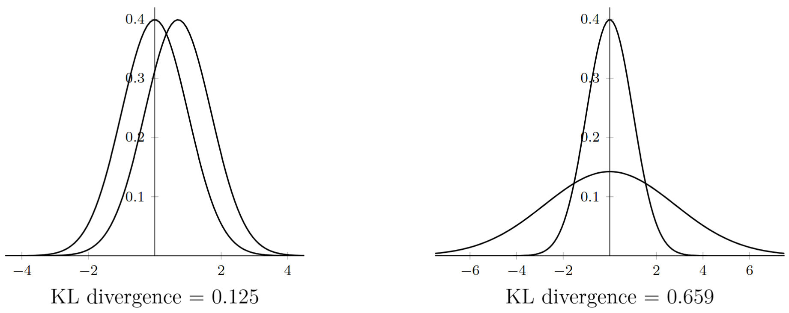 

- **性质 1** 非负性，即 $D(p//q)\geq0$ 恒成立。由此性质还可以推导出 $I(X;Y)\geq0$ 。
$$\begin{align}D(p//q)&=\sum_{x}p(x)\log\frac{p(x)}{q(x)}=-\sum_xp(x)\log\frac{q(x)}{p(x)}\\&\geq-\sum_{x}p(x)(\frac{q(x)}{p(x)}-1)=0\end{align}$$
$$\begin{align}I(X;Y)&=\sum_{x,y}p(x,y)\log\frac{p(x,y)}{p(x)p(y)}\\&=D(p(x,y)//p(x)p(y))\geq0\end{align}$$
- **性质 2** 非对称性，即 $D(p//q)=D(q//p)$ 不恒成立。
- **性质 3** 若 $U$ 为均匀分布，则有：
$$
\begin{align}
H(X)
&=-\sum_xp(x)\log p(x)\\
&=-\sum_xp(x)\log\frac{p(x)}{1/K}+\log K\\
&=H(U)-D(X//U)
\end{align}
$$
- **性质 4** 如果 $P_1,P_2$ 是 **独立分布**，并且联合分布是 $P=P_1P_2$ ，如果 $Q_1,Q_2$ 是独立分布，并且联合分布是 $Q=Q_1Q_2$ ，那么：
$$
D(P//Q)=D(P_1//Q_1)+D(P_2//Q_2)
$$

>[!Note] **相对熵的应用**
>假设数据通过未知分布 $p(x)$ 生成，想要对 $p(x)$ 进行建模，可以使用参数分布 $p(x\vert\theta)$ 来近似该分布：
>$$\min_{\theta}D(p//q)=\frac{1}{N}\sum_{n=1}^N\{-\log q(x_n\vert\theta)+\log p(x_n)\}$$

#### 3.5 Fano 不等式

定义在相同字符表 $\{0,1,\cdots,K-1\}$ 上的两个随机变量 $X$ 和 $\hat{X}$ ，其中 $\hat{X}$ 是对 $X$ 的某种估计，估计 **错误** 概率定义为：
$$
P_E=\sum_{k=0}^{K-1}\sum_{\begin{align}j=0\\j\neq k\end{align}}^{K-1}\mathrm{Pr}\{X=k,\hat{X}=j\}
$$
则 $\hat{X}$ 已知条件下 $X$ 的疑义度 $H(X\vert\hat{X})$ 满足下述不等式：
$$
H(X\vert\hat{X})\leq H(P_E)+P_E\log(K-1)
$$
当 $E=0$ 时表示估计正确，当 $E=1$ 时表示估计错误，则有如下证明：
$$
\begin{align}
H(E,X|\hat{X})&=H(X|\hat{X})+H(E|X,\hat{X})=H(X|\hat{X})\\
&=H(E|\hat{X})+H(X|E,\hat{X})\\
H(E|\hat{X})&\leq H(E)=H(P_E)\\
H(X|E,\hat{X})&=P_EH(X|E=1,\hat{X})+(1-P_E)H(X|E=0,\hat{X})\\
&=P_EH(X|E=1,\hat{X})\\
&\leq P_E\log(K-1)
\end{align}
$$

 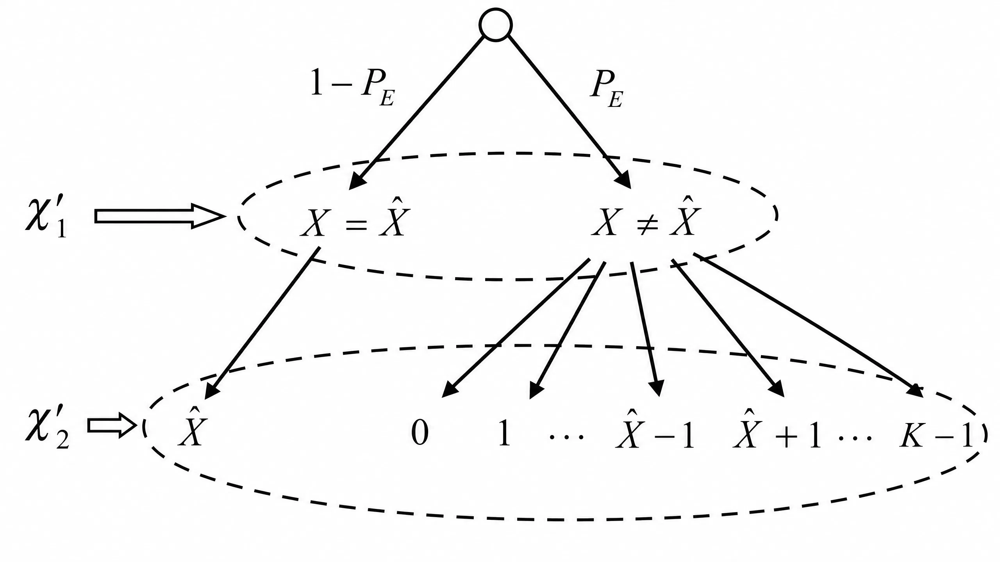 

#### 3.6 马尔可夫过程

如果随机变量序列 $X_1,X_2,\cdots,X_n$ 的联合概率分布可以写成如下形式：
$$
p(x_1,x_2,\cdots,x_n)=p(x_1)p(x_2\vert x_1)\cdots p(x_n\vert x_{n-1})
$$
则称这 $n$ 个随机变量构成 **马尔可夫链**，记为：
$$
X_1\rightarrow X_2\rightarrow\cdots\rightarrow X_n
$$
如果 $X\rightarrow Y\rightarrow Z$ 则有 **数据处理定理**：
$$
\begin{align}
&I(X;Y)\geq I(X;Z)\\
&I(X;Y)\geq I(X;Y\vert Z)
\end{align}
$$

 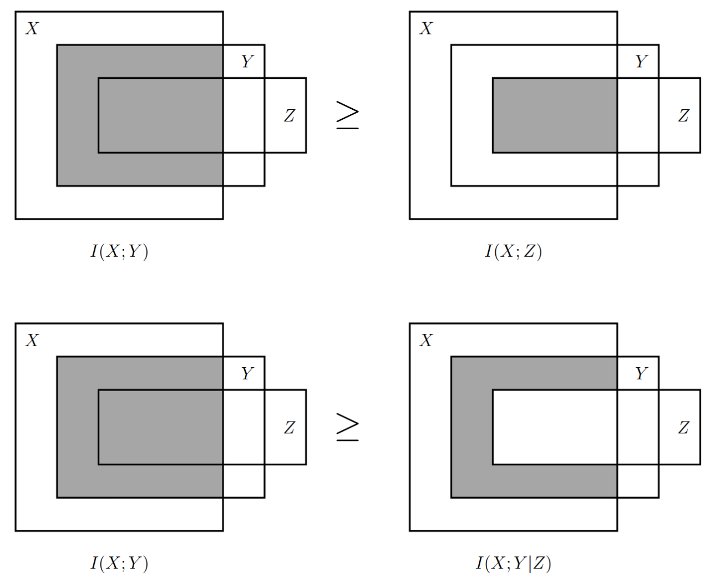 

对于四变量马尔可夫链，如果 $U\rightarrow X\rightarrow Y\rightarrow V$ ，则 $I(X;Y)\geq I(U;V)$ 。
$$
\begin{cases}
U\rightarrow X\rightarrow Y\Rightarrow I(X;Y)\geq I(U;Y)\\
U\rightarrow Y\rightarrow V\Rightarrow I(U;Y)\geq I(U;V)
\end{cases}
\Rightarrow I(X;Y)\geq I(U;V)
$$

 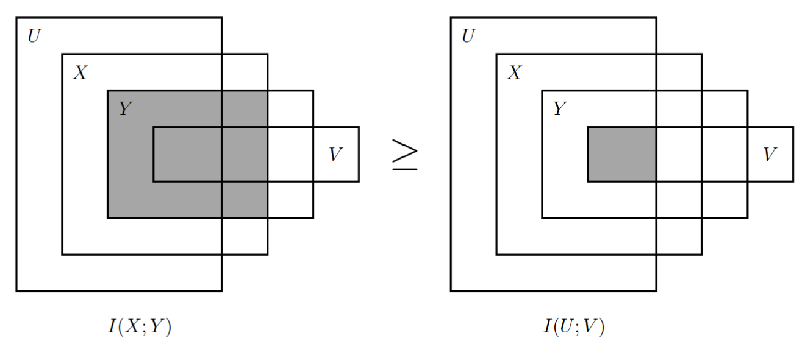 

#### 3.7 互信息的凸性

互信息 $I(X;Y)$ 是关于输入分布 $\{p(x)\}$ 和转移概率矩阵 $\{p(y\vert x)\}$ 的函数：
$$
\begin{align}
I(X;Y)
&=\sum_x\sum_yp(x,y)\log\frac{p(x\vert y)}{p(x)}\\
&=\sum_x\sum_yp(x)p(y\vert x)\log\frac{p(y\vert x)}{p(y)}\\
&=\sum_x\sum_yp(x)p(y\vert x)\log\frac{p(y\vert x)}{\sum_xp(x)p(y\vert x)}\\
&=I(\{p(x)\},\{p(y\vert x)\})
\end{align}
$$
**定理 1** 转移概率矩阵 $\{p(y\vert x)\}$ 给定时， $I(X;Y)=I(\{p(x)\})$ 是输入分布的上凸函数。
$$
\begin{align}
I(X;Y|Z)
&=p(Z=0)I(X;Y|Z=0)+p(Z=1)I(X;Y|Z=1)\\
&=\theta I(\{p_1(x)\})+(1-\theta)I(\{p_2(x)\})\\
I(X;Y)&=I(\{p(x)\})=I(\{\theta p_1(x)+(1-\theta)p_2(x)\})\\
\end{align}
$$
$$
Z\rightarrow X\rightarrow Y\Rightarrow I(X;Y)\geq I(X;Y|Z)
$$
$$
I(\{\theta p_1(x)+(1-\theta)p_2(x)\})\geq \theta I(\{p_1(x)\})+(1-\theta)I(\{p_2(x)\})
$$

 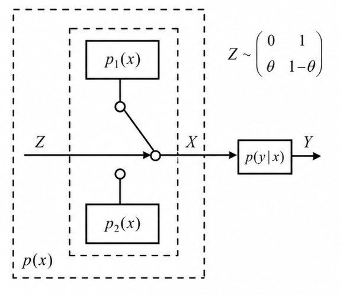 

**定理 2** 输入分布 $\{p(x)\}$ 给定时， $I(X;Y)=I(\{p(y\vert x)\})$ 是转移概率矩阵的下凸函数。
$$
\begin{align}
I(X;Y|Z)
&=p(Z=0)I(X;Y|Z=0)+p(Z=1)I(X;Y|Z=1)\\
&=\theta I(\{p_1(y|x)\})+(1-\theta) I(\{p_2(y|x)\})\\
I(X;Y)
&=I(\{p(y|x)\})=I(\{\theta p_1(y|x)+(1-\theta)p_2(y|x)\})
\end{align}
$$
$$
\begin{align}
I(X;Y,Z)
&=\underbrace{I(X;Z)}_{=0}+I(X;Y|Z)
=I(X;Y)+\underbrace{I(X;Z|Y)}_{\geq 0}\\
\Rightarrow&\quad
I(X;Y)\leq I(X;Y|Z)
\end{align}
$$

 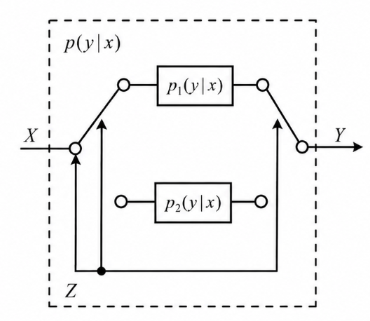 

### 4. 补充说明

本文中使用的韦恩图在信息论中的适用性有以下几点需要注意：
- 信息论中的熵、互信息与集合论中的测度在代数结构上是 **完全同构** 的，只要遵循集合的加减运算规则，在韦恩图上得出的 **等式** 通过信息论代数推导也一定正确；
- 对于离散随机变量的信息论不等式证明，只有当所有不等式涉及到的 **原子区域** 代表的面积均 **非负** 时，韦恩图证明的不等式才是可靠的；
	- 上文中的马尔可夫链中不等式 $I(X;Y)\geq I(X;Y|Z)$ 的韦恩图正确，原因是 $I(X;Y)=I(X;Z)+I(X;Y|Z)$ ，而 $I(X;Z)\geq 0$ 成立，因此，证明不等式成立的一个思路便是先转换为等式，再减去必然为正的部分得到不等式。
- 对于三元以上的复杂交互，由于 **互信息可以为负** 等原因，无法通过韦恩图上区域的大小直接判定大小关系，用韦恩图得出的结论很可能是 **不可信** 的。
	- 在互信息的凸性证明过程中，由于定理1中为马尔可夫链，$I(X;Y)\geq I(X;Y|Z)$，定理2却推导出 $I(X;Y)\leq I(X;Y|Z)$ ，可见韦恩图的表示是有局限性的，即不能通过韦恩图来表示负面积，也就无法判定大小关系。