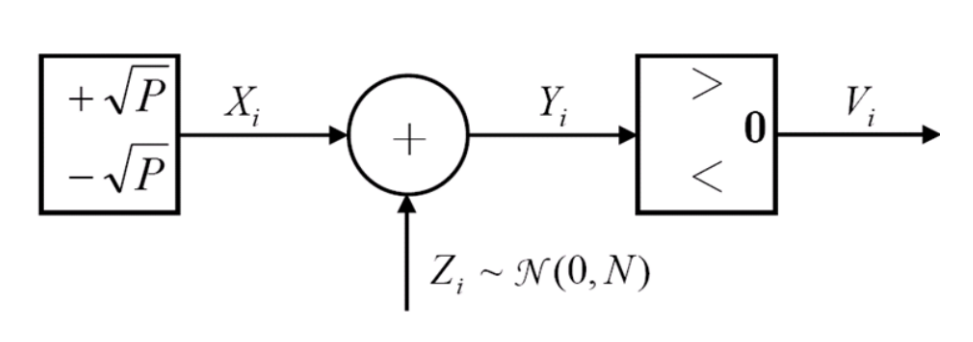
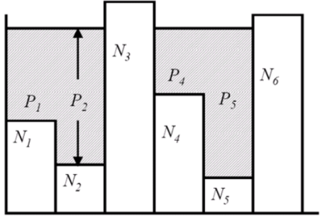

### 1. 高斯信道容量分析

#### 1.1 离散 AWGN 信道模型

**时间离散加性高斯信道 (AWGN)**：输入信号 $X_i$ 在传输中受到独立同分布的均值为 $0$、方差为 $N$ 的高斯白噪声 $Z_i \sim \mathcal{N}(0, N)$ 的干扰，产生输出信号 $Y_i = X_i + Z_i$。

  

为了使传输具有物理意义，输入信号的平均功率必须受到限制：
$$
\frac{1}{n}\sum_{i=1}^n x_i^2 \leq P
$$
若将输入幅度离散化为 $\{+\sqrt{P}, -\sqrt{P}\}$，且在接收端进行硬判决（以 $0$ 为阈值），则该连续信道退化为 **二元对称信道 (BSC)**。其错误概率 $P_e$ 由高斯分布的尾部概率决定：
$$
\begin{align}
P_e &= P(Y < 0 \mid X = \sqrt{P}) = P(X+Z < 0 \mid X = \sqrt{P}) \\
&= P(Z < -\sqrt{P}) = P(Z > \sqrt{P}) \\
&= 1 - \Phi\left(\frac{\sqrt{P}}{\sqrt{N}}\right)
\end{align}
$$

#### 1.2 容量公式推导

信道容量定义为在功率约束 $E[X^2] \leq P$ 下的最大互信息：
$$
C = \max_{p(x): E[X^2]\leq P} I(X;Y) = \max_{p(x): E[X^2]\leq P} [h(Y) - h(Y \mid X)]
$$
由于噪声 $Z$ 与输入 $X$ 独立，条件熵 $h(Y \mid X) = h(X+Z \mid X) = h(Z)$。已知方差为 $N$ 的高斯分布微分熵为 $h(Z) = \frac{1}{2}\log_2(2\pi e N)$。

为了最大化 $I(X;Y)$，必须最大化输出熵 $h(Y)$。由于 $Y = X + Z$，输出的方差为 $E[Y^2] = E[X^2] + E[Z^2] \leq P + N$。根据 **最大熵定理**，在方差受限的随机变量中，高斯分布具有最大的微分熵。因此，当 $Y$ 服从高斯分布时，$h(Y)$ 达到最大值：
$$
h(Y) \leq \frac{1}{2}\log_2(2\pi e (P+N))
$$
当输入 $X$ 也服从高斯分布 $X \sim \mathcal{N}(0, P)$ 时，等号成立。此时信道容量为：
$$
C = \frac{1}{2}\log_2(2\pi e (P+N)) - \frac{1}{2}\log_2(2\pi e N) = \frac{1}{2}\log_2\left(1 + \frac{P}{N}\right)
$$

>[!Note] **Note**
>该结论揭示了高斯分布在信息论中的特殊地位：
>- **发送端**：采用高斯分布作为输入可以获得最大的互信息。
>- **干扰端**：在相同功率限制下，高斯噪声是最“坏”的干扰，因为它能最大限度地降低互信息。

#### 1.3 平行信道与注水法则

高斯平行信道由 $k$ 个独立的加性高斯子信道组成：$Y_j = X_j + Z_j, Z_j \sim \mathcal{N}(0, N_j)$。总功率限制为 $\sum_{j=1}^k P_j \leq P$。其容量为：
$$
C = \max_{\sum P_j \leq P} \sum_{j=1}^k \frac{1}{2}\log_2\left(1 + \frac{P_j}{N_j}\right)
$$
利用拉格朗日乘子法构造 $J = \sum_{j=1}^k \frac{1}{2}\log_2(1 + \frac{P_j}{N_j}) - \lambda(\sum_{j=1}^k P_j - P)$，求导可得最优功率分配满足 $P_j + N_j = \gamma$。结合 $P_j \geq 0$ 约束，得到 **注水法则 (Water-filling)**：
$$
P_j = (\gamma - N_j)^+ = \max(0, \gamma - N_j)
$$

  

**物理意义**：噪声功率 $N_j$ 相当于底部的坑洼，总功率 $P$ 像水一样注入。水位线由 $\gamma$ 决定。噪声较小的信道（坑浅）分配更多功率；噪声过大的信道（坑深过水位线）则不分配功率。这在 OFDM、MIMO 等多载波系统中是功率分配的核心依据。

### 2. 模拟信道容量与资源互换

#### 2.1 带限信道容量

对于带宽限制在 $[0, W]$ Hz 的连续时间信道 $y(t) = x(t) + z(t)$。根据 **奈奎斯特采样定理**，信号可以由每秒 $2W$ 个采样点完全表示。

连续信号的离散化表示（Sinc 插值）：
$$
f(t) = \sum_{n=-\infty}^{\infty} f\left(\frac{n}{2W}\right) \text{sinc}\left(2\pi W\left(t - \frac{n}{2W}\right)\right)
$$
若噪声 $z(t)$ 是单边功率谱密度为 $N_0$ 的白高斯过程，其采样序列 $z_n$ 的方差为 $N = N_0 W$。在 $T$ 秒内，相当于有 $2WT$ 个独立的子信道。总功率限制为 $P$，则每个样本分配功率 $P_i = P/(2W)$。

代入离散容量公式，得到 **香农公式**：
$$
C = W \log_2\left(1 + \frac{P}{N_0 W}\right) \text{ (bps)}
$$
#### 2.2 单比特最小能量

设传输速率为 $R$，每比特平均能量为 $\mathcal{E}_b = P/R$。定义频带效率 $\eta = R/W$，则：
$$
\eta = \log_2\left(1 + \frac{\mathcal{E}_b}{N_0} \eta\right) \Rightarrow \frac{\mathcal{E}_b}{N_0} = \frac{2^\eta - 1}{\eta}
$$
由于 $f(x) = \frac{e^x - 1}{x}$ 是 $x$ 的增函数。证明：$f'(x) = \frac{e^x(x-1)+1}{x^2}$。令 $g(x) = e^x(x-1)+1$，则 $g'(x) = xe^x > 0$（当 $x>0$），且 $g(0)=0$。故 $f'(x)>0$，函数单调递增。

因此，$\mathcal{E}_b/N_0$ 随 $\eta$ 减小而减小。当 $R \to 0$（即 $\eta \to 0$）时，达到最小能量：
$$
\left(\frac{\mathcal{E}_b}{N_0}\right)_{\min} = \lim_{\eta\to 0} \frac{2^\eta - 1}{\eta} = \ln 2 \approx 0.693 \approx -1.59 \text{ dB}
$$

#### 2.3 功率与带宽互换启示

香农公式揭示了 **带宽** 和 **功率** 可以相互补偿：
- **以带宽换功率**：增加带宽 $W$ 可以降低所需的功率 $P$。当 $W \to \infty$ 时，利用 $\lim_{x\to 0} \log(1+x) \approx x \log e$，容量趋于极限 $C_{\infty} = \frac{P}{N_0} \log_2 e \approx 1.44 \frac{P}{N_0}$。
- **技术启示**：在宽带系统（如 CDMA、OFDM）中，通过扩频可以实现在极低信噪比下的可靠通信。但在传感器网络等能量受限场景，降低速率 $R$ 是节省能量的关键（即“慢即是省”）。

>[!tip] **Example**
>- **16QAM vs QPSK**：16QAM 虽然频带效率高，但功率效率不如 QPSK，因为 $P$ 随 $C$ 呈指数上升趋势。
>- **传感器网络**：节点能量有限，数据量较小，应尽量使用 BPSK 这种低速率、高功率效率的调制方式。

### 3. 编码定理与工程实践

#### 3.1 编码定理与逆定理

**正定理**：只要 $R < C$，总存在 $(2^{nR}, n)$ 码使得当 $n \to \infty$ 时，最大错误概率 $\lambda^{(n)} \to 0$。

**逆定理证明要点**：
利用 **Fano 不等式**：$H(W \mid Y^n) \leq 1 + P_e^{(n)} nR \triangleq n\epsilon_n$。
$$
\begin{align}
nR = H(W) &= I(W;Y^n) + H(W \mid Y^n) \leq I(X^n;Y^n) + n\epsilon_n \\
&\leq \sum_{i=1}^n [h(Y_i) - h(Z_i)] + n\epsilon_n \\
&\leq \sum_{i=1}^n \frac{1}{2}\log_2\left(1 + \frac{P_i}{N}\right) + n\epsilon_n
\end{align}
$$
根据 **Jensen 不等式**，$\frac{1}{n}\sum_{i=1}^n \frac{1}{2}\log_2(1+P_i/N) \leq \frac{1}{2}\log_2(1+\sum_{i=1}^n P_i/nN) \leq C$。当 $n \to \infty$ 且 $P_e^{(n)} \to 0$ 时，必有 $R \leq C$。

#### 3.2 理想反馈与联合编码

- **反馈信道**：对于离散无记忆高斯信道，**理想反馈不能增加信道容量**（$C_{\text{FB}} = C$），但可以显著简化编码器的设计复杂度。
- **联合编码定理**：只要信源熵速率 $H(\mathcal{V}) < C$，就存在联合编码使得传输错误概率趋于 $0$。反之若 $H(\mathcal{V}) > C$，则不可能可靠传输。

#### 3.3 理论极限与工程实际

**香农限的逼近**：虽然理论上 $R < C$ 即可实现无误传输，但实际系统面临诸多限制：
1. **码长限制**：理论要求 $n \to \infty$，实际系统为保证时延，码长必须有限。
2. **输入分布**：实际采用的星座图调制并非理想高斯分布。
3. **案例分析**：假设容量为 $1.5 \text{ b/s/Hz}$ 的信道，如果使用 BPSK 传输，根据香农信道容量定理，错误概率可以为 $0$。而实际系统的错误概率不可能为 $0$，正是因为实际系统无法满足“无限码长”和“高斯输入”（BPSK 是离散输入而非高斯分布）的条件。

目前的 LDPC 码等先进技术已能在特定条件下将性能推至距离香农限仅 $0.0045 \text{ dB}$ 的水平。