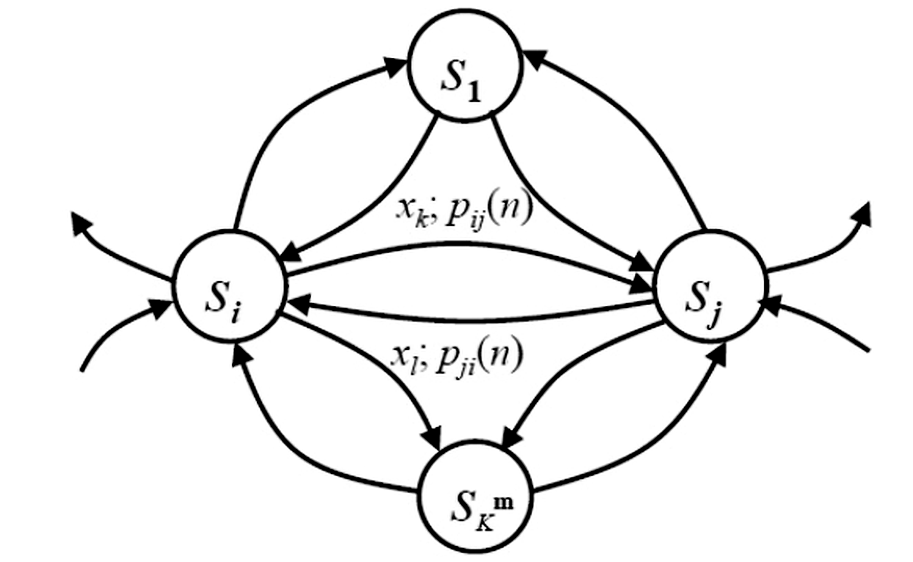

### 1. 平稳离散信源

#### 1.1 平稳随机过程

对于任意正整数 $n$ ，任意 $t_1,t_2,\cdots,t_n\in T$ 和任意 $h$ ，考虑两个随机向量：
$$
\mathbf{X}=(X(t_1),X(t_2),\cdots,X(t_n)),\quad
\mathbf{X_h}=(X(t_1+h),X(t_2+h),\cdots,X(t_n+h))
$$
若 $\mathbf{X}$ 与 $\mathbf{X_h}$ 具有相同的分布，则称 $\{X(t)\}$ 为 **平稳随机过程**。

- **性质 1** $E(X(t_n)) = E(X(t_n + h)) = E(X(0)) = \text{Const.}$
- **性质 2** $X(t)$ 的均值和方差对于所有 $t$ 都一样
#### 1.2 平稳信源的定义

$$
\cdots X_{-1}, X_{0}, X_{1}, X_{2}, \cdots, X_{n}, \cdots
$$
满足任意长度片段的联合概率分布与时间起点 **无关** 的称为 **平稳信源**：
$$
\text{Pr}(X_1,X_2,\cdots,X_L) = \text{Pr}(X_{1+n},X_{2+n},\cdots,X_{L+n})
$$
满足不同时间的随机变量 **不相关** 的称为 **简单无记忆信源**：
$$
\text{Pr}(X_1,X_2,\cdots,X_L) = \prod_{i=1}^L \text{Pr}(X_i)
$$
**$m$ 阶马尔可夫信源** 的定义为：
$$
\text{Pr}(X_l\vert X_{l-1},X_{l-2},\cdots,X_0)=
\text{Pr}(X_l\vert X_{l-1},X_{l-2},\cdots,X_{l-m})
$$
当 $m=1$ 时该信源被简称为 **马尔可夫信源**。
#### 1.3 平稳信源的熵

平稳信源发出长度为 $n$ 的序列 $X_1,X_2\cdots,X_n$ ，随机矢量 $\mathbf{X}=(X_1,X_2\cdots,X_n)$，则：
$$
H(\mathbf{X})=H(X_1,X_2,\cdots,X_n)=-\sum p(x_1,x_2,\cdots,x_n)\log p(x_1,x_2,\cdots,x_n)
$$
$H(\mathbf{X})$ 随 $N$ 增长而增长，趋向 **无穷大**。

- **平均每符号熵**：$H_N(\mathbf{X}) \triangleq \frac{1}{N} H(\mathbf{X}) = \frac{1}{N} (X_1,X_2,\cdots,X_N)$
- **熵速率**：$\begin{align}H_\infty(\mathbf{X}) = \lim_{N \to \infty} H_N(\mathbf{X})\end{align}$
- **平均条件熵**： $H(X_N \mid X_{N-1},X_{N-2},\cdots,X_1)$
#### 1.4 平稳信源的性质

- **性质 1** $H(X_N \mid X_{N-1} X_{N-2} \cdots X_1)$ 随 $N$ 增大而 **单调不增**
$$
\begin{align}
H(X_N|X_1,X_2,\cdots,X_{N-1})
&\leq H(X_N|X_2,\cdots,X_{N-1})\\
&= H(X_{N-1}|X_1,\cdots,X_{N-2})
\end{align}
$$
- **性质 2** $H_N(X)$ 随 $N$ 增大而 **单调不增**
$$
\begin{align}
H_N(\mathbf{X})
&=\frac{1}{N}H(X_1,X_2,\cdots,X_{N-1},X_N)\\
&=\frac{1}{N}\{H(X_1)+H(X_2|X_1)+\cdots+H(X_N|X_1,X_2,\cdots,X_{N-1})\}\\
&\geq H(X_{N}|X_1,\cdots,X_{N-2},X_{N-1})
\end{align}
$$
- **性质 3** $H_N(X) \geq H(X_N \mid X_{N-1} X_{N-2} \cdots X_1)$
$$
\begin{align}
H_N(\mathbf{X})
=&\frac{1}{N}\{H(X_1,X_2,\cdots,X_{N-1})+H(X_N|X_1,X_2,\cdots,X_{N-1})\}\\
=&\frac{1}{N}\{(N-1)H_{N-1}(X)+H(X_N|X_1,X_2,\cdots X_{N-1})\}\\
\leq& \frac{1}{N}\{(N-1)H_{N-1}(\mathbf{X})+H_N(\mathbf{X})\}\\
\Longrightarrow&\space H_N(\mathbf{X})\leq H_{N-1}(\mathbf{X})
\end{align}
$$
- **性质 4** $\begin{align}H_\infty(X) = \lim_{N \to \infty} H_N(X) = \lim_{N \to \infty} H(X_N \mid X_{N-1} X_{N-2} \cdots X_1)\end{align}$

#### 1.5 熵速率与冗余度

$$
H_\infty(\mathbf{X})
=\lim_{N\rightarrow\infty}H_N(\mathbf{X})
=\lim_{N\rightarrow\infty}H(X_N|X_{N-1}X_{N-2}\cdots X_1)
$$
$$
\begin{align}
H_\infty(\mathbf{X})
\leq H(X_N|X_{N-1}X_{N-2}\cdots X_2X_1)
\leq\cdots\leq
H(X_2|X_1)\leq H(X_2)\leq\log K
\end{align}
$$
熵的相对率 $\eta$ 及信源的冗余度 $R$ 定义为：
$$
\eta=\frac{H_\infty(\mathbf{X})}{\log K},\eta\leq1,\quad
R=1-\eta
$$
### 2. 马尔可夫信源

#### 2.1 马尔可夫信源的定义

**$m$ 阶马尔可夫信源** 的定义为：
$$
\text{Pr}(X_l\vert X_{l-1},X_{l-2},\cdots,X_0)=
\text{Pr}(X_l\vert X_{l-1},X_{l-2},\cdots,X_{l-m})
$$
马尔可夫信源的 **状态空间** 为：
$$
x^m=x_{i_{l-1}}x_{i_{l-2}}\cdots x_{i_{l-m}}\in\mathcal{X}^m,|\mathcal{X}^m|={K}^m
$$
马尔可夫信源的 **状态空间有限** 且 **由状态转移函数确定**：
$$
s_{i_{n+1}}=F(s_{i_n},x_{i_n})
$$
#### 2.2 状态图表示

  

$$
s_i=\mathbf{x_i}=x_{i_1}x_{i_2}\cdots x_{i_m}\in\mathcal{X}^m,\quad
s_j=\mathbf{x_j}=x_kx_{i_1}x_{i_2}\cdots x_{i_{m-1}}\in\mathcal{X}^m
$$
$$
\begin{align}
p_{ij}(n)
&=\mathrm{Pr}(X_n=x_k|X_{n-1}X_{n-2}\cdots X_{n-m}=x_{i_1}x_{i_2}\cdots x_{i_m})\\
&=\mathrm{Pr}(S_n=s_j|S_{n-1}=s_i)
\end{align}
$$

#### 2.3 稳态状态分布

- **时齐马尔可夫信源**：状态转移概率 $p_{ij}(n)$ 与时间 $n$ 无关。
- **既约马尔可夫信源**：从任一状态出发，进过有限步总可以到达任一其他状态。

- **状态转移概率矩阵**：$P=[p_{ij}]_{K^m\times K^m}$
-  **$n$ 时刻状态概率分布**：$Q(n)=(q_1(n),q_2(n),\cdots,q_{K^m}(n)),q_i(n)=\mathrm{Pr}(S_n=s_i)$

状态概率分布有关系 $Q(n+1)=Q(n)P$ ，对于时齐既约马尔可夫信源，状态的稳态分布：
$$
\overline{Q}=\lim_{n\rightarrow\infty}Q(n+1)=\lim_{n\rightarrow\infty}Q(n)P=\overline{Q}P
$$

#### 2.4 马尔可夫信源的熵率

$$
\begin{align}
H_\infty
&=\lim_{N\rightarrow\infty}\frac{1}{N}H(X_1,X_2,\cdots,X_N)\\
&=\lim_{N\rightarrow\infty}H(X_N|X_{N-1},X_{N-2},\cdots,X_1)\\
&=\lim_{N\rightarrow\infty}H(X_N|X_{N-1},X_{N-2},\cdots,X_{N-m})\\
&=H(X_{m+1}|X_m,X_{m-1}\cdots,X_1)\\
&=\sum_{i=1}^{K^m}q(S=s_i)H(X|S=s_i)\\
&=H(X|S)
\end{align}
$$
