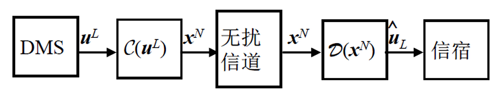

### 1. 离散无记忆信源

#### 1.1 信源编码的目标

**信源编码目标**：在代价最小的意义上来最有效地表示一个信源。

* 代价最小：使用最少的比特数对信源进行编码
* 信源编码包括量化、压缩、映射、变换等具体和抽象的过程

$$
\begin{cases}
\text{无损编码}
\begin{cases}
\text{绝对无差错编码},&P_e^{(n)}=0,\forall n\\
\text{渐进无差错编码},&P_e^{(n)}\xrightarrow{n\to\infty}0
\end{cases}\\
\text{有损编码 (限失真编码)}
\end{cases}
$$
#### 1.2 离散无记忆信源

对于 **离散无记忆信源 (DMS)** $\{U, p(\cdot)\}$，有如下定义：

* 字符表：$\mathcal{A} = \{a_1, a_2, \dots, a_K\}$
* 概率分布：$\{p_1, p_2, \dots, p_K\}$，满足 $p_i \geq 0,\ \sum_{i=1}^K p_i = 1$

输出长度为 $L$ 的消息序列：$\mathbf{u}^L = (u_1, u_2, \dots, u_L)$，可能的序列总数一共 $K^L$ 种。

  

* $\mathbf{u}^L = (u_1, u_2, \dots, u_L)$：长度为 $L$ 的消息序列
* $\mathbf{x}^N = (x_1, x_2, \dots, x_N)$：长度为 $N$ 的码字
* $\mathcal{C}$： 编码器，码书、码字的集合（标号的集合）
* $\mathcal{D}$：译码器，将接收到的码字还原为原始消息的估计
#### 1.3 编码与等长编码

对于**编码字符表** $\mathcal{B}=\{b_1,b_2,\cdots,b_D\}$ ，**编码长度** 为 $N$ 的 **等长编码** ，若为 **无损编码** 有：
$$
D^N\geq K^L
\space\Rightarrow\space
N\geq\frac{L\log K}{\log D}
$$
以对整数进行编码的 **整数编码** 为例：
- 若 $\mathcal{A}=\{0,1,\cdots,9\},L=1,\mathcal{B}=\{0,1\}$ ，则 $N=\lceil\log_2{10}\rceil=4$ ，单字符 $4\text{ bit}$
- 若 $\mathcal{A}=\{0,1,\cdots,9\},L=2,\mathcal{B}=\{0,1\}$ ，则 $N\geq\lceil\log_2100\rceil=7$ ，单字符 $3.5\text{ bit}$ 
- 若 $\mathcal{A}=\{0,1,\cdots,9\},L=\infty,\mathcal{B}=\{0,1\}$ ，则单字符 $\log_210\approx3.322\text{ bit}$

 信源输出序列越长，**编码效率** 越高，越接近 $\log K$ ，但是在实际过程中，编码序列越长，译码的时间延迟也越长，**译码实时性** 也有所降低。
### 2. 香农编码定理
#### 2.1 香农编码定理

- **正定理**：当 $\begin{align}N>\frac{L(H(U)+\epsilon_L)}{\log D}\end{align}$ 时 **可以实现** 无损编码
- **逆定理**：当 $\begin{align}N<\frac{L(H(U)-\epsilon_L)}{\log D}\end{align}$ 时 **不存在** 无损编码
- **编码速率**： $\begin{align}R=\frac{N}{L}\log D\to H(U)\end{align}$ 即每个原始字符平均用了多少比特来表示

无损编码是指信源编码的错误概率可以 **任意小** 但 **并非为零**。通常是对非常长的信息序列进行编码，特别是消息序列长度 $L$ 趋于无穷时才能实现香农编码。$U$ 表示输出的随机变量。

长度为 $L$ 的信源输出序列，个数为 $K^L$ 。当 $L$ 非常大时，根据大数定理，输出序列中符号 $a_i$ 的个数 **约** 为 $Lp_i$ ，具有这样构成成分的序列称为 **典型列**，出现的概率为：
$$
\prod_{i=1}^{K}p_i^{Lp_i}
=2^{L\sum_{i=1}^Kp_i\log p_i}
=2^{-LH(U)}
$$
典型列的个数为：
$$
\begin{align}
M&=\mathrm{C}_{L}^{Lp_1}\cdot\mathrm{C}_{L-Lp_1}^{Lp_2}\cdot\mathrm{C}_{L-Lp_1-Lp_2}^{Lp_3}\cdots\\
&=\frac{L!}{(Lp_1)!(L-Lp_1)!}\cdot\frac{(L-Lp_1)!}{(Lp2)!(L-Lp_1-Lp_2)!}\cdots
=\frac{L!}{\prod_{i=1}^K(Lp_i)!}
\end{align}
$$
根据斯特林公式 $\begin{align}x!\approx(\frac{x}{\mathrm{e}})^x\sqrt{2\pi x}\end{align}$ ，有：
$$
\log M=L(\log L-1)+\frac{1}{2}\log(2\pi L)
-\sum_{i=1}^K
\left[Lp_i(\log L+\log p_i-1)+\frac{1}{2}\log(2\pi Lp_i)\right]
$$
$$
\begin{align}
\frac{\log M}{L}=H(U)-\frac{1}{2L}
\left((K-1)\log(2\pi L)+\sum_{i=1}^K\log p_i\right)\xrightarrow{L\rightarrow\infty} M=2^{LH(U)}
\end{align}
$$
典型列几乎等概（注意定义中的“约”）。当 $L\rightarrow\infty$ 时，输出非典型列的可能性趋于零。

对于典型列编码，**编码速率** 为 $R=H(U)$ 
#### 2.2 渐进等分性质

长度为 $L$ 的输出序列 $\mathbf{u}^L=(u_1,u_2,\cdots,u_L)$ ，该序列发生的 **概率** 与 **自信息** 分别为：
$$
p(\mathbf{u}^L)=\prod_{l=1}^Lp(u_l),\quad 
I(\mathbf{u}^L)=-\log p(\mathbf{u}^L)=-\sum_{l=1}^L I(u_l)
$$
定义随机变量 $\begin{align}I_L\triangleq\frac{I(\mathbf{u}^L)}{L}=\sum_{l=1}^L\frac{I(u_l)}{L}\end{align}$ ，则有：
$$
\begin{align}
&E(I_L)=E\left[\frac{1}{L}\sum_{l=1}^L I(u_l)\right]=E[I(u)]=H(U)\\
&D(I_L)=D\left[\frac{1}{L}\sum_{l=1}^L I(u_l)\right]=\frac{1}{L^2}D\left[\sum_{l=1}^LI(u_l)\right]=\frac{1}{L}D[I(u)]\triangleq\frac{\sigma_I^2}{L}
\end{align}
$$
根据切比雪夫不等式：
$$
P\{|\xi-E(\xi)|>\epsilon\}\leq\frac{\mathrm{Var}(\xi)}{\epsilon^2},\forall\space\xi,\epsilon
$$
可以得到：
$$
P\{|I_L-H(U)|>\epsilon\}\leq\frac{\sigma_I^2}{L\epsilon^2}
$$
给定 $\epsilon$ ，选择充分大的 $L$ ，可以满足 $\begin{align}\frac{\sigma_I^2}{L\epsilon^2}<\epsilon\end{align}$ ，故有：
$$
P\{|I_L-H(U)|>\epsilon\}\leq\epsilon
\text{ 或 }
P\{|I_L-H(U)|<\epsilon\}\geq1-\epsilon
$$
#### 2.3 典型列及其性质

令 $H(U)$ 为一个离散无记忆信源 DMS $\{U,p(\cdot)\}$ 的熵，$\epsilon$ 为任意正数：
$$
A_\epsilon^{(L)}(U)=\left\{u^L:\left|-\frac{1}{L}\log p(\mathbf{u}^L)-H(U)\right|<\epsilon\right\}
$$
为给定 DMS 输出长度为 $L$ 的 $\epsilon$ 典型列集合，简称 **典型列集**，其中 $\mathbf{u}^L\in U^L$ 

>[!Note] **Note**
>根据此前对典型列的定义：出序列中符号 $a_i$ 的个数约为 $Lp_i$ ，具有这样构成成分的序列称为典型列。可以发现这里“约”的表示相对模糊，此处的典型列集则更形式化地定义了在这样的范围内被视为典型集合的一部分。

- **性质 1**：当 $L$ 足够大时， $\mathrm{Pr}\left(\mathbf{u}^L\in A_\epsilon^{(L)}(U)\right)>1-\epsilon$

$$
\begin{align}
\mathrm{Pr}\left(A_\epsilon^{(L)}(U)\right)
&=\sum_{\mathbf{u}^L\in A_\epsilon^{(L)}(U)}p(\mathbf{u}^L)
=\sum_{\mathbf{u}^L\in U^L}p(\mathbf{u}^L)I\left(\mathbf{u}^L\in A_\epsilon^{(L)}(U)\right)\\
&=E\left\{I\left(\mathbf{u}^L\in A_\epsilon^{(L)}(U)\right)\right\}
=\mathrm{Pr}\left(\mathbf{u}^L\in A_\epsilon^{(L)}(U)\right)>1-\epsilon
\end{align}
$$

【注】上式中的 $I$ 是指示函数，括号内的表达式为真时值为 $1$ ，否则为 $0$ 。

- **性质 2**：$\begin{align}2^{-L(H(U)+\epsilon)}\leq p(\mathbf{u}^L)\leq 2^{-L(H(U)-\epsilon)},\text{if }\mathbf{u}^L\in A_\epsilon^{(L)}(U)\end{align}$

【注】该性质可直接用前文典型列出现的概率证明。

- **性质 3**：$(1-\epsilon)2^{L(H(U)-\epsilon)}\leq\left|A_\epsilon^{(L)}(U)\right|\leq 2^{L(H(U)+\epsilon)}$

$$
\begin{align}
1=\sum_{\mathbf{u}^L\in U^L}p(\mathbf{u}^L)
\geq\sum_{\mathbf{u}^L\in A_\epsilon^{(L)}(U)}p(\mathbf{u}^L)
\geq\left|A_\epsilon^{(L)}(U)\right|\cdot 2^{-L(H(U)+\epsilon)}\\
\Longrightarrow
\left|A_\epsilon^{(L)}(U)\right|\leq 2^{L(H(U)+\epsilon)}
\end{align}
$$
$$
\begin{align}
1-\epsilon
\leq\sum_{\mathbf{u}^L\in A_\epsilon^{(L)}(U)}p(\mathbf{u}^L)
\leq\sum_{\mathbf{u}^L\in A_\epsilon^{(L)}(U)}2^{-L(H(U)-\epsilon)}
\leq\left\vert A_\epsilon^{(L)}(U)\right|\cdot2^{-L(H(U)-\epsilon)}\\
\Longrightarrow
(1-\epsilon)2^{L(H(U)-\epsilon)}\leq\left|A_\epsilon^{(L)}(U)\right|
\end{align}
$$
**离散无记忆源** 的输出序列分为两类：

- $A_\epsilon^{(L)}(U)$ ：典型列集合，高概率集
- $\overline{A_\epsilon^{(L)}(U)}$ ：非典型列集合，低概率集

需要特别注意的是，在具体的例子中，个别非典型列出现的概率 **不一定** 比典型列出现的概率小，非典型列的数目也 **不一定** 比典型列的数目少。
#### 2.4 香农编码定理证明

- **正定理**：当 $\begin{align}N>\frac{L(H(U)+\epsilon)}{\log D}\end{align}$ 时 **可以实现** 无损编码

由于典型列的个数 $\left|A_\epsilon^{(L)}(U)\right|\leq 2^{L(H(U)+\epsilon)}$ ，所以当 $\begin{align}N>\frac{L(H(U)+\epsilon)}{\log D}\end{align}$ 时，可以对所有的典型列进行编码，而对所有的非典型列用统一的一个序列（如全 $\text{D}$ 序列）编码，当接收端收到全 $\text{D}$ 序列时，则声称译码错误：
$$
p_e=p\{\hat{\mathbf{u}}^L\neq\mathbf{u}^L\}=p\left\{\mathbf{u}^L\not\in A_\epsilon^{(L)}(U)\right\}<\epsilon
$$

- **逆定理**：当 $\begin{align}N<\frac{L(H(U)-\epsilon)}{\log D}\end{align}$ 时 **不存在** 无损编码

当 $\begin{align}N<\frac{L(H(U)-\epsilon)}{\log D}\end{align}$ 时，记 $D^N=2^{L(H(U)-\epsilon-\epsilon_1)}$ ，则每个典型列找到编码序列的概率为：
$$
\frac{D^N}{A_\epsilon^{(L)}(U)}
\leq\frac{2^{L(H(U)-\epsilon-\epsilon_1)}}{(1-\epsilon)2^{L(H(U)-\epsilon)}}
=\frac{2^{-L\epsilon_1}}{1-\epsilon}\xrightarrow{L\rightarrow\infty}0
$$
【注】香农编码定理除了使用典型列证明，还可以使用 **Fano 不等式** 证明：

编码 $X$ 能携带的最大信息量就是它的熵：
$$
H(X)\leq\log(D^N)=N\log D
$$
根据信息不增原理，恢复出的信息 $I(U^L;\hat{U}^L)$ 不可能比压缩后的编码 $X$ 包含的信息还多：
$$
\begin{cases}
H(U^L)=I(U^L;\hat{U}^L)+H(U^L|\hat{U}^L)\\
I(U^L;\hat{U}^L)\leq H(X)
\end{cases}
\Rightarrow
H(U^L)\leq H(X)+H(U^L|\hat{U}^L)
$$
Fano 不等式规定，如果译码错误率 $p_e\rightarrow0$ ，那么译码器猜错的不确定性 $H(U^L|\hat{U}^L)$ 必须极小，相比于整体序列长度 $L$ 可以忽略不记（记为 $L\epsilon$）：
$$
L\cdot H(U)=H(U^L)\leq N\log D+L\epsilon
\space\Rightarrow\space
\frac{N}{L}\geq\frac{H(U)-\epsilon}{\log D}
$$