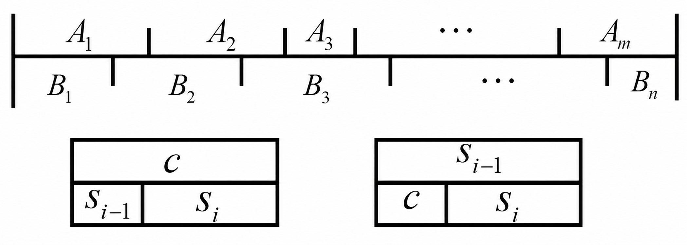
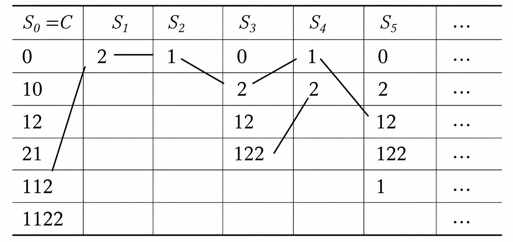
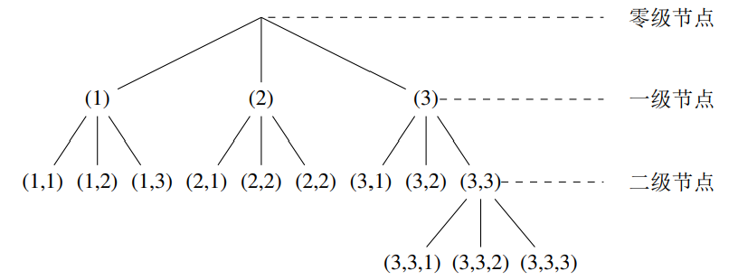
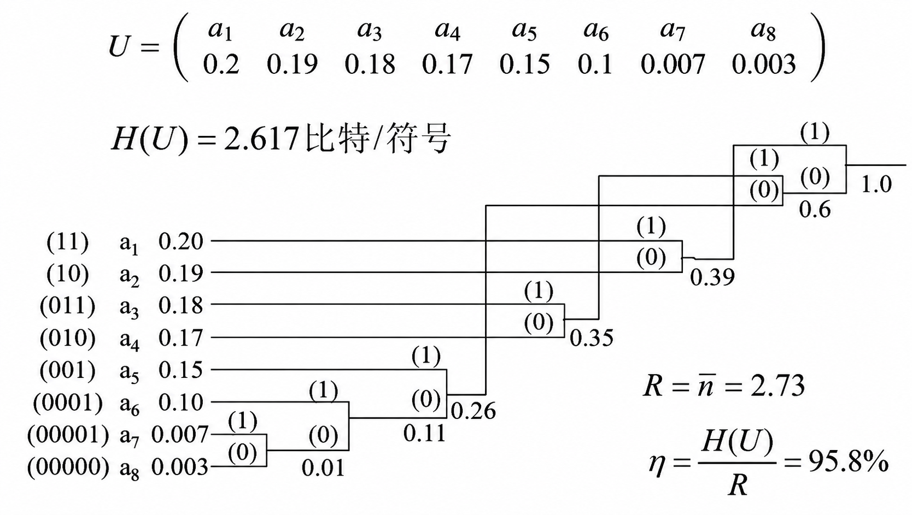
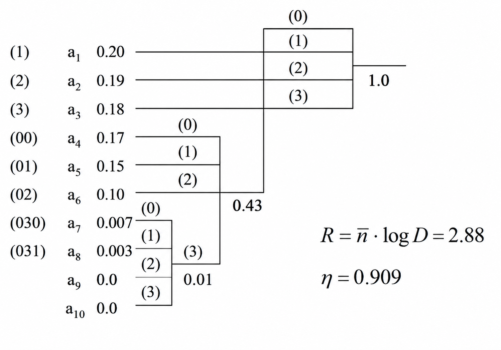

### 1. 不等长编码

#### 1.1 不等长编码

$$
\def\arraystretch{1.8}
\begin{array}{cccc}
\text{消息集} & \text{概率分布} & \text{码字} & \text{码长} \\
\hline
a_1 & p_1 & \boxed{\ b_{11}b_{12}\cdots b_{1n_1}\ } & n_1 \\
a_2 & p_2 & \boxed{\ b_{21}b_{22}\cdots b_{2n_2}\ } & n_2 \\
\cdots & \cdots & \cdots & \cdots \\
a_K & p_K & \boxed{\ b_{K1}b_{K2}\cdots b_{Kn_K}\ } & n_K \\
\end{array}
$$

对于上表中的 DMS 不等长编码，该消息集的 **平均码长** 为： $\begin{align}\overline{n}=\sum_{k=1}^K p_kn_k\end{align}$
#### 1.2 唯一可译码

$$
\begin{array}{|c|c|c|c|c|c|}
\hline
\text{信源消息} & \text{出现概率} & \text{奇异码} & \text{非唯一可译码} & \text{非即时码} & \text{即时可译码} \\
\hline
a_1 & 0.5 & 0 & 0 & 0 & 0 \\
a_2 & 0.25 & 0 & 1 & 01 & 10 \\
a_3 & 0.125 & 1 & 00 & 011 & 110 \\
a_4 & 0.125 & 10 & 11 & 0111 & 1110 \\
\hline
\end{array}
$$

如果码的任意扩展都是非奇异的，则称该码是 **唯一可译** 的：

- **非奇异性**：$x_i\neq x_j\space\Rightarrow\space C(x_i)\neq C(x_j)$
- **码扩展**：$C^*(x_1x_2x_3\cdots x_n)=C(x_1)C(x_2)\cdots C(x_n)$
#### 1.3 即时可译码

编码 $\mathcal{B}=\{101,00111,10111,11001\}$ 是 **唯一可译** 的，但是如 `10111001110011100111...` 存在不同的分割方案：`10111|00111|00111|00111|...` 和 `101|11001|11001|11001|...` 如果这种循环一直持续，那么这个编码的 **译码延时会是无限大的**，该编码 **不是即时可译码**。
### 2. S-P 判定准则

#### 2.1 后缀分解集

  

如果一段连续的码流既可以被划分成 $A_1,A_2,A_3\cdots A_m$ ，又可以被划分成 $B_1,B_2,B_3\cdots B_n$ 那么它就产生了 **歧义**。假设 $C$ 是原始码字集合，$S_{i-1}$ 是上一轮找出的 **后缀集合**：

- $c=S_{i-1}S_i$ ：如果原始码字 $c$ 比上一轮的后缀 $S_{i-1}$ 长，且 $S_{i-1}$ 恰好是 $c$ 的一个前缀，那么剩下来的部分 $S_i$ 就是新的后缀；
- $S_{i-1}=cS_i$ ：如果上一轮的后缀 $S_{i-1}$ 比原始码字 $c$ 长，且 $c$ 恰好是 $S_{i-1}$ 的一个前缀，那么剩下来的部分 $S_i$ 也是新的后缀。

初始后缀集合 $S_0$ 就是所有的原始码字集合 $C$ 。

  

- $S_0\to S_1$ ：码字 `1122` 包含前缀 `112` ，因此 $S_1$ 中含有 `2`；
- $S_1\to S_2$ ：码字 `21` 包含前缀 `2` ，因此 $S_2$ 中含有 `1`；
- $S_2\to S_3$ ：码字 `10`,`12`,`112`,`1122` 都包含前缀 `1`，因此 $S_3$ 中含有 `0`,`2`,`12`,`122`；
- $S_3\to S_4$ ：码字 `21` 包含前缀 `2` ，后缀 `122` 包含前缀 `12` ，因此 $S_4$ 中含有 `1`,`2`；

如果在推导出的 **任何一个** 后缀集合 $(S_1,S_2,\cdots)$ 中，出现了原始码字集合 $S_0$ 中的元素，那么这组编码就 **不是唯一可译码**（可以逆向构造出有歧义的连续码流）。

如 $S_3$ 中包含原始码字 `12` ，是由 `112` 去掉前缀 `1` 得到的，`1` 是由 `21` 去掉前缀 `2` 得到的，`2` 是由 `1122` 去掉前缀 `112` 得到的，因此可以构造出 `1122112` 有两种划分方式 `112|21|12` 和 `1122|112` ，从而产生歧义。
#### 2.2 S-P 判据

一个码是唯一可译码的 **充分必要条件** 是除 $S_0$ 外没有任何一个后缀分解集中包含码字。

- 若 $S_1=\emptyset$ 则该码是 **即时可译** 并且 **唯一可译** 的；
- 若 $S_n=\emptyset,n>1$ 则该码是 **唯一可译** 且 **译码延时有限** 的。
#### 2.3 Kraft 不等式

如果一个码中没有任何一个码字是其它码字的前缀，则称该码是 **异字头码**，即 $S_1=\emptyset$ 。在异字头码的树形表示中，所有码字 **只出现在叶节点上**。

  

存在长度为 $n_1,n_2,\cdots,n_K$ 的 $D$ 元异字头码的 **充要条件** 为：
$$
\sum_{k=1}^KD^{-n_k}\leq1
$$
- **必要性**：设 $n_1<n_2<\cdots<n_k$ ，可将异字头码的所有码字放置在码树的叶节点上，每放置一个长度为 $n_k$ 的码字，相当于砍掉其下生长的子树的共 $D^{n_K-n_k}$ 个叶节点，为了保证放置过程可行，必须满足条件：
$$
\sum_{k=1}^{K}D^{n_K-n_k}\leq D^{n_K}
\text{ 即 }
\sum_{k=1}^{K}D^{-n_k}\leq 1
$$

- **充分性**：可将所有码字依次放置在码树的叶节点上，对长为 $n_k$ 的码字在第 $n_k$ 层任选一个可用的叶节点砍掉其下的子树，相当于砍掉第 $n_k$ 叶节点的 $\frac{1}{D_{n_k}}$ ，若 $\sum_{k=1}^{K}D^{-n_k}\leq 1$ 则上述放置过程可以进行下去，构成一个异字头码。

任何 **唯一可译码** 必然满足 Kraft 不等式：
$$
\begin{align}
\left(\sum_{k=1}^KD^{-n_k}\right)^r
&=\left(\sum_{k_1=1}^KD^{-n_{k_1}}\right)
\left(\sum_{k_2=1}^KD^{-n_{k_2}}\right)
\cdots
\left(\sum_{k_r=1}^KD^{-n_{k_r}}\right)\\
&=\sum_{k_1=1}^K\sum_{k_2=1}^K\cdots\sum_{k_r=1}^K
D^{-(n_{k_1}+n_{k_2}+\cdots+n_{k_r})}=\sum_{i=1}^{r\cdot n_\text{max}} A_iD^{-i}
\end{align}
$$
长度为 $i$ 的 $D$ 进制序列，最多只有 $D^i$ 种不同的排列组合，如果该码是 **唯一可译** 的，那么这 $A_i$ 种不同的码字拼接方式，它们翻译成 $D$ 进制序列后必须是 **互不相同** 的。既然 $A_i$ 种组合产生的序列各不相同，并且总的序列种类最多只有 $D^i$ 种，那么必然有 $A_i$ 的数量不能超过 $D^i$ ，因此有 $A_i\leq D^i$ 必然成立：
$$
\sum_{k=1}^KD^{-n_k}
\leq\left(\sum_{i=1}^{r\cdot n_\text{max}}D^i\cdot D^{-i}\right)^\frac{1}{r}
\leq(r\cdot n_\text{max})^\frac{1}{r}\\
=2^{\frac{1}{r}\log_2(r\cdot n_\text{max})}
\xrightarrow{r\to\infty}1
$$
因此，一个编码是唯一可译码，则该编码同时满足 Kraft 不等式，且可以根据该编码构造出存一个 **同样长度的异字头码**，即即时可译码。

【注】在信息论中，异字头码和即时可译码是 **完全等价** 的。
### 3. 不等长极限定理

#### 3.1 基本定理

任何一个 **唯一可译码** 的平均码字长度必须满足 $\begin{align}\overline{n}\geq\frac{H(U)}{\log D}\end{align}$ ，同时一定存在一个 $D$ 元唯一可译码，其平均长度满足 $\begin{align}\overline{n}\leq\frac{H(U)}{\log D}+1\end{align}$ 。
$$
\begin{align}
H(U)-\overline{n}\log D
&=-\sum_{k=1}^K(p_k\log p_k+p_kn_k\log D)\\
&=\sum_{k=1}^K p_k\log\frac{D^{-n_k}}{p_k}
\leq\sum_{k=1}^K p_k\left(\frac{D^{-n_k}}{p_k}-1\right)\\
&=\sum_{k=1}^K D^{-n_k}-1\leq 0
\end{align}
$$
【注】实际上就是换为以 $D$ 为底的熵。

选择唯一的 $n_k$ 使得 $D^{-n_k}\leq p_k\leq D^{-(n_k-1)}$ ，对左侧不等式求和，得：
$$
\sum_{k=1}^K D^{-n_k}\leq\sum_{k=1}^K p_k=1
$$
因此存在长度为 $n_k$ 的异字头码。对右侧不等式取对数并求期望得：
$$
\sum_{k=1}^K p_k\log p_k<-\sum_{k=1}^Kp_k(n_k-1)\log D
$$
所以：$\begin{align}H(U)>(\overline{n}-1)\log D,\space\overline{n}\leq\frac{H(U)}{\log D}+1\end{align}$ 成立。
#### 3.2 扩展定理

对于长度为 $L$ 的平稳信源 $U^L$ ，有：
$$
\begin{align}
&\frac{H(U^L)}{\log D}
\leq\overline{n}(U^L)
<\frac{H(U^L)}{\log D}+1\\
&\Longrightarrow
\frac{H(U^L)}{L\log D}
\leq\overline{n}=\frac{\overline{n}(U^L)}{L}
<\frac{H(U^L)}{L\log D}+\frac{1}{L}\\
&\Longrightarrow
\overline{n}\xrightarrow{L\to\infty}
\frac{H(U)}{\log D}
\end{align}
$$
**编码速率** $R\triangleq\overline{n}\log D$ ，则：$\begin{align}R\xrightarrow{L\to\infty}H(U)\end{align}$ ，**编码效率** $\begin{align}\eta=\frac{H(U)}{R}\end{align}$ 。
### 4. Huffman 编码
#### 4.1 二元最佳码

给定信源分布，其 **最佳二元编码** 必然满足以下两个条件：

- 其出现 **概率越小** 的消息所对应的 **码长越长**；
- 出现概率最小的两个消息所对应的 **码长相等**，且码字 **最后一位不同**。

对于满足 $p_1\geq p_2\geq\cdots\geq p_{K-1}\geq p_K$ 的源 $U$ ，定义 **辅助源** $U'$ ： 
$$
U\sim
\begin{pmatrix}
a_1 & a_2 & \cdots & a_{K-1} & a_K\\
p_1 & p_2 & \cdots & p_{K-1} & p_K
\end{pmatrix}
$$
$$
U'\sim
\begin{pmatrix}
a'_1=a_1 & a'_2=a_2 & \cdots & a'_{K-1}=a_{K-1}\cup a_K\\
p'_1=p_1 & p'_2=p_2 & \cdots & p'_{K-1}=p_{K-1}+p_K
\end{pmatrix}
$$
则对辅助源 $U'$ 的最佳编码 **也是** 对原始源 $U$ 的最佳编码。

若 $C_1',C_2',\cdots,C_{K-1}'$ 是辅助源的最佳编码，相应码长分别为 $n_1',n_2',\cdots,n_{K-1}'$ ，对应地， $U$ 的码字 $C_1,C_2,\cdots,C_K$ 的长度分别为：
$$
n_k=\begin{cases}
n_k',&k=1,2\cdots,K-2\\
n_{K-1}'+1,&k=K-1,K
\end{cases}
$$
则相应地 $U$ 的平均码长为：
$$
\overline{n}
=\sum_{k=1}^K p_kn_k
=\sum_{k=1}^{K-2} p_kn_k'+(p_{K-1}+p_K)(n'_{K-1}+1)
=\overline{n}'+(p_{K-1}+p_K)
$$
因此由 $\overline{n}'$ 最小可以得出 $\overline{n}$ 也是最小的，因此只需要 **递归** 地进行编码，每次合并出现概率最小的两个信源消息直至只剩一个消息，即可得到 **二元最佳码**。

  

#### 4.2 D元最佳码

同样采用递归的方式，每次合并出现 **概率最小** 的 $D$ 个信号直至只剩一个消息：

- 若 $K=(D-1)\cdot i+1$ ，则每次均有 $D$ 个消息要合并，合并充分利用；
- 若 $K= (D-1)\cdot i+M$ ，则需要增补 $D-M$ 个概率为零的虚拟信息。

  
