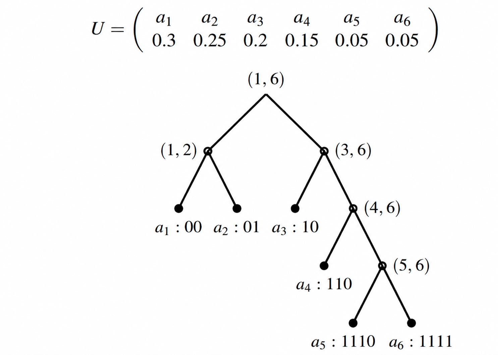
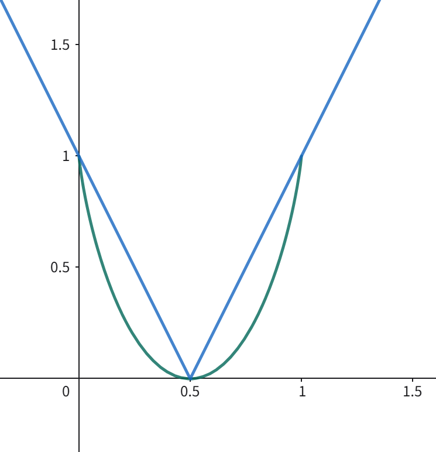
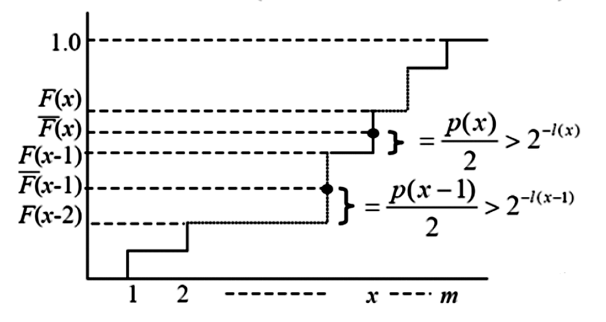
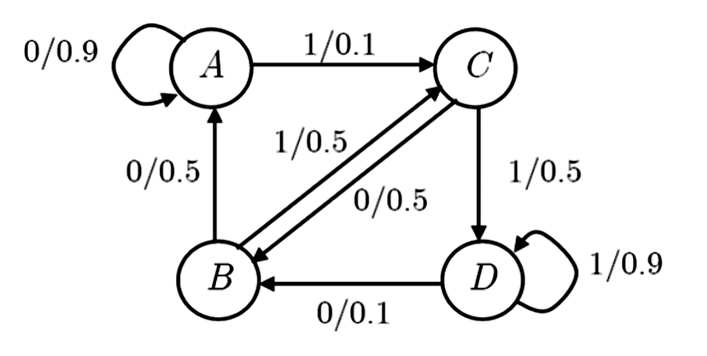

### 1. Shannon 编码

#### 1.1 编码方法

对于出现概率为 $p_k$ 的信源消息 $a_k$ 的编码长度为：
$$
l_k=\left\lceil\log\frac{1}{p_k}\right\rceil,2^{-l_k}\leq p_k< 2^{-l_k+1}
$$
$$
U\sim
\begin{pmatrix}
a_1 & a_2 & \cdots & a_{K-1} & a_K\\
p_1 & \geq p_2 & \cdots & \geq p_{K-1} & \geq p_K
\end{pmatrix}
$$
将信源消息按概率 **降序排列** 得到 $U$ ，编码方法为：
$$
P_k=\sum_{i=1}^{k-1}p_i=0.\underbrace{c_1c_2\cdots c_{l_k-1}c_{l_k}}_{l_k=\left\lceil\log\frac{1}{p_k}\right\rceil}c_{l_k+1}\cdots
$$
#### 1.2 编码性质

$$
\begin{array}{|c|c|c|c|c|}
\hline
p_k & 0.5 & 0.25 & 0.125 & 0.125 \\
\hline
l_k & 1 & 2 & 3 & 3 \\
\hline
P_k & 0 & 0.5 & 0.75 & 0.875 \\
\hline
\text{二进制展开} & 0.000000 & 0.100000 & 0.110000 & 0.111000 \\
\hline
\text{码字} & 0 & 10 & 110 & 111 \\
\hline
\end{array}
$$
- 该编码是一个 **前缀码**，并且 **等同于 Huffman 编码**。
$$
\begin{array}{|c|c|c|c|c|}
\hline
p_k & 0.4 & 0.25 & 0.2 & 0.15 \\
\hline
l_k & 2 & 2 & 3 & 3 \\
\hline
P_k & 0 & 0.4 & 0.65 & 0.85 \\
\hline
\text{二进制展开} & 0.000000 & 0.011\ldots & 0.101\ldots & 0.110\ldots \\
\hline
\text{码字} & 00 & 01 & 101 & 110 \\
\hline
\text{Huffman} & 1 & 01 & 000 & 001 \\
\hline
\end{array}
$$
- 该编码是一个 **前缀码**，但 **不等同于 Huffman 编码**。

【注】**前缀码**、**异字头码** 和 **即时可译码** 是完全等价的概念。

**Shannon 编码是前缀码**。如果把长度为 $l$ 的二进制码字 $z=z_1z_2\cdots z_l$ 与区间 
$$
(0.z_1z_2\cdots z_l,0.z_1z_2\cdots z_l+\frac{1}{2^l}]
$$
对应，则一个码是前缀码就等同于这些码字所对应的区间 **彼此不相交**。

如果 $z^{(1)}$ 是 $z^{(2)}$ 的 **前缀**，且 $z^{(2)}=z_1z_2\cdots z_l$ 则 $z^{(1)}=z_1z_2\cdots z_k,k<l$ ，$z^{(1)}$ 对应的区间包含 $z^{(2)}$ ，同样如果两个区间相交，则必然一个码是另一个码的 **前缀**。 

因为每一个码对应的区间不相交，因此 Shannon 码是一个前缀码：
$$
\begin{align}
[P_{k+1}]_{l_{k+1}}
&=[P_k+p_k]_{l_{k+1}}
\geq\left[P_k+\frac{1}{2^{l_k}}\right]_{l_{k+1}}\\
&=[P_k]_{l_{k+1}}+\frac{1}{2^{l_k}}
\geq[P_k]_{l_k}+\frac{1}{2^{l_k}}
\end{align}
$$
#### 1.3 编码效率

与 Huffman 编码相比，Shannon 编码渐进收敛性能较差。
$$
\begin{align}
H(U)
&\leq\overline{n}
=\sum_{k=1}^K l_kp_k
=\sum_{k=1}^K\left\lceil\log\frac{1}{p_k}\right\rceil p_k\\
&\leq\sum_{k=1}^K\left(\log\frac{1}{p_k}+1\right)p_k=H(U)+1
\end{align}
$$
序列 $\mathbf{u}^k$ 含有 $k$ 个 $1$，$n-k$ 个 $0$，则序列出现的概率：
$$
p(\mathbf{u}^k)=p^k(1-p)^{n-k}
$$
序列的 **编码长度** 为：
$$
l_k=\left\lceil\log\frac{1}{p(\mathbf{u}^k)}\right\rceil
\leq k\log\frac{1}{p}+(n-k)\log\frac{1}{1-p}+1
$$
该码的 **平均码长** 为：
$$
\overline{L}
\leq\sum_{k=0}^n C_n^kp^k(1-p)^{n-k}
\left(k\log\frac{1}{p}+(n-k)\log\frac{1}{1-p}+1\right)
=nH(U)+1
$$
$$
\begin{aligned}
&\sum_{k=0}^n C_n^{k} p^k (1-p)^{n-k} \left( k \log \frac{1}{p} + (n-k) \log \frac{1}{1-p} + 1 \right) \\
&= \log \frac{1}{p} \cdot (1-p)^n \sum_{k=0}^n C_n^{k}k \left( \frac{p}{1-p} \right)^k \\
&\quad\quad\quad\quad + \log \frac{1}{1-p} \cdot p^n \sum_{k=0}^n C_n^{k}k \left( \frac{1-p}{p} \right)^k + 1 \\
&= n \log \frac{1}{p} \cdot (1-p)^n \frac{p}{1-p} \left( \frac{p}{1-p} + 1 \right)^{n-1} \\
&\quad\quad\quad\quad + n \log \frac{1}{1-p} \cdot p^n \frac{1-p}{p} \left( \frac{1-p}{p} + 1 \right)^{n-1} + 1 \\
&= nH(U) + 1
\end{aligned}
$$
### 2. Fano 编码

#### 2.1 编码方法

$$
U = \left( \begin{array}{cccc|ccc} a_1 & a_2 & \dots & a_k & a_{k+1} & \dots & a_K \\ p_1 \ge & p_2 \ge & \dots & p_k \ge & p_{k+1} \ge & \dots & \ge p_K \end{array} \right) 
$$
每一次都将消息集划分为两部分，使之两部分的 **概率和之差尽可能小**：
$$
\left|\sum_{i=1}^k p_i-\sum_{i={k+1}}^K p_i\right|\to\text{min}
$$

  

#### 2.2 编码效率

Fano 编码的**平均码长** $\overline{n}\leq H(U)+1-2p_n$ ，其中 $p_n$ 为**最小符号概率**。

**引理 1**：由 $H(X)$ 的凸性，对于熵 $H(x)=-x\log_2 x-(1-x)\log_2(1-x)$ 在 $x\in[0,1]$ 区间内，满足不等式 $1-H(x)\leq |1-2x|$ 。

  

**引理 2**：设一组概率序列 $\{p_i,p_{i+1},\cdots,p_j\}$ 的总概率为 $P$ ，Fano 编码将其划分为左右两组 $P_L=\sum_{l=i}^k p_l,P_R=\sum_{r=k+1}^j p_r$ ，若划分点 $k$ 是使 $|P_L-P_R|$ 最小的点，则必有：
$$
|P_L-P_R|\leq p_k\text{ 或 }|P_L-P_R|\leq p_{k+1}
$$
则在任何非叶子节点的划分中，概率偏离度总满足 $|P_L-P_R|\leq\max(p_i,\cdots,p_j)$ 。

在二叉前缀码中，每个符号对应一个叶子，**码长等于从根到该叶子的边数**。设 $P(t)$ 为经过节点 $t$ 的总概率，则每个内部节点 $t$ 对平均码长的贡献恰好是 $P(t)$ ,于是：
$$
\overline{n}=\sum_{t\in\text{internal nodes}} P(t)
$$
熵可以沿着二叉树递归分解，设左右子树概率和为 $P_L(t),P_R(t)$，定义条件概率：
$$
q_t=\frac{P_L(t)}{P(t)}
$$
根据链式法则，从根节点开始递归展开有：
$$
H(U)=\sum_{t\in\text{internal nodes}}P(t)\cdot H_b(q_t)
$$
其中 $H_b(q_t)=-q_t\log q_t-(1-q_t)\log(1-q_t)$ 是 **二元熵**。两者相减得到：
$$
\overline{n}-H(U)=\sum_{t\in\text{internal nodes}}P(t)[1-H_b(q_t)]
$$
当 $n=2$ 时，内部节点集合仅包含 **根节点**，此时 $P(\text{root})=1,q=p_1,1-q=p_2$ 
$$
\overline{n}-H(U)=1-H(p_1,p_2)
$$
根据引理 1得到：
$$
1-H(p_1,p_2)\leq|p_1-p_2|=1-2p_2
$$
故当 $n=2$ 时定理成立。假设对于所有符号数小于 $n$ 的信源，定理均成立。对于规模为 $n$ 的信源，根节点将概率分为 $W_L,W_R$ ，设左子树包含 $k$ 个节点，右子树包含 $n-k$ 个节点：
$$
\overline{n}-H(U)
=[1-H(W_L,W_R)]
+W_L(\overline{n}_L-H(U_L))
+W_R(\overline{n}_R-H(U_R))
$$
代入归纳假设：
$$
\begin{align}
\overline{n}-H(U)
&\leq 1-H(W_L,W_R)
+W_L(1-\frac{2p_k}{W_L})
+W_R(1-\frac{2p_n}{W_R})\\
&=1-H(W_L,W_R)+W_L+W_R-2p_k-2p_n\\
&=2-H(W_L,W_R)-2p_k-2p_n
\end{align}
$$
为了证明 $\overline{n}-H(U)\leq1-2p_n$ ，只需要证明：
$$
2-H(W_L,W_R)-2p_k\leq 1
\Longleftrightarrow
1-H(W_L,W_R)\leq 2p_k
$$
根据引理 1和引理 2可以得到：
$$
1-H(W_L,W_R)\leq|W_L-W_R|\leq p_k
$$
显然 $p_k\leq 2p_k$ ，因此得到：
$$
1-H(W_L,W_R)\leq p_k\leq 2p_k
$$
因此，由数学归纳法可以得到：
$$
\overline{n}\leq H(U)+1-2p_n
$$
### 3. S-F-E 编码

#### 3.1 编码方法

Shannon-Fano-Elias 编码 **不需要** 对概率进行排序：
$$
U=\begin{pmatrix}
a_1&a_2&\cdots&a_m\\
p(1)&p(2)&\cdots& p(m)
\end{pmatrix}
$$

  

$F(x)$ 是累计分布函数，等于到符号 $x$ 为止的所有概率之和：
$$
F(x)\triangleq\sum_{i\leq x}p(i)
$$
$\overline{F}(x)$ 是修正后的累计分布函数，等于前 $x-1$ 个符号的概率和加上当前符号概率的 **一半**：
$$
\overline{F}(x)\triangleq\sum_{i<x}p(i)+\frac{1}{2}p(x)
$$
S-F-E 编码的 **码长公式** 为：
$$
l(x)=\left\lceil\log\frac{1}{p(x)}\right\rceil+1
$$
将修正累计分布函数值转换为二进制小数后保留小数点后 $l(x)$ 位即得到码字：
$$
\overline{F}(x)=0.\underbrace{z_1z_2z_3\cdots z_{l(x)}}z_{l(x)+1}\cdots
$$
S-F-E 编码是 **前缀码** ：
$$
2^{-l(x)}\leq\frac{p(x)}{2}=\overline{F}(x)-F(x-1)
$$
$$
\overline{F}(x)-[\overline{F}(x)]_{l(x)}<2^{-l(x)}
$$

#### 3.2 编码效率

类似于香农编码的编码效率证明过程，可以得到 S-F-E 编码的 **平均码长**：
$$
\overline{n}=\sum_xp(x)l(x)=\sum_x p(x)\left\{\left\lceil\log\frac{1}{p(x)}\right\rceil+1\right\}<H(U)+2
$$
$$
\begin{array}{|c|c|c|c|c|c|c|c|}
\hline
x & p(x) & F(x) & \overline{F}(x) & \text{二进制表示} & l(x) & \text{码字} & \text{Huffman码} \\
\hline
1 & 0.25 & 0.25 & 0.125 & 0.001 & 3 & 001 & 01 \\
\hline
2 & 0.5 & 0.75 & 0.5 & 0.10 & 2 & 10 & 1 \\
\hline
3 & 0.125 & 0.875 & 0.8125 & 0.1101 & 4 & 1101 & 001 \\
\hline
4 & 0.125 & 1.0 & 0.9375 & 0.1111 & 4 & 1111 & 000 \\
\hline
\end{array}
$$

### 4. 平稳信源编码

令 $\epsilon$ 是任意小正数，对平稳有记忆信源 $\{u^L,p(u^L)\}$ 进行 $D$ 元不等长编码，则总可以找到一个 $L(\epsilon)$ ，当 $L>L(\epsilon)$ 时，平均编码码长 $\overline{n}$ 满足：
$$
\frac{H(U|U^\infty)}{\log D}
\leq\overline{n}\leq
\frac{H(U|U^\infty)}{\log D}+\epsilon
$$
编码方法可以使用 Shannon 编码。
### 5. 马尔可夫信源编码
$$
H_\infty(U)=\sum_s q(s)H(U|s)=H(U|S)
$$
- 用 $\lceil\log|S|\rceil$ 个比特对初始状态 $S$ 进行编码；
- 对状态的输出长度为 $L$ 的消息序列进行 **不等长编码**。 

当 $L$ 充分大的时候，平均编码码长 $\overline{n}$ 满足：
$$
\frac{H(U|U^\infty)}{\log D}
\leq\overline{n}\leq
\frac{H(U|U^\infty)}{\log D}+\frac{1}{L}
$$

  

通过状态转移矩阵求解平稳概率：
$$
q(A)=q(D)=\frac{5}{12},\quad q(B)=q(C)=\frac{1}{12}
$$
则该马尔可夫信源的 **极限熵** 为：
$$
H(X|S)=\sum_{s\in\{A,B,C,D\}}q(s)H(X|s)=0.558
$$
对于这个特定的马尔可夫信源，**最优平均码长** 为 $\overline{n}_\text{opt}=0.558\text{ bit}$ 。

当对 $L=1$ 编码时，至少要给每个符号分配一个比特，平均码长 $\overline{n}_1=1$ 。
$$
\begin{array}{|c|c|c|c|c|}
\hline
\text{消息} & A & B & C & D \\
\hline
00 & 0(0.81) & 0(0.45) & 10(0.25) & 111(0.5) \\
\hline
01 & 10(0.09) & 111(0.05) & 110(0.25) & 110(0.05) \\
\hline
10 & 110(0.05) & 110(0.25) & 111(0.05) & 10(0.09) \\
\hline
11 & 111(0.05) & 10(0.25) & 0(0.45) & 0(0.81) \\
\hline
\text{平均码长 } n_L & 1.29 & 1.85 & 1.85 & 1.29 \\
\hline
\end{array}
$$
$$
\overline{n}_2=\frac{1}{L}(q(A)\times1.29+q(B)\times1.85+q(C)\times1.29+q(D)\times1.29)=0.6917
$$
若进一步对更长的输出符号序列编码，效率将更高。