### 1. 离散无记忆信道
#### 1.1 信道的数学模型

 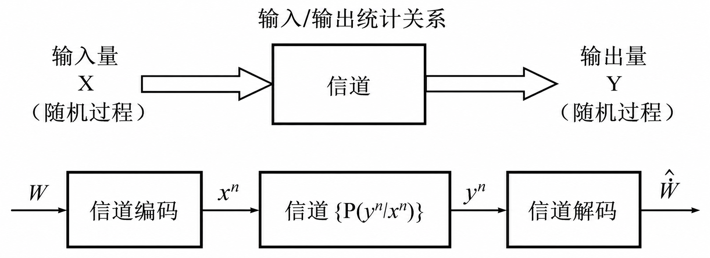 

**离散无记忆信道**：输入集合和输出集合都是有限的离散符号，信道在当前时刻 $n$ 的输出 $y_n$ 只取决于当前时刻的输入 $x_n$ ，而与过去或未来的输入和输出无关。
$$
p_N(y^N|x^N)=\prod_{n=1}^Np(y_n|x_n),\forall N
$$
**平稳信道**：信道的统计特性不随时间发生改变：
$$
p(y_n=j|x_n=k)=p(y_m=j|x_m=k),\forall n,m
$$

按照输入/输出信道在 **幅度和时间上的取值**，可以将信道分类为：

- 幅度离散，时间离散信道
- 幅度连续，时间离散信道
- 幅度连续，时间连续信道
- 幅度离散，时间连续信道

按输入/输出之间的 **记忆性** 可以分为有记忆信道和无记忆信道。

按输入/输出之间 **关系的确定性** 可以分为确定信道和随机信道。
#### 1.2 DMC 信道容量

信道容量为输出序列对不同输入序列所提供的**最大互信息**
$$
C=\lim_{n\rightarrow\infty}\frac{1}{n}\max_{Q(x^n)}
I(X_1X_2\cdots X_N;Y_1Y_2\cdots Y_N)
$$
平均每次利用信道，在输入和输出符号之间所能相互提供的互信息的 **最大值的极限**，该信道容量定义对所有形式的信道 **均成立**。

对于 **离散无记忆信道 (DMC)**：
$$
I(X_1X_2\cdots X_N;Y_1Y_2\cdots Y_N)\leq\sum_{n=1}^NI(X_n;Y_n)
$$
其中等号在输入为 **独立随机序列** 时得到，因此：
$$
C=\lim_{n\to\infty}\frac{1}{n}\max_{Q(x^n)}I(X_1X_2\cdots X_N;Y_1Y_2\cdots Y_N)
$$

将 $H(\mathbf{Y})$ 用熵的 **链式法则** 展开，并根据 **条件减少熵** 得到：
$$
\begin{align}
H(\mathbf{Y})
&=H(Y_1,Y_2,\cdots,Y_n)\\
&=H(Y_1)+H(Y_2|Y_1)+\cdots+H(Y_n|Y_{n-1}\cdots Y_n)
\leq \sum_{i=1}^n H(Y_i)
\end{align}
$$
给定输入时的 **条件熵** 为：
$$
\begin{align}
H(\mathbf{Y}|\mathbf{X})
&=-E\{\log p(y^n|x^n)\}
=-E\left\{\log\prod_{i=1}^n p(y_i|x_i)\right\}\\
&=-\sum_{i=1}^n E\{\log p(y_i|x_i)\}
=\sum_{i=1}^n H(Y_i|X_i)
\end{align}
$$
互信息等于接收端的不确定性减去由噪声引起的条件不确定性：
$$
\begin{align}
I(\mathbf{X};\mathbf{Y})
&=H(\mathbf{Y})-H(\mathbf{Y|X})\\
&\leq\sum_{i=1}^n\{H(Y_i)-H(Y_i|X_i)\}
=\sum_{i=1}^n I(X_i,Y_i)
\end{align}
$$
其中等号在输出 $Y$ 为 **独立分布** 时成立。信道无记忆，当 $X$ 独立分布时，$Y$ 也独立分布。因此，为了达到该信道的最大传输容量，在发送端只需要使用相互独立的输入信号即可。
#### 1.3 DMC 无噪信道

 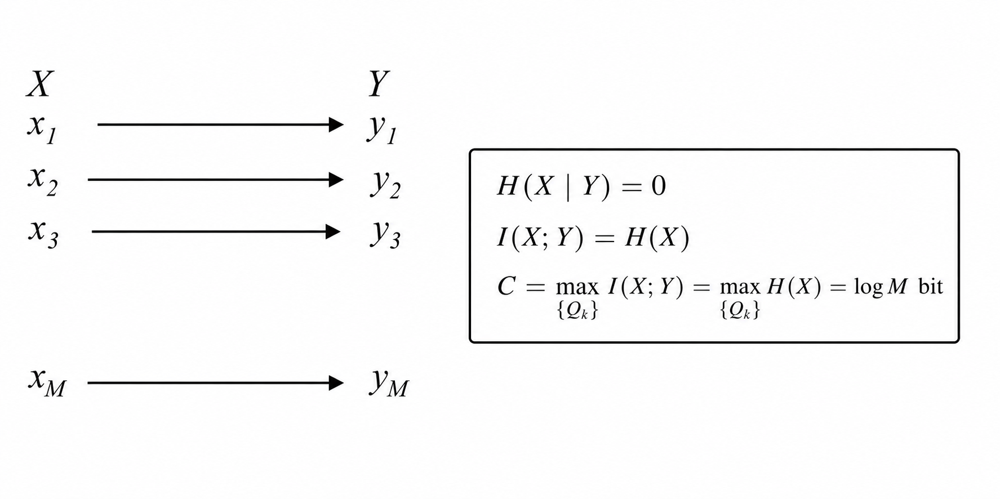 

在该信道中，信号传输 **不会产生任何噪声**，也 **不会丢失任何信息**。由于 $X$ 和 $Y$ 是一一对应的，在已知接收符号 $Y$ 的情况下，发送符号 $X$ 也是确定的，因此 $H(X|Y)=0$ 。

信道传输的信息 $I(X;Y)=H(X)-H(X|Y)=H(X)$ ，发送多少信息传输多少信息。

当 $X$ 中的所有符号 **等概率** 发送时，信源熵达到最大值 $\log M$ ，即为信道容量。
#### 1.4 DMC 无损信道

 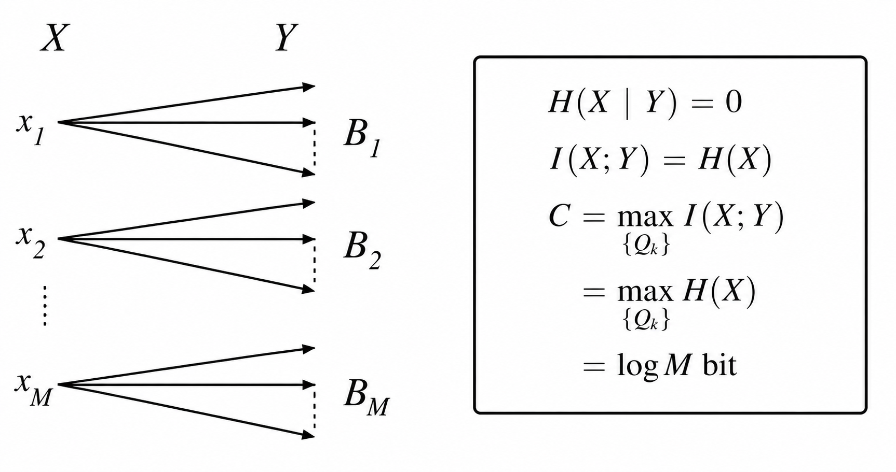 

该信道是 **无损有噪信道**，输出空间被划分为 **互不重叠** 的子集。同样在已知接收符号 $Y$ 的情况下，发送符号 $X$ 是确定的，因此 $H(X|Y)=0,I(X;Y)=0,C=\log M$ ，等概时取得。
#### 1.5 DMC 确定信道

 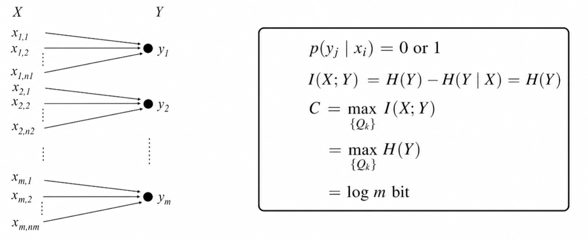 

对于任意给定的输入 $x_i$ ，其转移到输出 $y_j$ 的概率非 $0$ 即 $1$ 。因为信道是 **确定** 的，所以一旦 $X$ 被确定，输出 $Y$ 就是唯一确定的，因此 $H(Y|X)=0,I(X;Y)=H(Y)$，当输出的 $m$ 个符号为 **等概率** 时，输出熵达到最大值，信道容量为 $\log m$ 。
#### 1.6 DMC 无用信道

 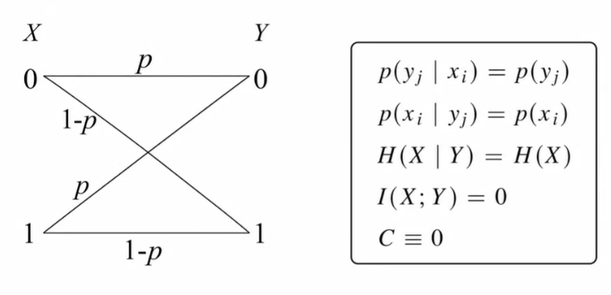 

$X$ 和 $Y$ 彼此独立，**条件熵** 等于 **信源熵**，$H(X|Y)=H(X)$ 接收端即使观察了输出 $Y$，对输入 $X$ 的不确定性没有任何降低。则 $I(X;Y)=H(X)-H(X|Y)=0,C\equiv0$ 。
#### 1.7 DMC 复制信道

 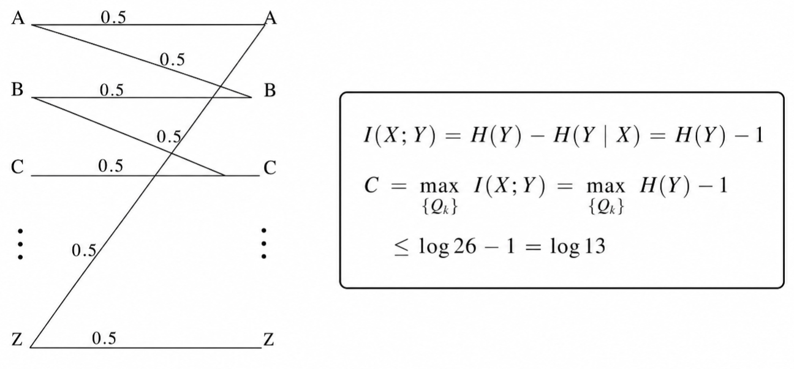 

对于任意一个给定的输入 $X=x$ ，其输出 $Y$ 只有两种可能，这个二项分布的不确定性为：
$$
H(Y|X=x)=-(0.5\log_20.5+0.5\log_20.5)=1\text{ bit}
$$
因为对每个输入符号都是如此，则 $H(Y|X)=1\text{ bit},I(X;Y)=H(Y)-1$ 。

输出端一共有 $26$ 个可能的字母，输出符号 **等概分布** 时取得最大值 $\log26-1=\log13$ 。
#### 1.8 二元对称信道 BSC

 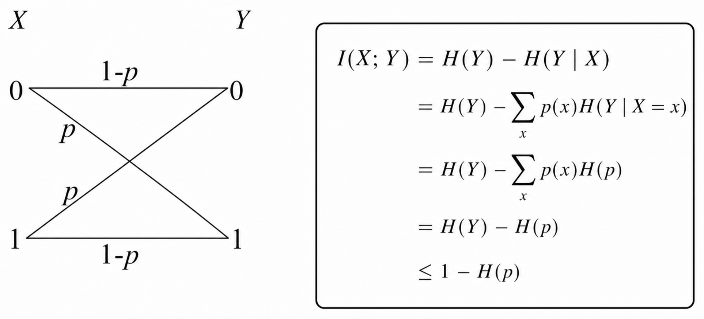 

当 $X=0$ 时，其不确定性为二进制熵函数：
$$
H(Y|X=0)=H(p)=-p\log p-(1-p)\log(1-p)
$$
当 $X=1$ 时，同理，其不确定性也是 $H(Y|X=1)=H(p)$ ，因此：
$$
H(Y|X)=\sum_xp(x)H(p)=H(p)\sum_xp(x)=H(p)
$$

当输入取 **等概分布** 时，输出 $Y$ 也是 **等概分布**，等号成立。
#### 1.9 二元除删信道 BEC

 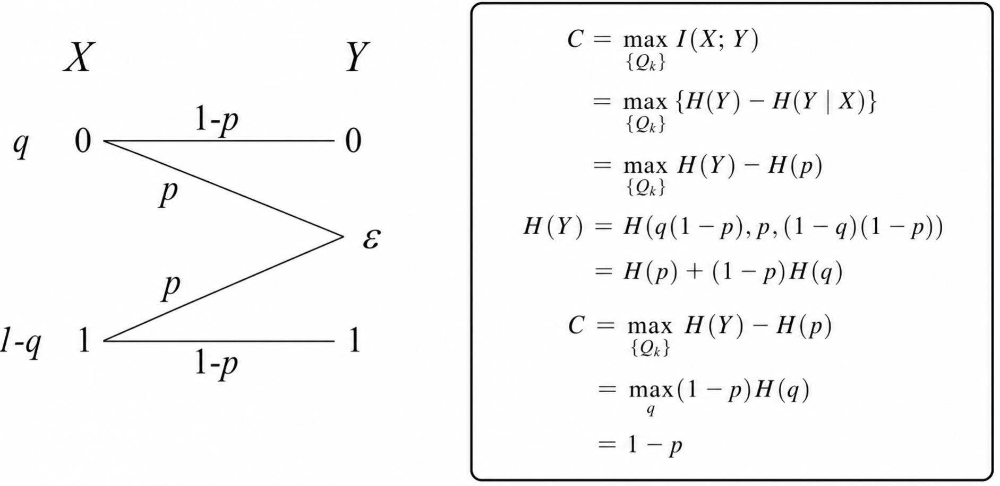 

同样根据 $X$ 的输出概率分布，可以得到 $H(Y|X)=H(p)$ ，输出的熵为：
$$
H(Y)=H(p)+(1-p)H(q)
$$

 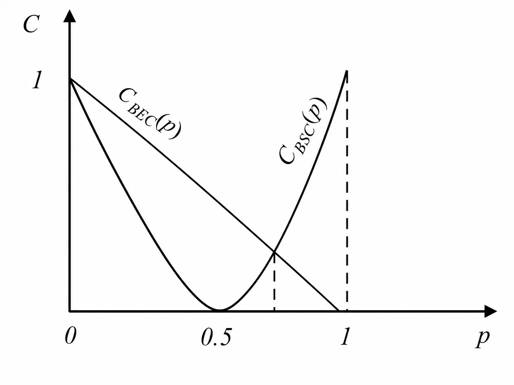 

### 2. 信道的组合

#### 2.1 平行信道

 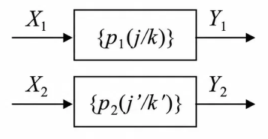 

**平行信道** 的信道容量等于 **各信道容量之和**：$\begin{align}C=\sum_{i=1}^n C_i\end{align}$
$$
p(jj'|kk')=p_1(j|k)p_2(j'|k')
$$
$$
\begin{align}
I(X_1X_2;Y_1Y_2)
&=H(Y_1Y_2)-H(Y_1Y_2|X_1X_2)\\
&\leq H(Y_1)+H(Y_2)-H(Y_1|X_1)-H(Y_2|X_2)\\
&=I(X_1;Y_1)+I(X_2;Y_2)
\end{align}
$$
等号成立的条件是各个子信道分别独立取最佳。
#### 2.2 开关信道

 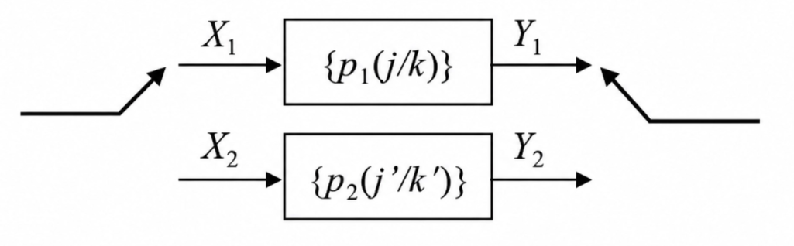 

$$
p(j|k)=
\begin{cases}
p_1(j|k),&k\in\mathcal{X}_1,j\in\mathcal{Y}_1\\
p_2(j|k),&k\in\mathcal{X}_2,j\in\mathcal{Y}_2\\
0,&\text{otherwise}
\end{cases}
\space,\quad
Q_k=
\begin{cases}
P_AQ_k^1,&k\in\mathcal{X}_1\\
P_BQ_k^2,&k\in\mathcal{X}_2
\end{cases}
$$
对于开关信道，总互信息分为 **各信道互信息的加权和** 以及 **开关动作本身带来的熵**：
$$
I(X;Y)=P_AI(X_1;Y_1)+P_BI(X_2;Y_2)+H(P_A,P_B)
$$
在满足 $P_A+P_B=1$ 的约束下，对 $P_A$ 和输入分布进行最大化：
$$
C=\max_{\{P_A,Q_k^1,Q_k^2\}}I(X;Y)=\max_{P_A}\{P_AC_1+P_BC_2+H(P_A,P_B)\}
$$
展开熵项 $H(P_A,P_B)=-P_A\log P_A-P_B\log P_B$ ，得到：
$$
C=\max_{P_A}\{P_AC_1+P_BC_2-P_A\log P_A-P_B\log P_B\}
$$
使用拉格朗日乘子法，引入拉格朗日乘子 $\lambda$ ：
$$
L=P_AC_1+P_BC_2-P_A\log P_A-P_B\log P_B-\lambda(P_A+P_B-1)
$$
对 $P_A$ 求偏导并令其为 $0$ ：
$$
\frac{\partial L}{\partial P_A}=C_1-(\log P_A+\frac{1}{\ln 2})-\lambda=0
$$
简洁起见，将 $\log_2\mathrm{e}$ 合并入 $\lambda$ 中，得到：
$$
\frac{\partial C}{\partial P_A}=C_1-\log P_A-1=\lambda
$$
$$
\log_2 P_A=C_1-1-\lambda
\space\Longrightarrow\space
P_A=2^{C_1-1-\lambda}
$$
同理可以对 $P_B$ 求偏导得到 $P_B=2^{C_2-1-\lambda}$ 。利用 $P_A+P_B=1$ 可以得到：
$$
2^{C_1-\lambda-1}+2^{C_2-\lambda-1}=1
\space\Longrightarrow\space
2^{-\lambda-1}(2^{C_1}+2^{C_2})=1
$$
解得 $2^{-\lambda-1}=\frac{1}{2^{C_1}+2^{C_2}}$ ，代入 $C$ 的表达式可得：
$$
\begin{align}
C
&=P_AC_1+P_BC_2-P_A(C_1-1-\lambda)-P_B(C_2-1-\lambda)\\
&=(P_A+P_B)(1+\lambda)=1+\lambda=\log(2^{C_1}+2^{C_2})
\end{align}
$$
>[!Note] **Note**
>当 $C_1=C_2=0$ 时，$C=1$，两个信道本身都无法传递任何数据，但是开关本身成为了一个信息源，控制开关可以通过通道的选择每步传输 1 bit 的信息。
#### 2.3 级联信道

 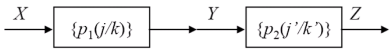 

输出 $Z$ 只取决于输入 $Y$，而与 $X$ 无直接关联，$X\to Y\to Z$ 构成马尔可夫链：
$$
I(X;Y)\geq I(X;Z),\quad I(Y;Z)\geq I(X;Z)
$$
级联信道的容量 $C$ 定义为：$C=\max_{p(x)}I(X;Z)$，根据上述不等式可以得到：
$$
C\leq\min\{C_1,C_2\}
$$
#### 2.4 案例：对称信道

 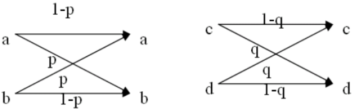 

上图中为两个 **对称信道**，其中 $C_1=1-H(p),C_2=1-H(q)$ ，下面三张依次是 **平行信道**、**开关信道**、**联级组合信道** 的信道容量分析。

 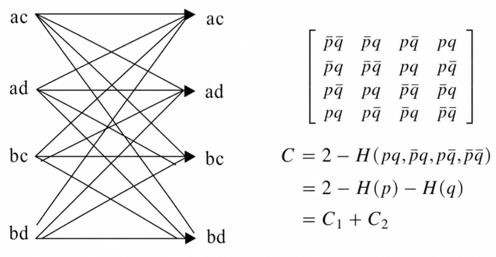 

 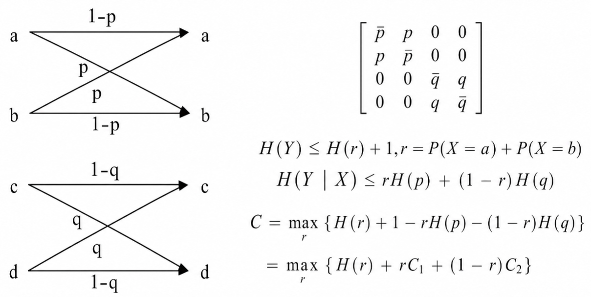 

 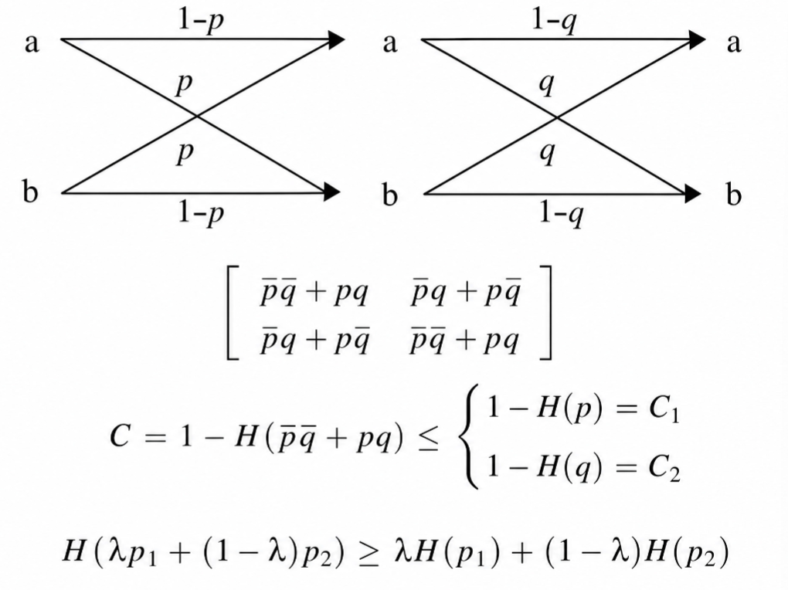 

