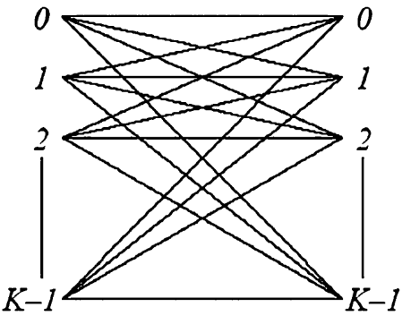
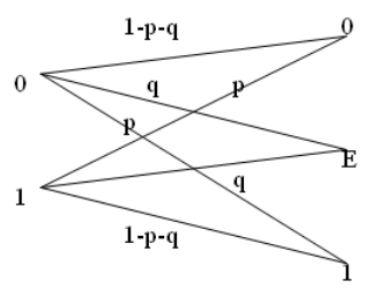
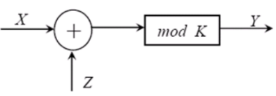

### 1. 凸函数与凸优化

#### 1.1 凸函数的平稳点

假定 $f(x)$ 是定义在 **所有分量为非负** 的 $K$ 维无穷凸集 $R$ 上的一个 **凸函数**，则满足下式的点称为 $f(x)$ 的 **平稳点**，$f(x)$ 在平稳点处取到 **极值**：
$$
\nabla f(x) =
\begin{bmatrix}
\frac{\partial f(x)}{\partial x_1}&
\frac{\partial f(x)}{\partial x_2}&
\cdots&
\frac{\partial f(x)}{\partial x_K}
\end{bmatrix}^{T}
= \mathbf{0}
$$
在该平稳点处的 Hessian 矩阵是 **对称矩阵**：
$$
H(x) =
\begin{pmatrix}
\frac{\partial^2 f(x)}{\partial x_1^2} & \frac{\partial^2 f(x)}{\partial x_1\partial x_2} & \cdots & \frac{\partial^2 f(x)}{\partial x_1\partial x_K} \\[6pt]
\frac{\partial^2 f(x)}{\partial x_2\partial x_1} & \frac{\partial^2 f(x)}{\partial x_2^2} & \cdots & \frac{\partial^2 f(x)}{\partial x_2\partial x_K} \\[6pt]
\vdots & \vdots & \ddots & \vdots \\[6pt]
\frac{\partial^2 f(x)}{\partial x_K\partial x_1} & \frac{\partial^2 f(x)}{\partial x_K\partial x_2} & \cdots & \frac{\partial^2 f(x)}{\partial x_K^2}
\end{pmatrix}
$$
如果是凸函数，则在其定义域内，Hessian 矩阵为 **半正定**，可用于判断一个函数是否为凸。

>[!Note] **半正定矩阵**
>$n\times n$ 的实对称矩阵 $A$ 被称为 **半正定矩阵** ，如果对任意非负实向量 $x\in\mathrm{R}^n$ 都有：
>$$\mathbf{x}^TA\mathbf{x}\geq0$$ 即以 $A$ 作为二次型的系数矩阵时，它永远 **不可能** 产生负值。

#### 1.2 凸函数的极值点

**定理 1**：$f(x)$ 是定义在所有分量为非负的 $K$ 维无穷凸集 $R$ 上的一个凸函数，如果 $\nabla f(x)$ 在 $R$ 上 **连续**，则 $f(x)$ 在 $R$ 上取 **极大值** 的 **充要条件** 为：
$$
\begin{align}
&f'(x)=0,\forall x_k>0\\
&f'(x)<0,\forall x_k=0
\end{align}
$$
如果在 $R$ 上能找到 $f'(x)=0$ 则极大值必然在该点取到，否则取边界点，此时 $f'(x)<0$ 。

**定理 2**：$f(x)$ 是定义在 $K$ 维概率空间 $R$ 上的一个凸函数，如果 $\nabla f(x)$ 在 $R$ 上 **连续**，则 $f(x)$ 在 $R$ 上取 **极大值** 的 **充要条件** 为：
$$
\begin{align}
&f'(x)=\lambda,\forall x_k>0\\
&f'(x)<\lambda,\forall x_k=0
\end{align}
$$
其中 $\lambda$ 为拉格朗日乘数，由 $\sum_k x_k=1$ 决定。
#### 1.3 凸优化与 KTT 条件

凸优化问题可以写为**目标函数**、**不等式约束** 和 **等式约束** 的标准形式：
$$
\begin{align}
&\text{Minimize}\quad f(x)\\ 
&\text{Subject to}\quad g_i(x)\leq0,h_j(x)=0
\end{align}
$$
为了求解，为不等式约束引入系数 $\mu_i$ ，为等式约束引入系数 $\lambda_i$ ，则最优解 $x^*$ 必须满足：

- **梯度平衡**：目标函数的梯度和约束函数的梯度相互抵消：
$$
\nabla f(x^*)
+\sum_{i=1}^m\mu_i\nabla g_i(x^*)
+\sum_{j=1}^l\lambda_j\nabla h_j(x^*)
=0
$$
- **原始可行性**：最优解 $X^*$ 必须是合法的，即必须满足原本所有约束条件：
$$
\begin{align}
&g_i(x^*)\leq0,\text{ for all }i=1,\cdots,m\\
&h_j(x^*)=0,\text{ for all }j=1,\cdots,l
\end{align}
$$
- **对偶可行性**：不等式约束对应的系数 $\mu_i$ 必须非负：
$$
\mu_i\geq0,\text{ for all }i=1,\cdots,m
$$
- **互补松弛性**：对于任意一个不等式约束，要么乘子 $\mu_i=0$ ，要么约束函数 $g_i(x^*)=0$： 
$$
\mu_i g_i(x^*)=0,\text{ for all }i=1,\cdots,m
$$
>[!Note] **Note**
>对偶可行性和互补松弛性实际上在处理 **不等式约束的边界问题**：
>- 当 $x^*$ 不在不等式约束的等号上时 $\mu_i=0$ ，相当于这一条不等式约束没有生效；
>- 当 $x^*$ 在不等式约束的等号边界上时，此时 $g_i(x^*)=0$ ，由于 $x^*$ 向边界外移动可能让 $f(x)$ 的值更小，为阻止 $x^*$ 向边界外移动，要让 $\mu_i>0$ 抵消向外移动的趋势。
>
>上述 KTT 条件总是能让 $\mu_ig_i(x^*)=0$ ，实际上就是转换为最小化拉格朗日函数：
>$$L(x,\mu,\lambda)=f(x)+\sum_{i=1}^m\mu_ig_i(x)+\sum_{j=1}^l\lambda_jh_j(x)$$

### 2. DMS 信道容量定理

#### 2.1 DMS 信道容量定理

概率分布 $\{Q_0\cdots,Q_{K-1}\}$ 达到转移概率为 $\{p(j|k)\}$ 的 DMS 信道容量 $C$ 的 **充要条件** 为：
$$
\begin{align}
&I(X=k;Y)=C,\forall k,Q_k>0\\
&I(X=k;Y)<C,\forall k,Q_k=0
\end{align}
$$
$I(X=k;Y)$ 表示通过信道传送字符 $X=k$ 时，信道输入输出间可获得的互信息期望值：
$$
I(X=k;Y)
= \sum_{j=0}^{J-1} p(j|k) \log\frac{p(j|k)}{p(j)}
= \sum_{j=0}^{J-1} p(j|k) \log\frac{p(j|k)}{\sum_{i=0}^{K-1} Q_i p(j|i)}
$$
**证明**：
$$
I(X=l;Y) = \sum_{j=0}^{J-1} p(j|l) \log\frac{p(j|l)}{\sum_{i=0}^{K-1} Q_i p(j|i)}
$$
$$
\frac{\partial I(X=l;Y)}{\partial Q_k}
= -\sum_{j=0}^{J-1} p(j|l) \frac{p(j|k)}{\sum_{i=0}^{K-1} Q_i p(j|i)}
$$
$$
\begin{aligned}
\sum_{l=0}^{K-1} Q_l\frac{\partial I(X=l;Y)}{\partial Q_k}
&= -\sum_{l=0}^{K-1} Q_l \sum_{j=0}^{J-1} p(j|l) \frac{p(j|k)}{\sum_{i=0}^{K-1} Q_i p(j|i)} \\[4pt]
&= -\sum_{j=0}^{J-1} \frac{p(j|k)}{\sum_{i=0}^{K-1} Q_i p(j|i)} \sum_{l=0}^{K-1} Q_l p(j|l) = -1
\end{aligned}
$$
构造拉格朗日函数：
$$
J(\{Q_k\}) = I(X;Y) - \lambda\!\left(\sum_{k=0}^{K-1} Q_k\right)
= \sum_{k=0}^{K-1} Q_k I(X=k;Y) - \lambda\!\left(\sum_{k=0}^{K-1} Q_k\right)
$$
互信息是上凸函数，根据凸函数的极值点条件：
$$
\frac{\partial J(\{Q_k\})}{\partial Q_k}
\begin{cases}
=0, & \forall Q_k > 0 \\[4pt]
<0, & \forall Q_k = 0
\end{cases}
$$
$$
\begin{aligned}
\frac{\partial J(\{Q_k\})}{\partial Q_k}
&= I(X=k;Y) + \sum_{l=0}^{K-1} Q_l\frac{\partial I(X=l;Y)}{\partial Q_k} - \lambda \\[4pt]
&= I(X=k;Y) - (\lambda+1)
\end{aligned}
$$
令 $C=\lambda+1$ ，即得 DMS 信道容量定理的条件：
$$
\begin{cases}
I(X=k;Y)=C, & \forall k,\; Q_k > 0 \\[4pt]
I(X=k;Y)<C, & \forall k,\; Q_k = 0
\end{cases}
$$
>[!Note] **Note**
>取到 DMS 信道的容量的充要条件是对于好的（使用该符号） $I(X=k;Y)$ 其值均相等，对于不好的（不使用该符号） $I(X=k;Y)$ 其值均为 $0$ :
>$$C=I(X;Y)=\sum_{k}Q_kI(X=k;Y)$$

#### 2.2 对称 DMS 信道

离散无记忆信道的转移概率可用 $K\times J$ 矩阵表示：
$$
\mathbf{P}=\{p(j|k)\}=
\begin{bmatrix}
p(0|0) & p(1|0) & \cdots & p(J-1|0) \\
p(0|1) & p(1|1) & \cdots & p(J-1|1) \\
\vdots & \vdots & \ddots & \vdots \\
p(0|K-1) & p(1|K-1) & \cdots & p(J-1|K-1)
\end{bmatrix}
$$
向量 $\textbf{x} = \{x_1, x_2, …, x_N\}$ 的置换向量定义为：
$$
\mathbf{x}' = \{x_{\pi(1)}, x_{\pi(2)}, \cdots, x_{\pi(N)}\}
$$
$\mathbf{\pi}=\{\pi_1,\pi_2,\cdots,\pi_N\}$ 是 $\{1,2,\cdots,N\}$ 的任意排列。

若 $\mathbf{P}$ 中每一行都是第一行的一个置换，则该信道 **关于输入对称**，有推论：
$$
H(Y|X) = H(Y|X=k) = -\sum_{j=0}^{J-1} p(j|k)\log p(j|k)
$$
若 $\mathbf{P}$ 中每一列都是第一列的一个置换，则该信道 **关于输出对称**，有推论：
$$
\sum_{k=0}^{K-1} p(j|k) = \frac{K}{J},\quad j=0,1,\cdots,J-1
$$
若一个信道既关于输入对称，又关于输出对称，即 $\mathbf{P}$ 中每一行都是第一行的一个置换，每一列都是第一列的一个置换，则该信道是 **对称的**。

对一个信道的转移概率矩阵 $\mathbf{P}$ **按列划分**，得到若干个子信道，若划分出的所有子信道均是对称的，则称该信道是 **准对称的**。下面是两个准对称信道的例子：
$$
\mathbf{P_1}=\begin{pmatrix}
0.8 & 0.1 & 0.1 \\
0.1 & 0.1 & 0.8
\end{pmatrix},
\quad
\mathbf{P_2}=\begin{pmatrix}
0.2 & 0.1 & 0.4 & 0.3 \\
0.3 & 0.1 & 0.4 & 0.2 \\
0.2 & 0.4 & 0.1 & 0.3 \\
0.3 & 0.4 & 0.1 & 0.2
\end{pmatrix}
$$
#### 2.3 准对称信道容量定理

达到准对称离散无记忆信道容量的输入分布为 **均匀分布**。

证明：若 $Q_k=\frac{1}{K},k=0,1,\cdots,K-1$ ，则有：
$$
\begin{aligned}
I(X=k;Y)
&= \sum_{j=0}^{J-1} p(j|k) \log\frac{p(j|k)}{\frac{1}{K}\sum_{i=0}^{K-1}p(j|i)} \\[4pt]
&= \sum_s \sum_{j\in y_s} p(j|k) \log\frac{p(j|k)}{\frac{1}{K}\sum_i p(j|i)} = \text{const}
\end{aligned}
$$
满足 KKT 条件，此时的互信息值记为该信道的信道容量。
#### 2.4 不同对称性信道容量

若信道 **关于输入对称** 则：
$$
I(X;Y)=H(Y)-H(Y|X)=H(Y)+\sum_{j=0}^{J-1}p(j|k)\log p(j|k)
$$
若信道同时也 **关于输出对称**（即**信道对称**），则：
$$
C=\log J+\sum_{j=0}^{J-1}p(j|k)\log p(j|k)
$$
若信道 **只关于输入对称**，则：
$$
C\leq\log J+\sum_{j=0}^{J-1}p(j|k)\log p(j|k)
$$
#### 2.5 案例：K 元对称信道

  

$$
p(j|k)=\begin{cases}
1-p,&k=j\\
\frac{p}{K-1},&k\neq j
\end{cases}
$$
$$
\begin{align}
C
&=\log K+\sum_{j=0}^{J-1}p(j|k)\log p(j|k)\\
&=\log K+(1-p)\log(1-p)+p\log\frac{p}{K-1}\\
&=\log K-H(p)-p\log(K-1)
\end{align}
$$

#### 2.6 案例：除删信道

  

$$
\mathbf{P} = \begin{pmatrix}
1-p-q & q & p \\
p & q & 1-p-q
\end{pmatrix}
$$
当 $Q_0=Q_1=0.5$ 时有：
$$
\begin{align}
C &= I(X=0;Y) = I(X=1;Y) \\[4pt]
&= (1-p-q)\log\frac{1-p-q}{(1-q)/2}
+ q\log\frac{q}{q}
+ p\log\frac{p}{(1-q)/2} \\[4pt]
&= (1-p-q)\log(1-p-q) + p\log p - (1-q)\log\frac{1-q}{2}
\end{align}
$$
当 $p=0$ 时该信道为二元除删信道，当 $q=0$ 时为二元对称信道。

#### 2.7 案例：模 K 加法信道

  

$$
Y = X + Z \bmod K,\quad X,Y,Z \in \{0,1,2,\cdots,K-1\}
$$
$p(z)$ 为任意分布，该信道是一个对称信道。
$$
\begin{aligned}
H(Y|X) &= -\sum_x \sum_y Q(x)p(y|x)\log p(y|x) \\
&= -\sum_x \sum_z Q(x)p(z)\log p(z) = H(Z)
\end{aligned}
$$
$$
C = \log K - H(Z)
$$

当 $Z$ 为 **等概分布** 时，信道容量为 $0$；当 $Z$ 为 **确定性分布** 时，信道容量为 $\log K$。
#### 2.8 可逆转移矩阵信道容量

根据 KKT 条件，当所有输入 $k$ 均有非零概率时，互信息 $I(X=k;Y)$ 必须等于常数 $C$：
$$
\sum_j p(j|k)\log\frac{p(j|k)}{p(j)}=C,\quad p(j)=\sum_iQ_ip(j|i)
$$
将上述方程拆分并移项：
$$
\sum_jp(j|k)\log p(j)=\sum_jp(j|k)\log p(j|k)-C
$$
令 $\beta_j=C+\log p(j)$ ，原式变成矩阵形式：
$$
\mathbf{P} \boldsymbol{\beta} = \boldsymbol{\alpha},
\quad\alpha_k=\sum_jp(j|k)\log p(j|k)
$$
由于 $\mathbf{P}$ 可逆，求解 $\boldsymbol{\beta}=\mathbf{P}^{-1}\boldsymbol{\alpha}$ ，由 $\beta_j=C+\log p(j)$ 得到 $p(j)=2^{\beta_j-C}$ ，**归一化**：
$$
\sum_j2^{\beta_j-C}=1
\space\Longrightarrow\space
2^C=\sum_j2^{\beta_j}
\space\Longrightarrow\space
C=\log_2\left(\sum_j2^{\beta_j}\right)
$$
再由 $\omega_j=\sum_{i=0}^{K-1}Q_i p(j|k),j=0,1,\cdots,K-1$ 即可求出 $\{Q_k\}$ 。

