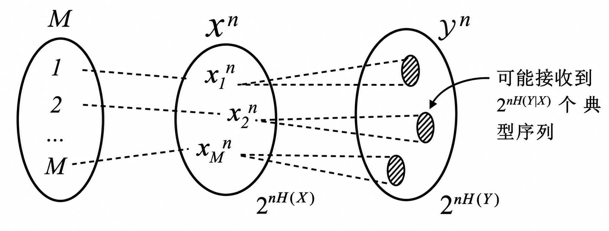
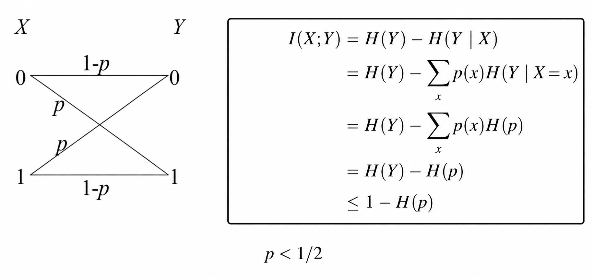
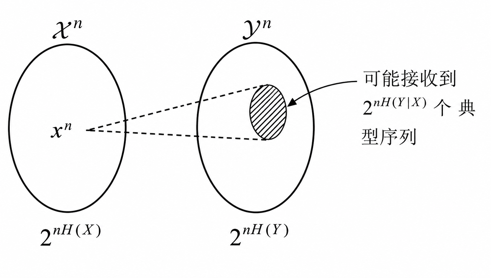
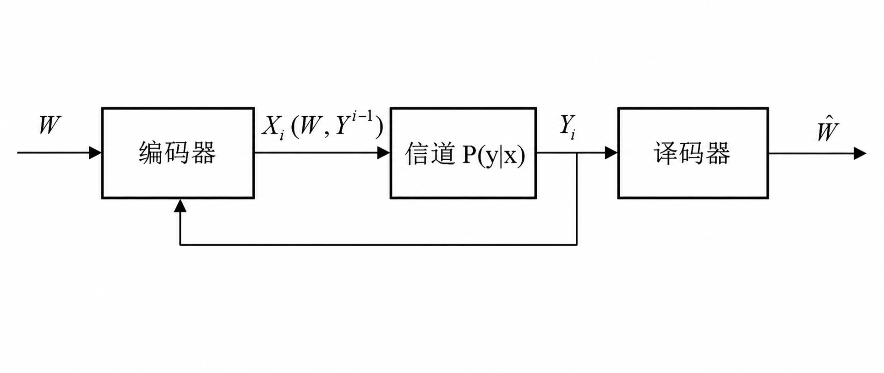
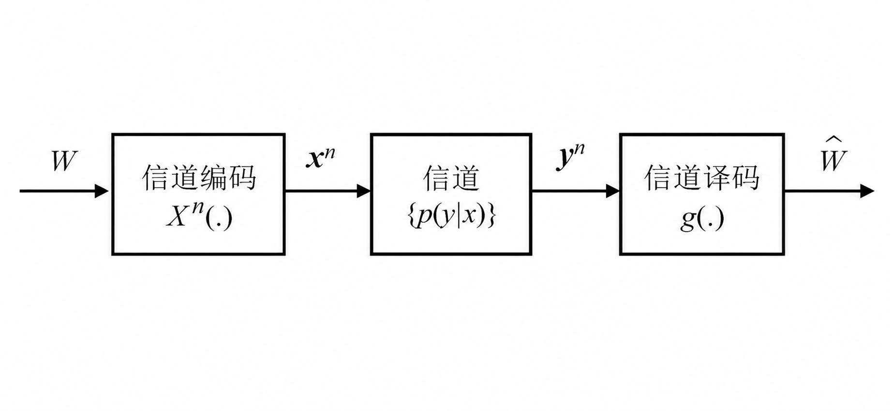

### 1. DMC 信道的编码

#### 1.1 DMC 编码直观说明

  

- **发送端 $\mathcal{M}$** ：发送端有 $M$ 个可能发送的不同消息，即 $\{1,2,\cdots,M\}$
- **输入序列空间 $\mathcal{X}^n$** ：编码器将每个消息 $i$ 映射为一个长度为 $n$ 的码字 $\mathbf{x}_i^n$ ，在长度为 $n$ 的所有输入序列中，符合统计规律的典型输入列的个数大约为 $2^{nH(X)}$ 
- **输出序列空间 $\mathcal{Y}^n$** ：接收端长度为 $n$ 的典型输出列的总数大约为 $2^{nH(Y)}$
- **阴影部分**：发送端发送特定的码字，由于信道噪声在接收端可能收到的条件典型列集合

由于所有码字通过的信道是 **相同** 的，在信道中受到的噪声是同概率分布的（如有 $0.1$ 的概率发生比特翻转），对于 **不同** 的码字在接收端可能接受到的典型列个数是 **近似相等** 的。同时在发送端码字作为典型列发生的概率也是近似相等的，发送端的消息数量 $M$ 满足近似：
$$
M\approx\frac{2^{nH(Y)}}{2^{nH(Y|X)}}=2^{n(H(Y)-H(Y|X))}=2^{nI(X;Y)}
$$
**传输速率 $R$** 表示每个传输符号所能传送的平均比特数：
$$
R=\frac{\log M}{n}\approx I(X;Y)\leq C
$$
#### 1.2 DMC 编码基本定义

离散无记忆信道 $(\mathcal{X},p(y|x),\mathcal{Y})$ 上的一个 $(M,n)$ 码由如下组成：
- 一个与 $M$ 个消息对应的标号集合 $\mathcal{W}=\{1,2,\cdots,M\}$
- 一个编码器，一个码的全体码字构成码书。把消息 $w\in\mathcal{W}$ 映射成码字 $x^n\in\mathcal{X}^n$ 
- 一个译码器 $g_1$ ：$\mathcal{Y}^n\to\mathcal{W}$ 对应于确定的译码法则

发送第 $i$ 个消息所发生的 **错误概率** 定义为：$\lambda_i=P\{g(Y^n)\neq i \mid X^n=x^n(i)\}$

**最大错误概率** ：$\begin{align}\lambda^{(n)}=\max_{i\in\{1,2,\cdots,M\}}\lambda_i\quad\quad\end{align}$  **平均错误概率** ：$\begin{align}P_e^{(n)}=\frac{1}{M}\sum_{i=1}^M\lambda_i\end{align}$

若存在一系列 $(2^{nR},n)$ 码，当 $n\to\infty$ 时， $\lambda^{(n)}\to0$ ，该编码速率 $R$ 被称为 **可达的**。
#### 1.3 二元对称信道编码定理

  

用 $\mathcal{L}$ 表示码书，则码书对应的矩阵可以表示为：

$$
\begin{bmatrix}
x_1(1) & x_2(1) & \cdots & x_n(1) \\
x_1(2) & x_2(2) & \cdots & x_n(2) \\
\vdots & \vdots & \ddots & \vdots \\
x_1(2^{nR}) & x_2(2^{nR}) & \cdots & x_n(2^{nR}) \\
\end{bmatrix}
$$

- **译码方法**：如果接收到的 $y^n$ 与某个码字 $x^n(i)$ 的 Hamming 距离小于 $r=n(p+\epsilon_2)$ 时，就宣称发送的是第 $i$ 个码字，其中 $\epsilon_2$ 是任意小数，且满足 $p+\epsilon_2<0.5$ 
- **译码错误**：$y^n$ 与 $x^n(i)$ 的 Hamming 距离大于 $r=n(p+\epsilon_2)$ 或者 $y^n$ 与其它 $x^n(j)$ 的 Hamming 距离小于 $r=n(p+\epsilon_2)$ 

对于一个 **随机生成** 的码书 $\mathcal{L}$ ，$P(\mathcal{L})$ 是生成该码书的概率，**全局平均错误概率** 为：
$$
P(E)=\sum_\mathcal{L}P(\mathcal{L})P_e^{(n)}(\mathcal{L})
$$
在 **特定码书** 下的平均错误概率为：
$$
P_e^{(n)}(\mathcal{L})=\frac{1}{2^{nR}}\sum_{i=1}^{2^{nR}}\lambda_i(\mathcal{L})
$$
将上式代入全局平均错误概率，由于各码字在**所有码书**上的平均错误概率相同，得：
$$
P(E)
=\frac{1}{2^{nR}}
\sum_{i=1}^{2^{nR}}
\sum_{\mathcal{L}}P(\mathcal{L})\lambda_i(\mathcal{L})
=\sum_\mathcal{L}P(\mathcal{L})\lambda_1(\mathcal{L})
\triangleq P(E \mid i=1)
$$
译码错误可以分解为两种情况，译码器找不到正确答案或 $y^n$ 落在错误码字 Hamming 球内：
$$
P(E \mid i=1)
=P(\overline{E}_1\cup E_2\cup\cdots\cup E_{2^{nR}})
\leq P(\overline{E}_1)+\sum_{i=2}^{2^{nR}}P(E_i)
$$
- 不妨令 $i=1$ 为全 $0$ 序列，则 $P(\overline{E}_1)$ 表示输出序列中 $1$ 的个数超过 $n(p+\epsilon_2)$ 的概率，根据切比雪夫不等式，该概率可以任意小，即 $P(\overline{E}_1)<\frac{\epsilon}{2}$ 。
- 发送其它序列时，有 $\sum_{t=0}^rC_n^t$ 个序列落在半径为 $r$ 的 Hamming 球内：
$$
\begin{align}
P(E \mid i=1)
&<\frac{\epsilon}{2}+(2^{nR}-1)\frac{1}{2^n}\sum_{t=0}^rC_n^t\\
&=\frac{\epsilon}{2}+(2^{nR}-1)\frac{1}{2^n}\sum_{t=0}^{n\lambda}C_n^t,\quad \lambda<1/2\\
&<\frac{\epsilon}{2}+2^{nR}2^{-n[1-H(\lambda)]}
=\frac{\epsilon}{2}+2^{n(R-C)}
\end{align}
$$
$$
r=n\lambda=n(p+\epsilon_2)
$$
$$
1
\geq\sum_{t=0}^{n\lambda}C_n^t\lambda^t(1-\lambda)^{n-t}
\geq\sum_{t=0}^{n\lambda}C_n^t\lambda^{n\lambda}(1-\lambda)^{n-n\lambda}
=\sum_{t=0}^{n\lambda}C_n^t2^{-nH(\lambda)}
$$
只要信息传输速率低于信道容量，通过增加编码长度 $n$ ，就能让错误概率趋近于 $0$ 。
#### 1.4 联合典型列及其性质

联合分布 $p(x,y)$ 的联合典型列集合 $A_\epsilon^{(n)}$ 是指具有以下性质的序列对 $(x^n,y^n)$ 的集合：
$$
A_{\epsilon}^{(n)} = \left\{ (x^n, y^n) \in \mathcal{X}^n \times \mathcal{Y}^n : 
\begin{aligned}
\left| -\frac{1}{n}\log p(x^n) - H(X) \right| &< \epsilon, \\[1ex]
\left| -\frac{1}{n}\log p(y^n) - H(Y) \right| &< \epsilon, \\[1ex]
\left| -\frac{1}{n}\log p(x^n, y^n) - H(X,Y) \right| &< \epsilon
\end{aligned}
\right\}
$$

设 $A_\epsilon^{(n)}$ 是与 $p(x,y)$ 对应的联合典型列集合，若联合序列 $(X^n,Y^n)$ 的每一个符号对 $(x_i,y_i)$ 均是按照联合分布 $p(x,y)$ **独立选取**，则 $(X^n,Y^n)\sim p(x^n,y^n)$ 且满足：

- $P\left((X^n,Y^n)\in A_\epsilon^{(n)}\right)\to 1$
- $(1-\epsilon)2^{n(H(X,Y)-\epsilon)}\leq\left|A_\epsilon^{(n)}\right|\leq2^{n(H(X,Y)+\epsilon)}$

如果联合序列 $\left(\widetilde{X}^n,\widetilde{Y}^n\right)\sim p(x^n)p(y^n)$ ，即 $\widetilde{X}^n$ 和 $\widetilde{Y}^n$ 分别按照 $p(x,y)$ 的边缘分布 $p(x)$ 和 $p(y)$ 来独立选取，则：
$$
(1-\epsilon)2^{-n(I(X;Y)+3\epsilon)}\leq P\left(\left(\widetilde{X}^n,\widetilde{Y}^n\right)\in A_\epsilon^{(n)}\right)\leq2^{-n(I(X;Y)-3\epsilon)}
$$
$$
\begin{align}
P\left(\left(\widetilde{X}^n,\widetilde{Y}^n\right)\in A_\epsilon^{(n)}\right)
&=\sum_{(x^n,y^n)\in A_\epsilon^{(n)}}p(x^n)p(y^n)\\
&\leq\left|A_\epsilon^{(n)}\right|\cdot 2^{-n(H(X)-\epsilon)}\cdot2^{-n(H(Y)-\epsilon)}\\
&\leq 2^{n(H(X,Y)+\epsilon)}\cdot 2^{-n(H(X)-\epsilon)}\cdot2^{-n(H(Y)-\epsilon)}\\
&=2^{-n(I(X;Y)-3\epsilon)}
\end{align}
$$
$$
\begin{align}
P\left(\left(\widetilde{X}^n,\widetilde{Y}^n\right)\in A_\epsilon^{(n)}\right)
&=\sum_{(x^n,y^n)\in A_\epsilon^{(n)}}p(x^n)p(y^n)\\
&\geq\left|A_\epsilon^{(n)}\right|\cdot 2^{-n(H(X)+\epsilon)}\cdot2^{-n(H(Y)+\epsilon)}\\
&\geq(1-\epsilon)\cdot 2^{n(H(X,Y)-\epsilon)}\cdot 2^{-n(H(X)+\epsilon)}\cdot2^{-n(H(Y)+\epsilon)}\\
&=(1-\epsilon)2^{-n(I(X;Y)+3\epsilon)}
\end{align}
$$
则随机独立配对的两条序列，落入联合典型集的概率约为 $2^{-nI(X;Y)}$ ，$I(X;Y)$ 越大，说明 $X$ 和 $Y$ 的依赖越强，随机配对恰好为联合典型列的概率就越低。

  

随机选择 $y^n$ 约有 $2^{-nI(X;Y)}$ 的概率与 $x^n$ 构成联合典型列。

>[!Note] **Note**
>观察可以发现，随机选择 $y^n$ 与 $x^n$ 构成联合典型列的概率信道容量表达上恰为 $1/M$ ，这是由两种不同的视角造成的：消息通过信道的过程会受噪声影响从“单点”变成一个“散布”，典型列就是这个“散布”落在的集合（根据大数定理不落在散布的概率可以 **忽略不计**），由于通过的信道受到的噪声是一样的，散布的大小也是 **近似相同** 的。
>- 随机选择 $y^n$ 与 $x^n$ 构成典型列的概率就是回答 $y^n$ 恰好落在 $x^n$ 的散布内的概率，即一个散布占整个输出序列空间的多少比例；
>- 发送端的消息数量 $M$ 就是回答在散布互不重叠的情况下最多能传递多少不同的信号，即整个输出序列空间能放下多少散布。
### 2. DMC 信道编码定理

#### 2.1 DMC 信道编码定理

**香农信道编码定理**：如果信息传输率 $R$ 小于信道容量 $C$ ，则存在一种编码方法，使信息在该信道上无错误地可靠传输。

所有低于信道容量 $C$ 的速率 $R$ 均是可达的，仅当 $R<C$ 时，总存在一系列码 $(2^{nR},n)$ ，当 $n\to\infty$ 时，**最大误码概率** $\lambda^{(n)}\to0$ 。

用 $\mathcal{L}$ 表示码书，则码书对应的矩阵可以表示为：
$$
\begin{bmatrix}
x_1(1) & x_2(1) & \cdots & x_n(1) \\
x_1(2) & x_2(2) & \cdots & x_n(2) \\
\vdots & \vdots & \ddots & \vdots \\
x_1(2^{nR}) & x_2(2^{nR}) & \cdots & x_n(2^{nR}) \\
\end{bmatrix}
$$
- **译码方法**：如果接收的 $y^n$ 与某个码字 $x^n(\hat{w})$ 是联合典型的，即 $(x^n(\hat{w}),y^n)\in A_\epsilon^{(n)}$ 就宣称发送的是第 $\hat{w}$ 个码字；
- **译码错误**：译码错误事件 $\hat{w}\neq w$ 以及不可译事件（不存在唯一的码字 $x^n(\hat{w})$ 满足 $(x^n(\hat{w}),y^n)\in A_\epsilon^{(n)}$）

对于一个 **随机生成** 的码书 $\mathcal{L}$ ，$P(\mathcal{L})$ 是生成该码书的概率，**全局平均错误概率** 为：
$$
P(E)=\sum_\mathcal{L}P(\mathcal{L})P_e^{(n)}(\mathcal{L})
$$
在 **特定码书** 下的平均错误概率为：
$$
P_e^{(n)}(\mathcal{L})=\frac{1}{2^{nR}}\sum_{w=1}^{2^{nR}}\lambda_w(\mathcal{L})
$$
将上式代入全局平均错误概率，由于各码字在**所有码书**上的平均错误概率相同，得：
$$
P(E)
=\frac{1}{2^{nR}}
\sum_{w=1}^{2^{nR}}
\sum_{\mathcal{L}}P(\mathcal{L})\lambda_w(\mathcal{L})
=\sum_\mathcal{L}P(\mathcal{L})\lambda_1(\mathcal{L})
\triangleq P(E \mid w=1)
$$
译码错误可以分解为两种情况，译码器找不到正确答案或 $y^n$ 与错误码字联合典型：
$$
P(E \mid w=1)
=P(\overline{E}_1\cup E_2\cup\cdots\cup E_{2^{nR}})
\leq P(\overline{E}_1)+\sum_{i=2}^{2^{nR}}P(E_i)
$$
根据联合典型列的性质，$P(\overline{E}_1)\leq\epsilon$ ，由于 $x^n(i)$ 与 $x^n(1)$ 独立无关，意味着 $y^n$ 与 $x^n(i)$ 独立，因此有：
$$
\begin{cases}
P(E_i)\leq2^{-n(I(X;Y)-3\epsilon)}\\
P(\overline{E}_1)\leq\epsilon
\end{cases}
\Longrightarrow
P(E \mid w=1)\leq\epsilon+2^{-n(I(X;Y) - R - 3\epsilon)}
$$
当 $R<I(X;Y)-3\epsilon$ 时，对于充分大的 $n$ ，有 $P(E \mid w=1)\leq2\epsilon$ 成立。

由于 $\epsilon$ 可以任意小，平均错误概率可以任意小。平均错误概率小意味着必然存在至少一个具体的码书 $\mathcal{L}^*$ 使得其错误概率不超过 $2\epsilon$ ，好的码书因此存在。

>[!Note] **Note**
>此处的证明和前文中的二元对称信道编码定理证明过程很相似，但是 Hamming 距离等概念只有在二元对称信道中适用，相比之下典型列更具备普遍性。

#### 2.2 DMC 信道编码逆定理

**逆定理**：具有 $\lambda^{(n)}\to0$ 的任何 $(2^{nR},n)$ 码必有 $R\leq C$ 成立。

消息经过的处理链为 $W\to X^n\to Y^n\to\hat{W}$ 构成一个 **马尔可夫链**。
$$
\begin{align}
nR=H(W)&=H(W|\hat{W})+I(W;\hat{W})\\
&\leq H(W|\hat{W})+I(X^n;Y^n) &&\text{(数据处理不等式)}\\
&\leq H\left(P_e^{(n)}\right)+P_e^{(n)}\cdot nR+I(X^n;Y^n)&&\text{(Fano 不等式)}\\
&\leq1+P_e^{(n)}\cdot nR+nC\\
R&\leq P_e^{(n)}R+\frac{1}{n}+C
\end{align}
$$
$P_e^{(n)}\geq1-\frac{C}{R}-\frac{1}{nR}$ 当 $R>C$ ，则 $P_e^{(n)}$ 一定大于 $0$ 。
#### 2.3 理想反馈 DMC 容量

  

反馈指发送方在发送第 $i$ 个符号时，已经知道前 $i-1$ 个输出 $Y^{i-1}$ ，$X_i=f_i(W,Y^{i-1})$ 。

反馈 **不能增加** 离散无记忆信道的容量：$C_\text{FB}=C=\max_{p(x)}I(X;Y)$ 。
$$
\begin{align}
nR=H(W)&=H(W|Y^n)+I(W;Y^n)\\
&\leq H(W|\hat{W})+I(W;Y^n)\\
&\leq 1+P_e^{(n)}\cdot nR+I(W;Y^n)
\end{align}
$$
$$
\begin{align}
I(W;Y^n)&=H(Y^n)-H(Y^n|W)\\
&=H(Y^n)-\sum_{i=1}^n H(Y_i|Y^{i-1},W)\\
&=H(Y^n)-\sum_{i=1}^n H(Y_i|Y^{i-1},W,X_i)\\
&=H(Y^n)-\sum_{i=1}^n H(Y_i|X_i)\leq nC 
\space\Longrightarrow\space
C_\text{FB}\leq C
\end{align}
$$
加入反馈后信道容量不低于无反馈，则 $C_\text{FB}\geq C$ ，综合可得 $C_\text{FB}=C$ 。

>[!Note] **Note**
>对于无记忆信道，在设计编码时其实已经知道了信道的统计特性，反馈每次具体发生了什么噪声对预测下一次噪声没有提供有用的信息；对于有记忆信道，反馈可以帮助调整信道的统计特性，在此情形下调整编码确实能提升信道容量。

#### 2.4 信源信道联合编码定理

  

$$
H(\mathcal{V})<R_s\text{(信源编码速率)}<R_c\text{(信道编码速率)}<C\space\Longrightarrow\space P_e^{(n)}\to0
$$
在有限集上取值的信源 $\mathcal{V}$ 的熵速率为 $H(\mathcal{V})$ ，若 $H(\mathcal{V})<C$ 则存在一个信源信道联合编码使得 $P_e^{(n)}\to0$ ，反之若 $H(\mathcal{V})>C$ 则不可能以任意小的错误概率传送信源。

**正定理**：
$$H(\mathcal{V})<C\space\Longrightarrow\space\exists\epsilon,H(\mathcal{V})+\epsilon<C$$ 该源的 $\epsilon$ 典型列集合 $\left|A_\epsilon^{(n)}\right|<2^{n(H(\mathcal{V})+\epsilon)}<2^{nC}$ ，可用不大于 $2^{nC}$ 个不同的码字代表典型列集合此时编码速率小于信道容量，故该码可达。对非典型列不予编码引起的差错不多于 $\epsilon$ 。

**逆定理**：

设信源信道联合编码为 $V^n\to X^n\to Y^n\to \hat{V}^n$ ，则有：
$$
H(V^n|\hat{V}^n)\leq1+P_e^{(n)}\log|\mathcal{V}^n|=1+nP_e^{(n)}\log|\mathcal{V}|
$$
$$
\begin{align}
H(\mathcal{V}) &\leq \frac{H(V^n)}{n} = \frac{1}{n}H(V^n|\hat{V}^n) + \frac{1}{n}I(V^n;\hat{V}^n)\\
&\leq \frac{1}{n}\left(1+nP_e^{(n)}\log|\mathcal{V}|\right) + \frac{1}{n}I(X^n;Y^n)\\
&\leq \frac{1}{n} + P_e^{(n)}\log|\mathcal{V}| + C
\end{align}
$$

若要求 $P_e^{(n)}\to 0$，则 $H(\mathcal{V}) < C$。

>[!Note] **Note**
>只要 $H<C$ 总可以找到可行的信源信道联合编码；也可以分别构造最优的信源编码和信道编码，使信息传输可达，但不能使得可行速率极限增加，但可以简化编码。

>[!tip] **Example**
>二元信源 $\mathcal{V}=\{0,1\}$ ，分布为 $p(0)=0.9,p(1)=0.1$ ，取 $n=100$：
>- **直接编号**： $V^{100}$ 的所有可能取值有 $2^{100}$ 种，需要 $100\text{ bits}$ 来编号，$R_s=1$ 
>- **典型列编号**：典型列是哪些 $0$ 出现约 $90$ 次，$1$ 出现约 $10$ 次的序列，这样的序列大约是 $C_{100}^{10}\approx 1.7\times10^{13}\approx 2^{44}$ 条，只需要 $44 \text{ bits}$ 来编号，$R_s=0.44$ 
>
>该信源的信源熵 $H(\mathcal{V})=-0.9\log0.9-0.1\log0.1\approx0.47$。可见通过典型列编码可以降低信源编码速率，降低对信道容量 $C$ 的要求。